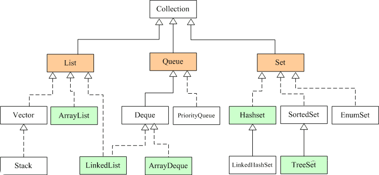
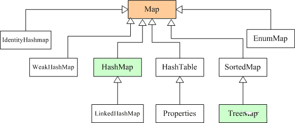

# 集合
## java集合概述
### 常见的集合有哪些
**Java 集合可分为 Collection 和 Map 两种体系**
       
        Collection接口：单列数据，定义了存取一组对象的方法的集合
            List：元素有序(指的是存储时，与存放顺序保持一致)、可重复的集合
            Set：元素无序、不可重复的集合 
        Map接口：双列数据，保存具有映射关系“key-value对”的集合                    
**注意：Collection是一个接口，Collections是一个工具类，Map不是Collection的子接口**
               
 

    图中，
    List代表了有序可重复集合，可直接根据元素的索引来访问；
    Set代表无序不可重复集合，只能根据元素本身来访问；
    Queue是队列集合。
    Map代表的是存储key-value对的集合，可根据元素的key来访问value。
    上图中淡绿色背景覆盖的是集合体系中常用的实现类，
    分别是ArrayList、LinkedList、ArrayQueue、HashSet、TreeSet、HashMap、TreeMap等实现类。

## 常见问题
### 线程安全的集合有哪些？线程不安全的呢？
    
    线程安全的：
        Hashtable：比HashMap多了个线程安全。
        ConcurrentHashMap:是一种高效但是线程安全的集合。
        Vector：比Arraylist多了个同步化机制。
        Stack：栈，也是线程安全的，继承于Vector。
    线性不安全的：
        HashMap
        Arraylist
        LinkedList
        HashSet
        TreeSet
        TreeMap    
### ArrayList和LinkedList的异同？
    总结：ArrayList 增删改慢（要移动数据），查询快（直接get（index））
          LinkedList 增删改快，查询慢（移动指针/遍历）
          都行线程不安全
          
    是否保证线程安全： 
        ArrayList 和 LinkedList 都是不同步的，也就是不保证线程安全；
    底层数据结构： 
        Arraylist 底层使用的是Object数组；
        LinkedList 底层使用的是双向循环链表数据结构；
    插入和删除是否受元素位置的影响： 
        ArrayList 采用数组存储，所以插入/删除元素的时间复杂度受元素位置的影响。 
            (插入/删除要移动，所以慢)
            1.执行add(E e)方法的时候， 
            ArrayList 会默认在将指定的元素追加到此列表的末尾，这种情况时间复杂度就是O(1)。
            2.如果要在指定位置 i 插入和删除元素的话（add(int index, E element)）
            时间复杂度就为 O(n-i)。
            因为在进行上述操作的时候集合中第 i 和第 i 个元素之后的(n-i)个元素都要执行向后位/向前移一位的操作。
        LinkedList 采用链表存储，
            （插入/删除不移动指针，所以快）
            所以插入/删除元素时间复杂度不受元素位置的影响，都是近似 O（1）而数组为近似 O（n）。
    是否支持快速随机访问： 
        LinkedList(慢) 不支持高效的随机元素访问，
        ArrayList(快)  实现了RandmoAccess 接口，所以有随机访问功能。
                        快速随机访问就是通过元素的序号快速获取元素对象(对应于get(int index)方法)。            
    内存空间占用： 
        ArrayList的空间浪费主要体现在在list列表的结尾会预留一定的容量空间，
        LinkedList的空间浪费则体现在它的每一个元素都需要消耗比ArrayList更多的空间
        （因为要存放直接后继和直接前驱以及数据）。
### ArrayList 与 Vector 区别？
    线程安全：
        Vector是线程安全的，Vector在关键性的方法前面都加了synchronized关键字()比如add()方法，来保证线程的安全性。
        ArrayList不是线程安全的。
        如果有多个线程会访问到集合，那最好是使用 Vector，因为不需要我们自己再去考虑和编写线程安全的代码。
    扩容：
        ArrayList在底层数组不够用时在原来的基础上扩展0.5倍（增加0.5倍），
        Vector是扩展1倍（增加1倍），这样ArrayList就有利于节约内存空间。
### ArrayList的扩容机制？
    ArrayList扩容的本质就是计算出新的扩容数组的size后实例化，grow()方法进行扩容
    并将原有数组内容复制到新数组中去。默认情况下，新的容量会是原容量的1.5倍（增加0.5倍）。
>以JDK1.8为例说明:

    public boolean add(E e) {
         //判断是否可以容纳e，若能，则直接添加在末尾；若不能，则进行扩容，然后再把e添加在末尾
         ensureCapacityInternal(size + 1);  // Increments modCount!!
         //将e添加到数组末尾
         elementData[size++] = e;
         return true;
         }
     
     // 每次在add()一个元素时，arraylist都需要对这个list的容量进行一个判断。
     //通过ensureCapacityInternal()方法确保当前ArrayList维护的数组具有存储新元素的能力，
     //经过处理之后将元素存储在数组elementData的尾部
     
     private void ensureCapacityInternal(int minCapacity) {
           ensureExplicitCapacity(calculateCapacity(elementData, minCapacity));
     }
     
     private static int calculateCapacity(Object[] elementData, int minCapacity) {
             //如果传入的是个空数组则最小容量取默认容量与minCapacity之间的最大值
             if (elementData == DEFAULTCAPACITY_EMPTY_ELEMENTDATA) {
                 return Math.max(DEFAULT_CAPACITY, minCapacity);
             }
             return minCapacity;
         }
         
       private void ensureExplicitCapacity(int minCapacity) {
             modCount++;
             // 若ArrayList已有的存储能力满足最低存储要求，则返回add直接添加元素；如果最低要求的存储能力>ArrayList已有的存储能力，
             //这就表示ArrayList的存储能力不足，因此需要调用 grow();方法进行扩容
             if (minCapacity - elementData.length > 0)
                 grow(minCapacity);
         }
     
     
     private void grow(int minCapacity) {
             // 获取elementData数组的内存空间长度
             int oldCapacity = elementData.length;
             // 扩容至原来的1.5倍
             int newCapacity = oldCapacity + (oldCapacity >> 1);
             //校验容量是否够
             if (newCapacity - minCapacity < 0)
                 newCapacity = minCapacity;
             //若预设值大于默认的最大值，检查是否溢出
             if (newCapacity - MAX_ARRAY_SIZE > 0)
                 newCapacity = hugeCapacity(minCapacity);
             // 调用Arrays.copyOf方法将elementData数组指向新的内存空间
              //并将elementData的数据复制到新的内存空间
             elementData = Arrays.copyOf(elementData, newCapacity);
         }
   
    