# java中的IO
## IO基础
### IO分类-从传输方式
从数据传输方式或者说是运输方式角度看，可以将 IO 类分为:  
- 字节流
- 字符流

#### 字节流
(整体结构如下，部分派生类有缺失)  

    
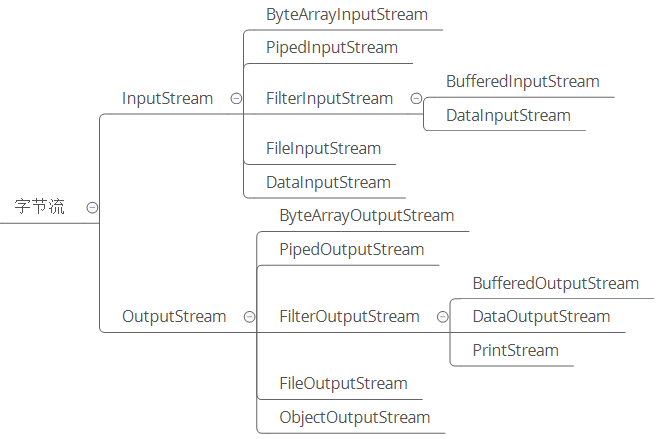

#### 字符流
(整体结构如下，部分派生类有缺失)  

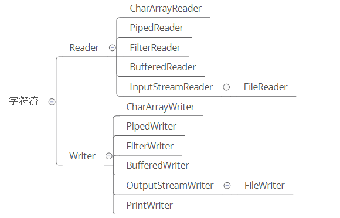  

#### 字节流和字符流的区别

- 字节流读取**单个字节**，字符流读取**单个字符**(一个字符根据编码的不同，对应的字节也不同，如 UTF-8 编码中文汉字是 3 个字节，GBK编码中文汉字是 2 个字节。)  

- 字节流用来处理二进制文件(图片、MP3、视频文件)，字符流用来处理文本文件(可以看做是特殊的二进制文件，使用了某种编码，人可以阅读)。  

> 简而言之，字节是个计算机看的，字符才是给人看的。

#### 字节转字符Input/OutputStreamReader/Writer  

编码就是把字符转换为字节，而解码是把字节重新组合成字符。   
如果编码和解码过程使用不同的编码方式那么就出现了乱码。   
- GBK 编码中，中文字符占 2 个字节，英文字符占 1 个字节； 
- UTF-8 编码中，中文字符占 3 个字节，英文字符占 1 个字节； 
- UTF-16be 编码中，中文字符和英文字符都占 2 个字节。

UTF-16be 中的 be 指的是 Big Endian，也就是大端。相应地也有 UTF-16le，le 指的是 Little Endian，也就是小端。   

Java 使用双字节编码 UTF-16be，这不是指 Java 只支持这一种编码方式，而是说 char 这种类型使用 UTF-16be 进行编码。char 类型占 16 位，也就是两个字节，Java 使用这种双字节编码是为了让一个中文或者一个英文都能使用一个 char 来存储。  

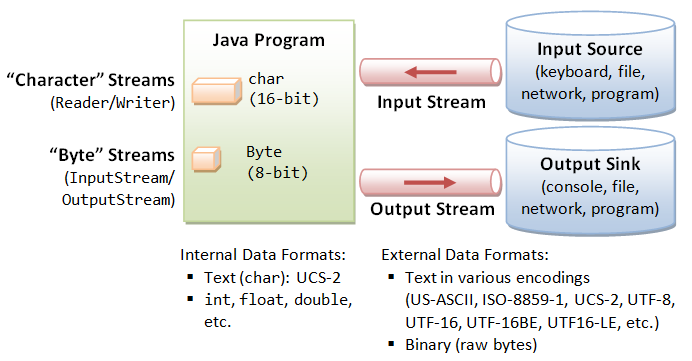

### IO分类-从数据操作上

从数据来源或者说是操作对象角度看，IO 类可以分为:  

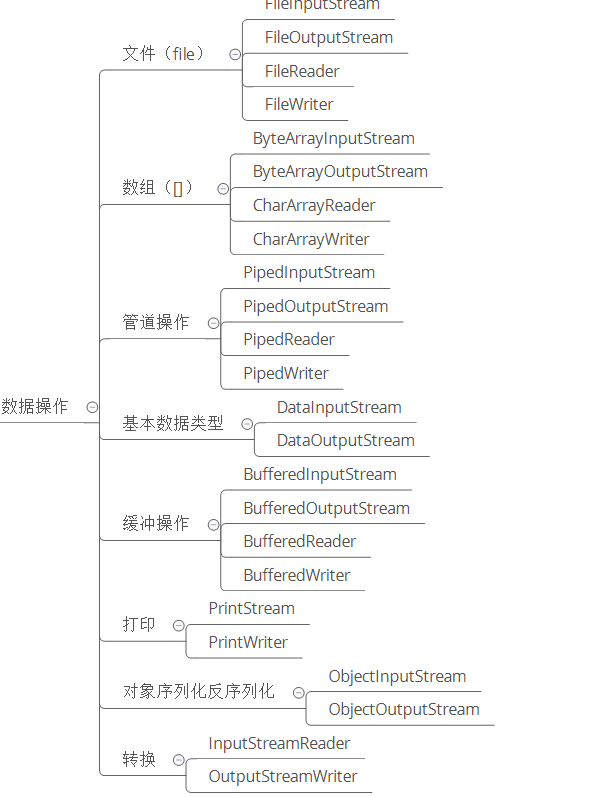  
### IO设计模式(装饰者模式)
以 InputStream 为例，   
- InputStream 是抽象组件；   
- FileInputStream 是 InputStream 的子类，属于具体组件，提供了字节流的输入操作；   
- FilterInputStream 属于抽象装饰者，装饰者用于装饰组件，为组件提供额外的功能。例如 BufferedInputStream 为 FileInputStream 提供缓存的功能。
 
 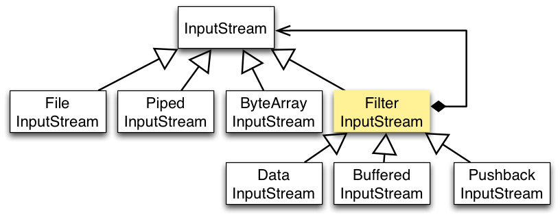 
 
 实例化一个具有缓存功能的字节流对象时，只需要在 FileInputStream 对象上再套一层 BufferedInputStream 对象即可。    
 
         FileInputStream fileInputStream = new FileInputStream(filePath);
         BufferedInputStream bufferedInputStream = new BufferedInputStream(fileInputStream);

## IO调用步骤

进程中的IO调用步骤大致可以分为以下四步：  
1.进程向操作系统请求数据 ;

2. 操作系统把外部数据加载到内核的缓冲区中;

3.操作系统把内核的缓冲区拷贝到进程的缓冲区 ;

4.进程获得数据完成自己的功能 ;

当操作系统在把外部数据放到进程缓冲区的这段时间（即上述的第二，三步），如果应用进程是挂起等待的，那么就是同步IO，反之，就是异步IO，也就是AIO
## BIO

Java BIO即Block I/O ， **同步并阻塞**的IO。

BIO其实就是两个进程(C/S)在一个线程里进行的通讯形式，Client和Server端各启一个进程来保持通讯，当调用的对方进程没有资源的时候，自己进入等待状态，但一直会监听调用该进程的状态，直到可以取到资源。  

BIO就是传统的java.io包下面的代码实现。

**Server端**
    
    public class Server {
        private final static int port=8888;
    
        public static void main(String[] args) throws IOException {
            ServerSocket server=null;
    
            BufferedReader in=null;
    
            PrintWriter out=null;
    
            try {
                server=new ServerSocket(port);
                System.out.println("服务器开始运行");
                Socket socket=null;
                ThreadPoolExecutor executor = new ThreadPoolExecutor(Runtime.getRuntime().availableProcessors(),
                        50, 60, TimeUnit.SECONDS,
                        new ArrayBlockingQueue(1028),
                        new ThreadFactoryBuilder().setNameFormat("服务器线程-%s").build(),
                        new ThreadPoolExecutor.CallerRunsPolicy());
    
                while (true){
                    //阻塞等待连接，
                    socket=server.accept();
                    System.out.println("已有连接建立。。。。。");
                    executor.execute(new ServerTask(socket));
                }
            } catch (IOException e) {
                e.printStackTrace();
            }finally {
                if(server!=null){
                    System.out.println("服务器已关闭。");
                    in.close();
                    out.close();
                    server.close();
                    server=null;
                }
    
            }
        }
    }

ServerTask：
    
    public class ServerTask implements Runnable {
        private Socket socket;
    
        public ServerTask(Socket socket) {
            this.socket = socket;
        }
    
        @Override
        public void run() {
            BufferedReader in = null;
    
            PrintWriter out = null;
    
            try {
                in = new BufferedReader(new InputStreamReader(socket.getInputStream()));
                out = new PrintWriter(this.socket.getOutputStream(), true);
                String body = null;
                while (true) {
                    if ((body = in.readLine() )== null) {
                        break;
                    }
                    System.out.println("服务器收到消息：" + body);
                    out.println("服务器已经收到消息。。。。。");
                }
            } catch (IOException e) {
                e.printStackTrace();
            } finally {
                try {
    
                    in.close();
                    out.close();
                    socket.close();
                } catch (IOException e) {
                    e.printStackTrace();
                }
            }
    
        }
    }
    
**Client端**
        
        public class Client {
            private final static String address = "127.0.0.1";
        
            private final static int port = 8888;
        
            public static void main(String[] args) {
                Socket socket = null;
                BufferedReader in = null;
                PrintWriter out=null;
        
                try {
                    socket=new Socket(address,port);
                    in=new BufferedReader(new InputStreamReader(socket.getInputStream()));
                    out=new PrintWriter(socket.getOutputStream(),true);
                    while (true){
                        Scanner scanner=new Scanner(System.in);
                        System.out.print("输入内容：");
                        if(scanner.hasNext()){
                            out.println("客户端请求:"+scanner.next());
                            out.flush();
                        }
        
                        String response=in.readLine();
                        System.out.println("收到服务器反馈："+response);
                    }
        
        
        
                } catch (IOException e) {
                    e.printStackTrace();
                }finally {
                    try {
                        if(socket!=null){
                            System.out.println("关闭客户端");
                            in.close();
                            out.close();
                            socket.close();
                        }
                    } catch (IOException e) {
                        e.printStackTrace();
                    }
        
                }
            }
        }

## NIO
### 简介
NIO (New lO)也有人称之为java non-blocking lO是从Java 1.4版本开始引入的一个新的IO API，可以替代标准的Java lO API。NIO与原来的IO有同样的作用和目的，但是使用的方式完全不同，**NIO支持面向缓冲区的、基于通道的IO操作**。NIO将以更加高效的方式进行文件的读写操作。NIO可以理解为非阻塞IO,传统的IO的read和write只能阻塞执行，线程在读写IO期间不能干其他事情，比如调用socket.read()时，如果服务器一直没有数据传输过来，线程就一直阻塞，而NIO中可以配置socket为非阻塞模式。

NIO相关类都被放在java.nio包及子包下，并且对原java.io包中的很多类进行改写。
NIO有三大核心部分:Channel(通道)，Buffer(缓冲区), Selector(选择器)
Java NlO的非阻塞模式，使一个线程从某通道发送请求或者读取数据，但是它仅能得到目前可用的数据，如果目前没有数据可用时，就什么都不会获取，而不是保持线程阻塞，所以直至数据变的可以读取之前，该线程可以继续做其他的事情。非阻塞写也是如此，一个线程请求写入一些数据到某通道，但不需要等待它完全写入，这个线程同时可以去做别的事情。
通俗理解:NIO是可以做到用一个线程来处理多个操作的。假设有1000个请求过来,根据实际情况，可以分配20或者80个线程来处理。不像之前的阻塞IO那样，非得分配1000个。
 

### NIO 与 BIO的比较  

BIO以**流**的方式处理数据,而**NIO以块**的方式处理数据,块I/O的效率比流IO高很多  
BIO是**阻塞**的，NIO则是**非阻塞**的  
BlO基于字节流和字符流进行操作，而NIO基于Channel(通道)和Buffer(缓冲区)进行操作，数据总是从通道读取到缓冲区中，或者从缓冲区写入到通道中。Selector(选择器)用于监听多个通道的事件（比如:连接请求，数据到达等)，因此使用单个线程就可以监听多个客户端通道    

NIO|BIO
--|--
面向缓冲区（buffer）|面向流（Stream）
非阻塞（Non Blocking IO）|阻塞IO（Blocking IO）
选择器（selectors）|

NIO可以先将数据写入到缓冲区，然后再有缓冲区写入通道，因此可以做到同步非阻塞。  

BIO则是面向的流，读写数据都是单向的。因此是同步阻塞。  

### NIO 三大核心

NIO有三大核心部分: 
- Channel(通道)
- Buffer(缓冲区)
- Selector(选择器)

**Buffer(缓冲区)**
    缓冲区本质上是一块可以写入数据，然后可以从中读取数据的内存。这块内存被包装成NIO Buffer对象，并提供了一组方法，用来方便的访问该块内存。相比较直接对数组的操作，Buffer APl更加容易操作和管理。  
  
**Channel(通道)**  
    Java NIO的通道类似流，但又有些不同:既可以从通道中读取数据，又可以写数据到通道。但流的(input或output)读写通常是单向的。通道可以非阻塞读取和写入通道，通道可以支持读取或写入缓冲区，也支持异步地读写。  
    
**Selector(选择器)**
     Selector是一个Java NIO组件，可以能够检查一个或多个NIO通道，并确定哪些通道已经准备好进行读取或写入。这样，一个单独的线程可以管理多个channel，从而管理多个网络连接，提高效率  
     
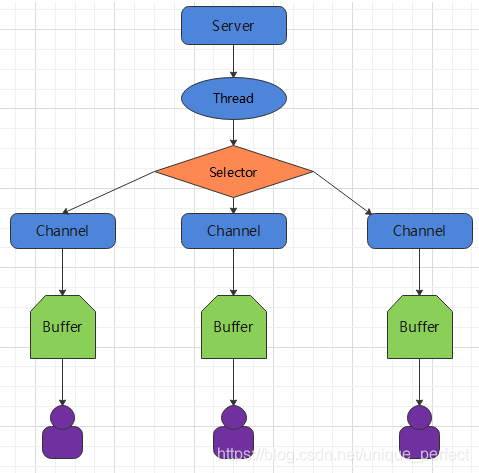  

- 每个channel都会对应一个 Buffer
- 一个线程对应Selector ,一个Selector对应多个channel(连接)程序
- 切换到哪个channel是由事件决定的
- Selector 会根据不同的事件，在各个通道上切换
- Buffer 就是一个内存块，底层是一个数组
- 数据的读取写入是通过 Buffer完成的，BlO中要么是输入流，或者是输出流,不能双向，但是NIO的Buffer是可以读也可以写。
- Java NIO系统的核心在于:通道(Channel)和缓冲区(Buffer)。通道表示打开到lO设备(例如:文件、套接字)的连接。若需要使用NIO系统，需要获取用于连接IO设备的通道以及用于容纳数据的缓冲区。然后操作缓冲区，对数据进行处理。简而言之，**Channel负责传输，Buffer负责存取数据**  

### 核心一:缓存区 (Buffer)

**缓冲区（Buffer**一个用于特定基本数据类型的容器。由 java.nio 包定义的，所有缓冲区 都是 Buffer 抽象类的子类.。Java NIO 中的 Buffer **主要用于与 NIO 通道进行 交互，数据是从通道读入缓冲区，从缓冲区写入通道中的**  

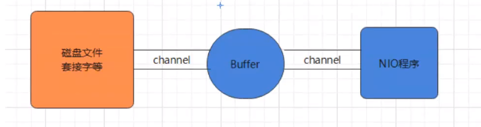 

#### Buffer类介绍
Buffer就像一个数组，可以保存多个相同类型的数据。根据 数据类型不同 ，有以下 Buffer 常用子类：    
- ByteBuffer 
- CharBuffer 
- ShortBuffer 
- IntBuffer 
- LongBuffer 
- FloatBuffer 
- DoubleBuffer 

上述 Buffer 类他们都采用相似的方法进行管理数据，只是各自 管理的数据类型不同而已。都是通过如下方法获取一个 Buffer 对象：  

static XxxBuffer allocate(int capacity) : 创建一个容量为capacity 的 XxxBuffer 对象  
 

缓冲区的基本属性 Buffer 中的重要概念：  

- 容量 (capacity) ：作为一个内存块，Buffer具有一定的固定大小， 也称为"容量"，缓冲区容量不能为负，并且创建后不能更改。  

- 限制 (limit)：表示缓冲区中可以操作数据的大小 （limit 后数据不能进行读写）。缓冲区的限制不能 为负，并且不能大于其容量。 写入模式，限制等于 buffer的容量。读取模式下，limit等于写入的数据量。

- 位置 (position)：下一个要读取或写入的数据的索引。 缓冲区的位置不能为 负，并且不能大于其限制

- 标记 (mark)与重置 (reset)：标记是一个索引， 通过 Buffer 中的 mark() 方法 指定 Buffer 中一个 特定的 position，之后可以通过调用 reset() 方法恢 复到这 个 position.  

标记、位置、限制、容量遵守以下不变式： 0 <= mark <= position <= limit <= capacity

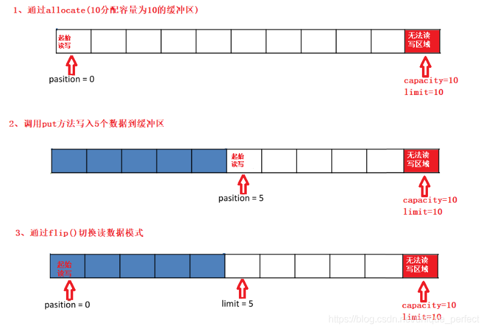  

#### Buffer常见方法

1.**Buffer clear()** ：清空缓冲区并返回对缓冲区的引用  
2.**Buffer flip()** ：为 将缓冲区的界限设置为当前位置， 并将当前位置重置为 0    
3.**int capacity()**:返回 Buffer 的 capacity 大小  
4.**boolean hasRemaining()**:判断缓冲区中是否还有元素  
5.**int limit()**:返回 Buffer 的界限(limit) 的位置  
6.**Buffer limit(int n)**:将设置缓冲区界限为 n, 并返回一个具有新 limit 的缓冲区对象  
7.**Buffer mark()**:对缓冲区设置标记  
8.**int position()**:返回缓冲区的当前位置 position  
9.**Buffer position(int n)**:将设置缓冲区的当前位置为 n， 并返回修改后的 Buffer 对象  
10.**int remaining()**:返回 position 和 limit 之间的元素个数  
11.**Buffer reset()**:将位置 position 转到以前设置的mark 所在的位置  
12.**Buffer rewind()**:将位置设为为 0， 取消设置的 mark    

缓冲区的数据操作 Buffer 所有子类提供了两个用于数据操作的方法：

1.**get()**:读取单个字节  
2.**get(byte[] dst)**:批量读取多个字节到 dst 中  
3.**get(int index)**:读取指定索引位置的字节(不会移动 position)放到入数据到Buffer中  
4.**put(byte b)**:将给定单个字节写入缓冲区的当前位置  
5.**put(byte[] src)**:将 src 中的字节写入缓冲区的当前位置  
6.**put(int index, byte b)**:将指定字节写入缓冲区的索引 位置(不会移动 position)  

使用Buffer读写数据一般遵循以下四个步骤：

1.写入数据到Buffer
2.调用flip()方法，转换为读取模式
3.从Buffer中读取数据
4.调用buffer.clear()方法或者buffer.compact()方 法清除缓冲区

> 方法示例：
    
    public class TestBuffer {
    
        public static void main(String[] args) {
                //1. 分配一个指定大小的缓冲区
                ByteBuffer buf = ByteBuffer.allocate(1024);
                System.out.println("-----------------allocate()----------------");
                System.out.println(buf.position());// 0: 表示当前的位置为0
                System.out.println(buf.limit());// 1024: 表示界限为1024，前1024个位置是允许我们读写的
                System.out.println(buf.capacity());//1024：表示容量大小为1024
    
                //2. 利用 put() 存入数据到缓冲区中
                System.out.println("-----------------put()----------------");
                String str = "kim-lil";
                buf.put(str.getBytes());
                System.out.println(buf.position());// 7表示下一个可以写入的位置是7,因为我们写入的字节是7个,从0开始已经写了7个，位置为8的position为7
                System.out.println(buf.limit());// 1024：表示界限为1024，前1024个位置是允许我们读写的
                System.out.println(buf.capacity());//1024：表示容量大小为1024
    
                //3. 切换读取数据模式
                System.out.println("-----------------flip()----------------");
                buf.flip();
                System.out.println(buf.position());// 0: 读取的起始位置为0
                System.out.println(buf.limit());// 7: 表示界限为7，前7个位置有数据可以读取
                System.out.println(buf.capacity());// 1024:表示容量大小为1024
    
                //4. 利用 get() 读取缓冲区中的数据
                System.out.println("-----------------get()----------------");
                byte[] dst = new byte[buf.limit()];//创建一个界限为limit大小的字节数组
                buf.get(dst);//批量将limit大小的字节写入到dst字节数组中
                System.out.println(new String(dst, 0, dst.length));//结果为kim-lil
    
                System.out.println(buf.position());//7: 读取的位置变为7,因为前面的7个字节数据已经全部读取出去,下一个可读取的位置为7，从0开始的
                System.out.println(buf.limit());//7: 可读取的界限大小为7
                System.out.println(buf.capacity());// 1024: 表示容量大小为1024
    
                //5. rewind() : 可重复读
                System.out.println("-----------------rewind()----------------");
                buf.rewind();// 将位置设为为 0,从头开始读取
                System.out.println(buf.position());// 0
                System.out.println(buf.limit());// 7
                System.out.println(buf.capacity());// 1024
    
                //6. clear() : 清空缓冲区. 但是缓冲区中的数据依然存在，但是处于“被遗忘”状态
                System.out.println("-----------------clear()----------------");
                buf.clear();
                System.out.println(buf.position());// 0
                System.out.println(buf.limit());// 1024
                System.out.println(buf.capacity());// 1024
                byte[] res= new byte[buf.limit()];//创建一个界限为limit大小的字节数组
                buf.get(res);
                System.out.println(new String(res,0,res.length));//k
    
        }
    }

    
    public class TestBuffer2 {
        public static void main(String[] args) {
            String str = "kim-lil";
    
            ByteBuffer buf = ByteBuffer.allocate(1024);
            buf.put(str.getBytes());// 将str写入到buf缓冲区中
            buf.flip();//转换为读模式
            byte[] dst = new byte[buf.limit()];//定义一个字节数组
            buf.get(dst, 0, 2);//将前2个字节批量写入到dst字节数组中
            System.out.println(new String(dst, 0, 2));//打印结果为it
            System.out.println(buf.position());//当前下一个读取的位置为2
            //mark() : 标记
            buf.mark();
            buf.get(dst, 2, 2);//从第3个位置开始将2个字节批量写入到dst字节数组中
            System.out.println(new String(dst, 2, 2));//打印结果为he
            System.out.println(buf.position());// 当前下一个读取的位置为4
            //reset() : 恢复到 mark 的位置
            buf.reset();
            System.out.println(buf.position());// 2
            //判断缓冲区中是否还有剩余数据
            if (buf.hasRemaining()) {
                //获取缓冲区中可以操作的数量
                System.out.println(buf.remaining());// 5: 返回 position 和 limit 之间的元素个数
            }
        }
    
    }
    
    public class TestBuffer3 {
        public static void main(String[] args) {
            //分配直接缓冲区
            ByteBuffer buf = ByteBuffer.allocateDirect(1024);
            System.out.println(buf.isDirect());
        }
    
    }

#### 直接与非直接缓冲区

byte byffer可以是两种类型，一种是基于**直接内存**（也就是非堆内存）；另一种是**非直接内存**（也就是堆内存）。对于直接内存来说，JVM将会在IO操作上具有更高的性能，因为它
直接作用于本地系统的IO操作。而非直接内存，也就是堆内存中的数据，如果要作IO操作，会先从本进程内存复制到直接内存，再利用本地IO处理。

从数据流的角度，**非直接内存**是下面这样的作用链：

**本地IO-->直接内存-->非直接内存-->直接内存-->本地IO**

而**直接内存**是：

**本地IO-->直接内存-->本地IO**

很明显，在做IO处理时，比如网络发送大量数据时，直接内存会具有更高的效率。直接内存使用allocateDirect创建，但是它比申请普通的堆内存需要耗费更高的性能。不过，这部分的数据是在JVM之外的，因此它不会占用应用的内存。所以呢，当你有很大的数据要缓存，并且它的生命周期又很长，那么就比较适合使用直接内存。只是一般来说，如果不是能带来很明显的性能提升，还是推荐直接使用堆内存。字节缓冲区是直接缓冲区还是非直接缓冲区可通过调用其 isDirect()  方法来确定。

使用场景
 - 有很大的数据需要存储，它的生命周期又很长
 - 适合频繁的IO操作，比如网络并发场景

### 核心二：通道(Channel)
#### Channel介绍
通道（Channel）：由 java.nio.channels 包定义 的。Channel 表示 IO 源与目标打开的连接。 Channel 类似于传统的“流”。只不过 Channel 本身不能直接访问数据，Channel 只能与 Buffer 进行交互。  

> 通道类似于流，但有些区别如下：

- 通道可以**同时进行读写**，而流只能读或者只能写

- 通道可以实现**异步读写**数据

- 通道可以从**缓冲读数据**，也可以**写数据到缓冲**  

> Channel 在 NIO 中是一个接口
    
    public interface Channel extends Closeable{} 
    
#### Channel接口常用实现类
- FileChannel：用于读取、写入、映射和操作文件的通道。
- DatagramChannel：通过 **UDP** 读写网络中的数据通道。
- SocketChannel：通过 **TCP** 读写网络中的数据。
- ServerSocketChannel：可以**监听新进来的 TCP 连接**，对每一个新进来的连接都会创建一个 SocketChannel。 【ServerSocketChanne 类似 ServerSocket , SocketChannel 类似 Socket  

#### FileChannel 类 

获取通道的一种方式是对支持通道的对象调用getChannel() 方法。支持通道的类如下

- FileInputStream
- FileOutputStream
- RandomAccessFile
- DatagramSocket
- Socket
- ServerSocket
- 获取通道的其他方式是使用 Files 类的静态方法 newByteChannel() 获取字节通道。或者通过通道的静态方法 open() 打开并返回指定通道  

#### FileChannel常用方法 

- int read(ByteBuffer dst) ：从Channel 到 中读取数据到  ByteBuffer
- long  read(ByteBuffer[] dsts) ： 将Channel中的数据“分散”到  ByteBuffer[]
- int  write(ByteBuffer src) ：将  ByteBuffer中的数据写入到  Channel
- long write(ByteBuffer[] srcs) ：将  ByteBuffer[] 到 中的数据“聚集”到  Channel
- long position() ：返回此通道的文件位置
- FileChannel position(long p) ：设置此通道的文件位置
- long size() ：返回此通道的文件的当前大小
- FileChannel truncate(long s) ：将此通道的文件截取为给定大小
- void force(boolean metaData) ：强制将所有对此通道的文件更新写入到存储设备中

#### 案例1-本地文件写数据
    
      public static void main(String[] args) {
            /**
             * 需求：使用前面学习后的 ByteBuffer(缓冲)和 FileChannel(通道)， 将数据写入到 data.txt 中.
             */
            try {
                // 1、字节输出流通向目标文件
                FileOutputStream fos = new FileOutputStream("D:\\data01.txt");
                // 2、得到字节输出流对应的通道Channel
                FileChannel channel = fos.getChannel();
                // 3、分配缓冲区
                ByteBuffer buffer = ByteBuffer.allocate(1024);
                for (int i = 0; i < 10; i++) {
                    buffer.clear();//清空缓冲区
                    buffer.put(("hello,使用Buffer和channel实现写数据到文件中"+i+"\r\n").getBytes());
                    // 4、把缓冲区切换成写出模式
                    buffer.flip();
                    channel.write(buffer);//将缓冲区的数据写入到文件通道
                }
                channel.close();
                System.out.println("写数据到文件中！");
            } catch (Exception e) {
                e.printStackTrace();
            }
    
        }

#### 案例2-本地文件读数据  
> reAllocate：对buffer扩容

     public class ChannelTest {
         /**
          * 对 ByteBuffer 进行扩容操作
          */
         private static ByteBuffer reAllocate(ByteBuffer buf) {
             final int capacity = buf.capacity();
             byte[] newBuffer = new byte[capacity * 2];
             /**
              * System.arraycopy( ) 复制数组
              *          src:     原数组
              *         srcPos： 原数组起始位置（从这个位置开始复制）
              *         dest：   目标数组
              *         destPos：目标数组粘贴的起始位置
              *         length： 复制的个数
              */
             System.arraycopy(buf.array(), 0, newBuffer, 0, capacity);
             /**
              * ByteBuffer.wrap 方法 将字节数组包装到缓冲区中。设置position为原始数组最大位置
              */
             return (ByteBuffer) ByteBuffer.wrap(newBuffer).position(capacity);
         }
     
         public static void main(String[] args) throws IOException {
             /**
              * 需求：设置两个缓冲区，一大一小，大的缓冲区为每次读取的量，小的缓冲区存放每行的数据（确保大小可存放文本中最长的那行）。
              * 读取的时候判断是不是换行符13，是的话则返回一行数据，不是的话继续读取，直到读完文件。
              */
             // 1、定义一个文件字节输入流与源文件接通
             FileInputStream is = new FileInputStream("D:\\data01.txt");
             // 2、需要得到文件字节输入流的文件通道
             FileChannel channel = is.getChannel();
             // 3、定义一个缓冲区
             int bufferSize = 1024 * 1024;  // 每一块的大小
             ByteBuffer buffer = ByteBuffer.allocate(bufferSize);
     
             ByteBuffer bb = ByteBuffer.allocate(1024);
     
             // 4、读取数据到缓冲区
             int bytesRead = channel.read(buffer);
             while (bytesRead != -1) {
                 buffer.flip();// 切换模式，写->读
                 while (buffer.hasRemaining()) {//返回 position 和 limit 之间的元素个数
                     byte b = buffer.get();
                     if (b == 10 || b == 13) { // 换行或回车
                         bb.flip();
                         // 这里就是一个行
                         final String line = Charset.forName("utf-8").decode(bb).toString();
                         System.out.println(line);// 解码已经读到的一行所对应的字节
                         bb.clear();
                     } else {
                         if (bb.hasRemaining()) { //判断缓冲区中是否还有元素
                             bb.put(b);
                         } else { // 空间不够扩容
                             bb = reAllocate(bb);
                             bb.put(b);
                         }
                     }
                 }
                 buffer.clear();// 清空,position位置为0，limit=capacity
                 //  继续往buffer中写
                 bytesRead = channel.read(buffer);
             }
             channel.close();
     
         }
     
     }

#### 案例3-使用Buffer完成文件复制 

    public class ChannelTest2 {
        public static void main(String[] args) throws IOException {
            FileInputStream fis=new FileInputStream("D:\\data01.txt");
            FileOutputStream fos=new FileOutputStream("D:\\data01_temp.txt");
    
            // 得到的是文件通道
            FileChannel is_channel=fis.getChannel();
            FileChannel os_channel=fos.getChannel();
    
            // 分配缓冲区
            ByteBuffer buffer=ByteBuffer.allocate(1024);
    
            while (is_channel.read(buffer)>0){
                // 已经读取了数据 ，把缓冲区的模式切换成可读模式
                buffer.flip();
                // 把数据写出到
                os_channel.write(buffer);//将buffer缓冲区中的数据写入到osChannel中
                // 必须先清空缓冲然后再写入数据到缓冲区
                buffer.clear();
            }
            is_channel.close();
            os_channel.close();
            System.out.println("复制完成！");
        }
    }
#### 案例4-通道复制transferFrom()
> 从目标通道中去复制原通道数据

       public class ChannelTest3 {
           public static void main(String[] args) throws IOException {
               FileInputStream fis=new FileInputStream("D:\\data01.txt");
               FileOutputStream fos=new FileOutputStream("D:\\data01_temp.txt");
       
               // 得到的是文件通道
               FileChannel is_channel=fis.getChannel();
               FileChannel os_channel=fos.getChannel();
               /**
                * 复制通道：调用transferFrom直接复制
                * 这里是 从is_channel复制到os_channel
                */
               os_channel.transferFrom(is_channel,is_channel.position(),is_channel.size());
       
               is_channel.close();
               os_channel.close();
               System.out.println("复制完成！");
           }
       }
 
#### 案例5-通道复制transferTo()
> 把原通道数据复制到目标通道 
    
    public class ChannelTest4 {
        public static void main(String[] args) throws IOException {
            FileInputStream fis=new FileInputStream("D:\\data01.txt");
            FileOutputStream fos=new FileOutputStream("D:\\data01_temp.txt");
    
            // 得到的是文件通道
            FileChannel is_channel=fis.getChannel();
            FileChannel os_channel=fos.getChannel();
            /**
             * 复制通道：调用transferTo()直接复制
             * 这里是把is_channel复制给os_channel
             *
             */
            is_channel.transferTo(is_channel.position(),is_channel.size(),os_channel);
    
            is_channel.close();
            os_channel.close();
            System.out.println("复制完成！");
        }
#### 案例6-分散 (Scatter) 和聚集 (Gather)  
- 分散读取（Scatter ）:是指把Channel通道的数据**读入**到多个缓冲区中去
- 聚集写入（Gathering ）是指将多个 Buffer 中的数 据**聚集**到 Channel。

    public class ChannelTest5 {
        public static void main(String[] args) throws IOException, InterruptedException {
            FileInputStream fis=new FileInputStream("D:\\data01.txt");
            //1. 获取通道
            FileChannel channel1 = fis.getChannel();
    
            //2. 分配指定大小的缓冲区
            ByteBuffer buf1 = ByteBuffer.allocate(100);
            ByteBuffer buf2 = ByteBuffer.allocate(1024);
    
            //3. 分散读取
            ByteBuffer[] bufs = {buf1, buf2};
            channel1.read(bufs);
            //需要变量改变成写
            for (ByteBuffer byteBuffer : bufs) {
                byteBuffer.flip();
            }
    
            System.out.println(new String(bufs[0].array(), 0, bufs[0].limit()));
            System.out.println("-----------------");
            System.out.println(new String(bufs[1].array(), 0, bufs[1].limit()));
    
            //4. 聚集写入
            FileOutputStream fos=new FileOutputStream("D:\\data01_temp.txt");
            FileChannel channel2 = fos.getChannel();
    
            channel2.write(bufs);
        }
    }
    
### 核心三：选择器(Selector)

####  选择器(Selector)概述

选择器（Selector)是SelectableChannle对象的**多路复用器**，Selector可以同时监控多个SelectableChannel的IO状况，也就是说，利用Selector可使一个单独的线程管理多个Channel。Selector是非阻塞IO的核心。

- Java 的 NIO，用非阻塞的 IO 方式。可以用**一个线程**，处理多个的客户端连接，就会使用到 **一个Selector(选择器)**
- Selector 能够检测多个注册的通道上是否有事件发生(注意:多个 Channel 以事件的方式可以注册到同一个(Selector)，如果有事件发生，便获取事件然后针对每个事件进行相应的处理。这样就可以只用一个单线程去管理多个通道，也就是管理多个连接和请求。
- 只有在连接/通道真正有读写事件发生时，才会进行读写，就大大地减少了系统开销，并且不必为每个连接都创建一个线程，不用去维护多个线程
- 避免了多线程之间的上下文切换导致的开销  

#### 选择器(Selector)使用

1.**创建 Selector**：通过调用Selector.open()方法创建一个 Selector。  

    Selector selector = Selector.open();
    
2.**向选择器注册通道**：SelectableChannel.register(Selector sel, int ops)    

    //1. 获取通道
    ServerSocketChannel ssChannel = ServerSocketChannel.open();
    //2. 切换非阻塞模式
    ssChannel.configureBlocking(false);
    //3. 绑定连接
    ssChannel.bind(new InetSocketAddress(9898));
    //4. 获取选择器
    Selector selector = Selector.open();
    //5. 将通道注册到选择器上, 并且指定“监听接收事件”
    ssChannel.register(selector, SelectionKey.OP_ACCEPT);

当调用 register(Selector sel, int ops) 将通道注册选择器时，选择器对通道的监听事件，需要通过第二个参数 **ops** 指定。可以监听的事件类型（用 可使用 SelectionKey 的四个常量 表示）：  
- 读 : SelectionKey.OP_READ （1）
- 写 : SelectionKey.OP_WRITE （4）
- 连接 : SelectionKey.OP_CONNECT （8）
- 接收 : SelectionKey.OP_ACCEPT （16）

若注册时不止监听一个事件，则可以使用“位或”操作符连接。
    
    int interestSet = SelectionKey.OP_READ|SelectionKey.OP_WRITE
    
### 案例-NIO非阻塞式（入门）

需求：服务端接收客户端的连接请求，并接收多个客户端发送过来的事件。

    
    public class Server {
        public static void main(String[] args) throws IOException {
            //1.获取管道
            ServerSocketChannel serverSocketChannel=ServerSocketChannel.open();
            //2.设置成非阻塞模式
            serverSocketChannel.configureBlocking(false);
            //3.绑定端口(任意本地地址+端口号)
            serverSocketChannel.bind(new InetSocketAddress(8888));
            //4.获取选择器
            Selector selector=Selector.open();
            //5.将通道注册到选择器上，并且开始指定监听的接收事件
            // 服务器通道只能注册SelectionKey.OP_ACCEPT事件
            serverSocketChannel.register(selector, SelectionKey.OP_ACCEPT);
            //6.开始轮训-已经就绪的事件
            while (selector.select()>0) {
                System.out.println("开始处理。。。。");
                //7.获取选择器中所有注册的通道中已准备好的事件
                Iterator<SelectionKey> iterator = selector.selectedKeys().iterator();
                //8.开始遍历
                while (iterator.hasNext()) {
                    SelectionKey selectionKey = iterator.next();
                    System.out.println("---->" + selectionKey);
                    //9.判断这个事件具体是什么
                    if (selectionKey.isValid()&&selectionKey.isAcceptable()) {
                        //10.获取当前接入事件的客户端通道
                        SocketChannel socketChannel = serverSocketChannel.accept();
                        //11.切换成非阻塞模式
                        socketChannel.configureBlocking(false);
                        //12.将本客户端注册到选择器
                        socketChannel.register(selector, SelectionKey.OP_READ);
                    } else if (selectionKey.isValid()&&selectionKey.isReadable()) {
                            //13.获取当前选择器上的读
                            SocketChannel socketChannel = (SocketChannel) selectionKey.channel();
                            //14.读取
                            ByteBuffer buffer = ByteBuffer.allocate(1024);
                            int len;
                            while ((len = socketChannel.read(buffer)) > 0) {
                                buffer.flip();
                                System.out.println(new String(buffer.array(), 0, len));
                                //清除之前的数据（覆盖写入）
                                buffer.clear();
                            }
                    }
                    //15.处理完毕后，移除当前事件
                    //已经处理的一定要移除，如果不移除，就会一直存在在selector.selectedKeys集合中
                    //待到下一次selector.select() > 0时，这个readyKey又会被处理一次
                    iterator.remove();
                }
            }
    
        }
    }

    public class Client {
        public static void main(String[] args) throws IOException {
            SocketChannel socketChannel = SocketChannel.open(new InetSocketAddress("127.0.0.1",8888));
            socketChannel.configureBlocking(false);
            ByteBuffer buffer = ByteBuffer.allocate(1024);
            Scanner scanner = new Scanner(System.in);
            while (true) {
                System.out.print("请输入:");
                String msg = scanner.nextLine();
                buffer.put(msg.getBytes());
                buffer.flip();
                socketChannel.write(buffer);
                buffer.clear();
            }
        }
    }

### NIO-网络编程实例-（群聊）

        public class Server {
            private ServerSocketChannel ssChannel;
        
            private Selector selector;
        
            private final static int port = 6666;
        
            //初始化
        
            public Server() {
                try {
                    ssChannel = ServerSocketChannel.open();
                    ssChannel.configureBlocking(false);
                    ssChannel.bind(new InetSocketAddress(port));
        
                    selector = Selector.open();
                    ssChannel.register(selector, SelectionKey.OP_ACCEPT);
        
                } catch (IOException e) {
                    e.printStackTrace();
                }
            }
        
            /**
             * 监听方法
             */
            public void Listen() {
                System.out.println("监听线程：" + Thread.currentThread().getName());
        
                try {
                    while  (selector.select() > 0) {
                        //获取通道所有已经就绪的事件
                        Iterator<SelectionKey> selectionKeys = selector.selectedKeys().iterator();
                        while (selectionKeys.hasNext()) {
                            SelectionKey key = selectionKeys.next();
                            if (key.isValid() && key.isAcceptable()) {
                                //获取当前接入的客户端通道
                                SocketChannel channel = ssChannel.accept();
                                channel.configureBlocking(false);
                                System.out.println(channel.getRemoteAddress()+"上线了。。");
        
                                channel.register(selector,SelectionKey.OP_READ);
        
                            }else if(key.isValid() && key.isReadable()){
                                //处理读取数据,读进来
                                readData(key);
                            }
                            selectionKeys.remove();
                        }
                    }
                } catch (IOException e) {
                    e.printStackTrace();
                }
        
            }
        
            /**
             * 读取客户端消息
             * @param key
             */
            private void readData(SelectionKey key) {
                SocketChannel socketChannel=null;
                try {
                    socketChannel= (SocketChannel) key.channel();
        
                    ByteBuffer buffer=ByteBuffer.allocate(1024);
                    if(socketChannel.read(buffer)>0){
                        String msg = new String(buffer.array());
                        System.out.println("收到客户端信息"+msg);
        
                        transferMsg(msg,socketChannel);
                    }
        
                } catch (IOException e) {
                    try {
                        System.out.println(socketChannel.getRemoteAddress() + " 离线了..");
                        e.printStackTrace();
                        //取消注册
                        key.cancel();
                        //关闭通道
                        socketChannel.close();
                    } catch (IOException ex) {
                        ex.printStackTrace();
                    }
                    e.printStackTrace();
                }
        
            }
        
            private void transferMsg(String msg, SocketChannel self_channel) {
                System.out.println("服务器转发消息。。。。。。。");
                //这里要遍历select下面所有的keys，而不是只selectedKeys
                for (SelectionKey key:selector.keys()){
                    Channel targetChannel  = key.channel();
                    if(targetChannel  instanceof SocketChannel&& targetChannel !=self_channel){
                        try {
                            ByteBuffer wrap = ByteBuffer.wrap(msg.getBytes());
                            ((SocketChannel) targetChannel).write(wrap);
                        } catch (IOException e) {
                            e.printStackTrace();
                        }
                    }
                }
            }
        
            public static void main(String[] args) {
                Server server=new Server();
                server.Listen();
            }
        }

        public class Client {
            private SocketChannel socketChannel;
        
            private Selector selector;
        
            private String userName;
        
            public Client() {
                try {
                    selector = Selector.open();
        
                    socketChannel = SocketChannel.open(new InetSocketAddress("127.0.0.1", 6666));
                    socketChannel.configureBlocking(false);
        
                    socketChannel.register(selector, SelectionKey.OP_READ);
                    userName = socketChannel.getLocalAddress().toString().substring(1);
                    System.out.println("用户" + userName + "连接服务器成功！");
                } catch (IOException e) {
                    e.printStackTrace();
                }
            }
        
            public void sendInfo(String info) {
                info = userName + "发送消息：" + info;
                try {
                    socketChannel.write(ByteBuffer.wrap(info.getBytes()));
                } catch (IOException e) {
                    e.printStackTrace();
                }
            }
        
            public void readInfo() {
                try {
                    int readChannels = selector.select();
                    if (readChannels > 0) {
                        Iterator<SelectionKey> selectionKeys = selector.selectedKeys().iterator();
        
                        while (selectionKeys.hasNext()) {
        
                            SelectionKey key = selectionKeys.next();
        
                            if (key.isValid() && key.isReadable()) {
        
                                SocketChannel sc = (SocketChannel) key.channel();
        
                                ByteBuffer buffer = ByteBuffer.allocate(1024);
        
                                sc.read(buffer);
        
                                System.out.println("客户端收到消息" + new String(buffer.array()).trim());
                            }
                            selectionKeys.remove();
                        }
        
                    }
                } catch (IOException e) {
                    e.printStackTrace();
                }
            }
        
            public static void main(String[] args) {
                Client client = new Client();
                new Thread(() -> {
                    while (true){
                            client.readInfo();
                        try {
                            TimeUnit.SECONDS.sleep(3);
                        } catch (InterruptedException e) {
                            e.printStackTrace();
                        }
                    }
                }).start();
        
                Scanner scanner = new Scanner(System.in);
                while (scanner.hasNextLine()) {
                    System.out.print("发送消息：");
                    String s = scanner.nextLine();
                    client.sendInfo(s);
                }
            }
        }

## AIO（NIO2）
### 简介
AIO采用“订阅-通知”模式: 即应用程序向操作系统注册IO监听，然后继续做自己的事情。当操作系统发生IO事件，并且准备好数据后，在**主动通知应用程序**，触发相应的函数:

BIO和NIO都是同步IO，都是采用的“**应用程序不询问我，我绝不会主动通知**”的方式。

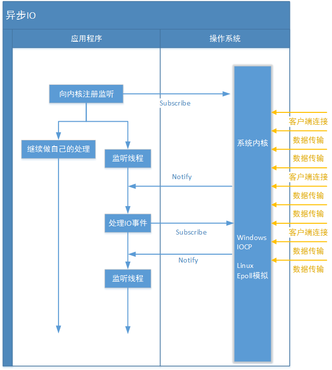  

和同步IO一样，异步IO也是由操作系统进行支持的。微软的windows系统提供了一种异步IO技术: **IOCP**(I/O Completion Port，I/O完成端口)； Linux下由于没有这种异步IO技术，所以使用的是**epoll**对异步IO进行模拟。  

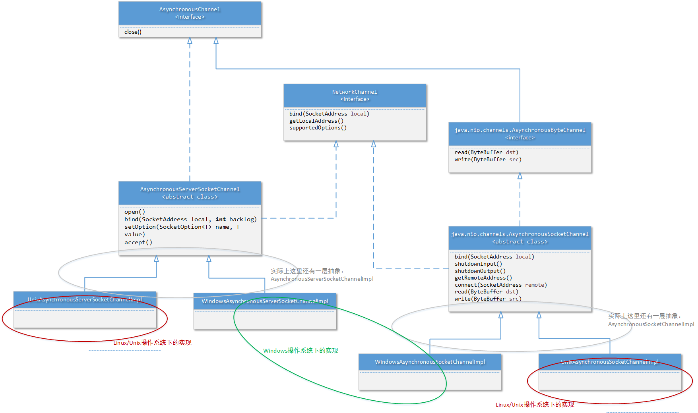  

### 示例1
    
    public class Server {
        public static void main(String[] args) {
            try {
                //创建服务端通道
                AsynchronousServerSocketChannel assChannel = AsynchronousServerSocketChannel.open();
                //绑定端口
                assChannel.bind(new InetSocketAddress(5555));
                System.out.println("服务端启动。。。。。");
                //接收客户端连接accept，接收操作异步处理
                assChannel.accept(null, new AcceptCompletionHandler(assChannel));
                //accept是异步操作，防止当前程序直接执行结束
                try {
                    // 阻塞程序，防止被GC回收
                    TimeUnit.SECONDS.sleep(Long.MAX_VALUE);
                } catch (InterruptedException e) {
                    e.printStackTrace();
                }
            } catch (IOException e) {
                e.printStackTrace();
            }
        }
    
    }
    
    public class AcceptCompletionHandler implements CompletionHandler<AsynchronousSocketChannel,Object> {
        private AsynchronousServerSocketChannel assChannel;
    
        public AcceptCompletionHandler(AsynchronousServerSocketChannel assChannel) {
            this.assChannel=assChannel;
        }
    
        @Override
        public void completed(AsynchronousSocketChannel result, Object attachment) {
            System.out.println("有新的客户端连接......");
            ByteBuffer buffer=ByteBuffer.allocate(1024);
            /**读客户端数据，读操作是异步操作,需要实现CompletionHandler对象
             * <A> void read(ByteBuffer dst,A attachment,CompletionHandler<Integer,? super A> handler);
             * 读操作异步方式方法解读
             * 第一个参数：dst  数据读取的目的地
             * 第二个参数：attachment  给读回调传递的额外信息
             * 第三个参数：CompletionHandler 当读数据完成后CompletionHandler对象
             */
            result.read(buffer,buffer, new ReadCompletionHandler(result));
    
            //再次接收其他客户端的数据
            assChannel.accept(null,new AcceptCompletionHandler(assChannel));
        }
    
        @Override
        public void failed(Throwable exc, Object attachment) {
            exc.printStackTrace();
            System.out.println("连接失败：");
        }
    }

    
    public class ReadCompletionHandler implements CompletionHandler<Integer, ByteBuffer> {
        private  AsynchronousSocketChannel result;
    
        public ReadCompletionHandler(AsynchronousSocketChannel result) {
    
            this.result=result;
        }
    
        @Override
        public void completed(Integer result, ByteBuffer attachment) {
            //读取完数据之后
            //移动limit位置
    
            attachment.flip();
            byte[] bytes = new byte[attachment.remaining()];
            attachment.get(bytes);
            String msg = new String(bytes,StandardCharsets.UTF_8);
            System.out.println("服务端接收数据："+msg);
            attachment.clear();
            //重复接收消息,再次调用异步读操作
    
            this.result.read(attachment,attachment,new ReadCompletionHandler(this.result));
        }
    
        @Override
        public void failed(Throwable exc, ByteBuffer attachment) {
    
        }
    }

    
    public class Client {
        public static void main(String[] args) throws IOException {
            AsynchronousSocketChannel asChannel=AsynchronousSocketChannel.open();
            //连接服务端，异步方式
            asChannel.connect(new InetSocketAddress("127.0.0.1",5555),asChannel,new ClientCompletionHandler());
    
            ByteBuffer buffer=ByteBuffer.allocate(1028);
            //写操作
    
            Scanner scanner = new Scanner(System.in);
            while (scanner.hasNext()) {
                System.out.print("输入消息内容：");
                String msg = scanner.nextLine();
                if (msg != null && !"".equals(msg.trim())) {
                    buffer.put(msg.getBytes(StandardCharsets.UTF_8));
                    buffer.flip();
                    asChannel.write(buffer);
                    buffer.clear();
                }
            }
    
        }
    }
    
    
    public class ClientCompletionHandler implements CompletionHandler<Void, AsynchronousSocketChannel> {
        @Override
        public void completed(Void result, AsynchronousSocketChannel attachment) {
            System.out.println("连接服务成功.");
        }
    
        @Override
        public void failed(Throwable exc, AsynchronousSocketChannel attachment) {
            exc.printStackTrace();
            System.out.println("连接服务失败.");
        }
    }
    
## BIO、NIO、AIO的比较 

> BIO的IO处理流程：  

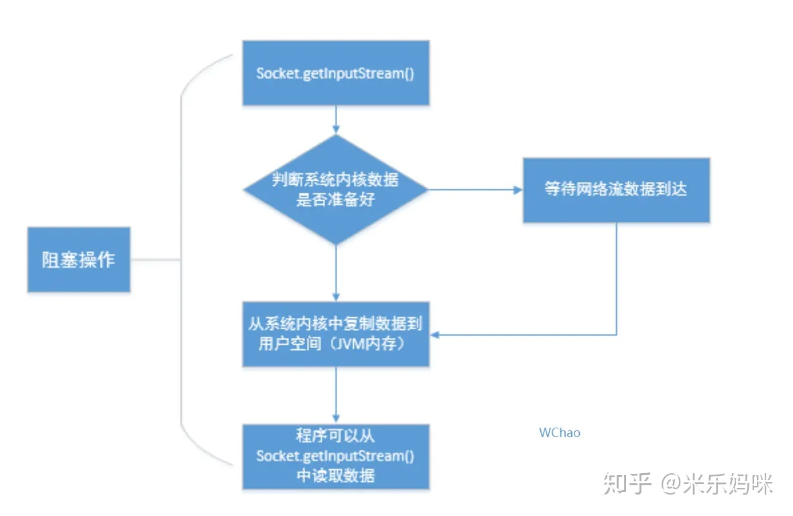
    
> NIO的IO处理流程：

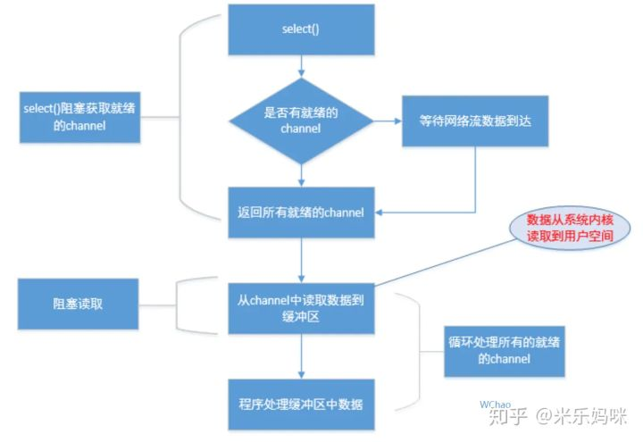  

> AIO的IO处理流程：

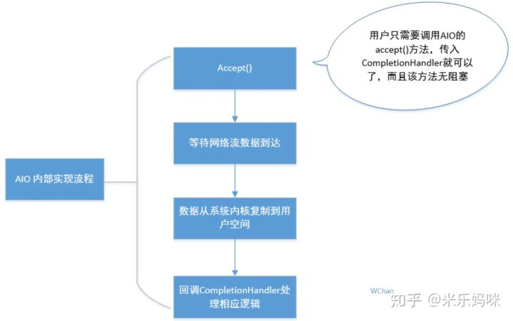