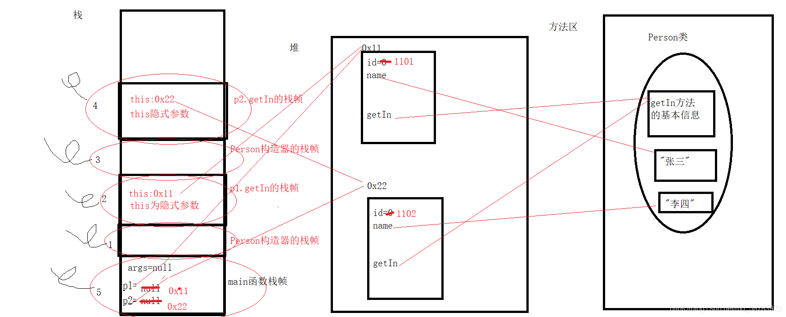
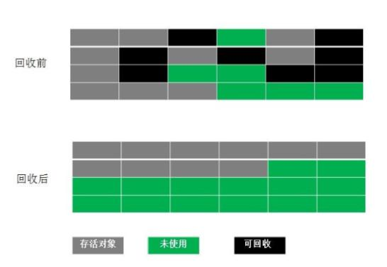

# JVM(Java Virtual Machine) java虚拟机
## 概述
    JVM 是 Java Virtual Machine 的缩写，即Java虚拟机，
    是一种抽象计算机，它有一个指令集，在运行时操作各种内存区域。虚拟机有很多种，
    不同厂商提供了不同实现，只要遵循虚拟机规范即可，
    目前我们所说的虚拟机一般指的是Hot Spot。
    JVM对Java语言一无所知，只知道一种特定的二进制格式，即类文件格式，
    我们写好的程序最终交给JVM执行的时候会被编译成二进制格式，JVM只认识二进制格式，
    所以任何语言只要编译后的格式符合要求，都可以在JVM上运行。
 
## JVM内存结构

> 内存空间：5个部分
    
    1.程序计数器
    2.java虚拟机栈
    3.本地方法栈
    4.堆
    5.方法区
### 程序计数器
    
    **记录指令执行到哪里**
    程序计数器是一块较小的内存空间，是当前线程正在执行的那条字节码指令的地址。
    字节码解释器通过改变程序计数器来依次读取指令，从而实现代码的流程控制；
    在多线程情况下，程序计数器记录的是当前线程执行的位置，
    当线程切换回来时，就知道上次线程执行到哪了。
    
        1.线程私有，每条线程都有自己的程序计数器。
        2.生命周期：随着线程的创建而创建，随着线程的结束而销毁。
        3.是唯一一个不会出现内存溢出（OutOfMemoryError) 的内存区域。
### java虚拟机栈
    
    **生成线程的栈帧，记录运行过程的一些信息**
    虚拟机栈是线程独有的空间，
    每个线程都有一个与线程同时创建的私有的虚拟机栈。
    虚拟机栈中存储栈帧，每个被线程调用的方法都会产生一个栈帧。
    调用一个方法就是执行一个栈帧的过程，一个方法调用完成，对应的栈帧就会出栈。
    栈的大小默认为1M，可通过参数-Xss调整大小，如-Xss256k。
    栈帧用于存放该方法运行过程中的一些信息，如：
        局部变量表
        操作数栈
        动态链接
        方法出口信息
        等......
        
    **局部变量表**
    
    定义为一个数字数组，主要用于存储方法参数、定义在方法体内部的局部变量，
    数据类型包括各类基本数据类型，对象引用，以及 return address 类型。
    
    局部变量表容量大小是在编译期确定下来的。最基本的存储单元是 slot（变量槽）。
    
    **操作数栈**
    
    每一个独立的栈帧除了包含局部变量表以外，还包含一个后进先出（Last-In-First-Out）的 操作数栈，
    也可以称之为表达式栈（Expression Stack）
    
    操作数栈，主要用于保存计算过程的中间结果，同时作为计算过程中变量临时的存储空间。
    
    **动态链接**
    
    每一个栈帧内部都包含一个指向运行时常量池中该栈帧所属方法的引用。
    
    包含这个引用的目的就是为了支持当前方法的代码能够实现动态链接（Dynamic Linking）。比如：invokedynamic指令
    
    在Java源文件被编译到字节码文件中时，所有的变量和方法引用都作为符号引用（Symbolic Reference）
    保存在class文件的常量池里。比如：描述一个方法调用了另外的其他方法时，就是通过常量池中指向方法的符号引用来表示的，
    那么动态链接的作用就是为了将这些符号引用转换为调用方法的直接引用。
    
    **虚拟机栈可能有以下两种异常：**
    
    1.如果线程执行所需栈深度大于Java虚拟机栈深度，就会抛出StackOverFlowError，
        其实方法调用的过程就是入栈和出栈的过程，如果线程请求分配的栈容量超过Java虚拟机栈允许的最大容量
        ，就容易发生异常（递归调用）
    2.如果Java虚拟机栈可以动态扩展，但是扩展大小的时候无法申请到足够的内存，则会抛出OutOfMemoryError。
    
        public static void main(String[] args) {
            test();
        }
        public static void test() {
            test();
        }
        //抛出异常：Exception in thread"main"java.lang.StackoverflowError
        //程序不断的进行递归调用，而且没有退出条件，就会导致不断地进行压栈。
### 本地方法栈(C栈)

    本地方法栈是为 JVM 运行 Native 方法准备的空间，
    由于很多 Native 方法都是用 C 语言实现的，所以它通常又叫 C 栈。
    它与 Java 虚拟机栈实现的功能类似，
    只不过本地方法栈是描述本地方法运行过程的内存模型
    
### 堆 

*堆是用来存放对象的内存空间，几乎所有的对象都存储在堆中
     
     堆是java虚拟机管理内存最大的一块， 在虚拟机启动时创建，
     所有线程共享，堆中的对象永远不会被显式释放，必须由GC回收，
     所以GC也主要回收堆中的对象实例，
     我们平常讨论的垃圾回收就是回收堆内存。
     堆可以处于物理上不连续的空间，可以固定大小，也可以动态扩展，
     通过参数-Xms和-Xmx两个参数控制堆的最小值和最大值。
          
 *Java 7及之前堆内存逻辑上分为三部分：新生区+养老区+永久区
 
 *Java 8及之后堆内存逻辑上分为三部分：新生区+养老区+元空间
 
 其中永久区/元空间就是方法区，逻辑上属于堆的一部分，下面方法区部分会有讲解  
 约定：新生区（代）<=>年轻代 、 养老区<=>老年区（代）、 永久区<=>永久代  
 
 *Java堆区进通常可以划分为年轻代（YoungGen）和老年代（oldGen） 

 
 
 #### 新生代与老年代
     
     1.新生代与老年代空间默认比例 1:2：JVM 调参数，XX:NewRatio=2，
       表示新生代占 1，老年代占 2，新生代占整个堆的 1/3。
     2.HotSpot 中，Eden 空间和另外两个 Survivor 空间缺省所占的比例是：8:1:1。
     3.几乎所有的 Java 对象都是在 Eden 区被 new 出来的，
       Eden 放不了的大对象，就直接进入老年代了。
       
       
#### 对象分配过程

    

    1.new的对象先放Eden伊甸园区。此区有大小限制。
    
    2.当Eden伊甸园的空间填满时，程序又需要创建对象，JVM的垃圾回收器将对Eden 伊甸园区进行垃圾回收（YGC），
            将伊甸园区中的不再被其他对象所引用的对象进行销毁。再加载新的对象放到伊甸园区
    
    3.然后将Eden 伊甸园中的剩余对象移动到幸存者S0区。
    
    4.如果再次触发垃圾回收，此时上次幸存下来的放到幸存者S0区的，如果没有回收，就会放到幸存者S1区。
    
    5.如果再次经历垃圾回收，此时会重新放回幸存者S0区，接着再去幸存者S1区。
    
    6.啥时候能去养老区呢？可以设置次数。默认是15次。
        *可以设置参数：进行设置*`-Xx:MaxTenuringThreshold= N`
    
    7.在养老区，相对悠闲。当养老区内存不足时，再次触发GC：Full GC，进行养老区的内存清理
    
    8.若养老区执行了Full GC之后，发现依然无法进行对象的保存，就会产生OOM异常。
    
    
#### Full GC 触发条件
   
    **Eden空间不足YGC,老年代空间不够，Full GC**
    1.当年轻代空间不足时，就会触发YGC,，这里的年轻代满指的是Eden代满
    2.显示调用System.gc(),老年代的空间不够,方法区的空间不够等都会触发 Full GC，
      同时对新生代和老年代回收，FUll GC 的 STW 的时间最长，应该要避免
    3.在出现 Full GC 之前，会先触发 YGC，
      如果老年代的空间还是不够就会触发 Full GC，STW 的时间长于 YGC
#### 逃逸分析

**对象和数组并非都是在堆上分配内存的**
    
- 1.《深入理解 Java 虚拟机中》关于 Java 堆内存有这样一段描述：
    随着 JIT 编译期的发展与逃逸分析技术逐渐成熟，栈上分配,标量替换优化技术将会导致一些变化，
    所有的对象都分配到堆上也渐渐变得不那么"绝对"了。
    这是一种可以有效减少 Java 内存堆分配压力的分析算法，通过逃逸分析，
- 2.**逃逸分析**    
Java Hotspot 编译器能够分析出一个新的对象的引用的使用范围从而决定是否要将这个对象分配到堆上。
  - 2.1.当一个对象在方法中被定义后，它可能被外部方法所引用，如作为调用参数传递到其他地方中，称为**方法逃逸**。
  - 2.2.再如赋值给类变量或可以在其他线程中访问的实例变量，称为**线程逃逸**    
        
#### TLAB(线程本地分配缓存区)
    
    **多线程分配单独的缓存区，保证同步执行，提高效率。如果没成功就加锁保证原子性**
    *TLAB 的全称是 Thread Local Allocation Buffer，即线程本地分配缓存区，
        是属于 Eden 区的，这是一个线程专用的内存分配区域，线程私有,
        默认开启的（当然也不是绝对的，也要看哪种类型的虚拟机）
    *堆是全局共享的, 在同一时间，可能会有多个线程在堆上申请空间，
    但每次的对象分配需要同步的进行（虚拟机采用 CAS 配上失败重试的方式保证更新操作的原子性）
    但是效率却有点下降
    *所以用 TLAB 来避免多线程冲突，在给对象分配内存时，每个线程使用自己的 TLAB，这样可以使得线程同步，
    提高了对象分配的效率
    *当然并不是所有的对象都可以在 TLAB 中分配内存成功，如果失败了就会使用加锁的机制来保持操作的原子性
    *-XX:+UseTLAB使用 TLAB,-XX:+TLABSize 设置 TLAB 大小
**TLAB 分配过程：**    
    
### 方法区
    
    **堆的逻辑部分(永久代/元空间)**
    
    Java 虚拟机规范中定义方法区是**堆**的一个逻辑部分。方法区存放以下信息：
    
        1.已经被虚拟机加载的类信息
        2.常量
        3.静态变量
        4.即时编译器编译后的代码
        
        

        
#### 方法区的特点
 
     1.线程共享。 方法区是堆的一个逻辑部分，因此和堆一样，都是线程共享的。整个虚拟机中只有一个方法区。
     2.永久代。 方法区中的信息一般需要长期存在，而且它又是堆的逻辑分区，因此用堆的划分方法，
               把方法区称为“永久代”。
     3.内存回收效率低。 方法区中的信息一般需要长期存在，回收一遍之后可能只有少量信息无效。
                       主要回收目标是：对常量池的回收；对类型的卸载。
     4.Java 虚拟机规范对方法区的要求比较宽松。 和堆一样，允许固定大小，也允许动态扩展，
         还允许不实现垃圾回收
**jdk1.7和jdk1.8实现方法区的区别**

    jdk1.7之前方法区使用永久代实现，
               方法区大小可以通过参数-XX:PermSize和-XX:MaxPermSize来控制方法区的大小和所能允许的最大值。
    jdk1.8移除了永久代，采用元空间实现，
           所以在jdk1.8中永久代的参数改成-XX:MetaspaceSize和-XX:MaxMetaspaceSize。
           **元空间和永久代的一个很大的区别就是元空间已经不在jvm内了，直接存储到了本地内存**。
## 对象的内存布局
### new 对象过程

    主要是三步：
     1.申请内存空间，这一步给成员变量赋默认值
     2.调用构造方法，这一步给成员变量赋初始值，
     3.建立指针与对象的关联。
   
    第一步是为了解决c++ 变量遗留值的问题，上一个程序访问过这块空间遗留下的值，安全起见先赋默认值。
    
### 普通对象布局

       分为4个部分：
       1.markword  8个字节
       
       2.class pointer 4个（压缩）或8个字节，指向对应的class
       
       3.instance data 对象的内部数据，例如成员变量
       4.padding  将字节数长度拼接到可以被8整除
       
       markword+class pointer 组成对象头，默认开启压缩为12个字节

例子：  
1、 Object o=new Object();

   
   
2. 有参数的对象

    String引用占4个字节，也就是32位，
    之所以不是8个字节64位是因为使用了压缩指针，
    我们常说的多少位，代表内存中2的n次方个地址，
    32的位计算机最大只能使用4G的内存。
### 数组对象布局
     
     对象头多了个数组长度

    
#### 对象头

    对象头记录了对象在运行过程中所需要使用的一些数据：
    
    哈希码 hashCode信息
    GC 分代年龄
    锁状态标志 
    线程持有的锁
    偏向线程 ID
    偏向时间戳
    
    对象头可能包含类型指针，通过该指针能确定对象属于哪个类。
    如果对象是一个数组，那么对象头还会包括数组长度。
## 对象的访问方式
    
    所有对象的存储空间都是在堆中分配的，但是这个对象的引用却是在堆栈中分配的。
    也就是说在建立一个对象时两个地方都分配内存，在堆中分配的内存实际建立这个对象，
    而在堆栈中分配的内存只是一个指向这个堆对象的指针（引用）而已。 
    那么根据引用存放的地址类型的不同，对象有不同的访问方式。
    
### 句柄访问方式

    堆中需要有一块叫做“句柄池”的内存空间，
    句柄中包含了**对象实例数据**与**类型数据**各自的具体地址信息。
    
    引用类型的变量存放的是该对象的句柄地址（reference）。
    访问对象时，首先需要通过引用类型的变量找到该对象的句柄，
    然后根据句柄中对象的地址找到对象。 
 
### 直接指针访问方式

     引用类型的变量直接存放对象的地址，从而不需要句柄池，
     通过引用能够直接访问对象。
     但对象所在的内存空间需要额外的策略存储对象所属的类信息的地址。

**HotSpot 采用第二种方式，即直接指针方式来访问对象**
只需要一次寻址操作，所以在性能上比句柄访问方式快一倍。  
但像上面所说，它需要额外的策略来存储对象在方法区中类信息的地址。  
也就是在对象信息里面要存方法区类信息的引用地址  

## 堆、栈、方法区交互

**例子：**

    public class Person {
        int id;
        String name;
        void getIn(){
            System.out.println("id："+id+",name："+name);
     
        }
        public Person(){
     
        }
        public static void main(String[] args){
            //创建p1对象
            Person p1=new Person();
            p1.id=1101;
            p1.name="张三";
            p1.getIn();
            //创建p2对象
            Person p2=new Person();
            p2.id=1102;
            p2.name="李四";
            p2.getIn();
        }
    }
    

参考博客[JVM内存模型](https://blog.csdn.net/sermonlizhi/article/details/124774141)

## 常量池

### 类常量池 

    类常量池是.class字节码文件中内容,保存了Java类中大多数信息,如方法信息、变量信息等.
    
**例子：**
 定义一个类： 
    
    package com.study.jvm.mem;
    
    public class UserService {
    
        private final static Long ID=10L;
        private static String name = "user";
        public String userInfo(){
            String userInfo = "{name:x,age:1}";
            return "userInfo";
        }
    
    }
    
 查看字节码：  
  
    javap -v UserService.class 
    
    
    Classfile /Users/dev/workspace-study/study/jvm/target/classes/com/study/jvm/mem/UserService.class
      Last modified 2022-6-1; size 664 bytes
      MD5 checksum 7e46f52a2426c92ecd39d80a1393fb99
      Compiled from "UserService.java"
    public class com.study.jvm.mem.UserService
      minor version: 0
      major version: 52
      flags: ACC_PUBLIC, ACC_SUPER
    Constant pool:
       #1 = Methodref          #11.#28        // java/lang/Object."<init>":()V
       #2 = String             #29            // {name:x,age:1}
       #3 = String             #23            // userInfo
       #4 = Long               10l
       #6 = Methodref          #30.#31        // java/lang/Long.valueOf:(J)Ljava/lang/Long;
       #7 = Fieldref           #10.#32        // com/study/jvm/mem/UserService.ID:Ljava/lang/Long;
       #8 = String             #33            // user
       #9 = Fieldref           #10.#34        // com/study/jvm/mem/UserService.name:Ljava/lang/String;
      #10 = Class              #35            // com/study/jvm/mem/UserService
      #11 = Class              #36            // java/lang/Object
      #12 = Utf8               ID
      #13 = Utf8               Ljava/lang/Long;
      #14 = Utf8               name
      #15 = Utf8               Ljava/lang/String;
      #16 = Utf8               <init>
      #17 = Utf8               ()V
      #18 = Utf8               Code
      #19 = Utf8               LineNumberTable
      #20 = Utf8               LocalVariableTable
      #21 = Utf8               this
      #22 = Utf8               Lcom/study/jvm/mem/UserService;
      #23 = Utf8               userInfo
      #24 = Utf8               ()Ljava/lang/String;
      #25 = Utf8               <clinit>
      #26 = Utf8               SourceFile
      #27 = Utf8               UserService.java
      #28 = NameAndType        #16:#17        // "<init>":()V
      #29 = Utf8               {name:x,age:1}
      #30 = Class              #37            // java/lang/Long
      #31 = NameAndType        #38:#39        // valueOf:(J)Ljava/lang/Long;
      #32 = NameAndType        #12:#13        // ID:Ljava/lang/Long;
      #33 = Utf8               user
      #34 = NameAndType        #14:#15        // name:Ljava/lang/String;
      #35 = Utf8               com/study/jvm/mem/UserService
      #36 = Utf8               java/lang/Object
      #37 = Utf8               java/lang/Long
      #38 = Utf8               valueOf
      #39 = Utf8               (J)Ljava/lang/Long;
    {
      public com.study.jvm.mem.UserService();
        descriptor: ()V
        flags: ACC_PUBLIC
        Code:
          stack=1, locals=1, args_size=1
             0: aload_0
             1: invokespecial #1                  // Method java/lang/Object."<init>":()V
             4: return
          LineNumberTable:
            line 3: 0
          LocalVariableTable:
            Start  Length  Slot  Name   Signature
                0       5     0  this   Lcom/study/jvm/mem/UserService;
    
      public java.lang.String userInfo();
        descriptor: ()Ljava/lang/String;
        flags: ACC_PUBLIC
        Code:
          stack=1, locals=2, args_size=1
             0: ldc           #2                  // String {name:x,age:1}
             2: astore_1
             3: ldc           #3                  // String userInfo
             5: areturn
          LineNumberTable:
            line 11: 0
            line 12: 3
          LocalVariableTable:
            Start  Length  Slot  Name   Signature
                0       6     0  this   Lcom/study/jvm/mem/UserService;
                3       3     1 userInfo   Ljava/lang/String;
    
      static {};
        descriptor: ()V
        flags: ACC_STATIC
        Code:
          stack=2, locals=0, args_size=0
             0: ldc2_w        #4                  // long 10l
             3: invokestatic  #6                  // Method java/lang/Long.valueOf:(J)Ljava/lang/Long;
             6: putstatic     #7                  // Field ID:Ljava/lang/Long;
             9: ldc           #8                  // String user
            11: putstatic     #9                  // Field name:Ljava/lang/String;
            14: return
          LineNumberTable:
            line 5: 0
            line 7: 9
    }
    SourceFile: "UserService.java"

其中Constant pool,就是.class文件的常量池.  
我们可以从中看到我们定义的常量信息和方法信息.

      private final static Long ID=10L;
      字节码表示如下:
       #7 = Fieldref           #10.#32        // com/study/jvm/mem/UserService.ID:Ljava/lang/Long;
       #12 = Utf8               ID
       #32 = NameAndType        #12:#13        // ID:Ljava/lang/Long;
其中主要两类常量

  

    字面量：
        给基本类型变量赋值的方式就叫做字面量或者字面值。 
        比如：String a=“b” ，这里“b”就是字符串字面量，
        同样类推还有整数字面值、浮点类型字面量、字符字面量。
    符号引用
    
        符号引用主要设涉及编译原理方面的概念，
        包括下面三类常量:
    
        类和接口的全限定名(Full Qualified Name)，也就是Ljava/lang/String;，
             主要用于在运行时解析得到类的直接引用。
    
        字段的名称和描述符(Descriptor)，字段也就是类或者接口中声明的变量，
        包括类级别变量(static)和实例级的变量。
        
        方法的名称和描述符,方法的描述类似于JNI动态注册时的“方法签名”，
            也就是参数类型+返回值类型，比如下面的这种字节码，表示main方法和String返回类型。

    小结：在Class文件中，存在着一些不会发生变化的东西，
        比如一个类的名字、类的字段名字/所属数据类型、方法名称/返回类型/参数名、常量、字面量等。
        这些在JVM解释执行程序的时候非常重要，所以编译器将源代码编译成class文件之后，
        会用一部分字节分类存储这些不变的代码，而这些字节我们就称为常量池。

###  运行时常量池   
    在虚拟机的类加载阶段,jvm会把该.class的字节流所代表的静态存储结构转化为方法区的运行时数据结构.
    
    运行时常量池有以下特点:
    
    每一个.class文件都会分配一个运行时常量池来存储当前类.class文件中的常量池信息,
    这些信息主要是编译期生成的各种字面量和符号引用.
    运行时常量池相对于class文件常量池,是动态的.
    

### 字符串常量池
   **字符串常量池是专门针对String类型设计的常量池.是当前应用所有线程共享的,每个jvm只有一个.**   
> 为什么要单独对字符串设计一个常量池

首先看下String的定义:
    
    public final class String
        implements java.io.Serializable, Comparable<String>, CharSequence {
        /** The value is used for character storage. */
        private final char value[];
        
    }
从源码中可以看出:  
1.String被final修饰,表示无法被继承  
2.属性value被final修饰,表示赋值后无法被修改   
所以：String具有不可变性.

    由于在Java中String变量会被大量使用,如果每一次声明一个String,都为其分配内存空间,存储对应的char[] ,
    将会导致极大的空间浪费.
    
    所以在jvm中提出了字符串常量池的概念,当初始化一个String变量时,如果该字符串已经在字符串常量池已经存在,
    就直接返回该字符串的引用.否则,往字符串常量池添加该字符串,并返回其引用.

其引用关系如下:

#### 例子
> String a="Hello" 和String a=new String("Mic") 

> String.intern()

结论：intern()主要是把 str1指针直接指向字符常量池      
        
可以参考美团技术文档[深入解析String#intern](https://tech.meituan.com/2014/03/06/in-depth-understanding-string-intern.html)     

> String+String   
   
**例子代码：**
  
    public class StringService {
    
        public static void main(String[] args) {
            String str1 = new String("abc");
            String str2 = "abc";
            String str3 = new String("a")+new String("bc");
            System.out.println("str1 == str2:"+(str1==str2));
            System.out.println("str2 == str3:"+(str3==str2));
            System.out.println("str1 == str3:"+(str1==str2));
            System.out.println("str1.intern == str3.intern:"+(str1.intern()==str2.intern()));
            System.out.println("str2.intern == str3.intern:"+(str2.intern()==str2.intern()));
    
        }
    }
**字节码**

    Code:
          stack=4, locals=4, args_size=1
             0: new           #2                  // class java/lang/String
             3: dup
             4: ldc           #3                  // String abc
             6: invokespecial #4                  // Method java/lang/String."<init>":(Ljava/lang/String;)V
             9: astore_1
            10: ldc           #3                  // String abc
            12: astore_2
            13: new           #5                  // class java/lang/StringBuilder
            16: dup
            17: invokespecial #6                  // Method java/lang/StringBuilder."<init>":()V
            20: new           #2                  // class java/lang/String
            23: dup
            24: ldc           #7                  // String a
            26: invokespecial #4                  // Method java/lang/String."<init>":(Ljava/lang/String;)V
            29: invokevirtual #8                  // Method java/lang/StringBuilder.append:(Ljava/lang/String;)Ljava/lang/StringBuilder;
            32: new           #2                  // class java/lang/String
            35: dup
            36: ldc           #9                  // String bc
            38: invokespecial #4                  // Method java/lang/String."<init>":(Ljava/lang/String;)V
            41: invokevirtual #8                  // Method java/lang/StringBuilder.append:(Ljava/lang/String;)Ljava/lang/StringBuilder;
            44: invokevirtual #10                 // Method java/lang/StringBuilder.toString:()Ljava/lang/String;
            47: astore_3
    
**我们可以看出：**
    
     String str3 = new String("a")+new String("bc");
     操作步骤：
     1.new StringBuilder
     2.new String(“a”)
     3.在字符串常量池 添加 a
     4.new String(“bc”)
     5.在字符串添加 bc
     6.StringBuilder.toString() 操作又new String(“abc”),但是未往字符串常量池添加.
所以str1,str2,str3对应的内存分布如下:  

     

堆上的字符串对象a和字符串对象bc,会在最近的一次垃圾回收时被回收,因为根本没有不可达.

> 总结

    1.new String 返回的时堆上的地址,但是不会把string自动添加到字符串常量池
    2.String a = “abc”,会自动把abc添加到字符串常量池,并返回字符串在字符串常量池的内存地址
    3.String.intern会把当前堆上的字符串添加到字符串常量池,并把堆上该字符串引用指向到字符串常量池字符串地址,
    4.在程序中定义字符串推荐 String a= “abc”,或String a = new String(“abc”).intern,提高字符串利用率.
### 其他类型常量池
在java中,除了存在字符串常量池,其他封装类也有对应的常量池,  
只不过字符串常量池是jvm级别的,而其他封装类常量池是在各自的类里面实现（拆箱/封箱）.    
这些常量池范围如下:

    Byte、Short、Integer、Long:[-128,127]
    Character:[0,127]
    Boolean: [True,False]
    
以Integer为例:
    
    public final class Integer extends Number implements Comparable<Integer> {
    
    
        public static Integer valueOf(int i) {
            if (i >= IntegerCache.low && i <= IntegerCache.high)
                return IntegerCache.cache[i + (-IntegerCache.low)];
            return new Integer(i);
        }
    
     private static class IntegerCache {
            static final int low = -128;
            static final int high;
            static final Integer cache[];
    
            static {
                // high value may be configured by property
                int h = 127;
                String integerCacheHighPropValue =
                    sun.misc.VM.getSavedProperty("java.lang.Integer.IntegerCache.high");
                if (integerCacheHighPropValue != null) {
                    try {
                        int i = parseInt(integerCacheHighPropValue);
                        i = Math.max(i, 127);
                        // Maximum array size is Integer.MAX_VALUE
                        h = Math.min(i, Integer.MAX_VALUE - (-low) -1);
                    } catch( NumberFormatException nfe) {
                        // If the property cannot be parsed into an int, ignore it.
                    }
                }
                high = h;
    
                cache = new Integer[(high - low) + 1];
                int j = low;
                for(int k = 0; k < cache.length; k++)
                    cache[k] = new Integer(j++);
    
                // range [-128, 127] must be interned (JLS7 5.1.7)
                assert IntegerCache.high >= 127;
            }
    
            private IntegerCache() {}
        }
    
    }

常量池生效是在调用valueOf方法时，根据值得范围（-128-127），查看是否在常量池里面取值   

## 类的加载过程（类的生命周期）
**按照Java虚拟机规范，从class文件到加载到内存中的类，到类卸载出内存为止**    
它的整个生命周期包括如下7个阶段：    

### 加载
加载指的是通过一个完整的类或接口名称来获得其二进制流的形式，  
并将其按照Java虚拟机规范将数据存储到运行时数据区域，  
**类加载主要做三件事：**

    1、通过一个类的全限定名获得定义此类的二进制字节流。
    2、将这个二进制字节流所代表的的静态存储转化为方法区运行时数据结构。
    3、在Java堆中生成一个代表此类的java.lang.Class对象，作为方法区中这些数据的访问入口。
    
上面第一步在虚拟机规范中并没有说明Class来源于哪里，也没有说明怎么获取，所以就会产生很多的实现方式， 

**常用获取class文件方式：**  

    1、读取本地经过编译的.class文件(最正常的方式)
    2、从压缩包如zip,jar,war中读取。
    3、从网络中读取
    4、通过动态代理动态生成.class文件
    5、从数据库读取
    
**执行Class的加载需要一个类加载器**

而一个良好合格的**类加载器**需要具有以下两个属性：

    1、对于同一个Class名称，任何时候都应该返回相同的Class对象
    2、如果类加载器L1委派给类加载器L2去加载一个Class对象C，那么以下场景出现的任意类型T，
        两个类加载器L1和L2都应该返回相同的Class对象：
        （1）C的直接父类或者父接口类型
        （2）C中的字段类型
        （3）C中方法或者构造函数的参数类型
        （4）C中方法的返回类型
在Java中类加载器不止一种，对于同一个类用不同的类加载器加载出来的对象是不相等的，  
那么Java是如何保证上面两点呢？这就是**双亲委派模型**，  
Java通过双亲委派模型**防止恶意加载**，也确保了**安全性**。  
#### 双亲委派模型
> 定义  

**先看父类有没有，有就父类加载，没有才自己加载**    
    
    当某个特定的类加载器它在接到需要加载类的请求时，
    这个类会首先查看自己已加载完的类中是否包含这个类，
    如果有就返回，没有的话就会把加载的任务交给父类加载器加载，
    以此递归，父类加载器如果可以完成类加载任务，就返回它，
    当父类加载器无法完成这个加载任务时，才会不得已自己去加载。
    这种机制就叫做双亲委派机制。
 

> 破坏双亲委派模型
**重写ClassLoader类的loadClass方法**
      
      双亲委派模型并不是一个强制性的约束模型，只是一种推荐的加载模型，
      也有不遵守这个模型的：
                比如JNDI，JDBC等相关的SPI动作并没有完全遵守双亲委派模型，
      破坏双亲委派模型的一个最简单的方式就是：
               继承ClassLoader类，然后重写其中的loadClass方法（因为双亲委派的逻辑就在loadClass方法中）
      
#### 常见异常

如果加载过程出现异常，可能抛出以下异常:
      
- ClassCircularityError：extends或者implements了自己的类或接口
- ClassFormatError：类或接口的二进制格式不正确
- NoClassDefFoundError：根据提供的全限定名找不到对应的类或者接口。

### 连接
  获取类或接口的二进制形式并将其结合到java虚拟机的运行时状态以便执行的过程。
连接包括三个步骤：验证、准备和解析：

#### 验证
类加载进来需要格式校验，验证以下几个方面：

- 文件格式验证：比如说是不是以魔数开头，jdk版本号的正确性等等。
- 元数据验证：比如说类中的字段是否合法，是否有父类，父类是否合法等等。
- 字节码验证：主要是确定程序的语义和控制流是否符合逻辑。

如果验证失败，会抛出一个VerifyError。

#### 准备
准备阶段是正式为类变量（或称“静态成员变量”）分配内存并**设置初始值**的阶段，这些内存都将在方法区中分配。

> "通常情况" 
 
 - 这里所设置的初始值是数据类型默认的零值（如 0、0L、null、false 等），  
 - 比如我们定义了public static int value=111 ，  
 - 那么 value 变量在准备阶段的初始值就是 0 而不是 111（**初始化阶段**才会**赋值**）。  

>特殊情况：  
- 比如给 value 变量加上了 **final关键字**public static final int value=111 ，  
- 那么准备阶段 value 的值就被赋值为 111。

#### 解析
在准备阶段完成后，就进入了解析阶段。  
解析阶段（Resolution），简言之，将类、接口、字段和方法的符号引用**转为直接引用**。

符号引用就是一些字面量的引用，和虚拟机的内部数据结构和和内存布局无关。  
比较容易理解的就是在Class类文件中，通过常量池进行了大量的符号引用。  
但是在程序实际运行时，只有符号引用是不够的，  
比如当如下println()方法被调用时，  系统需要明确知道该方法的位置。

### 初始化
> 类的初始化时机：

1.创建类的实例  
2.访问某个类或接口的静态变量，或者对该静态变量赋值  
3.调用类的静态方法  
4.反射（比如：Class.forName(“com.atguigu.Test”)    
5.初始化一个类的子类  
6.Java虚拟机启动时被标明为启动类的类  
7.JDK7开始提供的动态语言支持：java.lang.invoke.MethodHandle，实例的解析结果REF_getStatic、REF putStatic、REF_invokeStatic句柄对应的类没有初始化，则初始化  

除了以上七种情况，其他使用Java类的方式都被看作是对类的被动使用，都不会导致类的初始化，  
即不会执行初始化阶段（不会调用 clinit() 方法和 init() 方法）

> clinit()方法

1.初始化阶段就是执行类构造器方法<clinit>()的过程
2.此方法不需定义，是javac编译器自动收集类中的所有类变量的赋值动作和静态代码块中的语句合并而来。也就是说，当我们代码中包含static变量的时候，就会有clinit方法
3.<clinit>()方法中的指令按语句在源文件中出现的顺序执行
4.<clinit>()不同于类的构造器。（关联：构造器是虚拟机视角下的<init>()）
5.若该类具有父类，JVM会保证子类的<clinit>()执行前，父类的<clinit>()已经执行完毕
6.虚拟机必须保证一个类的<clinit>()方法在多线程下被同步加锁

### 使用
经过上面5个步骤，一个完整的对象已经加载到内存了，接下来我们在代码中就可以直接使用了。

### 卸载
当一个对象不再被使用了，会被垃圾回收掉。
## 垃圾收集策略与算法
### 判断对象存活
> 引用计数法

 就是有一个地方引用，引用计数就+1，如果引用不为0则说明存活。    
 这种方式有个很大缺点（**循环引用**）:   
 如果两个对象相互引用，就永远认为是存活的，从而不能对该对象进行GC。

> 根可达分析

通过“GC Root”作为起点开始向下搜索，搜索走过的路叫引用链。当一个对象没有任何引用链则说明此对象死掉了。  
GC Root指的是：  
- 常量  
- 静态变量  
- 运行时方法中的变量直接引用的对象  

GC Roots 并不包括堆中对象所引用的对象，这样就**不会有循环引用**的问题。
### 引用的种类
强引用>软引用>弱引用>虚引用

> 强引用

我们写的代码一般都是强引用，如Object obj = new Object()这种就属于强引用，  
强引用主要还存在就不会回收，空间不够直接抛出OOM

> 软引用

软引用通过SoftReference类来实现，软引用用来表示一些还有用但又是非必需的对象，  
系统在即将溢出之前，如果发现有软引用的对象存在，会对其二次回收，回收之后内存还是不够就会抛出OOM

> 弱引用

弱引用通过WeakReference实现，弱引用也是用来表示非必需的对象，  
但是相比于软引用，弱引用的对象会在第一次垃圾回收时就被回收掉

> 虚引用

虚引用通过PhantomReference实现，称为幽灵引用或幻影引用，最弱的一种引用，  
一个对象是否有虚引用对其生存时间没有影响，也无法通过虚引用来取得一个对象实例。  
设置为虚引用的唯一用处就是当这个对象被回收时可以收到一个系统通知。

### 垃圾收集算法
> STW(Stop-The-World)机制,

指的是在执行垃圾收集算法时，Java应用程序的其他所有线程都被挂起（除了垃圾收集帮助器之外）。  
Java中一种全局暂停现象，**全局停顿**，  
所有Java代码停止，native代码可以执行，但不能与JVM交互；这些现象多半是由于gc引起。  

> 复制算法（copying）

  复制算法将内存划分成大小相等的**两块**，每次只用一块，  
    当其中一块用完了，就将还活着的对象复制到另一块，然后把剩下的垃圾一次性全干掉。
   
     
优点：    
实现简单，内存效率高，不易产生碎片  
  缺点：    
  1.内存分为2块、只用1块、内存利用率低  
  2.对象存放的位置变了，前面提到的直接指针也得更新。  
  
新生代的对象大部分死得快，所以复制的对象也会少，所以该垃圾回收算法适合**新生代**
 
 Appel式回收：  
  将新生代分配一块较大的Eden区，和两块较小的survivor区（eden占80%，两个survivor区各占10%）。  
  大多数对象很快就死，就不用去survivor区了，把内存利用率也提升到了90%。这比纯复制算法要优秀得多。

> 标记-清除
- 标记：遍历所有的 GC Roots，然后将所有 GC Roots 可达的对象标记为存活的对象。 
- 清除：遍历堆中所有的对象，将没有标记的对象全部清除掉。与此同时，清除那些被标记过的对象的标记，以便下次的垃圾回收。

优点：  
   相对于标记-整理算法，stw时间更短，因为整理时涉及对象的移动。  
缺点：   
   1.两个过程效率都不高  
   2.产生大量内存碎片,导致如果大对象时，内存不足而不得不提前下一次垃圾搜集动作。

适用于老年代【目前只有CMS用】。

> 标记-整理  

- 标记：它的第一个阶段与标记-清除算法是一模一样的，均是遍历 GC Roots，然后将存活的对象标记。
- 整理：移动所有存活的对象，且按照内存地址次序依次排列，然后将末端内存地址以后的内存全部回收。因此，第二阶段才称为整理阶段。    

优点:      
    没有内存碎片  
缺点：  
   涉及对象的移动，增加系统负担，同时还要暂停用户线程，去更新前面提到的直接指针。也适用于老年代。  

>分代收集算法

根据对象存活周期的不同，将内存划分为几块。一般是把 Java 堆分为新生代和老年代，针对各个年代的特点采用最适当的收集算法。  

新生代：复制算法   
老年代：标记-清除算法、标记-整理算法  

### 垃圾回收器
> 各种垃圾回收器  

垃圾回收器|算法，并发|回收对象|备注
--|--|--|--
Serial|	复制算法，单线程	|年轻代|	适用于几十到一两百兆的堆空间
Serial Old	|标记-整理，单线程|	老年代|	适用于几十到一两百兆的堆空间
ParNew	|复制算法，并行	|年轻代|	是Serial的多线程版本，经常配合CMS。JDK9直接合并在CMS了，但后续版本准备淘汰了
Parallel Scavenge|	复制算法，并行|	年轻代|	类似ParNew，更加关注吞吐量
Parallel old	|标记-整理，并行|	老年代|	Parallel Scavenge的老年代版本，配合Parallel Scavenge一起用。JDK8默认它俩的组合
CMS	|标记-清除，并行|	老年代	|以获取最短回收停顿时间为目标，因为没有整理所以更快。适用于几G 到20G 左右的堆空间
G1	|标记-整理，并行|	年轻代、老年代	|可实现 STW 的时间可预测， G1 将堆内存“化整为零”
> CMS垃圾回收器
  
**CMS的四个工作阶段**
  
    1.初始标记
    仅仅只是标记一下 GC Roots 能直接关联到的对象，速度很快。会暂停所有用户线程。
  
    2.并发标记
    标记从 GCRoots 开始关联的所有对象开始遍历整个可达分析路径的对象。和用户线程同时工作，耗时较长。
  
    3.重新标记
    修正因 并发标记 期间用户线程继续运行而导致标记变动的记录。暂停所有用户线程，时间较短。   
    此时会产生漏标（三色标记里会说明），通过 增量更新 解决
  
    4.并发清除
    和用户线程并行的去清除垃圾。所以耗时的清除就不会有STW
> G1垃圾回收器

**G1原理**  
  为了实现 STW 的时间可预测， G1 将堆内存“化整为零” ， 将堆内存划分成多个大小相等独立区域（ Region）  
  每一个 Region都可以根据需要， 扮演新生代的 Eden 空间、 Survivor 空间， 或者老年代空间  
  优先回收垃圾多的区域(存活的对象少)  

  一般只不断调优暂停时间，不修改堆的大小，不然就放弃了G1的自动调优  
  暂停时间如果太小，就会减少Eden区和survivor区的大小  
 
**Region**
  可能是 Eden,也有可能是 Survivor,也有可能是 Old  
  每个 Region 的大小可以通过参数-XX:G1HeapRegionSize 设定， 取值范围为 1MB~32MB,且应为 2 的 N 次幂  
  另外 Region 中还有一类特殊的 Humongous 区域， 专门用来存储大对象。G1 认为只要大小超过了一个 Region 容量一半的对象即可判定为大对象  
  超过了整个 Region 容量的超级大对象， 将会被存放在 N 个连续的 Humongous Region 之中，  
 G1 的进行回收大多数情况下都把 HumongousRegion 当作老年代的一部分来进行看待  

**G1的四个工作阶段**  
  1.初始标记  
  仅仅只是标记一下 GC Roots 能直接关联到的对象， 并且修改 TAMS 指针的值    

  2.并发标记  
  从 GC Root 开始对堆中对象进行可达性分析， 递归扫描整个堆里的对象图， 找出要回收的对象。耗时较长。
  当对象图扫描完成以后，并发时有引用变动的对象 ，这些对象会漏标
  漏标的对象会被一个叫做SATB(snapshot-at-the-beginning)算法来解决  

  3.最终标记  
  处理并发阶段结后仍遗留下来的最后那少量的 SATB （原始快照）记录。会有短暂的停顿  

  4.筛选回收  
  更新 Region 的统计数据， 对各个 Region 的回收价值和成本进行排序， 根据用户所期望的停顿时间来制定回收计划  
### 三色标记

实现根可达算法的时候，将整个过程拆分成了**初始标记**、**并发标记**、**重新标记**、**并发清除**四个阶段。  

初始标记阶段，指的是标记 GCRoots 直接引用的节点，将它们标记为灰色，这个阶段**需要** 「Stop the World」。  
并发标记阶段，指的是从灰色节点开始，去扫描整个引用链，然后将它们标记为黑色，这个阶段**不需要**「Stop the World」。  
重新标记阶段，指的是去校正并发标记阶段的错误，这个阶段**需要**「Stop the World」。  
并发清除阶段，指的是将已经确定为垃圾的对象清除掉，这个阶段**不需要**「Stop the World」。  

根据可达性分析算法，从 GC Roots 开始进行遍历访问。  
**初始状态** 所有的对象都是白色的，只有 GC Roots 是黑色的。

**初始标记**阶段，GC Roots 标记直接关联对象置为灰色。

**并发标记**阶段，扫描整个引用链。

- 没有子节点的话，将本节点变为黑色。
- 有子节点的话，则当前节点变为黑色，子节点变为灰色。
当对象图扫描完成以后，并发时有引用变动的对象 ，这些对象会**漏标**
漏标的对象会被一个叫做**SATB**(snapshot-at-the-beginning)算法来解决

**重新标记**阶段，直至灰色对象没有其它子节点引用时结束。

**并发清除**阶段
扫描完成  
此时黑色对象就是存活的对象，白色对象就是已消亡可回收的对象。  
即（A、D、E、F、G）可达也就是存活对象，（B、C、H）不可达可回收的对象。  

> 三色标记算法缺陷
  
  多标（浮动垃圾）和漏标

**多标**
突然
原本应该回收的对象，被多余地标记为黑色存活对象，从而导致该垃圾对象没有被回收。  
多标问题会出现，是因为在并发标记阶段，有可能之前已经被标记为存活的对象，其引用被删除，从而变成了不可达对象  

例如下图中，假设我们现在遍历到了节点 E，此时应用执行了 objD.fieldE = null;  
那么此刻之后，对象 E、F、G 应该是被回收的。但因为节点 E 已经是灰色的，    
那么 E、F、G 节点都会被标记为存活的黑色状态，并不会被回收。  

多标问题会导致内存产生**浮动垃圾**，但好在其可以再**下次GC **的时候被回收，因此问题还不算很严重。

**漏标**
标记到一半时，白色对象可能是灰色对象引用的对象，结果在并发标记的时候， 
变成了黑色对象的引用对象。由于黑色对象的子对象认为是扫描完的，所以该白色对象就会被当成垃圾回收 

例如下图中，  
假设我们现在遍历到了节点 E，此时应用执行如下代码。   
     
    var G = objE.fieldG; 
    objE.fieldG = null;  // 灰色E 断开引用 白色G 
    objD.fieldG = G;  // 黑色D 引用 白色G
    
这时候因为 E 对象没有引用了 G 对象，因此扫描 E 对象的时候并不会将 G 对象标记为黑色存活状态。  
但由于用户线程的 D 对象引用了 G 对象，这时候 G 对象应该是存活的，应该标记为黑色。  
但由于 D 对象已经被扫描过了，不会再次扫描，因此 G 对象就被漏标了。      
    

漏标问题就非常严重了，其会导致存活对象被回收，会严重影响程序功能。

**解决漏标的方案**

漏标只有同时满足以下两个条件时才会发生：

1.一个或者多个黑色对象重新引用了白色对象；即**黑色对象成员变量增加了新的引用**。

2.灰色对象断开了白色对象的引用（直接或间接的引用）；即**灰色对象原来成员变量的引用发生了变化**。

只有当上面两个条件都满足，三色标记算法才会发生漏标的问题。  
换言之，如果我们破坏任何一个条件，这个白色对象就不会被漏标。  
这其实就产生了两种方式，分别是：**增量更新**、**原始快照**。  
- CMS 回收器使用的增量更新方案，  
- G1 采用的是原始快照方案。  
> 增量更新 Incremental Update**  
破坏第一个条件：「黑色对象成员变量增加了新的引用」。  

**记录新增的引用**
也就是**黑色对象的引用记录**，在后续「**重新标记**」阶段再以这个**黑色对象为根**，  
对其引用进行重新扫描。通过这种方式，被黑色对象引用的白色对象就会变成灰色，  
从而变为存活状态。  

> 原始快照 Snapshot At The Beginning，SATB**  

**记录原来的引用**

原始快照的方案，即破坏第二个条件：「灰色对象原来成员变量的引用发生了变化」。  

当原来成员变量的引用发生变化之前，**记录下原来的引用对象**。
后面留给*最终标记*阶段处理快照部分，会有stw
会产生多标（浮动垃圾），下次GC在清理

> 那种处理方式更好**

原始快照相对增量更新来说效率更高（当然原始快照可能造成更多的浮动垃圾），  
因为不需要在重新标记阶段再次深度扫描被删除引用对象。    
CMS 对增量引用的根对象会做**深度扫描**，  
G1 因为很多对象都位于不同的 region，CMS 就一块老年代区域，  
重新深度扫描对象的话 G1 的代价会比 CMS 高，  
所以 G1 选择原始快照不深度扫描对象，只是**简单标记**，等到下一轮 GC 再深度扫描。

## JVM调优
> 什么情况下需要调优
    
    1.Heap内存（老年代）持续上涨达到设置的最大内存值；
    2.Full GC 次数频繁；
    3.GC 停顿时间过长（超过1秒）；
    4.应用出现OutOfMemory 等内存异常；
    5.应用中有使用本地缓存且占用大量内存空间；
    6.系统吞吐量与响应性能不高或下降。

> 基本原则

 JVM调优是一个手段，但并不一定所有问题都可以通过JVM进行调优解决，因此，在进行JVM调优时，我们要遵循一些原则： 
  
      1.大多数的Java应用不需要进行JVM优化；
      2.大多数导致GC问题的原因是代码层面的问题导致的（代码层面）；
      3.上线之前，应先考虑将机器的JVM参数设置到最优；
      4.减少创建对象的数量（代码层面）；
      5.减少使用全局变量和大对象（代码层面）；
      6.优先架构调优和代码调优，JVM优化是不得已的手段（代码、架构层面）；
      7.分析GC情况优化代码比优化JVM参数更好（代码层面）；
> 调优目的
    
    吞吐量：用户代码运行时间 / (用户代码运行时间 + GC时间)
    响应时间：STW越短，响应时间越好
    
> 常用参数
    
**设定堆内存大小**

    -Xms100m: 堆内存最小限制100m
    -Xmx100m：堆内存最大限制100m。
   

**设定新生代大小**。 新生代不宜太小，否则会有大量对象涌入老年代

    -XX:NewSize：新生代大小
    
    -XX:NewRatio 新生代和老生代占比
    
    -XX:SurvivorRatio：伊甸园空间和幸存者空间的占比.默认=8，比值为 8:1:1。
    
    -XX:MaxTenuringThreshold 设定对象在 Survivor 区最大年龄阈值，超过阈值转移到老年代，默认 15。
    
**开启GC日志**  
开启 GC 日志对性能影响很小且能帮助我们定位问题，

    -XX:+PrintGCTimeStamps -XX:+PrintGCDetails -Xloggc:gc.log    

**设定垃圾回收器**

    年轻代用 -XX:+UseParNewGC 
    年老代用-XX:+UseConcMarkSweepGC

 参数 | 回收器 
-- | --  
-XX:-UseSerialGC | Serial + Serial Old  
-XX:-UseParNewGC | ParNew + Serial Old  
-XX:-UseParallelGC | Parallel Scavenge + Serial Old  
-XX:-UseParallelOldGC | Parallel Scavenge + Parallel Old 
-XX:-UseConcMarkSweepGC | CMS + ParNew  
-XX:-UseG1GC | G1    
 
### 调优步骤
> 监控分析

分析GC日志及dump文件，判断是否需要优化，确定瓶颈问题点。 

> 生成dump文件

1.JVM启动时增加两个参数:
    
    # 出现OOME时生成堆dump:
    -XX:+HeapDumpOnOutOfMemoryError
    # 生成堆文件地址：
    -XX:HeapDumpPath=D:/test.hprof
     
2.jmap生成      
发现程序异常前通过执行指令，直接生成当前JVM的dump文件  

    jmap -dump:file=文件名.dump [pid]
    # 9257是指JVM的进程号
    jmap -dump:format=b,file=testmap.dump 9257
总结：
第一种方式是一种事后方式，需要等待当前JVM出现问题后才能生成dump文件，实时性不高；  
第二种方式在执行时，JVM是暂停服务的，所以对线上的运行会产生影响。

所以建议**第一种方式**。
> 常用参数

-XX:+PrintGCDetails | 查看程序运行GC的运行情况
-XX:+HeapDumpOnOutOfMemoryError -XX:HeapDumpPath=D:/test.hprof |内存溢出生成dump文件

> 调优工具

跳转到[调优工具](常用工具/JVM调优工具.md)