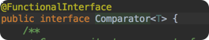

#lambda 的使用
参考博客[Java8 lambda 的使用](https://blog.csdn.net/bibiboyx/article/details/84257741)

## 描述

我们打开java1.8 Comparator的定义，发现了类定义上面多了一个@FunctionalInterface

对，1.8多了一个概念就是FunctionalInterface，这个Comparator就是一个FunctionalInterface

有了这个注解，原来使用实现类的地方就可以代之以lambda表达式。

## 举例    

    public class TestClass {
        public static void main(String[] args) {
            User user1 = new User(5, "aa");
            User user2 = new User(2, "ba");
            User user3 = new User(3, "ac");
            User user4 = new User(1, "aad");
            User user5 = new User(4, "asd");
            List<User> userList = Arrays.asList(user1, user2, user3, user4, user5);
            //获取所有ID集合
            List<Integer> idList = userList.stream().map(User::getId).collect(Collectors.toList());
            //排序ID
            List<User> userList1 = userList.stream().sorted(Comparator.comparingInt(User::getId)).collect(Collectors.toList());
            //分组
            Map<String, Long> map = userList.stream().collect(Collectors.groupingBy(User::getName, Collectors.counting()));
            //获取id大于2的
            List<User> userList2 = userList.stream().filter(user -> user.getId() > 2).collect(Collectors.toList());
            //获取最大
            Integer id = userList.stream().map(User::getId).max(Integer::compareTo).get();
            //获取最小
            Integer id1 = userList.stream().map(User::getId).min(Integer::compareTo).get();
            //获取id数量
            long count = userList.stream().map(User::getId).count();
            //总和
            int sum = userList.stream().mapToInt(User::getId).sum();
            //获取平均值
            double d = userList.stream().mapToInt(User::getId).average().getAsDouble();
            //匹配findAny/allMatch/noneMatch多用来判断
            User user = userList.stream().findAny().get();
            //获取第一个对象
            User user6 = userList.stream().findFirst().get();
            //将名字全转换为大写
            List<String> list = userList.stream().map(User::getName).map(String::toUpperCase).collect(Collectors.toList());
            //获取忽略第一个并取前几条数据
            List<User> list1 = userList.stream().skip(1).limit(2).collect(Collectors.toList());
            //去重
            List<User> collect = userList.stream().distinct().collect(Collectors.toList());
    
        }
    }
    
    
    import java.util.ArrayList;
    import java.util.Arrays;
    import java.util.List;
    import java.util.Set;
    import java.util.TreeSet;
    import java.util.function.BinaryOperator;
    import java.util.stream.Collector;
    import java.util.stream.Collectors;
    import java.util.stream.Stream;
    import org.junit.Test;
     
    /**
     *
     * lambda表达式中
     * 常用的stream相关方法
     * 1.Stream是元素的集合，类似Iterator；
       2.可以支持顺序和并行的对原Stream进行汇聚的操作；
     * @author huitoukest
     * @version 1.0
     *
     */
    public class MainStream  {
        /**
         * 
         * @param args
         */
        public static  void main(String[] args){
            
            MainStream main=new MainStream();
                 //main.testFilter();
                 //main.testMap();
                 //main.testDistinct();
                 //main.testFlatMap();
                 //main.testPeek();
                 //main.testLimit();
                 //main.testCollect();
                 //main.testSum();
                 main.testReduce();
        }
        
        /**
         * 使用Stream的基本步骤：
            1.创建Stream；
            2.转换Stream，每次转换原有Stream对象不改变，返回一个新的Stream对象（**可以有多次转换**）；
            3.对Stream进行聚合（Reduce/count等等）操作，获取想要的结果；
                   如何得到Stream对象：
            1.通过Collection接口（实现类）的默认方法stream()；
            2.通过Stream接口的静态方法Stream.of，比如Stream<Integer> stream = Stream.of(1,9,5);
            3.Stream.generate()或者Stream.iterate()生成无限长度的Stream，一般需要用limit(XX)发放来限定长度。
                        例子：Stream.iterate(1, item -> item + 1).limit(10).forEach(System.out::println);
                                   取出Stream中正整数集合的前10个。
         */
        
        /**
         * filter：过滤操作，将返回值是true的结果对应的项留下。
         * forEach：遍历操作，依次遍历每一个元素。
         * 这里，过滤掉长度大于等于2的元素
         */
        @Test
        public void testFilter(){
            List<String> list=Arrays.asList("b" ,"1","c","dd","2");
            list.stream()
            .filter((a)->a.length()<2)
            .forEach((a)->System.out.println(a))
            ;
        }
        
        /**
         * Map：映射操作，对集合中的每个元素做出相同的更改。
         * 这里，在每个元素后面加入下划线。
         */
         @Test
        public void testMap(){
            List<String> list=Arrays.asList("b" ,"1","c","dd","2");
            list.stream()
            .map((a)->a+"_")
            .forEach((a)->System.out.println(a))
            ;
        }
        
        /**
         * distinct：集合元素去重复操作。
         * count: 求出集合中元素的数量。
         */
         @Test
        public void testDistinct(){
            List<String> list=Arrays.asList("1" ,"1","2","dd","2");
            Long count=list.stream().distinct().count();
            System.out.println(count);
        }
        
        /**
         * flatMap:和map类似，不同的是其每个元素转换得到的是Stream对象，会把子Stream中的元素压缩到父集合中；
         * 即Map是遍历操作List中的元素。而flatMap中，需要我们返回Stream对象，flatMap自己把（返回的）多个Stream
         * 中的元素遍历压入一个Stream中。
         */
         @Test
        public void testFlatMap(){
            Stream<List<Integer>> inputStream = Stream.of(
                Arrays.asList(1),
                Arrays.asList(2,3,5),
                Arrays.asList(4,6)
                );
            Stream<Integer> outputStream = inputStream.flatMap((childList) -> childList.stream());
            outputStream.forEach(System.out::println);
        }
        
        /**
         * Peek:
         * 使用Peek的时候需要传入Consumer（消费函数），同时生成一个新的Stream。
         * 在我们用到新Stream集合中的具体元素的时候，会先触发消费函数中的操作。
         */
         @Test
        public void testPeek(){
            List<String> list=Arrays.asList("1" ,"a","2","dd","b");
            list.stream().peek(a->System.out.println(a+"_"))
            .forEach((a)->System.out.println("_"+a))
            ;
        }
        
        /**
         * Limit：对一个Stream进行截断操作，获取其前N个元素，如果原Stream中包含的元素个数小于N，那就获取其所有的元素；
         * Skip: 返回一个丢弃原Stream的前N个元素后剩下元素组成的新Stream，如果原Stream中包含的元素个数小于N，那么返回空Stream；
         */
         @Test
        public void testLimit(){
            List<String> list=Arrays.asList("1" ,"a","2","dd","b");
            list.stream().limit(4)
             .skip(1)
            .forEach((a)->System.out.println("_"+a))
            ;
        }
        
        /********************************************************************************************
                 上面基本上属于对Stream的转换，遍历，映射等操作。下面则是对Stream的汇聚（Reduce）操作
         *******************************************************************************************/
        /**
         * 可变汇聚：把输入的元素们累积到一个可变的容器中，比如Collection或者StringBuilder；
                  其他汇聚：除去可变汇聚剩下的，一般都不是通过反复修改某个可变对象，
                  而是通过把前一次的汇聚结果当成下一次的入参，反复如此。比如reduce，count，allMatch；
         */
        /**
         * collect，把Stream中的所有有元素收集到一个结果容器中
         * collect属于可变汇聚,同时也是Stream的通用汇聚操作
         */
         @Test
        public void testCollect(){
            List<String> list=Arrays.asList("1" ,"a","2","dd","b");
            /**
             * Collect这里有三个参数，分别是：(生成一个容器,也是返回的容器，如何往容器中添加元素，如何往容器中添加容器中的元素)。
             * 
             */
            ArrayList<String> aList=list.stream().collect(() -> new ArrayList<String>(),
                                  (lista,b) -> lista.add(b),
                                  (lista, listb) -> lista.addAll(listb));       
            aList.forEach((a)->System.out.println(a))
            ;
            System.out.println();
            /**
             * collect方法也接受Collector参数
             * Collector<T, A, R>
             *  T：输入元素类型
             *  A：缩减操作的可变累积类型（通常隐藏为实现细节）
             *  R：可变减少操作的结果类型
             */
            @SuppressWarnings("unused")
            Collector<Integer, ?, TreeSet<Integer>> intoSet =
                    Collector.of(TreeSet::new, TreeSet::add,
                                 (left, right) -> { left.addAll(right); return left; });              
            System.out.println();
            /**
             * Collectors中封装的一些静态方法返回Collector参数
             * 包括：toList,toSet,toCollection,toMap等等。
             */
            Set<String> aList3=list.stream().collect(Collectors.toSet());
            aList3.forEach((a)->System.out.println(a))
            ;
        }
        
        /**一些特定的汇聚操作
         * 比如sum，max,count :sum方法不是所有的Stream对象都有的，只有IntStream、LongStream和DoubleStream是实例才有
         */
         @Test
        public void testSum(){
            List<Integer> list=Arrays.asList(1 ,3,2,0);
            Long sum=list.stream().mapToLong(a->new Long(a)).sum();       
            System.out.println(sum);
     
            System.out.println(list.stream().max((a,b)->a.compareTo(b)).get());
            System.out.println(list.stream().count());
        }
        
        
        /**
         * Reduce,Reduce是一种通用的方法。
         * Reduce输入两个参数（a，b）——>的到的结果c将会作为下一次迭代的参数a传入，然后直到结束。
         * 
         */
         @Test
        public void testReduce(){
            List<Integer> list=Arrays.asList(1 ,3,2,0);
            //(a,b)依次迭代,返回Optional<Integer>
           System.out.println(list.stream().reduce((a,b)->a+b).get());
           //(a,(b,c)->...)附加初始值a,返回a的类型
           System.out.println(list.stream().reduce(-1, (sum, item) ->(sum + item)));
           //计数
           System.out.println(list.stream().reduce(0, (sum, item) ->(sum+1)));
           /**
            * 这里reduce中传入的是BinaryOperator<T>,通过BinaryOperator自带
            * 的maxBy和minBy静态方法可以获得
            */
           System.out.println(list.stream().reduce(
                              BinaryOperator.maxBy((a,b)->a-b)
                              ));
        }
        
        /**
         * allMatch：是不是Stream中的所有元素都满足给定的匹配条件
         * 
         */
         @Test
        public void testAllMatch(){
            List<Integer> list=Arrays.asList(1 ,3,2,0);
            System.out.println(list.stream().allMatch(a->a>=0));
            System.out.println(list.stream().allMatch(a->a>0));
        }
         /**
          * anyMatch：Stream中是否存在任何一个元素满足匹配条件
          * 
          */
          @Test
         public void testAnyMatch(){
             List<Integer> list=Arrays.asList(1,3,2,0);
             System.out.println(list.stream().anyMatch(a->a>100));
             System.out.println(list.stream().anyMatch(a->a>2));
         }
          /**
           * findFirst: 返回Stream中的第一个元素，如果Stream为空，返回空Optional
           */
           @Test
          public void testFindFirst(){
              List<Integer> list=Arrays.asList(1,3,2,0);
              System.out.println(list.stream().findFirst());
              System.out.println(list.stream().findFirst().get());
          }
           
           /**
            * noneMatch：是不是Stream中的所有元素都不满足给定的匹配条件
            */
            @Test
           public void testNoneMatch(){
               List<Integer> list=Arrays.asList(1,3,2,0);
               System.out.println(list.stream().noneMatch(a->a>100));
               System.out.println(list.stream().noneMatch(a->a>2));
           }
         /**
         * – max和min：使用给定的比较器（Operator），返回Stream中的最大|最小值
         */
        }
