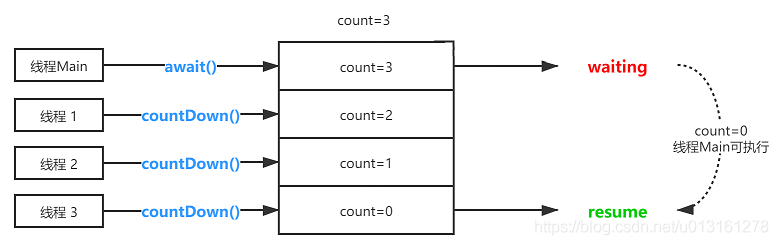
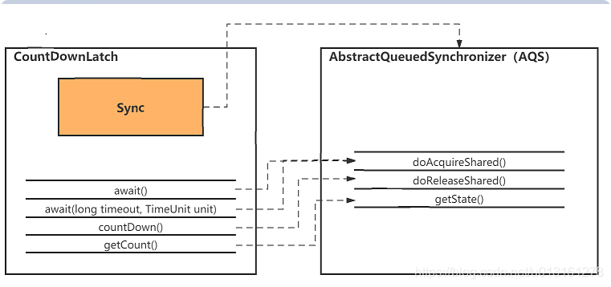
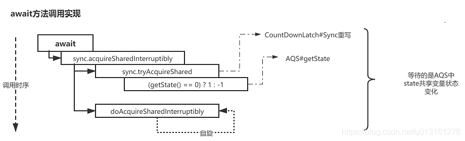
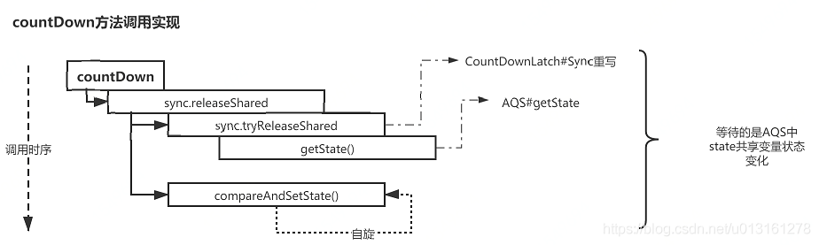
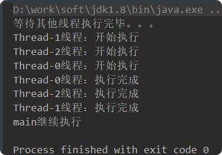
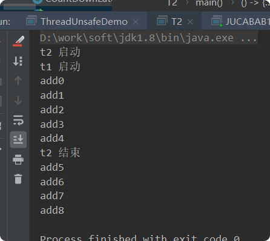
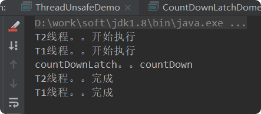

# CountDownLatch
## 带着问题（理解）
- 什么是CountDownLatch? 
- CountDownLatch底层实现原理?  AQS
- CountDownLatch一次可以唤醒几个任务? 
- 多个 CountDownLatch有哪些主要方法? await(),countDown() CountDownLatch适用于什么场景? 
- 写道题：实现一个容器，提供两个方法，add，size 写两个线程，线程1添加10个元素到容器中，线程2实现监控元素的个数，当个数到5个时，线程2给出提示并结束? 
- 使用CountDownLatch 代替wait notify 好处。

## 简介
> 在完成一组正在其他线程中执行的操作之前，它允许一个或多个线程一直等待

### 实现原理 

CountDownLatch 是通过一个**计数器**来实现的，当我们在 new 一个 CountDownLatch 对象的时候，需要带入该计数器值，该值就表示了线程的数量。

每当一个线程完成自己的任务后，计数器的值就会减 1 。当计数器的值变为0时，就表示所有的线程均已经完成了任务，然后就可以恢复等待的线程继续执行了。
如上图示例，用给定的计数为3进行初始化 CountDownLatch。由于调用了 countDown方法，所以在当前计数到达0之前，await方法会一直受阻塞；当计数到达0时会唤醒await方法阻塞的线程执行。

### 源码结构 

  

- J.U.C包中的最核心部分就是AQS的实现，它是JDK并发工具的实现基石，CountDownLatch也不例外，也是基于AQS进行实现
- await、countDown方法分别调用了AQS的doAcquireShared、doReleaseShared方法以共享锁的形式对AQS的共享变量state进行操作
- await方法阻塞等待，CountDownLatch 的作用是允许 1 或 N 个线程等待其他线程完成执行
- countDown方法变更计数，CountDownLatch 的计数器无法被重置  

### 实现剖析 

#### await方法
  

- 调用await() 方法，来使当前线程在锁存器倒计数至零之前一直等待，除非线程被中断
- 该方法内部使用 AQS 的 acquireSharedInterruptibly(int arg) 方法
- 在内部类 Sync 中重写了 tryAcquireShared(int arg) 方法
- 通过AQS中的getState() 方法，获取同步状态，其值等于计数器的值
- 如果计数器值不等于 0，则会调用 doAcquireSharedInterruptibly(int arg) 方法，该方法为一个自旋方法会尝试一直去获取同步状态

####  countDown方法

  

- 调用countDown() 方法，来改变计数器数量
- 内部调用AQS的releaseShared() 方法
- Sync重写了tryReleaseShared() 方法
- 释放锁，也就是操作计数器的过程，这里使用到了CAS（compareAndSetState）进行计数更新，若更新失败则进行自旋重试直到成功为止  

#### getCount方法 

调用AQS的getState方法获取计数  

## 示例1
    
    public class CountDownLatchDome {
    
        public static void main(String[] args) throws InterruptedException {
            CountDownLatch cdl = new CountDownLatch(3);
            MyThread t1 = new MyThread(cdl);
            MyThread t2 = new MyThread(cdl);
            MyThread t3 = new MyThread(cdl);
            t1.start();
            t2.start();
            t3.start();
            System.out.println("等待其他线程执行完毕。。。");
            cdl.await();
            System.out.println(Thread.currentThread().getName() + "继续执行");
        }
    
    }
    
    class MyThread extends Thread {
        private CountDownLatch countDownLatch;
    
        public MyThread(CountDownLatch countDownLatch) {
            this.countDownLatch = countDownLatch;
        }
    
        @Override
        public void run() {
            System.out.println(Thread.currentThread().getName() + "线程：开始执行");
            try {
                TimeUnit.SECONDS.sleep(2);
            } catch (InterruptedException e) {
                e.printStackTrace();
            }
            System.out.println(Thread.currentThread().getName() + "线程：执行完成");
            countDownLatch.countDown();
    
        }
    }

## 示例2
>实现一个容器，提供两个方法，add，getSize 写两个线程，线程1添加10个元素到容器中，线程2实现监控元素的个数，当个数到5个时，线程2给出提示并结束    
    
**使用object的wait和notify实现**
    
    import java.util.ArrayList;
    import java.util.List;
    
    /**
     *  必须先让t2先进行启动 使用wait 和 notify 进行相互通讯，wait会释放锁，notify不会释放锁
     */
    public class T2 {
    
     volatile   List list = new ArrayList();
    
        public void add (int i){
            list.add(i);
        }
    
        public int getSize(){
            return list.size();
        }
    
        public static void main(String[] args) {
    
            T2 t2 = new T2();
    
            Object lock = new Object();
    
            new Thread(() -> {
                synchronized(lock){
                    System.out.println("t2 启动");
                    if(t2.getSize() != 5){
                        try {
                            /**会释放锁*/
                            lock.wait();
                            System.out.println("t2 结束");
                        } catch (InterruptedException e) {
                            e.printStackTrace();
                        }
                    }
                    lock.notify();
                }
            },"t2").start();
    
            new Thread(() -> {
               synchronized (lock){
                   System.out.println("t1 启动");
                   for (int i=0;i<9;i++){
                       t2.add(i);
                       System.out.println("add"+i);
                       if(t2.getSize() == 5){
                           /**不会释放锁*/
                           lock.notify();
                           try {
                               lock.wait();
                           } catch (InterruptedException e) {
                               e.printStackTrace();
                           }
                       }
                   }
               }
            }).start();
        }
    }

**使用CountDownLatch**    
    public class CountDownLatchDome2 {
        volatile List list = new ArrayList<>();
    
        private void add(int i) {
            list.add(i);
        }
    
        private int getSize() {
            return list.size();
        }
    
        public static void main(String[] args) {
            CountDownLatch countDownLatch=new CountDownLatch(1);
            CountDownLatchDome2 list=new CountDownLatchDome2();
            new Thread(() -> {
                System.out.println("T2线程。。开始执行");
                if(list.getSize()!=5){
                    try {
                        countDownLatch.await();
                        System.out.println("T2线程。。完成");
                    } catch (InterruptedException e) {
                        e.printStackTrace();
                    }
                }
    
            },"T2").start();
    
            new Thread(() -> {
                System.out.println("T1线程。。开始执行");
                for (int i = 0; i <10 ; i++) {
                    list.add(i);
                    if(list.getSize()==5){
                        countDownLatch.countDown();
                        System.out.println("countDownLatch。。countDown");
    
                    }
                }
                System.out.println("T1线程。。完成");
            },"T1").start();
    
    
        }
    
    
    
    }

        