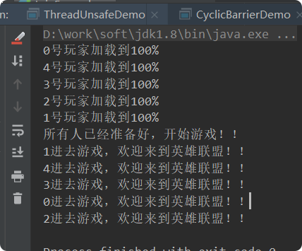

# CyclicBarrier 
## 带着问题（理解） 
- 什么是CyclicBarrier? 
- CyclicBarrier底层实现原理? 
- CountDownLatch和CyclicBarrier对比? 
- CyclicBarrier的核心函数有哪些?
- CyclicBarrier适用于什么场景?

## 简介
可以理解为**循环栅栏**，用于协调多个线程同步执行操作的场合，所有线程等待完成,然后一起做事情( **相互之间都准备好,然后一起做事情** )
比如LOL开始游戏，所有队员都加载到100% 才会正式开始游戏

##示例
> 等待玩家加载到100%，然后开始游戏，最后玩家进入游戏

    public class CyclicBarrierDemo {
        public static void main(String[] args) {
            CyclicBarrier cyclicBarrier=new CyclicBarrier(5, new Runnable() {
                @Override
                public void run() {
                    System.out.println("所有人已经准备好，开始游戏！！");
                }
            });
            for (int i = 0; i <5 ; i++) {
                new Thread(new Runnable() {
                    @Override
                    public void run() {
                        System.out.println(Thread.currentThread().getName()+"号玩家加载到100%");
                        try {
                            /**
                             * 执行await，等待所有线程完成之后一起执行后面的内容。
                             */
                            cyclicBarrier.await();
    
                        } catch (InterruptedException e) {
                            e.printStackTrace();
                        } catch (BrokenBarrierException e) {
                            e.printStackTrace();
                        }
                        System.out.println(Thread.currentThread().getName()+"进去游戏，欢迎来到英雄联盟！！");
                    }
                },String.valueOf(i)).start();
            }
        }
    }

## 和CountDonwLatch再对比 
- CountDownLatch减计数，CyclicBarrier加计数。 
- CountDownLatch是一次性的，CyclicBarrier可以重用。 
- CountDownLatch和CyclicBarrier都有让多个线程等待同步然后再开始下一步动作的意思，但是CountDownLatch的下一步的动作实施者是主线程，具有不可重复性；而CyclicBarrier的下一步动作实施者还是“其他线程”本身，具有往复多次实施动作的特点。