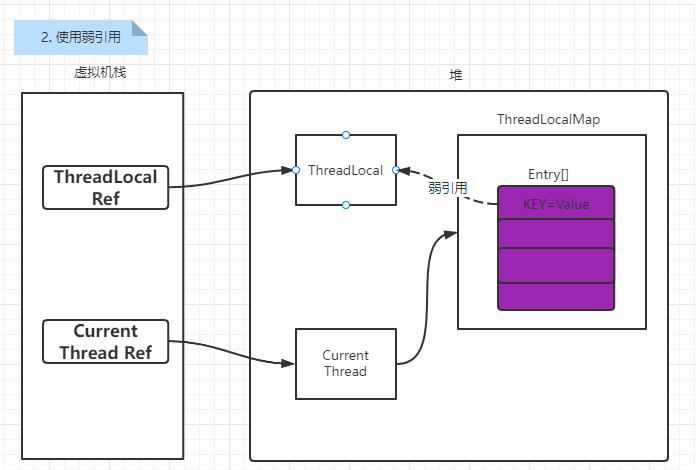

# ThreadLocal   

## 带着问题（理解）
- 什么是ThreadLocal? 用来解决什么问题的? 
- 说说你对ThreadLocal的理解 ThreadLocal是如何实现线程隔离的?
- 为什么ThreadLocal会造成内存泄露? 
- 如何解决 还有哪些使用ThreadLocal的应用场景? 

## 介绍

ThreadLocal意为线程本地变量，用于**解决多线程并发时访问共享变量的问题**。

所谓的共享变量指的是在堆中的实例、静态属性和数组；对于共享数据的访问受Java的内存模型（JMM）的控制，其模型如下：

  

每个线程都会有属于自己的本地内存，在堆（也就是上图的主内存）中的变量在被线程使用的时候会被复制一个副本线程的本地内存中，当线程修改了共享变量之后就会通过JMM管理控制写会到主内存中。   

很明显，在多线程的场景下，当有多个线程对共享变量进行修改的时候，就会出现线程安全问题，即数据不一致问题。常用的解决方法是对访问共享变量的代码加锁（synchronized或者Lock）。但是这种方式对性能的耗费比较大。在JDK1.2中引入了ThreadLocal类，来修饰共享变量，使每个线程都**单独拥有一份共享变量**，这样就可以做到线程之间对于共享变量的隔离问题。    

当然锁和ThreadLocal使用场景还是有区别的，具体区别如下：  

--|synchronized（锁）|ThreadLocal
--|--|--
原理|同步机制采用了时间换空间的方式，只提供一份变量，让不同线程排队访问（临界区排队）|采用空间换时间的方式，为每一个线程都提供一份变量的副本，从而实现同时访问而互不相干扰
侧重点|多个线程之间访问资源的同步|多线程中让每个线程之间的数据相互隔离

## 使用
> 一般都会将ThreadLocal声明成一个静态字段，同时初始化如下：

    static ThreadLocal<Object> threadLocal = new ThreadLocal<>();
    
其中Object就是原本堆中共享变量的数据。  

> 例如，有个User对象需要在不同线程之间进行隔离访问，可以定义ThreadLocal如下：  

    public class Test {
        static ThreadLocal<User> threadLocal = new ThreadLocal<>();
    }

### 常用的方法 
- set(T value)：设置线程本地变量的内容。
- get()：获取线程本地变量的内容。
- remove()：移除线程本地变量。注意在线程池的线程复用场景中在线程执行完毕时一定要调用remove，避免在线程被重新放入线程池中时被本地变量的旧状态仍然被保存。  

    
    public class Test {
        static ThreadLocal<User> threadLocal = new ThreadLocal<>();
        
        public void m1(User user) {
            threadLocal.set(user);
        }
        
        public void m2() {
            User user = threadLocal.get();
            // 使用
            
            // 使用完清除
            threadLocal.remove();
        }
    }

## 核心类-方法

java中一个线程也就是一个Thread  
Thread类里面维护了一个**独有的**成员字段。这个字段就是threadLocals。  
    
    ThreadLocal.ThreadLocalMap threadLocals = null;

### ThreadLocal.ThreadLocalMap 
ThreadLocal维护了一个内部类ThreadLocalMap。

    static class ThreadLocalMap {
            /**
             * The entries in this hash map extend WeakReference, using
             * its main ref field as the key (which is always a
             * ThreadLocal object).  Note that null keys (i.e. entry.get()
             * == null) mean that the key is no longer referenced, so the
             * entry can be expunged from table.  Such entries are referred to
             * as "stale entries" in the code that follows.
             */
    
         static class Entry extends WeakReference<ThreadLocal<?>> {
                    /** The value associated with this ThreadLocal. */
                    Object value;
        
                    Entry(ThreadLocal<?> k, Object v) {
                        super(k);
                        value = v;
                    }
                }
        
                /**
                 * The initial capacity -- MUST be a power of two.
                 */
                private static final int INITIAL_CAPACITY = 16;
        
                /**
                 * The table, resized as necessary.
                 * table.length MUST always be a power of two.
                 */
                private Entry[] table;
        
                /**
                 * The number of entries in the table.
                 */
                private int size = 0;
        
                /**
                 * The next size value at which to resize.
                 */
                private int threshold; // Default to 0
                
通过源码可以看出：  
- ThreadLocalMap里面存放了一个Entry[]数组
- Entry[]数组的key="ThreadLocal<?>"，V="我们要在线程之间隔离的对象"
- 初始容量为16

### ThreadLocal::set()

      public void set(T value) {
            Thread t = Thread.currentThread();  // 获取当前线程
            ThreadLocalMap map = getMap(t); //从thread中得到threadLocals字段
            if (map != null) //判断线程的threadLocals是否初始化了
                map.set(this, value);
            else
                createMap(t, value); // 没有则创建一个ThreadLocalMap对象进行初始化
        }
    
        void createMap(Thread t, T firstValue) {
        	t.threadLocals = new ThreadLocalMap(this, firstValue);
        }

        /**
        * 往map中设置ThreadLocal的关联关系
        * set中没有使用像get方法中的快速选择的方法，因为在set中创建新条目和替换旧条目的内容一样常见，
        * 在替换的情况下快速路径通常会失败（对官方注释的翻译）
        */
        private void set(ThreadLocal<?> key, Object value) {
            // map中就是使用Entry[]数据保留所有的entry实例
            Entry[] tab = table;
            int len = tab.length;
            // 返回下一个哈希码，哈希码的产生过程与神奇的0x61c88647的数字有关
            int i = key.threadLocalHashCode & (len-1);
        
            for (Entry e = tab[i]; e != null; e = tab[i = nextIndex(i, len)]) {
                ThreadLocal<?> k = e.get();
                if (k == key) {
                    // 已经存在则替换旧值
                    e.value = value;
                    return;
                }
                if (k == null) {
                    // 在设置期间清理哈希表为空的内容，保持哈希表的性质
                    replaceStaleEntry(key, value, i);
                    return;
                }
            }
            tab[i] = new Entry(key, value);
            int sz = ++size;
            // 扩容逻辑
            if (!cleanSomeSlots(i, sz) && sz >= threshold)
                rehash();
        }

### ThreadLocal::get()
     
     public T get() {
         Thread t = Thread.currentThread();
         ThreadLocalMap map = getMap(t);
         if (map != null) {
             // 获取ThreadLocal对应保留在Map中的Entry对象
             ThreadLocalMap.Entry e = map.getEntry(this);// this表示当前key（ThreadLocal<?> ）
             if (e != null) {
                 @SuppressWarnings("unchecked")
                 // 获取ThreadLocal对象对应的值
                 T result = (T)e.value;
                 return result;
             }
         }
         // map还没有初始化时创建map对象，并设置null，同时返回null
         return setInitialValue();
     }

### ThreadLocal::remove()
    
    public void remove() {
        ThreadLocalMap m = getMap(Thread.currentThread());
        // 键在直接移除
        if (m != null) {
            m.remove(this);
        }
    }

### 扩容
- 当前size大于阈值的4分之3时进行扩容
- 扩容为2倍  

      */
            private void rehash() {
                expungeStaleEntries();
    
                // Use lower threshold for doubling to avoid hysteresis
                if (size >= threshold - threshold / 4) 
                    resize();
            }
    
            /**
             * Double the capacity of the table.
             */
            private void resize() {
                Entry[] oldTab = table;
                int oldLen = oldTab.length;
                int newLen = oldLen * 2;
                Entry[] newTab = new Entry[newLen];
                int count = 0;
    
                for (int j = 0; j < oldLen; ++j) {
                    Entry e = oldTab[j];
                    if (e != null) {
                        ThreadLocal<?> k = e.get();
                        if (k == null) {
                            e.value = null; // Help the GC
                        } else {
                            int h = k.threadLocalHashCode & (newLen - 1);
                            while (newTab[h] != null)
                                h = nextIndex(h, newLen);
                            newTab[h] = e;
                            count++;
                        }
                    }
                }
    
                setThreshold(newLen);
                size = count;
                table = newTab;
            }

### hash与hash冲突
#### hash算法
    
     ThreadLocalMap(ThreadLocal<?> firstKey, Object firstValue) {
                table = new Entry[INITIAL_CAPACITY];
                int i = firstKey.threadLocalHashCode & (INITIAL_CAPACITY - 1);//计算索引
                table[i] = new Entry(firstKey, firstValue);
                size = 1;
                setThreshold(INITIAL_CAPACITY);
            }
            
 计算索引，firstKey.threadLocalHashCode & (INITIAL_CAPACITY - 1)。  
 关于& (INITIAL_CAPACITY - 1),这是取模的一种方式，对于2的幂作为模数取模，用此代替%(2^n)，这也就是为啥容量必须为2的冥，在这个地方也得到了解答。  
 
     private final int threadLocalHashCode = nextHashCode();
    
        /**
         * The next hash code to be given out. Updated atomically. Starts at
         * zero.
         */
        private static AtomicInteger nextHashCode =
            new AtomicInteger();
    
        /**
         * The difference between successively generated hash codes - turns
         * implicit sequential thread-local IDs into near-optimally spread
         * multiplicative hash values for power-of-two-sized tables.
         */
        private static final int HASH_INCREMENT = 0x61c88647;
    
        /**
         * Returns the next hash code.
         */
        private static int nextHashCode() {
            return nextHashCode.getAndAdd(HASH_INCREMENT);
        }
    
这里定义了一个AtomicInteger类型，每次获取当前值并加上HASH_INCREMENT，HASH_INCREMENT = 0x61c88647,这个值和斐波那契散列有关（这是一种乘数散列法，只不过这个乘数比较特殊，是32位整型上限2^32-1乘以黄金分割比例0.618…的值2654435769，用有符号整型表示就是-1640531527，去掉符号后16进制表示为0x61c88647），其主要目的就是**为了让哈希码能均匀的分布在2的n次方的数组里**, 也就是Entry[] table中，这样做可以尽量避免hash冲突。  

#### 哈希冲突
*使用闭散列:(**开放地址法**或者也叫线性探测法)解决哈希冲突。*

解决hash冲突的4种解决方案：  

链地址法|再哈希法|建立公共溢出区|开放地址法
--|--|--|--
对于相同的哈希值，使用链表进行连接。（HashMap使用此法）|提供多个哈希函数，如果第一个哈希函数计算出来的key的哈希值冲突了，则使用第二个哈希函数计算key的哈希值。|将哈希表分为基本表和溢出表两部分，凡是和基本表发生冲突的元素，一律填入溢出表。|线性探测再散列、二次(平方)探测再散列、伪随机探测再散列

**三种开放地址法**：
- 线性探测再散列：顺序查看下一个单元，直到找出一个空单元或查遍全表,di=1，2，3，…，m-1
- 二次(平方)探测再散列:在表的左右进行跳跃式探测，直到找出一个空单元或查遍全表,di=12，-12，22，-22，…，k2，-k2 ( k<=m/2 )
- 伪随机探测再散列:建立一个伪随机数发生器，并给一个随机数作为起点,di=伪随机数序列。具体实现时，应建立一个伪随机数发生器，（如i=(i+p) % m），并给定一个随机数做起点。

ThreadLocalMap使用的是**线性探测法**  
 
  线性探测法的地址增量di = 1, 2, … 其中，i为探测次数。该方法一次探测下一个地址，直到有空的地址后插入，若整个空间都找不到空余的地址，则产生溢出。  
  假设当前table长度为16，也就是说如果计算出来key的hash值为14，如果table[14]上已经有值，并且其key与当前key不一致，那么就发生了hash冲突，这个时候将14加1得到15，取table[15]进行判断，这个时候如果还是冲突会回到0，取table[0],以此类推，直到可以插入。  
  按照上面的描述，可以把table看成一个环形数组。  
  
  
  
  先看一下线性探测相关的代码，从中也可以看出来table实际是一个环：  
  
    
    private static int nextIndex(int i, int len) {
        return ((i + 1 < len) ? i + 1 : 0);
    }
    private static int prevIndex(int i, int len) {
        return ((i - 1 >= 0) ? i - 1 : len - 1);
    }
    private void set(ThreadLocal<?> key, Object value) {
        ThreadLocal.ThreadLocalMap.Entry[] tab = table;
        int len = tab.length;
        //计算索引，上面已经有说过。
        int i = key.threadLocalHashCode & (len-1);
        /**根据获取到的索引进行循环，如果当前索引上的table[i]不为空，在没有return的情况下，
        * 就使用nextIndex()获取下一个（上面提到到线性探测法）。*/
        for (ThreadLocal.ThreadLocalMap.Entry e = tab[i]; e != null;
            e = tab[i = nextIndex(i, len)]) {
            ThreadLocal<?> k = e.get();
            //table[i]上key不为空，并且和当前key相同，更新value
            if (k == key) {
                e.value = value;
                return;
            }
            /**table[i]上的key为空，说明被回收了
             * 说明改table[i]可以重新使用，用新的key-value将其替换,并删除其他无效的entry*/
            if (k == null) {
                replaceStaleEntry(key, value, i);
                return;
            }
        }
        //不存在也没有旧元素就创建一个
        tab[i] = new Entry(key, value);
        int sz = ++size;
        if (!cleanSomeSlots(i, sz) && sz >= threshold)
            rehash();//扩容
    }
    

## 内存泄漏问题

内存泄露问题：指程序中动态分配的堆内存由于某种原因**没有被释放或者无法释放**，造成系统内存的浪费，导致程序运行速度减慢或者系统奔溃等严重后果。内存泄露堆积将会导致内存溢出      

ThreadLocal的内存泄露问题一般考虑**和Entry对象有关**  
在上面的Entry定义可以看出ThreadLocal::Entry被弱引用所修饰。**JVM会将弱引用修饰的对象在下次垃圾回收中清除掉。**这样就可以实现ThreadLocal的生命周期和线程的生命周期解绑。但实际上并不是使用了弱引用就A会发生内存泄露问题，考虑下面几个过程：  

**1.如果使用强引用**
    

当ThreadLocal Ref被回收了，由于在Entry使用的是强引用，在Current Thread还存在的情况下就存在着到达Entry的引用链，无法清除掉ThreadLocal的内容，**同时Entry的value也同样会被保留**；也就是说就算使用了强引用仍然会出现内存泄露问题。  

**2.使用弱引用**
    

当ThreadLocal Ref被回收了，由于在Entry使用的是弱引用，因此在下次垃圾回收的时候就会将ThreadLocal对象清除，这个时候Entry中的KEY=null。但是由于ThreadLocalMap中任然存在Current Thread Ref这个强引用，因此Entry中value的值任然无法清除。还是存在内存泄露的问题  
 
由此可以发现，使用ThreadLocal造成内存泄露的问题是因为：*ThreadLocalMap的生命周期与Thread一致，如果不手动清除掉Entry对象的话就可能会造成内存泄露问题*。因此，**需要我们在每次在使用完之后需要手动的remove掉Entry对象**。

> 为什么要使用弱引用

1.使用完ThreadLocal之后，弱引用key会被GC回收，如果是强引用线程Thread还在运行就还持有ThreadLocal的强引用，无法倍GC
2.使用软引用，key被GC后，对应的 value 在下一次 ThreadLocalMap 调用 set、get、remove 方法时被清除，

>**总结**

- JVM利用设置ThreadLocalMap的Key为弱引用，来避免内存泄露。
- JVM利用调用remove、get、set方法的时候，回收弱引用。
 
- 当ThreadLocal存储很多Key为null的Entry的时候，**而没有去调用remove、get、set方法**，那么将导致内存泄漏。
 
- *当使用static ThreadLocal的时候，延长ThreadLocal的生命周期，那也可能导致内存泄漏。因为，static变量在类未加载的时候，它就已经加载，当线程结束的时候，static变量不一定会回收。那么，比起普通成员变量使用的时候才加载，static的生命周期加长将更容易导致内存泄漏危机*  

**所以使用完之后，一定到收到remove**

## 使用场景
> 场景一：每个线程维护了一个“序列号”

如果我们希望通过某个类将状态(例如用户ID、事务ID)与线程关联起来，那么通常在这个类中定义private static类型的ThreadLocal 实例。  

    public class SerialNum {
        // The next serial number to be assigned
        private static int nextSerialNum = 0;
    
        private static ThreadLocal serialNum = new ThreadLocal() {
            protected synchronized Object initialValue() {
                return new Integer(nextSerialNum++);
            }
        };
    
        public static int get() {
            return ((Integer) (serialNum.get())).intValue();
        }
    }

> 场景二：Session的管理

​可以尝试使用ThreadLocal替代Session的使用，当用户要访问需要授权的接口的时候，可以现在拦截器中将用户的Token存入ThreadLocal中；之后在本次访问中任何需要用户用户信息的都可以直接冲ThreadLocal中拿取数据。例如自定义获取用户信息的类AuthHolder：  

    public class AuthNHolder {
        private static final ThreadLocal<Map<String,String>> threadLocal = new ThreadLocal<>();
        public static void map(Map<String,String> map){
            threadLocal.set(map);
        }
        // 获取用户id
        public static String userId(){
            return get("userId");
        }
        // 根据键值获取对应的信息
        public static String get(String key){
            Map<String,String> map = getMap();
            return map.get(key);
        }
        // 用完清空ThreadLocal
        public static void clear(){
            threadLocal.remove();
        }
    }
备注：[参考博文](https://cloud.tencent.com/developer/article/1636025)。ThreadLocal里面封装的value只是一个例子，根据具体业务需求改就行了。
> 场景三：解决线程安全问题

依赖于ThreadLocal本身的特性，对于需要进行线程隔离的变量可以使用ThreadLocal进行封装。

> 开发手册中推荐
    
    import java.text.DateFormat;
    import java.text.SimpleDateFormat;
     
    public class DateUtils {
        public static final ThreadLocal<DateFormat> df = new ThreadLocal<DateFormat>(){
            @Override
            protected DateFormat initialValue() {
                return new SimpleDateFormat("yyyy-MM-dd");
            }
        };
    }

然后我们再要用到 DateFormat 对象的地方，这样调用：

    DateUtils.df.get().format(new Date());
    
    
