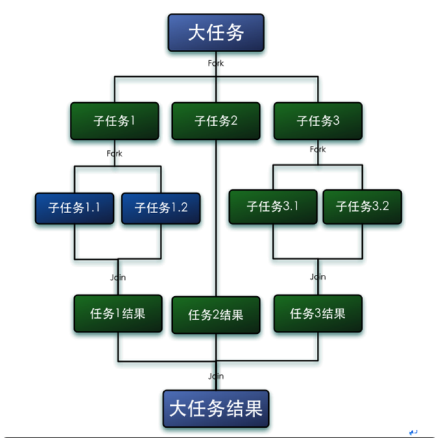
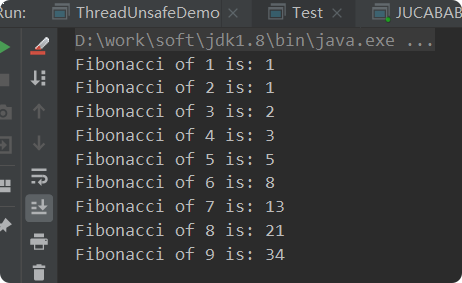

#Fork/Join框架

##Fork/Join简介
Fork/Join框架是Java并发工具包中的一种可以将一个大任务拆分为很多小任务来异步执行的工具
Fork是拆分,Join是合并.   

- 任务对象: ForkJoinTask (包括RecursiveTask、RecursiveAction 和 CountedCompleter)   
- 执行Fork/Join任务的线程: ForkJoinWorkerThread  
- 线程池: ForkJoinPool

## 核心内容
-ForkJoinPool与ForkJoinTask
    - ForkJoinPool类似与线程池，ForkJoinTask需要交给ForkJoinPool才能执行
    - ForkJoinTask 任务内容，继承RecursiveAction（无返回值）或者RecursiveTask（有返回值）；使用fork来分割任务，join合并

## 工作窃取-work-stealing算法

在 ForkJoinPool 中，线程池中每个工作线程(ForkJoinWorkerThread)都对应一个任务队列(WorkQueue)，工作线程优先处理来自自身队列的任务(LIFO或FIFO顺序，参数 mode 决定)，然后以FIFO的顺序随机窃取其他队列中的任务。
    
- 每个线程都有自己的一个WorkQueue，该工作队列是一个**双端队列**。 
- 队列支持三个功能push、pop、poll 
- push/pop只能被队列的所有者线程调用，而poll可以被其他线程调用。 
- 划分的子任务调用fork时，都会被push到自己的队列中。 
- 默认情况下，工作线程从自己的双端队列获出任务并执行。  
- 当自己的队列为空时，线程随机从另一个线程的队列末尾调用poll方法窃取任务。 

**被窃取任务**线程永远从双端队列的**头部拿**任务执行，而**窃取任务**的线程永远从双端队列的**尾部**拿任务执行。

## 示例
    
### RecursiveTask计算0-1000结果
    
    public class ForkJoinPoolDemo {
        public static void main(String[] args) throws ExecutionException, InterruptedException {
            ForkJoinPool forkJoinPool = new ForkJoinPool();
            MyTestTask task = new MyTestTask(0, 1000);
            ForkJoinTask<Integer> result = forkJoinPool.submit(task);
            System.out.println("最终运算结果===" + result.get());
        }
    }
    
    class MyTestTask extends RecursiveTask<Integer> {
        /**
         * 定义一个阈值
         */
        private static final int THRESHHOLD = 100;
    
        private int start;
    
        private int end;
    
        public MyTestTask(int start, int end) {
            this.start = start;
            this.end = end;
        }
        @Override
        protected Integer compute() {
            int result = 0;
            boolean flag = (end - start) <= THRESHHOLD;
            //间隔够小，开始执行
            if (flag) {
                System.out.println("进行计算，当前开始" + start + ",结束位置" + end);
                for (int i = 0; i < end - start; i++) {
                    result += i;
                }
            } else {
                //如果间隔不够小，就进行分割，
                System.out.println("需要分割，当前开始" + start + ",结束位置" + end);
                int middle = (end + start) / 2;
                MyTestTask leftTask = new MyTestTask(start, middle);
                MyTestTask rightTask = new MyTestTask(middle + 1, end);
                //分配任务
                leftTask.fork();
                rightTask.fork();
                //执行任务。
                int leftResult = leftTask.join();
                int rightResult = rightTask.join();
                //并且合并
                result = leftResult + rightResult;
    
            }
            System.out.println("计算完成，计算结果====" + result);
            return result;
        }
    }
### RecursiveTask计算斐波那契列
> 斐波那契列： 1、1、2、3、5、8、13、21、34、…… 公式 : F(1)=1，F(2)=1, f(3)=f(2)+f(1),F(n)=F(n-1)+F(n-2)(n>=3，n∈N*)   

**先是递归算法来试试：**
        
            //1 1 2 3 5 8
            public static long fibonacci(long number) {
                if (number <= 1) {
                    return number;
                } else {
                    return fibonacci(number-1)+fibonacci(number-2);
                }
            }
        
            public static void main(String[] args) {
                for (int i = 1; i <10 ; i++) {
                    System.out.printf("Fibonacci of %d is: %d\n", i, fibonacci(i));
                }
            }
 
 
**fork/join版本：** 
    
    public class FibonacciDome {
        public static void main(String[] args) throws ExecutionException, InterruptedException {
            ForkJoinPool forkJoinPool=new ForkJoinPool();
            for (int i = 1; i <10 ; i++) {
                Fibonacci fibonacci=new Fibonacci(i);
                Integer integer = forkJoinPool.submit(fibonacci).get();
                System.out.println(integer);
            }
    
        }
    
    }
    
    class Fibonacci extends RecursiveTask<Integer> {
    
        int num;
    
        public Fibonacci(int num) {
            this.num = num;
        }
    
        @Override
        protected Integer compute() {
            if(num<=1){
                return num;
            }
            Fibonacci f1=new Fibonacci(num-1);
            Fibonacci f2=new Fibonacci(num-2);
    
            f1.fork();
            f2.fork();
    
            return f1.join()+f2.join();
        }
    }
 
    
