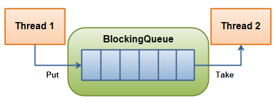
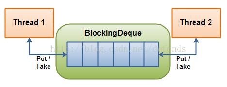
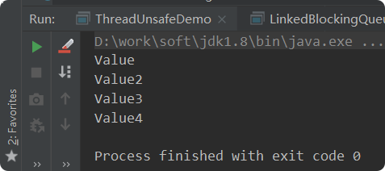
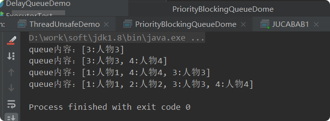
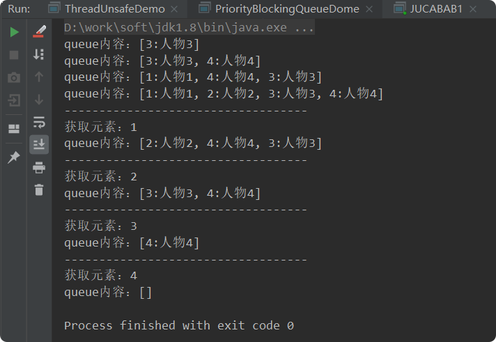

# BlockingQueue
## 带着问题（理解）
- 什么是BlockingDeque? 
- BlockingQueue大家族有哪些? ArrayBlockingQueue, DelayQueue, LinkedBlockingQueue, SynchronousQueue... 
- BlockingQueue适合用在什么样的场景? 
- BlockingQueue常用的方法? 
- BlockingQueue插入方法有哪些? 这些方法(add(o),offer(o),put(o),offer(o, timeout, timeunit))的区别是什么? 
- BlockingDeque 与BlockingQueue有何关系，请对比下它们的方法? 
- BlockingDeque适合用在什么样的场景? 
- BlockingDeque 与BlockingQueue实现例子?

## BlockingQueue和BlockingDeque
### BlockingQueue
BlockingQueue 通常用于一个线程生产对象，而另外一个线程消费这些对象的场景。下图是对这个原理的阐述:  

  

一个线程往里边放，另外一个线程从里边取的一个 BlockingQueue。  

一个线程将会持续生产新对象并将其插入到队列之中，直到队列达到它所能容纳的临界点。也就是说，**它是有限的**。如果该阻塞队列到达了其临界点，负责生产的线程将会在往里边插入新对象时发生阻塞。它会一直处于阻塞之中，直到负责消费的线程从队列中拿走一个对象。
负责消费的线程将会一直从该阻塞队列中拿出对象。如果消费线程尝试去从一个空的队列中提取对象的话，这个消费线程将会处于阻塞之中，直到一个生产线程把一个对象丢进队列。  

### BlockingQueue的方法
BlockingQueue 具有 4 组不同的方法用于插入、移除以及对队列中的元素进行检查。如果请求的操作不能得到立即执行的话，每个方法的表现也不同。这些方法如下:  

--|抛异常|特定值|阻塞|超时 
--|--|--|--|--
插入|add(o) |offer(o)| put(o) |offer(o, timeout, timeunit) 
移除|remove()| poll()| take() |poll(timeout, timeunit) 
检查|element()|peek()  

- 四组不同的行为方式解释:  
    - 抛异常: 如果试图的操作无法立即执行，抛一个异常。 
    - 特定值: 如果试图的操作无法立即执行，返回一个特定的值(常常是 true / false)。
    - 阻塞: 如果试图的操作无法立即执行，该方法调用将会发生阻塞，直到能够执行。
    - 超时: 如果试图的操作无法立即执行，该方法调用将会发生阻塞，直到能够执行，但等待时间不会超过给定值。返回一个特定值以告知该操作是否成功(典型的是 true / false)。

注意：  
- 无法向一个 BlockingQueue 中插入 null。如果你试图插入 null，BlockingQueue 将会抛出一个 NullPointerException。  
- 可以访问到 BlockingQueue 中的所有元素，而不仅仅是开始和结束的元素。比如说，你将一个对象放入队列之中以等待处理，但你的应用想要将其取消掉。那么你可以调用诸如 remove(o) 方法来将队列之中的特定对象进行移除。但是这么干效率并不高(译者注: 基于队列的数据结构，获取除开始或结束位置的其他对象的效率不会太高)，因此你尽量不要用这一类的方法，除非你确实不得不那么做。  

### BlockingDeque
- java.util.concurrent 包里的 BlockingDeque 接口表示一个线程安放入和提取实例的双端队列。  
    - BlockingDeque 类是一个双端队列，在不能够插入元素时，它将阻塞住试图插入元素的线程；在不能够抽取元素时，它将阻塞住试图抽取的线程。
    - deque(双端队列) 是 "Double Ended Queue" 的缩写。因此，双端队列是一个你可以从任意一端插入或者抽取元素的队列。 
    - 在线程既是一个队列的生产者又是这个队列的消费者的时候可以使用到 BlockingDeque。如果生产者线程需要在队列的两端都可以插入数据，消费者线程需要在队列的两端都可以移除数据，这个时候也可以使用 BlockingDeque。BlockingDeque 图解:

### BlockingDeque的方法

一个 BlockingDeque - 线程在双端队列的两端都可以插入和提取元素。  
一个线程生产元素，并把它们插入到队列的任意一端。如果双端**队列已满，插入线程将被阻塞**，直到一个移除线程从该队列中移出了一个元素。如果**双端队列为空，移除线程将被阻塞**，直到一个插入线程向该队列插入了一个新元素。 BlockingDeque 具有 4 组不同的方法用于插入、移除以及对双端队列中的元素进行检查。如果请求的操作不能得到立即执行的话，每个方法的表现也不同。这些方法如下:  

--|抛异常|特定值|阻塞|超时 
--|--|--|--|-- 
插入|addFirst(o)|offerFirst(o)|putFirst(o)| offerFirst(o, timeout, timeunit) 
移除|removeFirst(o)|pollFirst(o)| takeFirst(o) |pollFirst(timeout, timeunit) 
检查 |getFirst(o) |peekFirst(o) 

--|抛异常|特定值|阻塞|超时 
--|--|--|--|-- 
插入| addLast(o) |offerLast(o) |putLast(o) |offerLast(o, timeout, timeunit) 
移除| removeLast(o) |pollLast(o) |takeLast(o)| pollLast(timeout, timeunit)
检查| getLast(o) |peekLast(o)  
四组不同的行为方式解释:  
- 抛异常: 如果试图的操作无法立即执行，抛一个异常。
- 特定值: 如果试图的操作无法立即执行，返回一个特定的值(常常是 true / false)。 
- 阻塞: 如果试图的操作无法立即执行，该方法调用将会发生阻塞，直到能够执行。 
- 超时: 如果试图的操作无法立即执行，该方法调用将会发生阻塞，直到能够执行，但等待时间不会超过给定值。返回一个特定值以告知该操作是否成功(典型的是 true / false)。

### BlockingDeque与BlockingQueue关系  

BlockingDeque 接口继承自 BlockingQueue 接口。  
这就意味着你可以像使用一个 BlockingQueue 那样使用 BlockingDeque。如果你这么干的话，各种插入方法将会把新元素添加到双端队列的尾端，而移除方法将会把双端队列的首端的元素移除。正如 BlockingQueue 接口的插入和移除方法一样。  

以下是 BlockingDeque 对 BlockingQueue 接口的方法的具体内部实现:  

BlockingQueue|BlockingDeque
--|--
add() |addLast()
 offer() x 2 |offerLast() x 2 
 put() |putLast() 
 remove() |removeFirst() 
 poll() x 2| pollFirst() 
 take() |takeFirst() 
 element() |getFirst() 
 peek() |peekFirst()  
 
## BlockingQueue的例子 
首先，BlockingQueueExample 类分别在两个独立的线程中启动了一个 Producer 和 一个 Consumer。Producer 向一个共享的 BlockingQueue 中注入字符串，而 Consumer 则会从中把它们拿出来。  

    public class BlockingDequeDemo {
        public static void main(String[] args) {
            ArrayBlockingQueue queue = new ArrayBlockingQueue(1024);
    
            Producer producer = new Producer(queue);
            Consumer consumer = new Consumer(queue);
    
            producer.start();
            consumer.start();
        }
    }
    
    class Producer extends Thread {
        private ArrayBlockingQueue queue;
    
        public Producer(ArrayBlockingQueue queue) {
            this.queue = queue;
        }
    
        @Override
        public void run() {
            try {
                queue.put("1");
                TimeUnit.SECONDS.sleep(1);
                queue.put("2");
                TimeUnit.SECONDS.sleep(1);
                queue.put("3");
            } catch (InterruptedException e) {
                e.printStackTrace();
            }
        }
    }
    
    class Consumer extends Thread {
    
        private BlockingQueue queue;
    
        public Consumer(BlockingQueue queue) {
            this.queue = queue;
        }
    
        @Override
        public void run() {
            try {
                System.out.println(queue.take());
                System.out.println(queue.take());
                System.out.println(queue.take());
    
            } catch (InterruptedException e) {
                e.printStackTrace();
            }
        }
    }
    
## ArrayBlockingQueue-数组阻塞队列
ArrayBlockingQueue 类实现了 BlockingQueue 接口。  

ArrayBlockingQueue 是一个**有界**的阻塞队列，其内部实现是将对象放到一个数组里。有界也就意味着，它不能够存储无限多数量的元素。它有一个同一时间能够存储元素数量的上限。你可以在对其初始化的时候设定这个上限，但之后就无法对这个上限进行修改了(译者注: 因为它是基于数组实现的，也就具有数组的特性: 一旦初始化，大小就无法修改)。
ArrayBlockingQueue 内部以 FIFO(先进先出)的顺序对元素进行存储。队列中的头元素在所有元素之中是放入时间最久的那个，而尾元素则是最短的那个。
以下是在使用  ArrayBlockingQueue 的时候对其初始化的一个示例:  

       BlockingQueue queue = new ArrayBlockingQueue(1024);
            queue.put("1");
            Object object = queue.take();
            System.out.println(object.toString());

以下是使用了 Java 泛型的一个 BlockingQueue 示例。注意其中是如何对 String 元素放入和提取的:  

     BlockingQueue<String> queue = new ArrayBlockingQueue<String>(1024);
            queue.put("1");
            String string = queue.take();
    
            System.out.println(string);

## DelayQueue-延迟队列  
DelayQueue 实现了 BlockingQueue 接口。  

DelayQueue 对元素进行持有直到一个特定的延迟到期。注入其中的元素必须实现 java.util.concurrent.Delayed 接口，该接口定义:
    
    public interface Delayed extends Comparable<Delayed< {
        public long getDelay(TimeUnit timeUnit);
    }

DelayQueue 将会在每个元素的 getDelay() 方法返回的值的时间段之后才释放掉该元素。如果返回的是 0 或者负值，延迟将被认为过期，该元素将会在 DelayQueue 的下一次 take  被调用的时候被释放掉。

传递给 getDelay 方法的 getDelay 实例是一个枚举类型，它表明了将要延迟的时间段。TimeUnit 枚举将会取以下值:    

- DAYS
- HOURS
- INUTES
- SECONDS
- MILLISECONDS
- MICROSECONDS
- NANOSECONDS

### 例子
> 定义Delayed实例：
    
    public class DelayedElement<T> implements Delayed {
        long delayTime; // 延迟时间
        long expire; // 过期时间
        T data;
        public DelayedElement(long delayTime, T t) {
            this.delayTime = delayTime;
            // 过期时间 = 当前时间 + 延迟时间
            this.expire = System.currentTimeMillis() + delayTime;
    
            data = t;
        }
    
    
        /**
         * 剩余时间 = 到期时间 - 当前时间
         * @param unit 时间单位
         * @return
         */
        @Override
        public long getDelay(TimeUnit unit) {
            return unit.convert(this.expire-System.currentTimeMillis(),TimeUnit.MILLISECONDS);
        }
        /**
         * 优先级规则：两个任务比较，时间短的优先执行
         */
        @Override
        public int compareTo(Delayed o) {
            long delay = this.getDelay(TimeUnit.MILLISECONDS) - o.getDelay(TimeUnit.MILLISECONDS);
            return (int) delay;
        }
        @Override
        public String toString() {
            return "delayTime=" + delayTime +
                    ", expire=" + expire +
                    ", data=" + data;
        }
    }

> 使用客户端:
    
    public class DelayQueueDemo {
        public static void main(String[] args) throws InterruptedException {
            DelayQueue queue = new DelayQueue();
            queue.add(new DelayedElement<>(8, "第一次添加任务"));
            queue.add(new DelayedElement(3, "第二次添加任务"));
            queue.add(new DelayedElement(5, "第三次添加任务"));
    
            while (!queue.isEmpty()){
                Delayed delayed = queue.take();
                System.out.println(delayed);
            }
        }
    }

> 输出结果：
    
    delayTime=3, expire=1661537250909, data=第二次添加任务
    delayTime=5, expire=1661537250912, data=第三次添加任务
    delayTime=8, expire=1661537250914, data=第一次添加任务
    
> 描述：
    
- DelayQueue其实采用了装饰器模式，在对PriorityQueue进行包装下增加了延时时间获取元素的功能，其主要特点归纳如下：
- DelayQueue是一个无界阻塞队列，队列内部使用PriorityQueue来实现。
- 进入队列的元素必须实现Delayed接口，在创建元素时可以指定多久才能从队列中获取当前元素，只有在延迟期满时才能从中提取元素；
- 该队列头部是延迟期满后保存时间最长的Delayed元素；
- 如果没有延迟未过期元素，且队列没有头部，并且poll将返回null；
- 当一个元素的getDelay（TimeUnit.NANOSECONDS）方法返回一个小于等于0的值时，表示该元素已过期；
- 无法使用poll或take移除未到期的元素，也不会将这些元素作为正常元素对待；例如：size方法返回到期和未到期元素的计数之和。
- 此队列不允许使用null元素。
   
## LinkedBlockingQueue-链阻塞队列 
- LinkedBlockingQueue 类实现了 BlockingQueue 接口。  

- LinkedBlockingQueue 内部以一个链式结构(链接节点)对其元素进行存储。如果需要的话，这一链式结构可以选择一个上限。如果没有定义上限，将使用 **Integer.MAX_VALUE** 作为上限。

- LinkedBlockingQueue 内部以 FIFO(**先进先出**)的顺序对元素进行存储。（**尾插法**）队列中的头元素在所有元素之中是放入时间最久的那个，而尾元素则是最短的那个。  

> 以下是 LinkedBlockingQueue 的初始化和使用示例代码:
    
    public class LinkedBlockingQueueDemo {
        public static void main(String[] args) throws InterruptedException {
            BlockingQueue<String> unbounded = new LinkedBlockingQueue<String>();
            BlockingQueue<String> bounded   = new LinkedBlockingQueue<String>(1024);
            bounded.put("Value");
            bounded.put("Value2");
            bounded.put("Value3");
            bounded.put("Value4");
            System.out.println(bounded.take());
            TimeUnit.SECONDS.sleep(1);
            System.out.println(bounded.take());
            TimeUnit.SECONDS.sleep(1);
            System.out.println(bounded.take());
            TimeUnit.SECONDS.sleep(1);
            System.out.println(bounded.take());
    
        }
    }
    
> 运行结果：

间隔1S输出

##  PriorityBlockingQueue-具有优先级的阻塞队列
PriorityBlockingQueue是一个无界队列，它没有限制，在内存允许的情况下可以无限添加元素；它又是**具有优先级的队列**，是通过构造函数传入的对象来判断，传入的对象必须实现**comparable**接口。

### 例子
    首先创建一个Person对象，里面有id name 两个属性，person实现了comparable接口，并重写compareTo方法
        
        public class Person  implements Comparable<Person>{
            private int id;
        
            private String name;
        
            public Person(int id, String name) {
                this.id = id;
                this.name = name;
            }
        
            public int getId() {
                return id;
            }
        
            public void setId(int id) {
                this.id = id;
            }
        
            public String getName() {
                return name;
            }
        
            public void setName(String name) {
                this.name = name;
            }
        
            @Override
            public String toString() {
                return this.id+":"+this.name;
            }
        
        
            @Override
            public int compareTo(Person person) {
        
                return this.id>person.getId()?1:(this.id<person.getId()?-1:0);
            }
        }

    
    public class PriorityBlockingQueueDome {
        public static void main(String[] args) {
            PriorityBlockingQueue<Person> queue = new PriorityBlockingQueue<>();
            queue.put(new Person(3,"人物3"));
            System.out.println("queue内容："+queue);
            queue.put(new Person(4,"人物4"));
            System.out.println("queue内容："+queue);
            queue.put(new Person(1,"人物1"));
            System.out.println("queue内容："+queue);
            queue.put(new Person(2,"人物2"));
            System.out.println("queue内容："+queue);
        }
    }
    
运行结果：

结果分析：每次添加一个元素，PriorityBlockingQueue中的person都会执行compareTo方法进行排序，但是只是把**第一个元素排在首位**，其他元素按照队列的一系列复杂算法排序。这就保障了每次获取到的元素都是经过排序的第一个元素。   

     public static void main(String[] args) throws InterruptedException {
            PriorityBlockingQueue<Person> queue = new PriorityBlockingQueue<>();
            queue.put(new Person(3,"人物3"));
            System.out.println("queue内容："+queue);
            queue.put(new Person(4,"人物4"));
            System.out.println("queue内容："+queue);
            queue.put(new Person(1,"人物1"));
            System.out.println("queue内容："+queue);
            queue.put(new Person(2,"人物2"));
            System.out.println("queue内容："+queue);
    
            System.out.println("-----------------------------------");
            System.out.println("获取元素："+queue.take().getId());
            System.out.println("当前queue内容："+queue);
    
            System.out.println("-----------------------------------");
            System.out.println("获取元素："+queue.take().getId());
            System.out.println("当前queue内容："+queue);
    
            System.out.println("-----------------------------------");
            System.out.println("获取元素："+queue.take().getId());
            System.out.println("当前queue内容："+queue);
    
            System.out.println("-----------------------------------");
            System.out.println("获取元素："+queue.take().getId());
            System.out.println("当前queue内容："+queue);
    
    
        }   
        

每次获取的元素都是排序后第一个元素。  

## BlockingDeque 的例子

既然 BlockingDeque 是一个接口，那么你想要使用它的话就得使用它的众多的实现类的其中一个。java.util.concurrent 包提供了以下 BlockingDeque 接口的实现类: LinkedBlockingDeque。    

      public static void main(String[] args) throws InterruptedException {
            BlockingDeque<String> deque = new LinkedBlockingDeque<String>();
            deque.addFirst("1");
            deque.addLast("2");
    
            String two = deque.takeLast();
            System.out.println(two);
            String one = deque.takeFirst();
            System.out.println(one);
        }

## LinkedBlockingDeque-链阻塞双端队列 

LinkedBlockingDeque 类实现了 BlockingDeque 接口。 **deque(双端队列) 是 "Double Ended Queue" 的缩写**。因此，双端队列是一个你可以从任意一端插入或者抽取元素的队列。 LinkedBlockingDeque 是一个双端队列，在它为空的时候，一个试图从中抽取数据的线程将会阻塞，无论该线程是试图从哪一端抽取数据。  

        
    BlockingDeque<String> deque = new LinkedBlockingDeque<String>();
    deque.addFirst("1");
    deque.addLast("2");
     
    String two = deque.takeLast();
    String one = deque.takeFirst();

