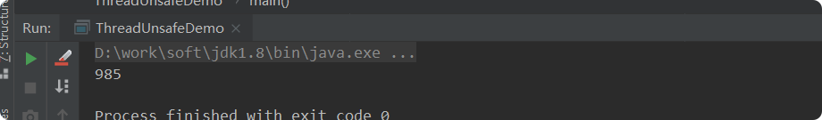
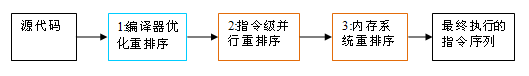
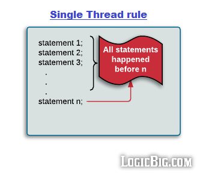
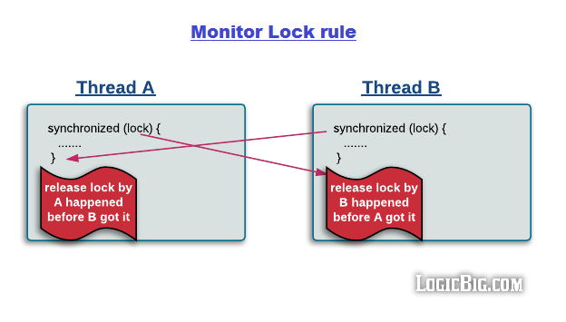
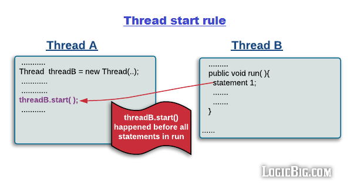
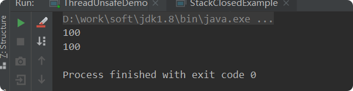

# java并发-理论基础

## 带着问题（理解）
- 多线程的出现是要解决什么问题的? 
- 线程不安全是指什么? 举例说明 
- 并发出现线程不安全的本质什么? 可见性，原子性和有序性。 
- Java是怎么解决并发问题的? 3个关键字，JMM和8个Happens-Before 
- 线程安全是不是非真即假?不是
- 线程安全有哪些实现思路?
- 如何理解并发和并行的区别?

## 为什么要用多线程
众所周知，CPU、内存、I/O 设备的速度是有极大差异的，为了合理利用 CPU 的高性能，平衡这三者的速度差异，  
计算机体系结构、操作系统、编译程序都做出了贡献，主要体现为:

- CPU 增加了**缓存**，以均衡与内存的速度差异；// 导致 **可见性**问题
- 操作系统增加了进程、线程，以**分时复用** CPU，进而均衡 CPU 与 I/O 设备的速度差异；// 导致 **原子性**问题
- 编译程序**优化指令执行次序**，使得缓存能够得到更加合理地利用。// 导致 **有序性**问题

## 线程不安全-实例

如果多个线程对同一个共享数据进行访问而不采取同步操作的话，那么操作的结果是不一致的。  
以下代码演示了 1000 个线程同时对 num 执行自增操作，操作结束之后它的值有可能小于 1000。    
    
    public class ThreadUnsafeDemo {
        private int num=0;
    
        public int getNum() {
            return num;
        }
    
        public void add() {
            num++;
        }
    
        public static void main(String[] args) throws InterruptedException {
            //一千个线程
            final int threadSize=1000;
            ThreadUnsafeDemo threadUnsafeDemo=new ThreadUnsafeDemo();
            final CountDownLatch countDownLatch=new CountDownLatch(threadSize);
            ExecutorService executorService= Executors.newCachedThreadPool();
            for (int i = 0; i <threadSize ; i++) {
                executorService.execute(() -> {
                    threadUnsafeDemo.add();
                    countDownLatch.countDown();
                });
            }
            countDownLatch.await();
            executorService.shutdown();
            System.out.println(threadUnsafeDemo.getNum());
    
    
        }
    }
 //结果总是小于1000
 
         
    
## 并发不安全原因-并发三要素
上面例子为什么不是1000？并发多线程出现的问题是上面？
### 可见性: CPU缓存引起
> **可见性**：一个线程对共享变量的修改，另外一个线程能够立刻看到。

**线程先把数据读取到缓存，并修改，主存中还没修改 所以不一致**
举个小例子：
    
    //线程1执行的代码
    int i = 0;
    i = 10;
     
    //线程2执行的代码
    j = i;
分析：  
假若执行线程1的是CPU1，执行线程2的是CPU2。由上面的分析可知，当线程1执行 i =10这句时，  
会先把i的初始值加载到CPU1的高速缓存中，然后赋值为10，那么在CPU1的**高速缓存**当中i的值变为10了，却没有立即写入到**主存**当中。  

此时线程2执行 j = i，它会先去**主存**读取i的值并加载到CPU2的**缓存**当中，注意此时**主存**当中i的值还是0，
那么就会使得j的值为0，而不是10.  

这就是可见性问题，线程1对变量i修改了之后，线程2没有立即看到线程1修改的值。    

### 原子性: 分时复用（线程切换）引起
>原子性：即一个操作或者多个操作 要么全部执行并且执行的过程不会被任何因素打断，要么就都不执行。

举个小例子:
    
    int i = 1;
    
    // 线程1执行
    i += 1;
    
    // 线程2执行
    i += 1;

分析：  
这里需要注意的是：i += 1需要三条 CPU 指令  

1.将变量 i 从内存读取到 CPU寄存器；
2.在CPU寄存器中执行 i + 1 操作；
3.将最后的结果i写入内存（缓存机制导致可能写入的是 CPU 缓存而不是内存）。  

由于CPU分时复用（线程切换）的存在，线程1执行了第一条指令后，就切换到线程2执行，  
假如线程2执行了这三条指令后，再切换会线程1执行后续两条指令，将造成最后写到内存中的i值是2而不是3。  

### 有序性: 指令重排序引起
> 有序性：即程序执行的顺序按照代码的先后顺序执行。

举个小例子:
    
    int i = 0;              
    boolean flag = false;
    i = 1;                //语句1  
    flag = true;          //语句2
    
分析：
上面代码定义了一个int型变量，定义了一个boolean类型变量，然后分别对两个变量进行赋值操作。从代码顺序上看，  
语句1是在语句2前面的，那么JVM在真正执行这段代码的时候会保证语句1一定会在语句2前面执行吗? 不一定，  
为什么呢? 这里可能会发生**指令重排序**（Instruction Reorder）。  

在执行程序时为了提高性能，编译器和处理器常常会对指令做重排序。重排序分三种类型：  

- 编译器优化的重排序。编译器在不改变单线程程序语义的前提下，可以重新安排语句的执行顺序。
- 指令级并行的重排序。现代处理器采用了指令级并行技术（Instruction-Level Parallelism， ILP）来将多条指令重叠执行。  
如果不存在数据依赖性，处理器可以改变语句对应机器指令的执行顺序。
- 内存系统的重排序。由于处理器使用缓存和读 / 写缓冲区，这使得加载和存储操作看上去可能是在乱序执行。
从 java 源代码到最终实际执行的指令序列，会分别经历下面三种重排序：   

上述的 1 属于编译器重排序，2 和 3 属于处理器重排序。这些重排序都可能会导致多线程程序出现内存可见性问题。  
对于编译器，JMM（java内存模型） 的编译器重排序规则会禁止特定类型的编译器重排序（不是所有的编译器重排序都要禁止）。  
对于处理器重排序，JMM 的处理器重排序规则会要求 java 编译器在生成指令序列时，插入特定类型的内存屏障（memory barriers，intel   
称之为 memory fence）指令，通过内存屏障指令来禁止特定类型的处理器重排序（不是所有的处理器重排序都要禁止）。  

## JAVA是怎么解决并发问题的: JMM(Java内存模型)
> 理解的第一个维度：核心知识点

JMM本质上可以理解为，Java 内存模型规范了 JVM 如何提供按需禁用缓存和编译优化的方法。具体来说，这些方法包括：

- volatile、synchronized 和 final 三个关键字
- Happens-Before 规则
> 理解的第二个维度：可见性，有序性，原子性

- **原子性**  
在Java中，对基本数据类型的变量的读取和赋值操作是原子性操作，即这些操作是不可被中断的，    
要么执行，要么不执行。 请分析以下哪些操作是原子性操作：   
    
    
    x = 10;        //语句1: 直接将数值10赋值给x，也就是说线程执行这个语句的会直接将数值10写入到工作内存中
    y = x;         //语句2: 包含2个操作，它先要去读取x的值，再将x的值写入工作内存，虽然读取x的值以及 
                    将x的值写入工作内存 这2个操作都是原子性操作，但是合起来就不是原子性操作了。
    x++;           //语句3： x++包括3个操作：读取x的值，进行加1操作，写入新的值。
    x = x + 1;     //语句4： 同语句3
    
上面4个语句只有语句1的操作具备原子性。       
也就是说，只有简单的读取、赋值（而且必须是将数字赋值给某个变量，变量之间的相互赋值不是原子操作）才是原子操作。  

总结:  
1.JMM 只保证了基本的读取和赋值是原子操作。
2.如果要实现更大范围的原子操作，可以通过synchronized和lock来实现（保证任何时刻只有一个线程执行该代码）。

- **可见性**  
 Java提供了volatile关键字来保证可见性。  
    - 当一个共享变量被volatile修饰时，它会保证修改的值会立即被更新到主存，当有其他线程需要读取时，它会去内存中读取新值。  
    - 而普通的共享变量不能保证可见性，因为普通共享变量被修改之后，什么时候被写入主存是不确定的，  
    当其他线程去读取时，此时内存中可能还是原来的旧值，因此无法保证可见性。
    - 另外，通过synchronized和Lock也能够保证可见性，synchronized和Lock能保证同一时刻只有一个线程获取锁然后执行同步代码，  
    并且在释放锁之前会将对变量的修改刷新到主存当中。因此可以保证可见性。 
- **有序性**
    - 可以通过volatile关键字来保证一定的“有序性”
    - 另外可以通过synchronized和Lock来保证有序性，很显然，synchronized和Lock保证每个时刻是有一个线程执行同步代码，  
    相当于是让线程顺序执行同步代码，自然就保证了有序性
    - 当然JMM是通过Happens-Before 规则来保证有序性的。
    

### 关键字: volatile、synchronized和final
其他篇文章分析了这个三个关键字

- [关键字:volatile](../关键字/volatile.md)
- [关键字:synchronized](../关键字/synchronized.md)
- [关键字:final](../关键字/final.md)  

### Happens-Before规则

上面提到了可以用 volatile 和 synchronized 来保证**有序性**。  
除此之外，JVM 还规定了先行发生原则，让一个操作无需控制就能先于另一个操作完成。

> 1.单一线程原则 Single Thread rule

在一个线程内，在程序前面的操作先行发生于后面的操作。

> 2.管程锁定规则 Monitor Lock Rule

一个 unlock 操作先行发生于后面对同一个锁的 lock 操作。

> 3.volatile 变量规则 Volatile Variable Rule

对一个 volatile 变量的写操作先行发生于后面对这个变量的读操作。

> 4.线程启动规则 Thread Start Rule

Thread 对象的 start() 方法调用先行发生于此线程的每一个动作。

> 5.线程加入规则 Thread Join Rule

Thread 对象的结束先行发生于 join() 方法返回。

> 6.线程中断规则 Thread Interruption Rule

对线程 interrupt() 方法的调用先行发生于被中断线程的代码检测到中断事件的发生，  
可以通过 interrupted() 方法检测到是否有中断发生。

> 7.对象终结规则 Finalizer Rule

一个对象的初始化完成(构造函数执行结束)先行发生于它的 finalize() 方法的开始。

> 8.传递性 Transitivity

如果操作 A 先行发生于操作 B，操作 B 先行发生于操作 C，那么操作 A 先行发生于操作 C。

## 线程安全: 不是一个非真即假的命题
一个类在可以被多个线程安全调用时就是线程安全的。线程安全不是一个非真即假的命题，    
可以将共享数据按照安全程度的强弱顺序分成以下五类:   
    1.不可变  
    2.绝对线程安全  
    3.相对线程安全  
    4.线程兼容  
    5.线程对立 
### 1.不可变  

不可变(Immutable)的对象一定是线程安全的，**不需要再采取任何的线程安全保障措施**。 
只要一个不可变的对象被正确地构建出来，永远也不会看到它在多个线程之中处于不一致的状态。  
不可变的类型:  
- final 关键字修饰的基本数据类型
- String
- 枚举类型
- Number 部分子类，如 Long 和 Double 等数值包装类型，BigInteger 和 BigDecimal 等大数据类型。  
    但同为 Number 的原子类 AtomicInteger 和 AtomicLong 则是可变的。

### 2.绝对线程安全 
 不管运行时环境如何，调用者都不需要任何额外的同步措施。

### 3.相对线程安全

对线程安全需要保证对这个对象单独的操作是线程安全的，在调用的时候不需要做额外的保障措施。  
但是对于一些特定顺序的连续调用，就可能需要在调用端使用额外的同步手段来保证调用的正确性。  

在 Java 语言中，大部分的线程安全类都属于这种类型，  
例如 Vector、HashTable、Collections 的 synchronizedCollection() 方法包装的集合等。

对于下面的代码，如果删除元素的线程删除了 Vector 的一个元素，而获取元素的线程试图访问一个已经被删除的元素，  
那么就会抛出 ArrayIndexOutOfBoundsException。  
    
    public class ThreadUnsafeDemo {
        private static Vector<Integer> vector = new Vector<>();
    
        public static void main(String[] args) {
            while (true) {
                for (int i = 0; i < 100; i++) {
                    vector.add(i);
                }
                ExecutorService executorService = Executors.newCachedThreadPool();
                executorService.execute(() -> {
                    for (int i = 0; i < vector.size(); i++) {
                        vector.remove(i);
                    }
                });
                executorService.execute(() -> {
                    for (int i = 0; i < vector.size(); i++) {
                        vector.get(i);
                    }
                });
                executorService.shutdown();
            }
        }
    }
    

如果要保证上面的代码能正确执行下去，就需要对删除元素和获取元素的代码进行同步。
    
     ExecutorService executorService = Executors.newCachedThreadPool();
                executorService.execute(() -> {
                    synchronized (vector){ //增加synchronized
                    for (int i = 0; i < vector.size(); i++) {
                        vector.remove(i);
                    }}
                });
                executorService.execute(() -> {
                    synchronized (vector) {//增加synchronized
                        for (int i = 0; i < vector.size(); i++) {
                            vector.get(i);
                        }
                    }
                });

### 4.线程兼容

线程兼容是指对象本身并不是线程安全的，但是可以通过在调用端正确地使用同步手段来保证对象在并发环境中可以安全地使用，  
我们平常说一个类不是线程安全的，绝大多数时候指的是这一种情况。Java API 中大部分的类都是属于线程兼容的，  
如与前面的 Vector 和 HashTable 相对应的集合类 ArrayList 和 HashMap 等。
### 5.线程对立

线程对立是指无论调用端是否采取了同步措施，都无法在多线程环境中并发使用的代码。  
由于 Java 语言天生就具备多线程特性，线程对立这种排斥多线程的代码是很少出现的，而且通常都是有害的，应当尽量避免。
## 线程安全的实现方法
### 互斥同步
synchronized 和 ReentrantLock。
详细分析请看：
- [关键字：synchronized](../关键字/synchronized.md)
- [JUC锁：ReentrantLock](../JUC/JUC锁/ReentrantLock.md)

### 非阻塞同步 
互斥同步最主要的问题就是线程阻塞和唤醒所带来的**性能**问题，因此这种同步也称为阻塞同步。    
互斥同步属于一种悲观的并发策略，总是认为只要不去做正确的同步措施，那就肯定会出现问题。无论共享数据是否真的会出现竞争，  
它都要进行加锁(这里讨论的是概念模型，实际上虚拟机会优化掉很大一部分不必要的加锁)、用户态核心态转换、  
维护锁计数器和检查是否有被阻塞的线程需要唤醒等操作。  

**(一)CAS**

随着硬件指令集的发展，我们可以使用基于冲突检测的乐观并发策略: 先进行操作，如果没有其它线程争用共享数据，那操作就成功了，  
否则采取补偿措施(不断地重试，直到成功为止)。这种乐观的并发策略的许多实现都不需要将线程阻塞，因此这种同步操作称为非阻塞同步。

乐观锁需要操作和冲突检测这两个步骤具备原子性，这里就不能再使用互斥同步来保证了，只能靠硬件来完成。  
硬件支持的原子性操作最典型的是: 比较并交换(Compare-and-Swap，CAS)。CAS 指令需要有 3 个操作数，分别是  
内存地址V、 旧的预期值 A 和新值 B。当执行操作时，只有当 V 的值等于 A，才将 V 的值更新为 B。  

**(二)AtomicInteger**

J.U.C 包里面的整数原子类 AtomicInteger，其中的 compareAndSet() 和 getAndIncrement() 等方法都使用了 **Unsafe** 类的 CAS 操作。
以下代码使用了 AtomicInteger 执行了自增的操作。  
    
    public class ThreadUnsafeDemo {
        private AtomicInteger cnt = new AtomicInteger();
    
        public void add() {
            cnt.incrementAndGet();
        }
    
    }
    
以下代码是 incrementAndGet() 的源码，它调用了 unsafe 的 getAndAddInt() 。  
    
      /**
         * Atomically increments by one the current value.
         *
         * @return the updated value
         */
        public final int incrementAndGet() {
            return unsafe.getAndAddInt(this, valueOffset, 1) + 1;
        }
        
以下代码是 getAndAddInt() 源码，  
- var1 指示对象内存地址，  
- var2 指示该字段相对对象内存地址的偏移，  
- var4 指示操作需要加的数值，  
这里为 1。通过 getIntVolatile(var1, var2) 得到旧的预期值，  
通过调用 compareAndSwapInt() 来进行 CAS 比较，如果该字段内存地址中的值等于 var5，  
那么就更新内存地址为 var1+var2 的变量为 var5+var4。  

可以看到 getAndAddInt() 在一个循环中进行，发生冲突的做法是不断的进行重试。     
    
    
    public final int getAndAddInt(Object var1, long var2, int var4) {
        int var5;
        do {
            var5 = this.getIntVolatile(var1, var2);
        } while(!this.compareAndSwapInt(var1, var2, var5, var5 + var4));

        return var5;
    }
**(三)ABA问题**

如果一个变量初次读取的时候是 A 值，它的值被改成了 B，后来又被改回为 A，那 CAS 操作就会误认为它从来没有被改变过。  

J.U.C 包提供了一个带有标记的原子引用类 **AtomicStampedReference **来解决这个问题，它可以通过控制变量值的版本来保证 CAS 的正确性。  
大部分情况下 ABA 问题不会影响程序并发的正确性，如果需要解决 ABA 问题，改用传统的互斥同步可能会比原子类更高效。  

**CAS, Unsafe和原子类详细分析请看：**
[JUC原子类：CAS, Unsafe和原子类](../JUC/JUC原子类/CAS,Unsafe和原子类.md)

### 无同步方案
**(一)栈封闭**
多个线程访问同一个方法的局部变量时，不会出现线程安全问题，因为局部变量存储在虚拟机栈中，属于线程私有的。  
    
    public class StackClosedExample {
        public void add100() {
            int cnt = 0;
            for (int i = 0; i < 100; i++) {
                cnt++;
            }
            System.out.println(cnt);
        }
        public static void main(String[] args) {
            StackClosedExample example = new StackClosedExample();
            ExecutorService executorService = Executors.newCachedThreadPool();
            executorService.execute(() -> example.add100());
            executorService.execute(() -> example.add100());
            executorService.shutdown();
        }
    }
    
  

更详细的分析请看J.U.C中线程池相关内容详解：

[JUC线程池: FutureTask](../JUC/JUC线程池/FutureTask.md)
[JUC线程池: ThreadPoolExecutor](../JUC/JUC线程池/ThreadPoolExecutor.md)
[JUC线程池: ScheduledThreadPool](../JUC/JUC线程池/ScheduledThreadPool.md)
[JUC线程池: Fork、Join](../JUC/JUC线程池/Fork、Join.md)

**(二)线程本地存储(Thread Local Storage)**  

如果一段代码中所需要的数据必须与其他代码共享，那就看看这些共享数据的代码是否能保证在同一个线程中执行。如果能保证，我们就可以把共享数据的可见范围限制在同一个线程之内，这样，无须同步也能保证线程之间不出现数据争用的问题。

符合这种特点的应用并不少见，大部分使用消费队列的架构模式(如“生产者-消费者”模式)都会将产品的消费过程尽量在一个线程中消费完。其中最重要的一个应用实例就是经典 Web 交互模型中的“一个请求对应一个服务器线程”(Thread-per-Request)的处理方式，这种处理方式的广泛应用使得很多 Web 服务端应用都可以使用线程本地存储来解决线程安全问题。

可以使用 java.lang.ThreadLocal 类来实现线程本地存储功能。 
 
详细的分析看：[Java并发:ThreadLocal](../JUC/JUC工具类/ThreadLocal.md)

**(三)可重入代码(Reentrant Code)**  
这种代码也叫做纯代码(Pure Code)，可以在代码执行的任何时刻中断它，转而去执行另外一段代码(包括递归调用它本身)，而在控制权返回后，原来的程序不会出现任何错误。

可重入代码有一些共同的特征，例如不依赖存储在堆上的数据和公用的系统资源、用到的状态量都由参数中传入、不调用非可重入的方法等。

## 回答问题（总结）
- 多线程的出现是要解决什么问题的?   

  答：  解决了 CPU、内存、I/O设备读写速度有很大差异  
  1.**CPU增加了缓存**，来平衡与内存的速度差异。不过导致了**可见性**问题  
  2.**操作系统**增加了进程、线程。用**多路复用CPU**的方式，平衡CPU和I/O设备的速度差异。不过导致了*原子性* 问题  
  3.**编译程序优化**指令执行顺序，使缓存能够得到更好的运用，导致了**一致性**问题   
- 线程不安全是指什么? 举例说明   

  答：  多线程操作同一个事情，导致结果和预想中不一样   
   
- 并发出现线程不安全的本质什么?   

   答：   1.可见性2.原子性  3.有序性。 
   
- Java是怎么解决并发问题的?   
  
   答： 3个关键字（synchronized、volatile、final），JMM和8个Happens-Before   
   
- 线程安全是不是非真即假?  
 
    答：不是

- 线程安全有哪些实现思路?  

    答：互斥同步 非阻塞同步 无同步方案
    总结：加锁，CAS 原子类（Unsafe 类的 CAS 操作）、栈封闭 、线程本地存储（ThreadLocal）、可重入代码
    
- 如何理解并发和并行的区别?  

    答：并发就是一个线程要做很多事情，并行就是同一时候要做很多事情
    

