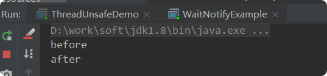

#java并发-线程基础
## 带着问题（理解）
- 线程有哪几种状态?   
- 分别说明从一种状态到另一种状态转变有哪些方式?   
- 通常线程有哪几种使用方式?   
- 基础线程机制有哪些?   
- 线程的中断方式有哪些?   
- 线程的互斥同步方式有哪些?   
- 如何比较和选择?   
- 线程之间有哪些协作方式?  

## 线程的生命周期
线程是一个动态执行的过程，它也有一个从产生到死亡的过程。

> 新建状态:

使用 new 关键字和 Thread 类或其子类建立一个线程对象后，该线程对象就处于新建状态。它保持这个状态直到程序 start() 这个线程。

> 就绪状态:

当线程对象调用了start()方法之后，该线程就进入就绪状态。就绪状态的线程处于就绪队列中，要等待JVM里线程调度器的调度。

> 运行状态:

如果就绪状态的线程获取 CPU 资源，就可以执行 run()，此时线程便处于运行状态。处于运行状态的线程最为复杂，它可以变为阻塞状态、就绪状态和死亡状态。

> 阻塞状态:
 
如果一个线程执行了sleep（睡眠）、suspend（挂起）等方法，失去所占用资源之后，该线程就从运行状态进入阻塞状态。在睡眠时间已到或获得设备资源后可以重新进入就绪状态。  
可以分为三种：

- 等待阻塞：运行状态中的线程执行 wait() 方法，使线程进入到等待阻塞状态。

- 同步阻塞：线程在获取 synchronized 同步锁失败(因为同步锁被其他线程占用)。

- 其他阻塞：通过调用线程的 sleep() 或 join() 发出了 I/O 请求时，线程就会进入到阻塞状态。当sleep() 状态超时，join() 等待线程终止或超时，或者 I/O 处理完毕，线程重新转入就绪状态。

> 死亡状态:

一个运行状态的线程完成任务或者其他终止条件发生时，该线程就切换到终止状态。

## 线程的优先级

   每一个 Java 线程都有一个优先级，这样有助于操作系统确定线程的调度顺序。  
   
   Java 线程的优先级是一个整数，其取值范围是 1 （Thread.MIN_PRIORITY ） - 10 （Thread.MAX_PRIORITY ）。  
   
   默认情况下，每一个线程都会分配一个优先级 NORM_PRIORITY（5）。  
   
   具有较高优先级的线程对程序更重要，并且应该在低优先级的线程之前分配处理器资源。但是，线程优先级不能保证线程执行的顺序，而且非常依赖于平台。
## 三种线程使用方式
- 实现 Runnable 接口；
- 通过 Callable 和 Future 创建线程。
- 继承 Thread 类

### 实现 Runnable 接口；
需要实现 run() 方法。  
通过 Thread 调用 start() 方法来启动线程。  
    
    public class MyRunnable implements Runnable {
        public void run() {
            // 方法省略。。。。
        }
    }
    public static void main(String[] args) {
        MyRunnable instance = new MyRunnable();
        Thread thread = new Thread(instance);
        thread.start();
    }

### 通过 Callable 和 Future 创建线程。
与 Runnable 相比，Callable 可以有返回值，返回值通过 FutureTask 进行封装。   
       
       public class MyCallable implements Callable<Integer> {
           @Override
           public Integer call() throws Exception {
               int i = 0;
               for(;i<100;i++)
               {
                   System.out.println(Thread.currentThread().getName()+" "+i);
               }
               return i;
           }
       
           public static void main(String[] args) throws ExecutionException, InterruptedException {
               MyCallable myCallable=new MyCallable();
               FutureTask futureTask=new FutureTask(myCallable);
               Thread thread=new Thread(futureTask);
               thread.start();
               System.out.println(futureTask.get());//调用get方法得到返回值
           }
       }   
    
### 继承 Thread 类
同样也是需要实现 run() 方法，因为 Thread 类也实现了 Runable 接口。  

当调用 start() 方法启动一个线程时，虚拟机会将该线程放入就绪队列中等待被调度，当一个线程被调度时会执行该线程的 run() 方法。

    public class MyThread extends Thread {
        @Override
        public void run(){
            System.out.println(Thread.currentThread().getName());
        }
    
        public static void main(String[] args) {
            MyThread myThread=new MyThread();
            myThread.start();//启动线程，放入等待队列等待被调度,被调度之后执行run（）
    
        }
    }

### 实现接口 VS 继承 Thread
**实现接口会更好一些**，因为:
- Java 不支持多重继承，因此继承了 Thread 类就无法继承其它类，但是可以实现多个接口；
- 类可能只要求可执行就行，继承整个 Thread 类开销过大。  

## 基础线程机制
### Executor
Executor 管理多个异步任务的执行，而无需程序员显式地管理线程的生命周期。这里的异步是指多个任务的执行互不干扰，不需要进行同步操作。  

主要有三种 Executor:  

- CachedThreadPool: 一个任务创建一个线程；
- FixedThreadPool: 所有任务只能使用固定大小的线程；
- SingleThreadExecutor: 相当于大小为 1 的 FixedThreadPool。

**注意**：现在不允许Executors这种方式创建线程池。因为要造成OOM
    
    
    public class ExecutorTest {
        public static void main(String[] args) {
            ExecutorService executorService=Executors.newCachedThreadPool();
            for (int i = 0; i <10 ; i++) {
                executorService.execute(() -> {
                    System.out.println(Thread.currentThread().getName());
                });
            }
            executorService.shutdown();
        }
    }
### Daemon
守护线程是程序运行时在后台提供服务的线程，不属于程序中不可或缺的部分。  
  
当所有非守护线程结束时，程序也就终止，同时会杀死所有守护线程。  

main() 属于非守护线程。  

使用 setDaemon() 方法将一个线程设置为守护线程。  
    
    public static void main(String[] args) {
        Thread thread = new Thread(new MyRunnable());
        thread.setDaemon(true);
    }
### sleep()
Thread.sleep(millisec) 方法会休眠当前正在执行的线程，millisec 单位为毫秒。  

sleep() 可能会抛出 InterruptedException，因为异常不能跨线程传播回 main() 中，因此必须在本地进行处理。线程中抛出的其它异常也同样需要在本地进行处理。    
    
    public void run() {
        try {
            Thread.sleep(3000);
        } catch (InterruptedException e) {
            e.printStackTrace();
        }
    }

### yield()
对静态方法 Thread.yield() 的调用声明了当前线程已经完成了生命周期中最重要的部分，可以切换给其它线程来执行。该方法只是对线程调度器的一个建议，而且也只是建议具有相同优先级的其它线程可以运行。
    
    public void run() {
        Thread.yield();
    }
    
## 线程中断
一个线程执行完毕之后会自动结束，如果在运行过程中发生异常也会提前结束。
### InterruptedException
**thread1.interrupt()中断线程，抛出InterruptedException ** 
通过调用一个线程的 interrupt() 来中断该线程，如果该线程处于阻塞、限期等待或者无限期等待状态，那么就会抛出 InterruptedException，从而提前结束该线程。但是不能中断 I/O 阻塞和 synchronized 锁阻塞。

对于以下代码，在 main() 中启动一个线程之后再中断它，由于线程中调用了 Thread.sleep() 方法，因此会抛出一个 InterruptedException，从而提前结束线程，不执行之后的语句。

       private static class MyThread1 extends Thread {
            @Override
            public void run() {
                try {
                    Thread.sleep(2000);
                    System.out.println("Thread run");
                } catch (InterruptedException e) {
                    e.printStackTrace();
                }
            }
        }
        public static void main(String[] args) throws InterruptedException {
            Thread thread1 = new MyThread1();
            thread1.start();
            thread1.interrupt(); //中断了线程，不会执行MyThread1中的run方法
            System.out.println("Main run");
        }

### interrupted()
**!interrupted()返回true，跳出线程中的循环**  
如果一个线程的 run() 方法执行一个无限循环，并且没有执行 sleep() 等会抛出 InterruptedException 的操作，那么调用线程的 interrupt() 方法就无法使线程提前结束。

但是调用 interrupt() 方法会设置线程的中断标记，此时调用 interrupted() 方法会返回 true。因此可以在循环体中使用 interrupted() 方法来判断线程是否处于中断状态，从而提前结束线程。        
    
    private static class MyThread2 extends Thread {
            @Override
            public void run() {
                while (!interrupted()) {
                    // ..
                }
                System.out.println("Thread end");
            }
        }
    
        public static void main(String[] args) throws InterruptedException {
            Thread thread2 = new MyThread2();
            thread2.start();
            thread2.interrupt();//调用中断方法，停止线程中的无限循环
        }

### Executor 的中断操作
    
调用 Executor 的 shutdown() 方法会等待线程都执行完毕之后再关闭，但是如果调用的是 shutdownNow() 方法，则相当于调用每个线程的 interrupt() 方法。

以下使用 Lambda 创建线程，相当于创建了一个匿名内部线程。
    
    public static void main(String[] args) {
        ExecutorService executorService = Executors.newCachedThreadPool();
        executorService.execute(() -> {
            try {
                Thread.sleep(2000);
                System.out.println("Thread run");
            } catch (InterruptedException e) {
                e.printStackTrace();
            }
        });
        executorService.shutdownNow();
        System.out.println("Main run");
    }

如果只想中断 Executor 中的一个线程，可以通过使用 submit() 方法来提交一个线程，它会返回一个 Future<?> 对象，通过调用该对象的 cancel(true) 方法就可以中断线程。
    
     public static void main(String[] args) {
            ExecutorService executorService = Executors.newCachedThreadPool();
            Future<?> future =executorService.submit(() -> {
                try {
                    Thread.sleep(2000);
                    System.out.println("Thread run");
                } catch (InterruptedException e) {
                    e.printStackTrace();
                }
            });
            future.cancel(true);
            System.out.println("Main run");
        }

## 线程互斥同步
Java 提供了两种锁机制来控制多个线程对共享资源的互斥访问，第一个是 JVM 实现的 synchronized，而另一个是 JDK 实现的 ReentrantLock。
### synchronized
> 同步一个代码块

    public void func() {
        synchronized (this) {
            // ...
        }
    }
它只作用于同一个对象，如果调用两个对象上的同步代码块，就不会进行同步。  

对于以下代码，使用 ExecutorService 执行了两个线程，由于调用的是同一个对象的同步代码块，因此这两个线程会进行同步，当一个线程进入同步语句块时，另一个线程就必须等待。

      public void func1() {
            synchronized (this) {
                for (int i = 0; i < 10; i++) {
                    System.out.print(i + " ");
                }
            }
        }
        public static void main(String[] args) {
            SynchronizedExample e1 = new SynchronizedExample();
            ExecutorService executorService = Executors.newCachedThreadPool();
            executorService.execute(() -> e1.func1());
            executorService.execute(() -> e1.func1());
        }

>  同步一个方法

    public synchronized void func () {
        // ...
    }
它和同步代码块一样，作用于同一个对象。

> 同步一个类

    public void func() {
        synchronized (SynchronizedExample.class) {
            // ...
        }
    }
        
作用于整个类，也就是说两个线程调用同一个类的不同对象上的这种同步语句，也会进行同步。

> 同步一个静态方法

    public synchronized static void fun() {
        // ...
    }

作用于整个类。

### ReentrantLock
ReentrantLock 是 java.util.concurrent(J.U.C)包中的锁。
   
    private Lock lock = new ReentrantLock();

    public void func() {

        lock.lock();
        try {
            for (int i = 0; i < 10; i++) {
                System.out.print(i + " ");
            }
        } finally {
            lock.unlock(); // 确保释放锁，从而避免发生死锁。
        }
    }
    public static void main(String[] args) {
        LockExample lockExample = new LockExample();
        ExecutorService executorService = Executors.newCachedThreadPool();
        executorService.execute(() -> lockExample.func());
        executorService.execute(() -> lockExample.func());
    }

### 比较

内容|synchronized|ReentrantLock 
--|--|--
实现|JVM 实现的|JDK 实现的
性能| 大致相同|大致相同
等待可中断| 不能中断|可中断
公平锁|非公平锁|默认非公平、也可以是公平的
锁绑定多个条件|不可以|可以同时绑定多个 Condition 对象
### 总结
除非需要使用 ReentrantLock 的高级功能，否则**优先使用 synchronized**。这是因为 synchronized 是 JVM 实现的一种锁机制，JVM 原生地支持它，而 ReentrantLock 不是所有的 JDK 版本都支持。并且使用 synchronized 不用担心没有释放锁而导致死锁问题，因为 JVM 会确保锁的释放。

## 线程之间的协作
当多个线程可以一起工作去解决某个问题时，如果某些部分必须在其它部分之前完成，那么就需要对线程进行协调。
### join()
在线程中调用另一个线程的 join() 方法，会将当前线程挂起，而不是忙等待，直到目标线程结束。  

对于以下代码，虽然 b 线程先启动，但是因为在 b 线程中调用了 a 线程的 join() 方法，b 线程会等待 a 线程结束才继续执行，因此最后能够保证 a 线程的输出先于 b 线程的输出。
    
     public class A extends Thread{
            @Override
            public void run() {
                System.out.println("A");
            }
        }
        public  class B extends Thread{
            private A a;
            B(A a){
                this.a=a;
            }
            @Override
            public void run() {
                try {
                    a.join();
                } catch (InterruptedException e) {
                    e.printStackTrace();
                }
                System.out.println("B");
            }
        }
        public  void test(){
            A a=new A();
            B b=new B(a);
            a.start();
            b.start();
        }
        public static void main(String[] args) {
             JoinExample joinExample=new JoinExample();
             joinExample.test();
        }

      
### wait() notify() notifyAll()
调用 wait() 使得线程等待某个条件满足，线程在等待时会被挂起，当其他线程的运行使得这个条件满足时，其它线程会调用 notify() 或者 notifyAll() 来唤醒挂起的线程。        

它们都属于 Object 的一部分，而不属于 Thread。  
只能用在同步方法或者同步控制块中使用，否则会在运行时抛出 IllegalMonitorStateExeception。   

使用 wait() 挂起期间，线程会释放锁。这是因为，如果没有释放锁，那么其它线程就无法进入对象的同步方法或者同步控制块中，那么就无法执行 notify() 或者 notifyAll() 来唤醒挂起的线程，造成死锁。

      public synchronized void before() {
            System.out.println("before");
            notifyAll();
        }
    
        public synchronized void after() {
            try {
                wait();
            } catch (InterruptedException e) {
                e.printStackTrace();
            }
            System.out.println("after");
        }
        public static void main(String[] args) {
            ExecutorService executorService = Executors.newCachedThreadPool();
            WaitNotifyExample example = new WaitNotifyExample();
            executorService.execute(() -> example.after());
            executorService.execute(() -> example.before());
        }

### await() signal() signalAll()
java.util.concurrent 类库中提供了 Condition 类来实现线程之间的协调，可以在 Condition 上调用 await() 方法使线程等待，其它线程调用 signal() 或 signalAll() 方法唤醒等待的线程。相比于 wait() 这种等待方式，await() 可以指定等待的条件，因此更加灵活。

使用 Lock 来获取一个 Condition 对象。

    public class AwaitSignalExample {
        private  Lock lock=new ReentrantLock();
        private Condition condition=lock.newCondition();
    
        private void before() {
            lock.lock();
            try {
                System.out.println("before");
                condition.signalAll();
            } catch (Exception e) {
    
            } finally {
                lock.unlock();
            }
        }
            private void after() {
                lock.lock();
                try {
                    condition.await();
                    System.out.println("after");
                } catch (Exception e) {
    
                } finally {
                    lock.unlock();
                }
        }
    
        public static void main(String[] args) {
            ExecutorService executorService = Executors.newCachedThreadPool();
            AwaitSignalExample awaitSignalExample=new AwaitSignalExample();
            executorService.execute(() -> awaitSignalExample.after());
            executorService.submit(() -> awaitSignalExample.before());
        }
    
    }

    
## 回答问题（总结）
- 线程有哪几种状态?  
  答：新建new、就绪start、运行run、阻塞sleep wait、死亡
- 分别说明从一种状态到另一种状态转变有哪些方式?   
  
- 通常线程有哪几种使用方式?   
  答：继承Thread 、实现runnable 、Callable+future创建代返回值的线程
- 基础线程机制有哪些?   
  答：  Executor线程池、Daemon守护线程、sleep()休眠线程、yield()完成重要方法，建议其他优先级线程执行
- 线程的中断方式有哪些?   
  答：
  - InterruptedException（sleep时候异常）
  - Interrupted（为true表示已经被中断）
  - Executor 的中断操作executorService.shutdownNow();
  - Executor 的中断操作future.cancel(true);
                              
- 线程的互斥同步方式有哪些?  
  答： synchronized 和ReentrantLock  ，
- 如何比较和选择?   
    答：除非需要使用 ReentrantLock 的高级功能，否则优先使用 synchronized。  
    
- 线程之间有哪些协作方式?  
    答：
    - join() 先执行被join（）调用的线程
    - wait() notify() notifyAll() 属于Object类
    - await() signal() signalAll() 属于condition类

