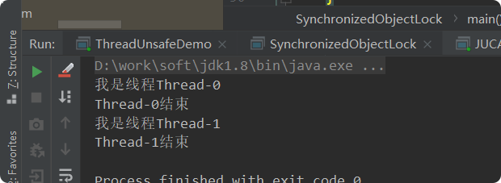

# synchronized
## 带着问题（理解）
- Synchronized可以作用在哪里? 分别通过对象锁和类锁进行举例。 
- Synchronized本质上是通过什么保证线程安全的? 分三个方面回答：加锁和释放锁的原理，可重入原理，保证可见性原理。
- Synchronized由什么样的缺陷?  Java Lock是怎么弥补这些缺陷的。 
- Synchronized和Lock的对比，和选择? 
- Synchronized在使用时有何注意事项? 
- Synchronized修饰的方法在抛出异常时,会释放锁吗? 
- 多个线程等待同一个Synchronized锁的时候，JVM如何选择下一个获取锁的线程? 
- Synchronized使得同时只有一个线程可以执行，性能比较差，有什么提升的方法? 
- 我想更加灵活地控制锁的释放和获取(现在释放锁和获取锁的时机都被规定死了)，怎么办? 
- 什么是锁的升级和降级? 
- 什么是JVM里的偏斜锁、轻量级锁、重量级锁? 
- 不同的JDK中对Synchronized有何优化?
## Synchronized的使用
在应用Sychronized关键字时需要把握如下注意点：

- 一把锁只能同时被一个线程获取，没有获得锁的线程只能等待；  
- 每个实例都对应有自己的一把锁(this),不同实例之间互不影响；例外：锁对象是*.class以及synchronized修饰的是static方法的时候，所有对象公用同一把锁
- synchronized修饰的方法，无论方法正常执行完毕还是抛出异常，都会释放锁
### 对象锁
包括方法锁(默认锁对象为this,当前实例对象)和同步代码块锁(自己指定锁对象)  

> 代码块形式：手动指定锁定对象，也可是是this,也可以是自定义的锁  

示例1：
    
    public class SynchronizedObjectLock implements Runnable {
        static SynchronizedObjectLock instence = new SynchronizedObjectLock();
    
        @Override
        public void run() {
            // 同步代码块形式——锁为this,两个线程使用的锁是一样的,线程1必须要等到线程0释放了该锁后，才能执行
            synchronized (this) {
                System.out.println("我是线程" + Thread.currentThread().getName());
                try {
                    Thread.sleep(3000);
                } catch (InterruptedException e) {
                    e.printStackTrace();
                }
                System.out.println(Thread.currentThread().getName() + "结束");
            }
        }
    
        public static void main(String[] args) {
            Thread t1 = new Thread(instence);
            Thread t2 = new Thread(instence);
            t1.start();
            t2.start();
        }
    }

示例2：
    
    public class SynchronizedObjectLock implements Runnable {
        static SynchronizedObjectLock instence = new SynchronizedObjectLock();
        // 创建2把锁
        Object block1 = new Object();
        Object block2 = new Object();
    
        @Override
        public void run() {
            // 这个代码块使用的是第一把锁，当他释放后，后面的代码块由于使用的是第二把锁，因此可以马上执行
            synchronized (block1) {
                System.out.println("block1锁,我是线程" + Thread.currentThread().getName());
                try {
                    Thread.sleep(3000);
                } catch (InterruptedException e) {
                    e.printStackTrace();
                }
                System.out.println("block1锁,"+Thread.currentThread().getName() + "结束");
            }
    
            synchronized (block2) {
                System.out.println("block2锁,我是线程" + Thread.currentThread().getName());
                try {
                    Thread.sleep(3000);
                } catch (InterruptedException e) {
                    e.printStackTrace();
                }
                System.out.println("block2锁,"+Thread.currentThread().getName() + "结束");
            }
        }
    
        public static void main(String[] args) {
            Thread t1 = new Thread(instence);
            Thread t2 = new Thread(instence);
            t1.start();
            t2.start();
        }
    }

> 方法锁形式：synchronized修饰普通方法，锁对象默认为this

示例1 
    
    public class SynchronizedObjectLock implements Runnable {
        static SynchronizedObjectLock instence = new SynchronizedObjectLock();
    
        @Override
        public void run() {
            method();
        }
    
        public synchronized void method() {
            System.out.println("我是线程" + Thread.currentThread().getName());
            try {
                Thread.sleep(3000);
            } catch (InterruptedException e) {
                e.printStackTrace();
            }
            System.out.println(Thread.currentThread().getName() + "结束");
        }
    
        public static void main(String[] args) {
            Thread t1 = new Thread(instence);
            Thread t2 = new Thread(instence);
            t1.start();
            t2.start();
        }
    }

### 类锁

指synchronize修饰静态的方法或指定锁对象为Class对象  

> synchronize修饰静态方法

示例1:
    
    public class SynchronizedObjectLock implements Runnable {
        static SynchronizedObjectLock instence1 = new SynchronizedObjectLock();
        static SynchronizedObjectLock instence2 = new SynchronizedObjectLock();
    
        @Override
        public void run() {
            method();
        }
    
        // synchronized用在普通方法上，默认的锁就是this，当前实例
        public synchronized void method() {
            System.out.println("我是线程" + Thread.currentThread().getName());
            try {
                Thread.sleep(3000);
            } catch (InterruptedException e) {
                e.printStackTrace();
            }
            System.out.println(Thread.currentThread().getName() + "结束");
        }
    
        public static void main(String[] args) {
            // t1和t2对应的this是两个不同的实例，所以代码不会串行
            Thread t1 = new Thread(instence1);
            Thread t2 = new Thread(instence2);
            t1.start();
            t2.start();
        }
    }

示例2：  
    
    public class SynchronizedObjectLock implements Runnable {
        static SynchronizedObjectLock instence1 = new SynchronizedObjectLock();
        static SynchronizedObjectLock instence2 = new SynchronizedObjectLock();
    
        @Override
        public void run() {
            method();
        }
    
        // synchronized用在静态方法上，默认的锁就是当前所在的Class类，所以无论是哪个线程访问它，需要的锁都只有一把
        public static synchronized void method() {
            System.out.println("我是线程" + Thread.currentThread().getName());
            try {
                Thread.sleep(3000);
            } catch (InterruptedException e) {
                e.printStackTrace();
            }
            System.out.println(Thread.currentThread().getName() + "结束");
        }
    
        public static void main(String[] args) {
            Thread t1 = new Thread(instence1);
            Thread t2 = new Thread(instence2);
            t1.start();
            t2.start();
        }
    }

> synchronized指定锁对象为Class对象 
    
    public class SynchronizedObjectLock implements Runnable {
        static SynchronizedObjectLock instence1 = new SynchronizedObjectLock();
        static SynchronizedObjectLock instence2 = new SynchronizedObjectLock();
    
        @Override
        public void run() {
            // 所有线程需要的锁都是同一把
            synchronized(SynchronizedObjectLock.class){
                System.out.println("我是线程" + Thread.currentThread().getName());
                try {
                    Thread.sleep(3000);
                } catch (InterruptedException e) {
                    e.printStackTrace();
                }
                System.out.println(Thread.currentThread().getName() + "结束");
            }
        }
    
        public static void main(String[] args) {
            Thread t1 = new Thread(instence1);
            Thread t2 = new Thread(instence2);
            t1.start();
            t2.start();
        }
    }
    

## Synchronized原理分析
### 加锁和释放锁的原理
现象、时机(内置锁this)、深入JVM看字节码(反编译看**monitor**指令)  

深入JVM看字节码，创建如下的代码：  
    
    public class SynchronizedDemo2 {
    
        Object object = new Object();
        public void method1() {
            synchronized (object) {
    
            }
            method2();
        }
    
        private static void method2() {
    
        }
    }

使用javac命令进行编译生成.class文件 
    
    >javac SynchronizedDemo2.java

使用javap命令反编译查看.class文件的信息 

    >javap -verbose SynchronizedDemo2.class

得到如下信息：
    
    
    
关注红色方框里的monitorenter和monitorexit即可。 

Monitorenter和Monitorexit指令，会让对象在执行，使其锁计数器加1或者减1。每一个对象在同一时间只与一个monitor(锁)相关联，而一个monitor在同一时间只能被一个线程获得，  
一个对象在尝试获得与这个对象相关联的Monitor锁的所有权的时候，monitorenter指令会发生如下3中情况之一：

* monitor计数器为0，意味着目前还没有被获得，那这个线程就会立刻获得然后把锁计数器+1，一旦+1，别的线程再想获取，就需要等待
* 如果这个monitor已经拿到了这个锁的所有权，**又重入*了这把锁，那锁计数器就会累加，变成2，并且随着重入的次数，会一直累加
* 这把锁已经被别的线程获取了，等待锁释放

> monitorexit指令：

释放对于monitor的所有权，释放过程很简单，就是讲monitor的计数器减1，如果减完以后，计数器不是0，则代表刚才是重入进来的，当前线程还继续持有这把锁的所有权，如果计数器变成0，则代表当前线程不再拥有该monitor的所有权，即释放锁。

该图可以看出，任意线程对Object的访问，首先要获得Object的监视器，如果获取失败，该线程就进入同步状态，线程状态变为BLOCKED，当Object的监视器占有者释放后，在同步队列中得线程就会有机会重新获取该监视器。  

### 可重入原理：加锁次数计数器
定义：  
- 可重入：（来源于维基百科）若一个程序或子程序可以“在任意时刻被中断然后操作系统调度执行另外一段代码，这段代码又调用了该子程序不会出错”，则称其为可重入（reentrant或re-entrant）的。即当该子程序正在运行时，执行线程可以再次进入并执行它，仍然获得符合设计时预期的结果。与多线程并发执行的线程安全不同，可重入强调对单个线程执行时重新进入同一个子程序仍然是安全的。

- 可重入锁：又名递归锁，是指在同一个线程在外层方法获取锁的时候，再进入该线程的内层方法会自动获取锁（前提锁对象得是同一个对象或者class），不会因为之前已经获取过还没释放而阻塞。
例子：
    
    
    public class SynchronizedDemo {
    
        public static void main(String[] args) {
            SynchronizedDemo demo =  new SynchronizedDemo();
            demo.method1();
        }
    
        private synchronized void method1() {
            System.out.println(Thread.currentThread().getId() + ": method1()");
            method2();
        }
    
        private synchronized void method2() {
            System.out.println(Thread.currentThread().getId()+ ": method2()");
            method3();
        }
    
        private synchronized void method3() {
            System.out.println(Thread.currentThread().getId()+ ": method3()");
        }
    }

分析：  
- 执行monitorenter获取锁
    - （monitor计数器=0，可获取锁）
    - 执行method1()方法，monitor计数器+1 -> 1 （获取到锁）
    - 执行method2()方法，monitor计数器+1 -> 2
    - 执行method3()方法，monitor计数器+1 -> 3
-执行monitorexit命令
    - method3()方法执行完，monitor计数器-1 -> 2
    - method2()方法执行完，monitor计数器-1 -> 1
    - method2()方法执行完，monitor计数器-1 -> 0 （释放了锁）
    - （monitor计数器=0，锁被释放了）  
这就是Synchronized的重入性，即在同一**锁程**中，每个对象拥有一个monitor计数器，当线程获取该对象锁后，monitor计数器就会加一，释放锁后就会将monitor计数器减一，线程不需要再次获取同一把锁。

## JVM中锁的优化
JavaSE6为了减少获得锁和释放锁带来的性能消耗，引入了“偏向锁”和“轻量级锁”，所以JavaSe6中锁共有4种状态，级别从低到高依次是：**无锁状态，偏向锁状态，轻量级锁状态，和重量级锁**状态。锁的状态会随着锁竞争的激烈程度的升级而升级。锁可以升级，但不能降级，这种只能升级不能降级的策略，目的是为了提高获得锁和释放锁的效率。

Java SE1.6为了减少获得锁和释放锁所带来的性能消耗，引入了“偏向锁”和“轻量级锁”，所以在Java SE1.6里锁一共有四种状态，级别从低到高依次是：无锁状态，偏向锁状态，轻量级锁状态和重量级锁状态，它会随着竞争情况逐渐升级。

锁可升级但不能降级，意味着偏向锁升级成轻量级锁后不能降级成偏向锁。这种锁升级却不能降级的策略，目的是为了提高获得锁和释放锁的效率。

**补充**：

(锁能否降级存在争议。这篇文章[Java锁优化--JVM锁降级](https://www.jianshu.com/p/9932047a89be) 中提到，R大说了锁是**可以降级的**。同时文章作者发现最新版的《深入理解Java虚拟机》中已经删掉了锁只能升级不能降级的相关文字)

### 偏向锁
HotSpot的作者研究发现，大多数情况下，锁不仅不存在多线程竞争，而且总是由同一线程多次获得。为了让线程获得锁的代价更低而引入了偏向锁。锁偏向的目的是消除数据在无竞争情况下的同步原语，进一步提高程序的运行性能。

偏向锁的核心思想是：如果一个线程获得了锁，当其再次请求锁时，无需再做任何同步操作。这样就节省了大量锁申请的时间，从而提升了性能。

> 偏向锁的原理
    
假设虚拟机启用了偏向锁，当锁对象第一次被线程获取时，虚拟机将会把对象头中的标识位设为'01'，即偏向模式，同时使用CAS操作把获取到该锁的线程的ID记录在锁对象的Mark Word中。如果CAS操作成功，持有偏向锁的线程以后每次进入这个锁相关的同步块，虚拟机就可以不再进行任何同步操作(例如Locking，Unlocking及对Mark Word的Update等)。  

当有另外一个线程去尝试获取这个锁时，偏向模式就宣告结束。根据锁对象目前是否处于被锁定的状态，撤销偏向(Revoke Bias)后恢复到未锁定(标志位为'01')或轻量级锁定(标识位为‘00’)的状态，后续的同步操作就如上面介绍的轻量级锁那样执行。锁偏向、轻量级锁的状态转化及对象Mark Word的关系如图。

### 轻量级锁

对象头的**Mark Word**，它是实现轻量级锁和偏向锁的关键。  

#### 轻量级锁的加锁过程

在进入同步块的时候，如果同步对象没有被锁定(锁标识位为'01'状态)，虚拟机首先将在当前线程的**栈帧中**划分一个名为锁记录(**Lock Record**)的空间，用于存储锁对象目前的Mark Word的拷贝(官方把这份拷贝加了一个Displaced前缀，即Displayed Mark Word)，这时线程堆栈与对象头的状态如图所示。  

然后，虚拟机将使用**CAS操作尝试将对象的Mark Word更新为指向Lock Record的指针**。如果这个更新动作**成功**了，那么这个线程就拥有了该对象的锁，并且对象Mark Word的锁标志位(Mark Word的最后2bit)将转变为'00'，即表示此对象处于轻量级锁定状态，这时候线程堆栈与对象头的状态如图所示  

如果这个更新操作**失败**了，虚拟机首先会检查对象的Mark Word是否指向当前线程的栈帧，如果只说明当前线程已经拥有了这个对象的锁，那就可以直接进入同步块继续执行，否则说明这个锁对象已经被其它**线程抢占了**。如果**有两条以上的线程征用同一个锁**，那轻量级锁就不再有效，要膨胀为**重量级锁**，锁标识的状态值变为'10'，Mark Word中存储的就是指向重量级锁(互斥锁)的指针，后面等待锁的线程也要进入阻塞状态。    

  
#### 轻量级锁的解锁过程

解锁过程也是通过CAS操作来进行的，如果对象的Mark Word**仍然指向着线程的锁记录**，那就用CAS操作把对象当前的Mark Word和线程中复制的Displaced Mark Word替换回来，如果**替换成功**，整个同步过程就完成了。如果**替换失败**，说明有其它线程尝试过获取该锁，**那就要在释放锁的同时，唤醒被挂起的线程**。  

> 需要**注意**的是：  

轻量级锁提升程序同步性能的依据是"**对于绝大部分的锁，在整个同步周期内都是不存在竞争的**"，这是一个经验数据。    
如果**没有竞争**，轻量级锁使用CAS操作**避免了使用互斥量的开销**，   
但如果**存在锁竞争**，除了互斥量的开销外，**还额外发生了CAS操作，因此在有竞争的情况下，轻量级锁会比传统的重量级锁更慢**。
#### 锁膨胀为重量级锁
 当**轻量级锁失败**，虚拟机就会使用重量级锁。  
 使用重量级锁时，对象的Mark Word中的末尾的2位会被设置为'10'。**整个Mark Word表指向monitor对象的指针**。  
    
在轻量级处理失败后，虚拟机会执行以下操作：  
    - 废弃前面BasicLock备份的对象头信息。
    - 正式启动重量级锁。
    
启动过程分为两步：  
1.首先通过inflate()方法进行锁膨胀，其目的是获得对象的ObjectMonitor。  
2.然后使用enter()方法尝试进入该锁。  
    
在enter()方法调用中，线程很可能在操作系统层面被挂起。如果是这样，线程间切换和调度的程度就比较高了。
### 自旋锁
互斥同步对性能最大的影响是阻塞的实现，挂起线程和恢复线程的操作都需要转入内核态中完成，这些操作给系统的并发性能带来了很大的压力； 同时，到在许多应用上，共享数据的锁定状态只会持续很短的一段时间，为了这段时间去挂起和恢复线程并不值得。  

当前线程暂时无法获取锁，什么时候获取锁未知。于是系统或尝试去让当前线程做几个空循环（自旋的含义）；在经过几次循环后，如果获取锁，就直接进入到了临界区了。如果锁被占用的时间很短，自旋等待的效果就会非常好，反之，如果锁被占用的时间 很长，那么自旋的线程只会白白消耗处理器资源，而不会做任何有用的工作，反而会带来性能上的浪费  

在JDK 1.6中引入了自适应的自旋锁。自适应意味着自旋的时间不再固定了，而是由前一次在同一个锁上的自旋时间及锁的拥有者的状态来决定  

## 动态编译器优化
### 锁消除
JIT 编译器在动态编译同步块的时候，借助了一种被称为逃逸分析的技术，来判断同步块使用的锁对象是否只能够被一个线程访问，而没有被发布到其它线程。确认是的话，那么 JIT 编译器在编译这个同步块的时候不会生成 synchronized 所表示的锁的申请与释放的机器码，即消除了锁的使用。  

锁消除主要是根据**逃逸分析**技术来判定的，如果判断在一段代码中，堆上的所有数据都不会逃逸出去从而被其它线程访问到，那就可以把它们当做栈上数据对待，认为它们是线程私有的，同步加锁自然就无需进行了。  

下面来看一个例子：  

下面方法中，每个StringBuffer.append()方法都会进行同步，锁就是sb对象。JVM观察sb变量，会发现它的动态作用域被限制在concatString()方法内部，也就是说sb的所有引用永远都不会逃逸到concatString()方法之外，其它线程无法访问到它。因此，虽然这里有锁，但是可以被安全地消除掉，在即时编译之后，这段代码就会忽略掉所有的同步而直接执行了。  
    
    public String concatString(String s1, String s2, String s3) {
            StringBuffer sb = new StringBuffer();
            sb.append(s1);
            sb.append(s2);
            sb.append(s3);
            return sb.toString();
        }

变量是否逃逸，对于JVM来是说需要使用数据流分析来确定，但是对于程序员而言，怎么会在明知道不存在数据争用的场景下使用同步呢？实际上许多同步并不是程序员自己加入的。

下面看另外一个例子：

        //一段看起来没有同步的代码
        public String concatString(String s1, String s2, String s3) {
            return s1 + s2 + s3;
        }
        
我们知道String是一个不可变的类，对字符串的连接操作总是会生成新的String对象来进行，因此javac编译器会对String的连接做自动转化。在jdk1.5之前会转化为StringBuffer对象的连续append()操作，jdk1.5及之后版本会转为StringBuilder对象的连续append()操作。如果当前使用的jdk1.5，则这段代码就等价于前一个例子中的代码了。

### 锁粗化 
锁粗化同理，就是在 JIT 编译器动态编译时，**如果发现几个相邻的同步块使用的是同一个锁实例，那么 JIT 编译器将会把这几个同步块合并为一个大的同步块**，从而避免一个线程“反复申请、释放同一个锁“所带来的性能开销。  

如果一系列的连续操作都是对同一个对象反复加锁和解锁，甚至加锁操作是出现在循环体中的，那即使没有线程竞争，频繁地进行互斥同步操作也会导致不必要的性能损耗。在这种情况下，虚拟机便会把所有的锁操作优化成对锁的一次请求，从而减少对锁的请求同步次数，这个操作叫做锁粗化。  

    public String concatString(String s1,String s2,String s3){
        StringBuffer sb=new StringBuffer();
        sb.append(s1);
        sb.append(s2);
        sb.append(s3);
        return sb.toString();
    }

> 对比记忆：

锁粗化和锁消除可以对比来看，都是举的StringBuffer.append的例子。  

锁粗化是在**多线程**场景下，**连续三次加锁-解锁操作可以优化为仅一次加锁-解锁操作**。  

锁消除是在**单线程**场景下，**连续三次加锁-解锁操作可以优化为不进行加锁-解锁**。  

## 应用层优化

### 减小锁持有时间
 应该尽可能地减少对某个锁的占用时间，以减少线程互斥的可能。
 
### 减小锁的粒度
> 锁分段

减小锁粒度也是一种削弱多线程锁竞争的有效手段。这种技术典型的使用场景就是ConcurrentHashMap类的实现，它的内部进一步细分若干个小的hashMap，称为段，默认情况下，一个ConcurrentHashMap被进一步细分为16个段，所以在高并发下锁竞争被分散在了16个段上。  

> 锁分离

ReentrantReadWriteLock实现了读写锁分离来优化读多写少的场景。

StampedLock 实现了乐观读锁、悲观读锁和写锁，都是为了降低锁的竞争。

LinkedBlockingQueue 中的 take() 和 put()

## 回答问题（总结）

- Synchronized可以作用在哪里? 分别通过对象锁和类锁进行举例。 

- Synchronized本质上是通过什么保证线程安全的? 分三个方面回答：加锁和释放锁的原理，可重入原理，保证可见性原理。
- Synchronized由什么样的缺陷?  Java Lock是怎么弥补这些缺陷的。 
- Synchronized和Lock的对比，和选择? 
- Synchronized在使用时有何注意事项?  
- Synchronized修饰的方法在抛出异常时,会释放锁吗? 
- 多个线程等待同一个Synchronized锁的时候，JVM如何选择下一个获取锁的线程? 
- Synchronized使得同时只有一个线程可以执行，性能比较差，有什么提升的方法? 
- 我想更加灵活地控制锁的释放和获取(现在释放锁和获取锁的时机都被规定死了)，怎么办? 
- 什么是锁的升级和降级? 
- 什么是JVM里的偏斜锁、轻量级锁、重量级锁? 
- 不同的JDK中对Synchronized有何优化?