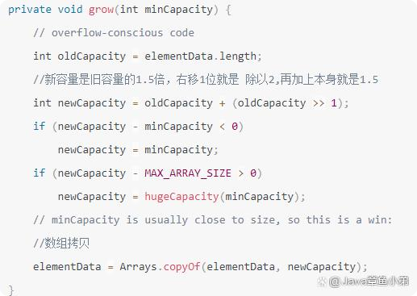
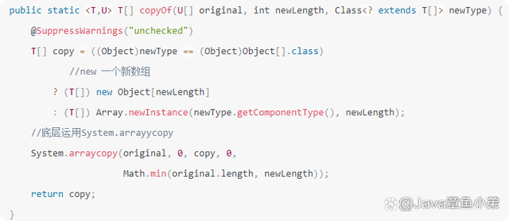
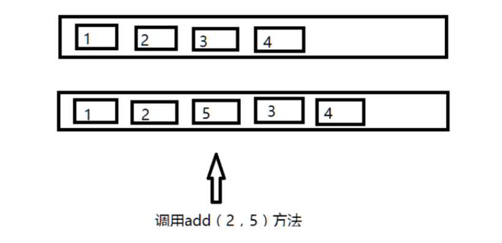
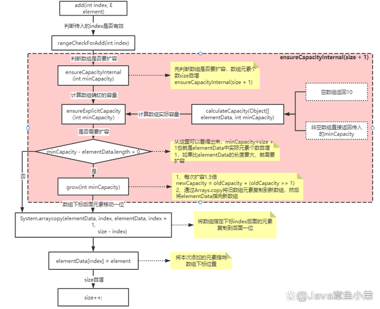

# ArrayList源码（jdk1.8）
## 基本介绍
    
    ArrayList 是最常用的 List 实现类，内部是通过数组实现的，它允许对元素进行快速随机访问。   
              数组的缺点是每个元素之间不能有间隔，当数组大小不满足时需要增加存储能力，就要将已经有数组的数据复制到新的存储空间中。  
              当从 ArrayList 的中间位置插入或者删除元素时，需要对数组进行复制、移动、代价比较高。  
              因此，它适合随机查找和遍历，不适合插入和删除。  
    ArrayList继承于AbstractList类，实现了List接口；他是一个数组队列，提供了相关的添加、删除、遍历的功能。  
    ArrayList实现了RandomAccess接口，说明其提供了随机访问的功能；RandomAccess接口是一个标记接口，     
             用以标记实现的List集合具备快速随机访问的能力。所有的List实现都支持随机访问的，只是基于基本结构的不同，     
             实现的速度不同罢了，这里的快速随机访问，那么就不是所有List集合都支持了。        
    ArrayList基于数组实现，数组带下标，可以实现常量级的随机访问，复杂度O(1).  
    LinkedList基于链表实现，随机访问需要依靠遍历实现，复杂度为O(n)  
    ArrayList实现了Serializable接口，这意味着ArrayList 支持序列化，能通过序列化去传输。  
    ArrayList实现了Cloneable接口，能被克隆。  
    其于Vector不同的是Vector是线程安全的，因此建议在单线程中才使用ArrayList，多线程中使用Vector。  
## UMl类图

## 主要参数

       public class ArrayList<E> extends AbstractList<E>
               implements List<E>, RandomAccess, Cloneable, java.io.Serializable
       {
           //序列化id
           private static final long serialVersionUID = 8683452581122892189L;
            //默认初始容量10
           private static final int DEFAULT_CAPACITY = 10;
           // 共享的空对象实例
           private static final Object[] EMPTY_ELEMENTDATA = {};
           // 用于默认大小的空实例的共享空数组实例。
           // 和上面的 EMPTY_ELEMENTDATA 区分，以知道在添加第一个元素时要膨胀多少。
           //使用默认构造函数时候调用这个
           private static final Object[] DEFAULTCAPACITY_EMPTY_ELEMENTDATA = {};
           /**
             * 保存添加到ArrayList中的元素。 
           	 * ArrayList的容量就是该数组的长度。 
           	 * 该值为DEFAULTCAPACITY_EMPTY_ELEMENTDATA 时，当第一次添加元素进入
           	 * ArrayList中时，数组将扩容值DEFAULT_CAPACITY。 
           	 * 被标记为transient，在对象被序列化的时候不会被序列化。
           */
           transient Object[] elementData; // non-private to simplify nested class access
           //ArrayList数组大小
           private int size;
            
           下面是方法。。省略！   
        } 
## 构造函数
        
    /**
     * 构造具有指定初始容量的
     */
    public ArrayList(int initialCapacity) {
        if (initialCapacity > 0) {
            //指定容量
            this.elementData = new Object[initialCapacity];
        } else if (initialCapacity == 0) {
            //如果指定容量为0，返回空ObjectEMPTY_ELEMENTDATA
            this.elementData = EMPTY_ELEMENTDATA;
        } else {
            throw new IllegalArgumentException("Illegal Capacity: "+
                                               initialCapacity);
        }
    }
    /**
     * 无参构造，不传值默认这个
     */
    public ArrayList() {
        //空数组Object[] DEFAULTCAPACITY_EMPTY_ELEMENTDATA
        this.elementData = DEFAULTCAPACITY_EMPTY_ELEMENTDATA;
    }
    //传入集合
    public ArrayList(Collection<? extends E> c) {
        elementData = c.toArray();
        //如果集合长度不是0，就复制拷贝一个指定长度的数组
        if ((size = elementData.length) != 0) {
            // c.toArray might (incorrectly) not return Object[] (see 6260652)
            if (elementData.getClass() != Object[].class)
                elementData = Arrays.copyOf(elementData, size, Object[].class);
        } else {
            // 如果数组长度==0，就返回一个空数组
            this.elementData = EMPTY_ELEMENTDATA;
        }
    }
## add方法
add方法分为两个，add(E e)一个参数和add(int index, E element)两个参数的  
> 1. add(E e)方法
执行流程图：  

说明：
   
    在第一次添加元素时，会计算数组容量
    数组可以指定容量初始化，如果没有指定或者指定容量为0，空数组的长度会在添加第一个元素时会扩大到10(默认容量是10)，如果初始化时指定数组容
    量小于10，会被设置成10，对应的源码如下
    

扩容的源码：  

数组拷贝的源码：  

       
> 2. add(int index, E element)

源码流程图：  

总结  

    1、指定下标添加元素比不指定多了一个判断下标是否有效的步骤
    2、指定下标要把下标后面元素移动一位，然后将本次添加元素指向数组下标位置；不指定下标添加直接在数组末尾追加是O(1)操作
    3、创建ArrayList时最好指定容量，减少数组频繁的扩容
    4、扩容1.5倍时如果容量太大，或者我们需要的容量太大时直接取
    (minCapacity > MAX_ARRAY_SIZE) ? Integer.MAX_VALUE : MAX_ARRAY_SIZE
    其中MAX_ARRAY_SIZE = Integer.MAX_VALUE - 8也就是2的31次幂-1 再-8

## addAll方法
两个方法：addAll(Collection<? extends E> c)和addAll(int index, Collection<? extends E> c)
> addAll(Collection<? extends E> c)
    
    public boolean addAll(Collection<? extends E> c) {
            Object[] a = c.toArray();
            int numNew = a.length;
            ensureCapacityInternal(size + numNew);  // Increments modCount
            System.arraycopy(a, 0, elementData, size, numNew);
            size += numNew;
            return numNew != 0;
        }
说明：主要涉及数组的容量扩容，新的list的大小为原数组大小+插入的集合的空间大小。  

> addAll(int index, Collection<? extends E> c)
    
    public boolean addAll(int index, Collection<? extends E> c) {
    	// 检查数组大小
            rangeCheckForAdd(index);
    
            Object[] a = c.toArray();
            int numNew = a.length;
            // 数组扩容
            ensureCapacityInternal(size + numNew);  // Increments modCount
    		// 移动的个数
            int numMoved = size - index;
            if (numMoved > 0)
            // 从传入的下标位置，原数组在index位置开始往后移
                System.arraycopy(elementData, index, elementData, index + numNew,
                                 numMoved);
    		// 插入collection
            System.arraycopy(a, 0, elementData, index, numNew);
            size += numNew;
            return numNew != 0;
        }

## get/set方法
> get(int index)
    
    public E get(int index) {
    		// 检查数组下标，大于 等于了数组大小，抛异常IndexOutOfBoundsException
            rangeCheck(index);
    		// 返回当前下标位置的元素
            return elementData(index);
        }

> set(int index, E element)

确保set的位置小于当前数组的长度（size）并且大于0，获取指定位置（index）元素，  
然后放到oldValue存放，将需要设置的元素放到指定的位置（index）上，  
然后将原来位置上的元素oldValue返回给用户。
    
    public E set(int index, E element) {
    		// 检查数组下标，大于 等于了数组大小，抛异常IndexOutOfBoundsException；确保有容量；
            rangeCheck(index);
    
            E oldValue = elementData(index);
            elementData[index] = element;
            return oldValue;
        }

## remove方法
三个个方法：remove(int index)和 remove(Object o)和removeRange(int fromIndex, int toIndex)
> remove(int index)
    
    /**
         * Removes the element at the specified position in this list.
         * Shifts any subsequent elements to the left (subtracts one from their
         * indices).
         *删除位于列表中指定位置的元素。将所有后续元素左移(从其下标减去1)。
         * @param index the index of the element to be removed
         * @return the element that was removed from the list
         * @throws IndexOutOfBoundsException {@inheritDoc}
         */
        public E remove(int index) {
        	// 检查给定的索引是否在范围内，不然则报错
            rangeCheck(index);
    		// 自增修改次数
            modCount++;
            // 将要删除的元素给oldValue
            E oldValue = elementData(index);
    		// 得到删除后，需要往左移的元素个数
            int numMoved = size - index - 1;
            if (numMoved > 0)
            	// 拷贝覆盖
                System.arraycopy(elementData, index+1, elementData, index,
                                 numMoved);
                // 清理内存空间，给GC回收
            elementData[--size] = null; // clear to let GC do its work
    		// 返回旧值
            return oldValue;
        }
说明：  
    1.先检查数组下标；  
    2.将删除的元素赋给oldValue；  
    3.找出要向左移的元素个数  
    4.进行拷贝覆盖  
    5.数组最后一位置空，方便GC回收  
    6.返回旧值  
    
> remove(Object o)
    
    public boolean remove(Object o) {
            if (o == null) {
                for (int index = 0; index < size; index++)
                    if (elementData[index] == null) {
                        fastRemove(index);
                        return true;
                    }
            } else {
                for (int index = 0; index < size; index++)
                    if (o.equals(elementData[index])) {
                        fastRemove(index);
                        return true;
                    }
            }
            return false;
        }
        
    private void fastRemove(int index) {
            modCount++;
            int numMoved = size - index - 1;
            if (numMoved > 0)
                System.arraycopy(elementData, index+1, elementData, index,
                                 numMoved);
            elementData[--size] = null; // clear to let GC do its work
        }
说明：根据对象来删除元素，分为两种情况：  
1.需要删除的对象为null的情况   
1.1：遍历判断对象是否为空，为空则调用fastRemove(index)方法进行删除；  
2.需要删除的对象不为null的情况，遍历判断得到当前数组中与删除的对象相同的值，  
  调用fastRemove(index);进行删除。

> removeRange(int fromIndex, int toIndex)
    
    // 删除下标fromIndex（包含一起删了）到toIndex（保留不删）的数据
    protected void removeRange(int fromIndex, int toIndex) {
            modCount++;
            // 得到要左移的元素个数
            int numMoved = size - toIndex;
            // 拷贝覆盖
            System.arraycopy(elementData, toIndex, elementData, fromIndex,
                             numMoved);
    
            // clear to let GC do its work
            // 从什么位置开始释放空间
            int newSize = size - (toIndex-fromIndex);
            for (int i = newSize; i < size; i++) {
                elementData[i] = null;
            }
            size = newSize;
        }
## clear()方法
    
    //从列表中删除所有元素。此调用返回后，列表将为空
    public void clear() {
            modCount++;
    		// 遍历置空，给GC回收
            // clear to let GC do its work
            for (int i = 0; i < size; i++)
                elementData[i] = null;
    
            size = 0;
        }
## 其他方法
> indexOf(Object o)

 返回列表中指定元素第一次出现的索引，如果列表中不包含该元素，则返回-1。
 更正式地，返回最低索引，如果没有这样的索引，则返回-1。
    
    /**
         * Returns the index of the first occurrence of the specified element
         * in this list, or -1 if this list does not contain the element.
         * More formally, returns the lowest index <tt>i</tt> such that
         * <tt>(o==null&nbsp;?&nbsp;get(i)==null&nbsp;:&nbsp;o.equals(get(i)))</tt>,
         * or -1 if there is no such index.
         */
        public int indexOf(Object o) {
            if (o == null) {
                for (int i = 0; i < size; i++)
                    if (elementData[i]==null)
                        return i;
            } else {
                for (int i = 0; i < size; i++)
                    if (o.equals(elementData[i]))
                        return i;
            }
            return -1;
        }
> contains(Object o)

直接调用indexOf(o)方法，得到当前对象出现的索引位置，
再与0判断大小。返回boolean 类型
    
    public boolean contains(Object o) {
            return indexOf(o) >= 0;
        }
## 总结
1）arrayList可以存放null。          
2）arrayList本质上就是一个elementData数组。  
3）arrayList区别于数组的地方在于能够自动扩展大小，其中关键的方法就是gorw()方法。  
4）arrayList中removeAll(collection c)和clear()的区别就是removeAll可以删除批量指定的元素，
        而clear是全是删除集合中的元素。  
5）arrayList由于本质是数组，所以它在数据的查询方面会很快，
    而在插入删除这些方面，性能下降很多，有移动很多数据才能达到应有的效果。   
6）arrayList实现了RandomAccess，所以在遍历它的时候推荐使用for循环。          
