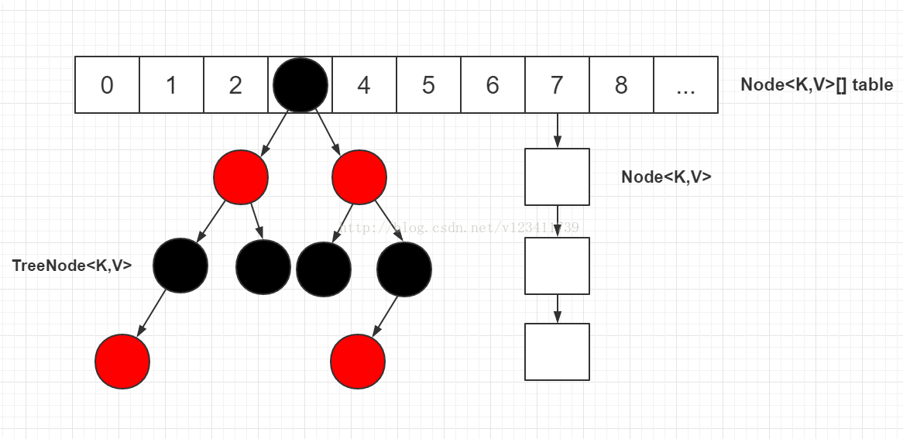
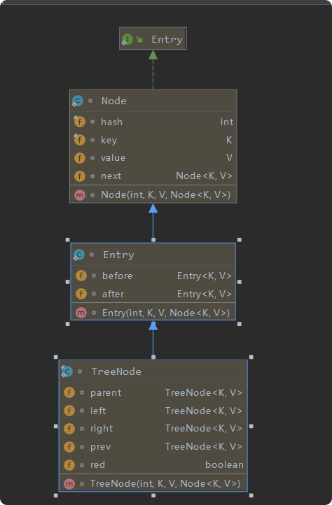
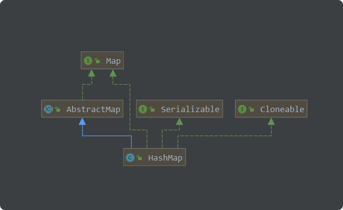
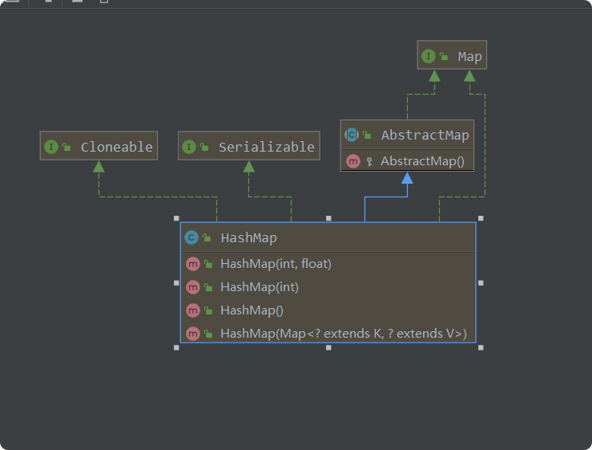
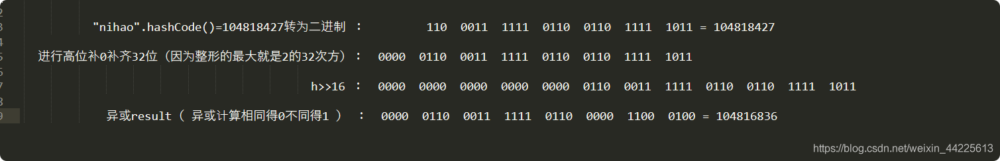
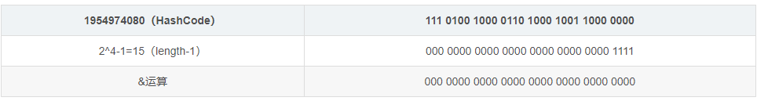
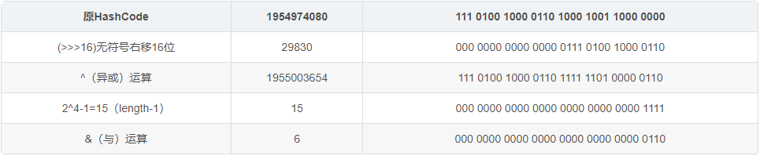

# ArrayList源码（jdk1.8）
## 基本介绍
    
    key-value形式的集合类HashMap，
    它最早出现于JDK1.2中，底层是基于散列表算法实现，HashMap允许key和value值为空。
    它是非线程安全的类，如果需要线程安全的HashMap，可以使用ConcurrentHashMap。
    
    在JDK1.8以前，HashMap使用链定址法解决冲突，但JDK1.8开始，引入了红黑树，
    具体的是，一个桶中链表长度>8时，且table数组的容量>64时，将链表拆分成红黑树，以降低查找复杂度。
       
## 数据结构

> 数组
    
     /**
         * The table, initialized on first use, and resized as
         * necessary. When allocated, length is always a power of two.
         * (We also tolerate length zero in some operations to allow
         * bootstrapping mechanics that are currently not needed.)
         */
        transient Node<K,V>[] table;
> 链表
    
     /**
         * Basic hash bin node, used for most entries.  (See below for
         * TreeNode subclass, and in LinkedHashMap for its Entry subclass.)
         */
        static class Node<K,V> implements Map.Entry<K,V> {
            final int hash;
            final K key;
            V value;
            Node<K,V> next;
    
            Node(int hash, K key, V value, Node<K,V> next) {
                this.hash = hash;
                this.key = key;
                this.value = value;
                this.next = next;
            }
    
            public final K getKey()        { return key; }
            public final V getValue()      { return value; }
            public final String toString() { return key + "=" + value; }
    
            public final int hashCode() {
                return Objects.hashCode(key) ^ Objects.hashCode(value);
            }
    
            public final V setValue(V newValue) {
                V oldValue = value;
                value = newValue;
                return oldValue;
            }
    
            public final boolean equals(Object o) {
                if (o == this)
                    return true;
                if (o instanceof Map.Entry) {
                    Map.Entry<?,?> e = (Map.Entry<?,?>)o;
                    if (Objects.equals(key, e.getKey()) &&
                        Objects.equals(value, e.getValue()))
                        return true;
                }
                return false;
            }
        }
> 红黑树
     
     
        // Tree bins
        /**
         * Entry for Tree bins. Extends LinkedHashMap.Entry (which in turn
         * extends Node) so can be used as extension of either regular or
         * linked node.
         */
        static final class TreeNode<K,V> extends LinkedHashMap.Entry<K,V> {
            TreeNode<K,V> parent;  // red-black tree links
            TreeNode<K,V> left;
            TreeNode<K,V> right;
            TreeNode<K,V> prev;    // needed to unlink next upon deletion
            boolean red;
            TreeNode(int hash, K key, V val, Node<K,V> next) {
                super(hash, key, val, next);
            }        
            ......省略.....
           }
## UMl类图

## 主要参数
	/**
     * The default initial capacity - MUST be a power of two.
     * 默认初始大小
     */
    static final int DEFAULT_INITIAL_CAPACITY = 1 << 4; // aka 16

    /**
     * The maximum capacity, used if a higher value is implicitly specified
     * by either of the constructors with arguments.
     * MUST be a power of two <= 1<<30.
     * 最大数组大小
     */
    static final int MAXIMUM_CAPACITY = 1 << 30;

    /**
     * The load factor used when none specified in constructor.
     * 加载因子
     */
    static final float DEFAULT_LOAD_FACTOR = 0.75f;

    /**
     * The bin count threshold for using a tree rather than list for a
     * bin.  Bins are converted to trees when adding an element to a
     * bin with at least this many nodes. The value must be greater
     * than 2 and should be at least 8 to mesh with assumptions in
     * tree removal about conversion back to plain bins upon
     * shrinkage.
     * 链表转红黑树阈值，当链表长度达到 8 时并且数组长度大于 MIN_TREEIFY_CAPACITY 64 时，链表转换为红黑树
     */
    static final int TREEIFY_THRESHOLD = 8;

    /**
     * The bin count threshold for untreeifying a (split) bin during a
     * resize operation. Should be less than TREEIFY_THRESHOLD, and at
     * most 6 to mesh with shrinkage detection under removal.
     * 红黑树转链表最小阈值，红黑树元素个数小于6是，红黑树转换为链表
     */
    static final int UNTREEIFY_THRESHOLD = 6;

    /**
     * The smallest table capacity for which bins may be treeified.
     * (Otherwise the table is resized if too many nodes in a bin.)
     * Should be at least 4 * TREEIFY_THRESHOLD to avoid conflicts
     * between resizing and treeification thresholds.
     * 链表转红黑树，数组最小长度
     */
    static final int MIN_TREEIFY_CAPACITY = 64;
    
    /**
     * The table, initialized on first use, and resized as
     * necessary. When allocated, length is always a power of two.
     * (We also tolerate length zero in some operations to allow
     * bootstrapping mechanics that are currently not needed.)
     * 存储元素的数组
     */
    transient Node<K,V>[] table;

    /**
     * Holds cached entrySet(). Note that AbstractMap fields are used
     * for keySet() and values().
     * 映射关系视图
     */
    transient Set<Map.Entry<K,V>> entrySet;

    /**
     * The number of key-value mappings contained in this map.
     * 存储元素的个数
     */
    transient int size;

    /**
     * The number of times this HashMap has been structurally modified
     * Structural modifications are those that change the number of mappings in
     * the HashMap or otherwise modify its internal structure (e.g.,
     * rehash).  This field is used to make iterators on Collection-views of
     * the HashMap fail-fast.  (See ConcurrentModificationException).
     * 此哈希映射在结构上被修改的次数
     */
    transient int modCount;

    /**
     * The next size value at which to resize (capacity * load factor).
     *
     * @serial
     */
    // (The javadoc description is true upon serialization.
    // Additionally, if the table array has not been allocated, this
    // field holds the initial array capacity, or zero signifying
    // DEFAULT_INITIAL_CAPACITY.)
    // 扩容阈值
    int threshold;

    /**
     * The load factor for the hash table.
     * 加载因子
     *
     * @serial
     */
    final float loadFactor;

 > tableSizeFor 方法
            
            /**
                  *    返回给定目标容量的 2 次幂。
                  * Returns a power of two size for the given target capacity.
                  */
                 static final int tableSizeFor(int cap) {
                     int n = cap - 1;
                     n |= n >>> 1;
                     n |= n >>> 2;
                     n |= n >>> 4;
                     n |= n >>> 8;
                     n |= n >>> 16;
                     return (n < 0) ? 1 : (n >= MAXIMUM_CAPACITY) ? MAXIMUM_CAPACITY : n + 1;
                 }    
## 构造函数
  
  
       /**
           * Constructs an empty <tt>HashMap</tt> with the specified initial
           * capacity and load factor.
           *
           * @param  initialCapacity the initial capacity
           * @param  loadFactor      the load factor
           * @throws IllegalArgumentException if the initial capacity is negative
           *         or the load factor is nonpositive
           */
           // 指定数组大小和加载因子
          public HashMap(int initialCapacity, float loadFactor) {
              if (initialCapacity < 0)
                  throw new IllegalArgumentException("Illegal initial capacity: " +
                                                     initialCapacity);
              if (initialCapacity > MAXIMUM_CAPACITY)
                  initialCapacity = MAXIMUM_CAPACITY;
              if (loadFactor <= 0 || Float.isNaN(loadFactor))
                  throw new IllegalArgumentException("Illegal load factor: " +
                                                     loadFactor);
              this.loadFactor = loadFactor;
              //指定阀值，数值向上取最近的2的次方（15->16,17->32）
              this.threshold = tableSizeFor(initialCapacity);
          }
             
          /**
           * Constructs an empty <tt>HashMap</tt> with the specified initial
           * capacity and the default load factor (0.75).
           *
           * @param  initialCapacity the initial capacity.
           * @throws IllegalArgumentException if the initial capacity is negative.
           */
          public HashMap(int initialCapacity) {
              this(initialCapacity, DEFAULT_LOAD_FACTOR);
          }
      
          /**
           * Constructs an empty <tt>HashMap</tt> with the default initial capacity
           * (16) and the default load factor (0.75).
           */
           // 默认指定加载因子 0.75
          public HashMap() {
              this.loadFactor = DEFAULT_LOAD_FACTOR; // all other fields defaulted
          }
      
          /**
           * Constructs a new <tt>HashMap</tt> with the same mappings as the
           * specified <tt>Map</tt>.  The <tt>HashMap</tt> is created with
           * default load factor (0.75) and an initial capacity sufficient to
           * hold the mappings in the specified <tt>Map</tt>.
           *
           * @param   m the map whose mappings are to be placed in this map
           * @throws  NullPointerException if the specified map is null
           */
           // 指定 map 初始化散列映射
          public HashMap(Map<? extends K, ? extends V> m) {
              this.loadFactor = DEFAULT_LOAD_FACTOR;
              putMapEntries(m, false);
          }      
          
## hash方法
     static final int hash(Object key) {
             int h;
             return (key == null) ? 0 : (h = key.hashCode()) ^ (h >>> 16);
      }
      
      调用hashcode方法生成的。
      进行了左移16位，然后进行异或运行形成  
          
> 源码hash计算方式

例如存放key为"nihao":
     
普通hashcode&(length-1) 和 hash(Object key)&(length-1)的区别
例如：key="abcabcabcabcabc"

    通过上边的例子我们可以得到，
    如果未进行扰动那么只要hashcode后四位为0那么无论前边28位如何变化得到的结果只会位0，  
    但是进行扰动以后情况有所不同了，显然末尾变成了0110减少了碰撞几率。
                           
总结：用hash(Object key) 方法可以减少hash碰撞
     

## get方法
	/**
     * Returns the value to which the specified key is mapped,
     * or {@code null} if this map contains no mapping for the key.
     *
     * 
More formally, if this map contains a mapping from a key
     * {@code k} to a value {@code v} such that {@code (key==null ? k==null :
     * key.equals(k))}, then this method returns {@code v}; otherwise
     * it returns {@code null}.  (There can be at most one such mapping.)
     *
     * 
A return value of {@code null} does not <i>necessarily</i>
     * indicate that the map contains no mapping for the key; it's also
     * possible that the map explicitly maps the key to {@code null}.
     * The {@link #containsKey containsKey} operation may be used to
     * distinguish these two cases.
     *
     * @see #put(Object, Object)
     */
    public V get(Object key) {
        Node<K,V> e;
        return (e = getNode(hash(key), key)) == null ? null : e.value;
    }

    /**
     * Implements Map.get and related methods
     *
     * @param hash hash for key
     * @param key the key
     * @return the node, or null if none
     */
    final Node<K,V> getNode(int hash, Object key) {
        Node<K,V>[] tab; Node<K,V> first, e; int n; K k;
        // 根据哈希值找到table中相应的桶位置，关键点在于(n - 1) & hash
        if ((tab = table) != null && (n = tab.length) > 0 && (first = tab[(n - 1) & hash]) != null) {
        
            if (first.hash == hash && // always check first node
                ((k = first.key) == key || (key != null && key.equals(k)))) {
                // tab节点node的hash和key与要查找的hash和key 相同，去除数据
                return first;
            }
             //如果第一个节点不是所求，则从所在桶的后续节点查找
            if ((e = first.next) != null) {
                //如果所在的桶已经转换成红黑树，则调用红黑树的方法查找
                if (first instanceof TreeNode) {
                	//定位数据类型为红黑树，从树种查找值
                    return ((TreeNode<K,V>)first).getTreeNode(hash, key);
                }
				
				// 遍历链表 first 后面的 node ，找到 key 值和 hash 值都相同的 node
                do {
                    if (e.hash == hash && ((k = e.key) == key || (key != null && key.equals(k)))) {
                        return e;
                    }
                } while ((e = e.next) != null);
            }
        }
        return null;
    }
> get方法总结：

    判断数组是否为空。  
    根据 key 的 hash 值和数组最大索引值进行与运算(n - 1) & hash得到索引值。  
    根据索引值判断数组该位置是否存在数据。  
    存在数据，判断 key 是否完全相同。  
    相同则直接返回数据。  
    不相同，数据类型为红黑树，则从红黑树中查找值。  
    不是红黑树，则遍历后面的链表找到 key 完全相同的数据返回。  
    
## put方法
        /**
         * Associates the specified value with the specified key in this map.
         * If the map previously contained a mapping for the key, the old
         * value is replaced.
         *
         * @param key key with which the specified value is to be associated
         * @param value value to be associated with the specified key
         * @return the previous value associated with <tt>key</tt>, or
         *         <tt>null</tt> if there was no mapping for <tt>key</tt>.
         *         (A <tt>null</tt> return can also indicate that the map
         *         previously associated <tt>null</tt> with <tt>key</tt>.)
         */
        public V put(K key, V value) {
            return putVal(hash(key), key, value, false, true);
        }
    
        /**
         * Implements Map.put and related methods
         *
         * @param hash hash for key
         * @param key the key
         * @param value the value to put
         * @param onlyIfAbsent if true, don't change existing value
         * @param evict if false, the table is in creation mode.
         * @return previous value, or null if none
         */
        final V putVal(int hash, K key, V value, boolean onlyIfAbsent,
                       boolean evict) {
            Node<K,V>[] tab; Node<K,V> p; int n, i;
            // 数组为空，进行初始化数组（这里才是初始化hashmap的地方。懒加载）
            if ((tab = table) == null || (n = tab.length) == 0) {
                n = (tab = resize()).length;
            }
            
            if ((p = tab[i = (n - 1) & hash]) == null) {
            	// tab 在 n - 1 & hash 该处的node为空，新建节点node存放在该位置
                tab[i] = newNode(hash, key, value, null);
            } else {
                Node<K,V> e; K k;
            	// tab 在 n - 1 & hash 该处的node不为空，对该处节点node进行校验
                if (p.hash == hash && ((k = p.key) == key || (key != null && key.equals(k)))) {
                	// tab节点node的hash和key与存入的hash和key 相同，取出tab中的节点node信息
                    e = p;
                } else if (p instanceof TreeNode) {
                	// tab节点类型为红黑树，以红黑树方式存储数据
                    e = ((TreeNode<K,V>)p).putTreeVal(this, tab, hash, key, value);
                } else {
    				// 循环遍历链表
                    for (int binCount = 0; ; ++binCount) {
                        if ((e = p.next) == null) {
                        	// 指针为空，新建节点node插入到链表尾部
                            p.next = newNode(hash, key, value, null);
                            
    						// 链表长度大于8，链表转换为红黑树
                            if (binCount >= TREEIFY_THRESHOLD - 1) { // -1 for 1st
                            	// treeifyBin 会判断当前数组长度小于64，则进行数组扩容；当前数组长度大于64，则链表转换红黑树
                                treeifyBin(tab, hash);
                            }
                            break;
                        }
                        
    					// 链表中查到与存入的 hash和key 相同，结束循环
                        if (e.hash == hash && ((k = e.key) == key || (key != null && key.equals(k)))) {
                            break;
                        }
                        p = e;
                    }
                }
    
    			// e 为 tab根据 hash 和 key 定位到的位置值，不为空则返回
                if (e != null) { // existing mapping for key
                    V oldValue = e.value;
                    if (!onlyIfAbsent || oldValue == null) {
                        e.value = value;
                    }
                    afterNodeAccess(e);
                    return oldValue;
                }
            }
            ++modCount;
            // 判断当前大小是否大于扩容阈值，大于则进行扩容  扩容阈值 = 初始容量 * load factor 0.75
            if (++size > threshold) {
                resize();
            }
            afterNodeInsertion(evict);
            return null;
        }
> put方法总结

      1.put 时判断数组是否存在，不存在则调用resize()进行初始化创建默认大小为16的数组。
      2.根据 key 的 hash 值和数组最大索引值进行与运算得到索引值。
      3.根据索引值获取该位置是否有元素，没有则新建 node 放进该位置。
      4.有则判断 key 是否完全相同，相同则将原 node 赋值给一个变量。
      5.key 不相同，判断该位置数据类型是红黑树还是链表。
      6.红黑树类型则以红黑树方式将 node 放在红黑树上。
      7.链表则遍历链表，将 node 放在最后一位（尾插法）。放完后判断链表长度是否超过8，
        超过则进入 treeifyBin() 方法（当前数组长度小于64，则进行数组扩容；当前数组长度大于64，则链表转换红黑树）。
      8.返回被覆盖的值。
      9.判断数组是否需要进行扩容。
   
## resize 扩容
    /**
         * Initializes or doubles table size.  If null, allocates in
         * accord with initial capacity target held in field threshold.
         * Otherwise, because we are using power-of-two expansion, the
         * elements from each bin must either stay at same index, or move
         * with a power of two offset in the new table.
         *
         * @return the table
         */
        final Node<K,V>[] resize() {
            // 旧数组
            Node<K,V>[] oldTab = table;
            // 旧数组长度
            int oldCap = (oldTab == null) ? 0 : oldTab.length;
            // 旧数组扩容阈值
            int oldThr = threshold;
            // 新数组长度、扩容阈值
            int newCap, newThr = 0;
    
    		// 旧数组不为空
            if (oldCap > 0) {
            	// 旧数组超过最大长度 1 << 30
                if (oldCap >= MAXIMUM_CAPACITY) {
                    threshold = Integer.MAX_VALUE;
                    return oldTab;
                }
    			
    			// 新数组长度为旧数组长度的两倍 
                else if ((newCap = oldCap << 1) < MAXIMUM_CAPACITY &&
                         oldCap >= DEFAULT_INITIAL_CAPACITY) {
                    // 新数组扩容阈值为旧数组扩容阈值的两倍
                    newThr = oldThr << 1; // double threshold
                }
            }
            else if (oldThr > 0) { // initial capacity was placed in threshold
                newCap = oldThr;
            } else {               // zero initial threshold signifies using defaults
            	// 数组初始默认长度 16
                newCap = DEFAULT_INITIAL_CAPACITY;
                // 初始扩容阈值 = 0.75 * 数组长度 16
                newThr = (int)(DEFAULT_LOAD_FACTOR * DEFAULT_INITIAL_CAPACITY);
            }
            if (newThr == 0) {
            	// 新数组扩容阈值为空，设置新数组扩容阈值 = 新数组长度 * 加载因子
                float ft = (float)newCap * loadFactor;
                newThr = (newCap < MAXIMUM_CAPACITY && ft < (float)MAXIMUM_CAPACITY ?
                          (int)ft : Integer.MAX_VALUE);
            }
            threshold = newThr;
    
    		// 构建新数组
            @SuppressWarnings({"rawtypes","unchecked"})
                Node<K,V>[] newTab = (Node<K,V>[])new Node[newCap];
            table = newTab;
            // 旧数组不为空，将旧数组数据迁移到新数组
            if (oldTab != null) {
            	// 遍历旧数组
                for (int j = 0; j < oldCap; ++j) {
                    Node<K,V> e;
                    if ((e = oldTab[j]) != null) {
                        oldTab[j] = null;
                        if (e.next == null) {
                        	// node 无链表，直接放在新表的e.hash & (newCap - 1)位置
                            newTab[e.hash & (newCap - 1)] = e;
                        } else if (e instanceof TreeNode) {
                        	// node 为红黑树，遍历红黑树重新计算新数组红黑树中的位置，与链表类似
                        	// 红黑树中会计算树中元素是否小于最小树形化阈值UNTREEIFY_THRESHOLD 6，小于则将红黑树转换为链表
                            ((TreeNode<K,V>)e).split(this, newTab, j, oldCap);
                        } else { // preserve order
                        	// node 为链表类型，遍历链表重新计算在新数组链表中的位置
                        	// 偶数队链表
                            Node<K,V> loHead = null, loTail = null;
                            // 奇数队链表
                            Node<K,V> hiHead = null, hiTail = null;
                            // 链表下一元素
                            Node<K,V> next;
                            do {
                                next = e.next;
                                if ((e.hash & oldCap) == 0) {
                                    if (loTail == null) {
                                        loHead = e;
                                    } else {
                                        loTail.next = e;
                                    }
                                    loTail = e;
                                }
                                else {
                                    if (hiTail == null) {
                                        hiHead = e;
                                    } else {
                                        hiTail.next = e;
                                    }
                                    hiTail = e;
                                }
                            } while ((e = next) != null);
    						
    						// 偶数队链表放在新数组的原位置
                            if (loTail != null) {
                                loTail.next = null;
                                newTab[j] = loHead;
                            }
    
    						// 奇数队链表放在新数组的 j + oldCap 位置
                            if (hiTail != null) {
                                hiTail.next = null;
                                newTab[j + oldCap] = hiHead;
                            }
                        }
                    }
                }
            }
            return newTab;
        }
>resize方法总结:        
    
    1.判断原数组是否为空。
    2.原数组不为空并且长度已超过最大长度 1 << 30，直接返回原数组不进行扩容操作。  
    3.原数组不为空，长度未超过最大长度，新数组长度和扩容阈值为原数组的长度和扩容阈值的两倍。
    4.原数组为空，未指明初始大小，默认大小为 16，扩容阈值为数组长度 * 加载因子。
    5.根据计算的新数组长度构建新数组。
    7.原数组不为空，遍历原数组，将原数组数据迁移到新数组。
    8.原数组 node 无链表，根据 hash 值和新数组最大长度计算索引值，放在新数组上。
    9.原数组 node 为红黑树，遍历红黑树重新计算新数组红黑树中的位置，与链表类似，
        红黑树中会计算树中元素是否小于最小树形化阈值UNTREEIFY_THRESHOLD 6，小于则将红黑树转换为链表。
    10.原数组 node 链表，遍历链表重新计算在新数组链表中的位置，
        将链表分为奇偶两队链表，
        偶数队链表放在新数组的原位置，
        奇数队链表放在新数组的 j + oldCap 位置。
  
## 总结
   