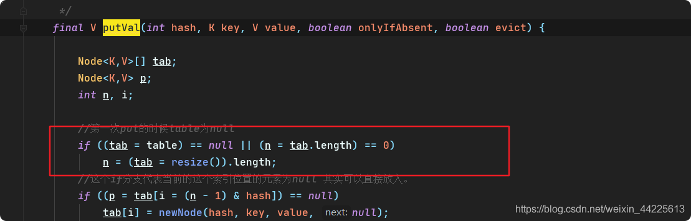
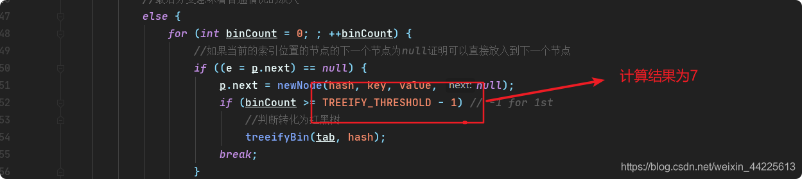
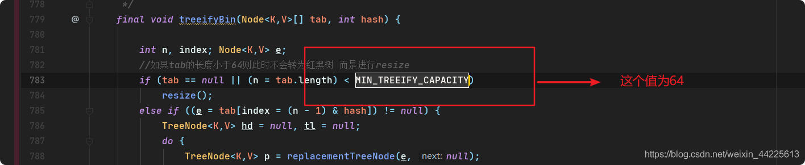
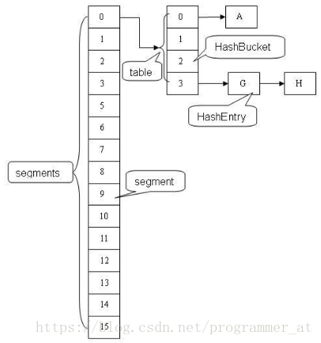
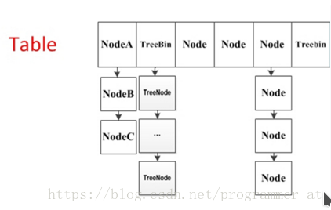

# 常见问题
## 线程安全的集合有哪些？线程不安全的呢？
    
    线程安全的：
        Hashtable：比HashMap多了个线程安全。
        ConcurrentHashMap:是一种高效但是线程安全的集合。
        Vector：比Arraylist多了个同步化机制。
        Stack：栈，也是线程安全的，继承于Vector。
    线性不安全的：
        HashMap
        Arraylist
        LinkedList
        HashSet
        TreeSet
        TreeMap    
## ArrayList和LinkedList的异同？
    **相同:线程都不安全； **
    **不同:ArrayList 增删改慢（要移动数据），查询快（直接get（index）） **
    **     LinkedList 增删改快，查询慢（移动指针/遍历） **
   
          
    是否保证线程安全： 
        ArrayList 和 LinkedList 都是不同步的，也就是不保证线程安全；
    底层数据结构： 
        Arraylist 底层使用的是Object数组；
        LinkedList 底层使用的是双向循环链表数据结构；
    插入和删除是否受元素位置的影响： 
        ArrayList 采用数组存储，所以插入/删除元素的时间复杂度受元素位置的影响。 
            (插入/删除要移动，所以慢)
            1.执行add(E e)方法的时候， 
            ArrayList 会默认在将指定的元素追加到此列表的末尾，这种情况时间复杂度就是O(1)。
            2.如果要在指定位置 i 插入和删除元素的话（add(int index, E element)）
            时间复杂度就为 O(n-i)。
            因为在进行上述操作的时候集合中第 i 和第 i 个元素之后的(n-i)个元素都要执行向后位/向前移一位的操作。
        LinkedList 采用链表存储，
            （插入/删除不移动指针，所以快）
            所以插入/删除元素时间复杂度不受元素位置的影响，都是近似 O（1）而数组为近似 O（n）。
    是否支持快速随机访问： 
        LinkedList(慢) 不支持高效的随机元素访问，
        ArrayList(快)  实现了RandmoAccess 接口，所以有随机访问功能。
                        快速随机访问就是通过元素的序号快速获取元素对象(对应于get(int index)方法)。            
    内存空间占用： 
        ArrayList的空间浪费主要体现在在list列表的结尾会预留一定的容量空间，
        LinkedList的空间浪费则体现在它的每一个元素都需要消耗比ArrayList更多的空间
        （因为要存放直接后继和直接前驱以及数据）。
## ArrayList 与 Vector 区别？
    **Vector线程安全，扩容增加1倍，ArrayList线程不安全，扩容增加0.5倍**
    线程安全：
        Vector是线程安全的，Vector在关键性的方法前面都加了synchronized关键字()比如add()方法，来保证线程的安全性。
        ArrayList不是线程安全的。
        如果有多个线程会访问到集合，那最好是使用 Vector，因为不需要我们自己再去考虑和编写线程安全的代码。
    扩容：
        ArrayList在底层数组不够用时在原来的基础上扩展0.5倍（增加0.5倍），
        Vector是扩展1倍（增加1倍），这样ArrayList就有利于节约内存空间。
## ArrayList的扩容机制？
    **grow()方法增加0.5倍**
    ArrayList扩容的本质就是计算出新的扩容数组的size后实例化，grow()方法进行扩容
    并将原有数组内容复制到新数组中去。默认情况下，新的容量会是原容量的1.5倍（增加0.5倍）。
以JDK1.8为例说明:  

    public boolean add(E e) {
         //判断是否可以容纳e，若能，则直接添加在末尾；若不能，则进行扩容，然后再把e添加在末尾
         ensureCapacityInternal(size + 1);  // Increments modCount!!
         //将e添加到数组末尾
         elementData[size++] = e;
         return true;
         }
     
     // 每次在add()一个元素时，arraylist都需要对这个list的容量进行一个判断。
     //通过ensureCapacityInternal()方法确保当前ArrayList维护的数组具有存储新元素的能力，
     //经过处理之后将元素存储在数组elementData的尾部
     
     private void ensureCapacityInternal(int minCapacity) {
           ensureExplicitCapacity(calculateCapacity(elementData, minCapacity));
     }
     
     private static int calculateCapacity(Object[] elementData, int minCapacity) {
             //如果传入的是个空数组则最小容量取默认容量与minCapacity之间的最大值
             if (elementData == DEFAULTCAPACITY_EMPTY_ELEMENTDATA) {
                 return Math.max(DEFAULT_CAPACITY, minCapacity);
             }
             return minCapacity;
         }
         
       private void ensureExplicitCapacity(int minCapacity) {
             modCount++;
             // 若ArrayList已有的存储能力满足最低存储要求，则返回add直接添加元素；如果最低要求的存储能力>ArrayList已有的存储能力，
             //这就表示ArrayList的存储能力不足，因此需要调用 grow();方法进行扩容
             if (minCapacity - elementData.length > 0)
                 grow(minCapacity);
         }
     
     
     private void grow(int minCapacity) {
             // 获取elementData数组的内存空间长度
             int oldCapacity = elementData.length;
             // 扩容至原来的1.5倍
             int newCapacity = oldCapacity + (oldCapacity >> 1);
             //校验容量是否够
             if (newCapacity - minCapacity < 0)
                 newCapacity = minCapacity;
             //若预设值大于默认的最大值，检查是否溢出
             if (newCapacity - MAX_ARRAY_SIZE > 0)
                 newCapacity = hugeCapacity(minCapacity);
             // 调用Arrays.copyOf方法将elementData数组指向新的内存空间
              //并将elementData的数据复制到新的内存空间
             elementData = Arrays.copyOf(elementData, newCapacity);
         }
## hashMap jdk1.7和1.8区别
    **1.8红黑树、头插法尾插法**
    1.底层结构：hashmap1.7底层结构是数组+链表，hashmap1.8底层结构是数组+链表+红黑树 
    2.扩容策略：1.8会保持原链表的顺序并且在元素插入后检测是否需要扩容（尾插法），
                1.7会颠倒链表的顺序并且在元素插入前检测是否需要扩容（头插法）   
                这也是为什么1.8不容易出现环型链表的原因
## hashmap线程不安全的地方在哪儿   
      **数据丢失、1.7循环列表、put 非null get 为 null** 
       1.数据丢失（多线程操作，相同key的hash值相同，会被覆盖）
           在put的过程中，会根据key计算hash值，找到数组中的位置，然后会进行非空判断，如果不存在值就插入。
           这里如果是多线程的操作，多个key具有相同的hash值，那么有的值就会被覆盖，导致数据丢失。
           
       2.jdk1.7循环列表（多线程扩容死循环）1.7中会产生循环链表（并发过程中头插法，
           next指针来回指向就出现了循环链表）
       3.可能会造成put非null元素后get出来的却是null，在transfer那一块的代码里面，遍历元素，
            
## hashMap中数组的创建和初始化是一开始进行的吗？
    
    hashmap中的数组不是new的时候创建的，
    而是在第一次put的时候做的初始化使用懒加载的方式，
    节省了空间。如图：

## hashmap什么时候会触发扩容？
     **16*0.75**
    当hashMap的容量达到最大容量值* 负载因子。
    这个容量是指数组的容量（16*0.75）
## hashMap扩容时候，每个entry都要重新计算一次hash吗？
      **1.7要，1.8不要**
      在1.7中是需要进行重新hash
      在1.8中做了优化，只需要看原来的hash值在扩容之后新增的那一位是0还是1,
      0的话数组索引没变，是1的话索引变成原索引+原来数组大小 
      其实结果一样：一种就是原来位置；另一种就是原始长度+原来位置   
## hashMap转换成红黑树的条件
    **链表大于8，数组大于64**
    两个条件，
    一个是链表的长度大于8，
    一个是数组的长度大于64这个
    源码中的表现：

## haspMap为什么转为红黑树的链表长度要大于8？
    **泊松分布算法，第8个 0.00000006**
    因为这是根据一个理论基础叫泊松分布，
    泊松分布用于描述单位时间（或空间）内随机事件发生的次数。
    我们可以看到jdk源码中有这么一段注释
    
    * Because TreeNodes are about twice the size of regular nodes, we
         * use them only when bins contain enough nodes to warrant use
         * (see TREEIFY_THRESHOLD). And when they become too small (due to
         * removal or resizing) they are converted back to plain bins.  In
         * usages with well-distributed user hashCodes, tree bins are
         * rarely used.  Ideally, under random hashCodes, the frequency of
         * nodes in bins follows a Poisson distribution
         * (http://en.wikipedia.org/wiki/Poisson_distribution) with a
         * parameter of about 0.5 on average for the default resizing
         * threshold of 0.75, although with a large variance because of
         * resizing granularity. Ignoring variance, the expected
         * occurrences of list size k are (exp(-0.5) * pow(0.5, k) /
         * factorial(k)). The first values are:
         *
         * 0:    0.60653066
         * 1:    0.30326533
         * 2:    0.07581633
         * 3:    0.01263606
         * 4:    0.00157952
         * 5:    0.00015795
         * 6:    0.00001316
         * 7:    0.00000094
         * 8:    0.00000006
         * more: less than 1 in ten million
         
     意思就是说：
    其实链表在加载因子位0.75的情况发生树化的概率仅为0.00000006这个概率是极为低下的，
    也就是说在大多数的情况下我们的链表都不会转为红黑树。
    通常如果 hash 算法正常的话，那么链表的长度也不会很长，
    那么红黑树也不会带来明显的查询时间上的优势，反而会增加空间负担。所以通常情况下，并没有必要转为红黑树，
    所以就选择了概率非常小，小于千万分之一概率，也就是长度为 8 的概率，把长度 8 作为转化的默认阈值。
    
    所以如果平时开发中发现 HashMap 或是 ConcurrentHashMap 内部出现了红黑树的结构，
    这个时候往往就说明我们的哈希算法出了问题，需要留意是不是我们实现了效果不好的 hashCode 方法，
    并对此进行改进，以便减少冲突。
## hashMap为什么要采用链表转为红黑树的方式进行存储？
   
    **为了提高查询的性能**
    正常情况下如果我们要查询的数据在链表的最后边那么我们需要从前向后的依次进行遍历，直到找到对应元素，
    这样的话我们的时间复杂度便是o(n),但是我们如果采用了红黑树这种结果的话，
    他是一种近似平衡二叉树，也就是左节点要比根节点小，右子节点比根节点大，
    所以此时的查找的时间复杂度位O(logn)。

## haspMap为什么要用红黑树
      **空间换时间，查找快**
      红黑树是一个自平衡的二叉查找树，也就是说红黑树的查找效率是非常的高，查找效率会从链表的o(n)降低为o(logn)。
      首先说一说转换为红黑树的必要性：红黑树的插入、删除和遍历的最坏时间复杂度都是O(log(n))，而只使用单链表的时间复杂度是O(n)。因此，意外的情况或者恶意使用下导致hashCode()方法的返回值很差时，性能的下降将会是"优雅"的，只要Key具有可比性。
      TreeNodes的大小是常规Nodes的两倍，所以只有桶中包含足够多的元素以供使用时，我们才会使用树。所以总体上来说还是空间换时间。
> a. 为什么在解决hash冲突的时候，不直接用红黑树?而选择先用链表，再转红黑树?
      
      **数据不多的时候：链表查询快，到了临界值，红黑树就快**  
      构造红黑树要比构造链表复杂，在链表的节点不多的时候，从整体的性能看来， 数组+红黑树的结构可能不一定比数组+链表的结构性能高。就好比杀鸡焉用牛刀的意思。
      HashMap频繁的扩容，会造成底部红黑树不断的进行拆分和重组，这是非常耗时的。因此，也就是链表长度比较长的时候转变成红黑树才会显著提高效率。
> b.我不用红黑树，用二叉查找树可以么?
      
      **二叉树的缺陷是：容易形成链表**
      之所以选择红黑树是为了解决二叉查找树的缺陷，二叉查找树在特殊情况下会变成一条线性结构（这就跟原来使用链表结构一样了，造成树很深的问题），遍历查找会非常慢。
      而红黑树在插入新数据后可能需要通过左旋，右旋、变色这些操作来保持平衡，引入红黑树就是为了查找数据快，解决链表查询深度的问题。
      但与此同时，红黑树的插入、拆分和重组相比于二叉查找树更耗时。
> c. 为什么使用红黑树而不使用AVL树
      
      **用AVL树开销太大**
      红黑树和AVL树（平衡二叉搜索树）的区别：
      AVL树是更加严格的平衡，因此可以提供更快的查找速度，一般读取查找密集型任务，适用AVL树。
      红黑树更适合于插入修改密集型任务。
      通常，AVL树的旋转比红黑树的旋转更加难以平衡和调试。
      原因总结：
      AVL以及红黑树是高度平衡的树数据结构。它们非常相似，真正的区别在于在任何添加/删除操作时完成的旋转操作次数。
      两种实现都缩放为O(logN)，其中N是叶子的数量，但实际上AVL树在查找密集型任务上更快：利用更好的平衡，树遍历平均更短。另一方面，插入和删除方面，AVL树速度较慢：需要更高的旋转次数才能在修改时正确地重新平衡数据结构。
      在AVL树中，从根到任何叶子的最短路径和最长路径之间的差异最多为1。在红黑树中，差异可以是2倍。
      两个都O(log N)查找，但平衡AVL树可能需要O(logN)旋转，而红黑树将需要最多两次旋转使其达到平衡（尽管可能需要检查O(logN)节点以确定旋转的位置）。旋转本身是O(1)操作，因为你只是移动指针。
   
## 红黑树的五条规则 ？    
    1.每个节点或者是黑色，或者是红色。
    2.根节点是黑色。
    3.每个叶子节点（NIL）是黑色。 [注意：这里叶子节点，是指为空(NIL或NULL)的叶子节点！]
    4.如果一个节点是红色的，则它的子节点必须是黑色的。
    5.从一个节点到该节点的子孙节点的所有路径上包含相同数目的黑节点。
        
## ConcurrentHashMap jdk1.7和1.8的区别)
内容|jdk1.7|jdk1.8
----|----|----|
存储结构|数组+链表|数组+链表+红黑树
结构图||
同步机制|分段锁，每个segment继承ReentrantLock|CAS + synchronized保证并发更新
键值对|HashEntry|Node  
put操作|多个线程同时竞争获取同一个segment锁，获取成功的线程更新map；  失败的线程尝试多次获取锁仍未成功，则挂起线程，等待释放锁|访问相应的bucket时，使用sychronizeded关键字，防止多个线程同时操作同一个bucket，如果该节点的hash不小于0，则遍历链表更新节点或插入新节点；如果该节点是TreeBin类型的节点，说明是红黑树结构，则通过putTreeVal方法往红黑树中插入节点；更新了节点数量，还要考虑扩容和链表转红黑树
size实现|统计每个Segment对象中的元素个数，然后进行累加，但是这种方式计算出来的结果并不一样的准确的。先采用不加锁的方式，连续计算元素的个数，最多计算3次：如果前后两次计算结果相同，则说明计算出来的元素个数是准确的；如果前后两次计算结果都不同，则给每个Segment进行加锁，再计算一次元素的个数；	|通过累加baseCount和CounterCell数组中的数量，即可得到元素的总个数；

## ConcurrentHashMap的五中节点？
    **Node、TreeBin、TreeNode、ForwrdingNode、ReservationNode**
    1、Node：连接着一个链表。
    2、TreeBin：红黑树的顶级节点，hash值固定为-1，
           TreeBin连接着一个红黑树，红黑树节点时TreeNode，
           TreeBin指向红黑树的根节点。
    3、TreeNode：红黑树中存储数据的节点。
    4、ForwrdingNode：辅助节点，临时节点，hash值固定为-1，
        在扩容进行的时候才会出现，相当于一个占位节点。扩容的时候，
        当table数组一个hash桶的节点全部迁移到新数组之后，
        原table数组的桶中会被放置一个ForwrdingNode节点。
    
    5、ReservationNode：保留节点，占位符。hash值固定为-3。
      在加锁的时候会用到ReservationNode起到占位符的作用。
## ConcurrentHashMap的红黑树桶的顶级节点是TreeBin，而不是TreeNode？
    **TreeBin封装，添加数据要旋转TreeNode主节点会变,不能枷锁**
    1、红黑树的操作比较复杂，有左旋、右旋等等，
       ConcurrentHashMap使用TreeBin作为红黑树的代理节点封装了这些操作，
          这是一种职责分离的思想，降低了TreeNode的复杂度。
    2、红黑树删除和添加结点的时候，会有一个平衡的过程。根节点变成孩子节点，孩子节点可能变成根节点。
       如果以TreeNode作为红黑树的顶级节点，由于插入和删除时根节点的不确定性，
       就不可能通过在顶级节点加同步锁来实现线程安全。
## ConcurrentHashMap的get方法是否要加锁，为什么？
    **unsafe方法**
    不需要，get方法采用了unsafe方法，来保证线程安全。
## ConcurrentHashMap是如何扩容的？
    **1.7对segment下的hashMap扩容2倍,1.8是生成2倍大的数组，然后数据迁移（transfer方法）**
    JDK7中对每一段segment（segment大小固定）进行扩容，每一段segment的扩容跟HashMap保持一致
    JDK8首先会生成一个双倍大小的数组，生成完数组后，线程就会开始转移元素，
    在扩容的过程中，如果有其他线程在put，那么这个put线程会帮助去进行元素的转移（helpTransfer方法），
    虽然叫转移，但是其实是基于原数组上的Node信息去生成一个新的Node的，也就是原数组上的Node不会消失，
    因为在扩容的过程中，如果有其他线程在get也是可以的。
## ConcurrentHashMap中的 sizeCtl参数？
     sizeCtl=0  默认状态，表示数组还没有被初始化。
     sizeCtl=-1  占位符，表示当前正在初始化数组。
     sizeCtl<-1  表示有 N-1 个线程正在执行扩容操作，如 -2 就表示有 2-1 个线程正在扩容。
     sizeCtl>0  记录下一次需要扩容的大小。
## ConcurrentHashMap中的是怎么保证写数据安全的？    
    **自旋锁+cas+sunchronized+分段锁**            
    
       