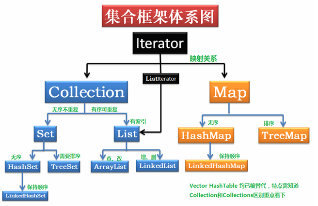
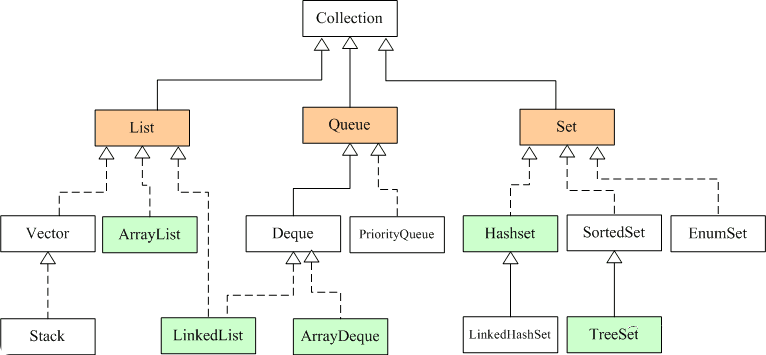
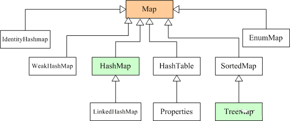
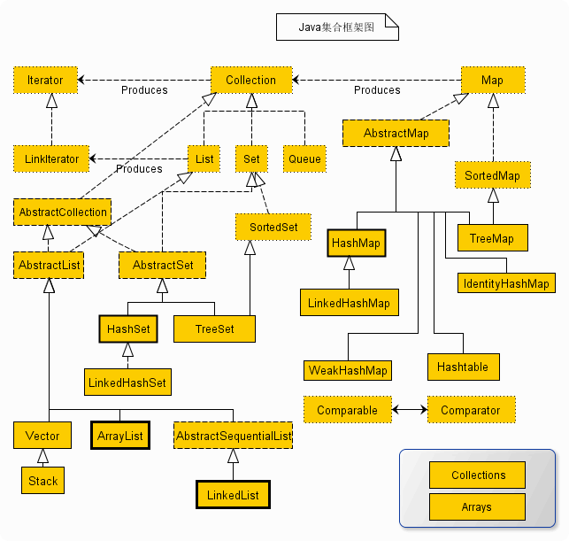

## java集合概述

**Java 集合可分为 Collection 和 Map 两种体系**
       
        Collection接口：单列数据，定义了存取一组对象的方法的集合
            List：元素有序(指的是存储时，与存放顺序保持一致)、可重复的集合
            Set：元素无序、不可重复的集合 
        Map接口：双列数据，保存具有映射关系“key-value对”的集合                    
**注意：Collection是一个接口，Collections是一个工具类，Map不是Collection的子接口**
  

 

    图中，
    List代表了有序可重复集合，可直接根据元素的索引来访问；
    Set代表无序不可重复集合，只能根据元素本身来访问；
    Queue是队列集合。
    Map代表的是存储key-value对的集合，可根据元素的key来访问value。
    上图中淡绿色背景覆盖的是集合体系中常用的实现类，
    分别是ArrayList、LinkedList、ArrayQueue、HashSet、TreeSet、HashMap、TreeMap等实现类。
## 集合体系

我们发现,无论是Set和List都是继承于Collection接口,实现Collection之中的方法,        
        **而他们又衍生出了HashSet,LinkedList等等我们经常使用的数据结构. **       
          
但是真相并不是如此的简单.       
**对于Collection接口的实现,其实是由AbstractCollection类完成的.**  

Collection中需要实现的的方法:
    
     boolean add(E o) 确保此 collection 包含指定的元素（可选操作）。 
     boolean addAll(Collection<? extends E> c) 
              将指定 collection 中的所有元素都添加到此 collection 中（可选操作）。 
     void clear() 
              移除此 collection 中的所有元素（可选操作）。 
     boolean contains(Object o) 
              如果此 collection 包含指定的元素，则返回 true。 
     boolean containsAll(Collection<?> c) 
              如果此 collection 包含指定 collection 中的所有元素，则返回 true。 
     boolean equals(Object o) 
              比较此 collection 与指定对象是否相等。 
     int hashCode() 
              返回此 collection 的哈希码值。 
     boolean isEmpty() 
              如果此 collection 不包含元素，则返回 true。 
     Iterator<E> iterator() 
              返回在此 collection 的元素上进行迭代的迭代器。 
     boolean remove(Object o) 
              从此 collection 中移除指定元素的单个实例，如果存在的话（可选操作）。 
     boolean removeAll(Collection<?> c) 
              移除此 collection 中那些也包含在指定 collection 中的所有元素（可选操作）。 
     boolean retainAll(Collection<?> c) 
              仅保留此 collection 中那些也包含在指定 collection 的元素（可选操作）。 
     int size() 
              返回此 collection 中的元素数。 
     Object[] toArray() 
              返回包含此 collection 中所有元素的数组。 
    <T> T[] toArray(T[] a) 
              返回包含此 collection 中所有元素的数组；返回数组的运行时类型与指定数组的运行时类型相同。
              
AbstractCollection类实现的方法:  

    
     boolean add(E o) 
              确保此 collection 包含指定的元素（可选操作）。 
     boolean addAll(Collection<? extends E> c) 
              将指定 collection 中的所有元素添加到此 collection 中（可选操作）。 
     void clear() 
              从此 collection 中移除所有元素（可选操作）。 
     boolean contains(Object o) 
              如果此 collection 包含指定的元素，则返回 true。 
     boolean containsAll(Collection<?> c) 
              如果此 collection 包含指定 collection 中的所有元素，则返回 true。 
     boolean isEmpty() 
              如果此 collection 不包含元素，则返回 true。 
     abstract  Iterator<E> iterator() 
              返回在此 collection 中的元素上进行迭代的迭代器。 
     boolean remove(Object o) 
              从此 collection 中移除指定元素的单个实例（如果存在）（可选操作）。 
     boolean removeAll(Collection<?> c) 
              从此 collection 中移除包含在指定 collection 中的所有元素（可选操作）。 
     boolean retainAll(Collection<?> c) 
              仅在此 collection 中保留指定 collection 中所包含的元素（可选操作）。 
    abstract  int size() 
              返回此 collection 中的元素数。 
     Object[] toArray() 
              返回包含此 collection 中所有元素的数组。 
    <T> T[] toArray(T[] a) 
              返回包含此 collection 中所有元素的数组；返回数组的运行时类型是指定数组的类型。 
     String toString() 
              
除了了一个hashcode方法,AbstractCollection类实现了几乎所有的功能.  

## 完整构建图

