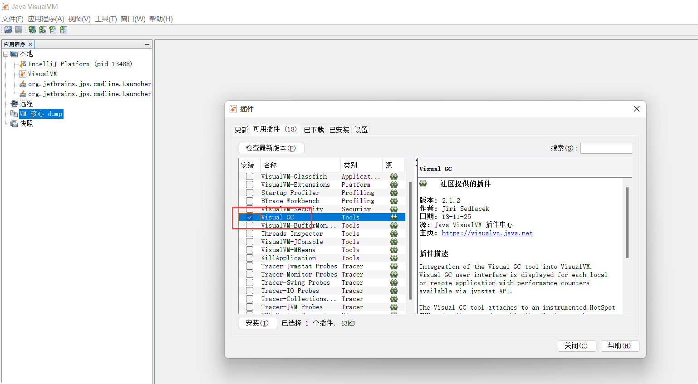
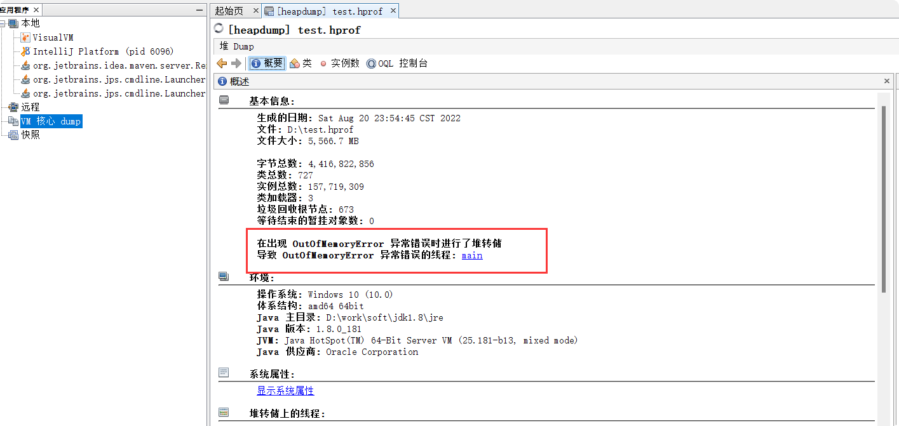
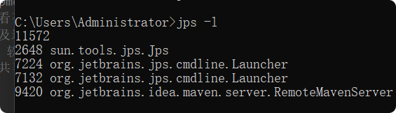

# 调优工具

## Jdk-VisualVM
> 描述：
 
       VisualVM 是一个工具，它提供了一个可视界面，用于查看 Java 虚拟机 (Java Virtual Machine, JVM) 
       上运行的基于 Java 技术的应用程序(Java 应用程序)的详细信息。
       VisualVM 对 Java Development Kit (JDK) 工具所检索的 JVM 软件相关数据进行组织，
       并通过一种使您可以快速查看有关多个 Java 应用程序的数据的方式提供该信息。
       您可以查看本地应用程序以及远程主机上运行的应用程序的相关数据。
       此外，还可以捕获有关 JVM 软件实例的数据，并将该数据保存到本地系统，
       以供后期查看或与其他用户共享。
> 运用    
 
    cmd -> 运行jvisualvm ->工具 -> 插件->选择Visual GC
    
    若报：无法连接Java VisualVM 插件中心, 因为Server returned HTTP response code: 503 for URL: http://www.oracle.com。
    这是插件中心地址错误问题，请参考：[https://blog.csdn.net/xionglangs/article/details/77603343](https://blog.csdn.net/xionglangs/article/details/77603343)
    

> 分析dump文件

## jps

jps：JVM Process Status Tool jps可以查看Java进程，相当于Linux下的ps命令，只不过它只列出Java进程。  
使用语法:
    
    jps：列出Java程序进程ID和Main函数名称
    jps -q：只输出进程ID
    jps -m：输出传递给Java进程（主函数）的参数
    jps -l：输出主函数的完整路径
    jps -v：显示传递给Java虚拟的参数
    
例子：

## idea-JPofiler

## YourKit

## 