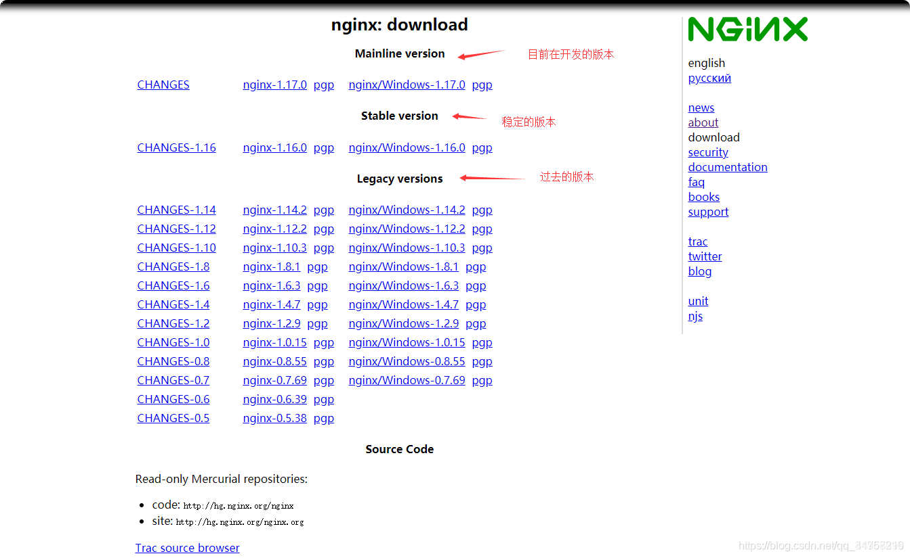
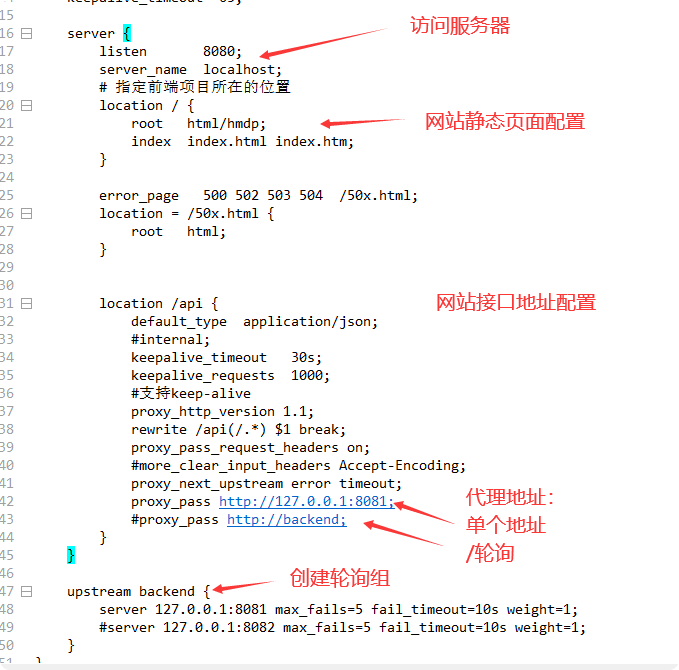
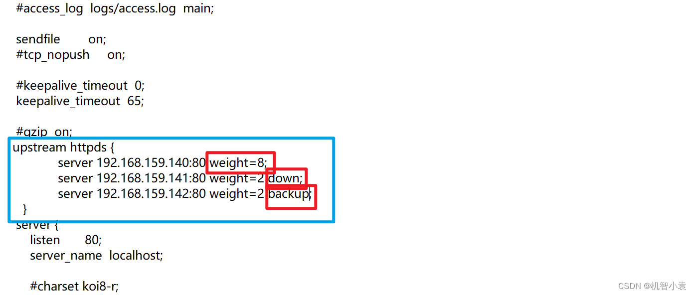

# Nginx

## windows安装
### 下载
下载地址：http://nginx.org/en/download.html
    

### 命令

- **开启Nginx**：start nginx或者nginx.exe

- **关闭Nginx**：nginx.exe -s stop 或者nginx.exe -s quit  

注：stop是快速停止nginx，可能并不保存相关信息；quit是完整有序的停止nginx，并保存相关信息。

## 配置静态页面

    server {
        listen 8092;      # nginx 监听端口      
        server_name 192.168.1.73 localhost;  #服务器地址 
      
        location / {
            root E:/nginx-1.15.0/cx;  #静态html文件存放目录地址
            index index.html index.htm;   #默认首页
        }
    }

> 示例
    
    server {
       listen  7100;
       server_name localhost;
       location / {
            return 444;
       }    
    }
      
    server {
       listen  7200;
       server_name localhost;
       location / {
           root D:/software/worksoft/nginx-1.18.0/html;
           index 1.html;
       }    
    }

## 反向代理与轮询
找到nginx.conf文件

### 如果希望有比重的话

- 负载均衡的几个配置：
    - 权重：weight=10
    - 停用：down
    - 备用：backup
这几个配置都是加在**upstream**里的ip后面例如：  

此时：就会根据配置去负载均衡。  

## 配置示例
    
    
    
    worker_processes  1;
    
    events {
        worker_connections  1024;
    }
    
    http {
        include       mime.types;
        default_type  application/json;
    
        sendfile        on;
        
        keepalive_timeout  65;
    
        server {
            listen       8080;
            server_name  localhost;
            # 指定前端项目所在的位置
            location / {
                root   html/hmdp;
                index  index.html index.htm;
            }
    
            error_page   500 502 503 504  /50x.html;
            location = /50x.html {
                root   html;
            }
    
    
            location /api {  
                default_type  application/json;
                #internal;  
                keepalive_timeout   30s;  
                keepalive_requests  1000;  
                #支持keep-alive  
                proxy_http_version 1.1;  
                rewrite /api(/.*) $1 break;  
                proxy_pass_request_headers on;
                #more_clear_input_headers Accept-Encoding;  
                proxy_next_upstream error timeout;  
                proxy_pass http://127.0.0.1:8081;
                #proxy_pass http://backend;
            }
        }
    
        upstream backend {
            server 127.0.0.1:8081 max_fails=5 fail_timeout=10s weight=1;
            #server 127.0.0.1:8082 max_fails=5 fail_timeout=10s weight=1;
        }  
    }

