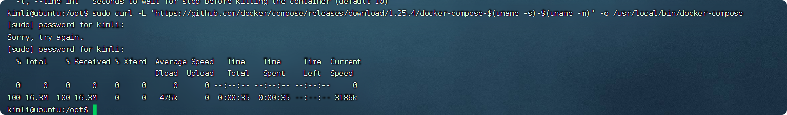
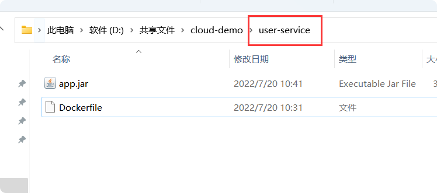
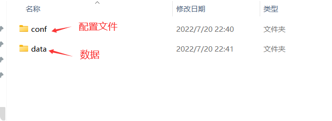
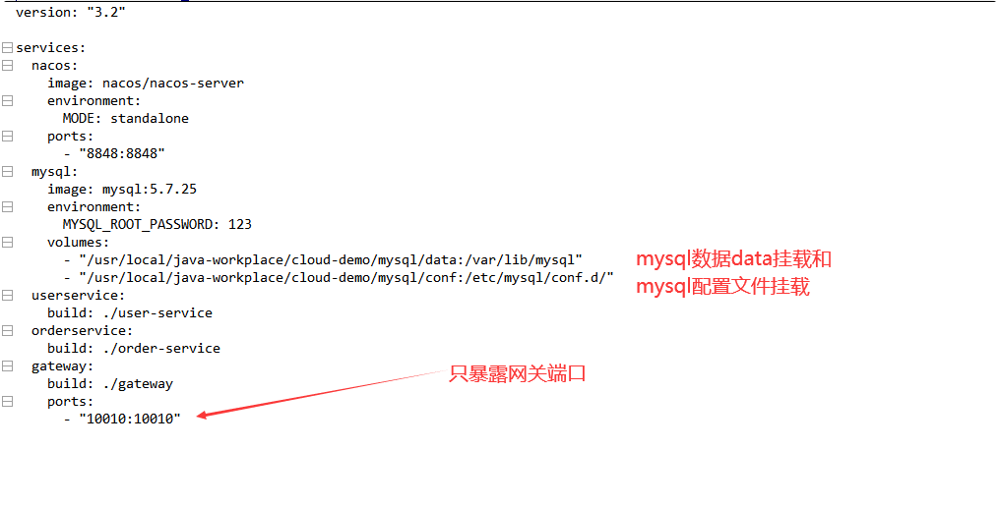
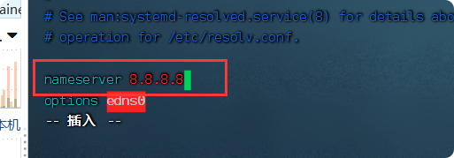

# 

[参考文档](https://www.runoob.com/docker/docker-tutorial.html)

## 核心概念  
docker中的核心概念  

1.镜像（Image）

镜像到底是个什么东西呢，很多人在学习docker的时候都是一头雾水的，可是是歪果仁对镜像情有独钟吧，好多东西都有镜像的概念。比如我们安装系统的.iso文件，其实就是镜像，这里你就可以把镜像认为是一种模板。我们可以使用docker根据这个模板创建容器来运行，其实更可以理解为镜像是好比github上的仓库一样，我们可以克隆下来源代码然后运行，运行起来的代码可以是一个网站、一个应用程序啥的，这就可以叫做容器。说白了，镜像就是一堆静态的模板，运行起来的镜像就是容器。镜像一般需要我们拉取下来，是只读的，这个我们克隆github上的仓库是一样一样的。

docker镜像中有分层的概念，就是一个镜像可能基于好几个镜像，比如一个web运行环境可能需要操作系统ubuntu、数据库mysql、.net core runtime运行时，那我们拉取的这个镜像就会包好这好几个镜像，这就好像我们前边说的打包好的运行环境一样，直接就拉下来一个小电脑一样。

2.容器（Container）

当我们拉取了一个镜像，然后run一下，就会根据这个镜像运行出来一个容器，运行的容器就好像我们的应用程序一样，可以访问可以停止，我们运用多次run命令，就运行了很多很多容器，也可以说是镜像的实例。从这个角度来看，我们可以把镜像看作是类，容器看作new出来的实例，也是很合适的。

3.仓库（Repository）

存放镜像的地方就是仓库，就好比存放代码的地方是github一样，我们就把github称为代码的仓库，github算是最大的仓库。那么存放docker镜像的地方我们叫做dockerhub，是docker的中央仓库。其实已经有dockerhub这个网站了（https://hub.docker.com/），这就是 存放docker镜像的官方仓库，好多官方的也保存在这里，保证了镜像的安全性和可靠性，我们可以从上边拉取一下镜像来运行我们的软件。当然我们也可以制作好我们自己镜像推送上去，不过这些肯定是要官方审核的，防止有些人写入一些恶意代码。不过我们可以推到我们自己的dockerhub上去，供我们自己使用，这个就好我们的github账号一样了，属于私有镜像了。

4.数据卷（Volumn）

实际上我们的容器就好像是一个简易版的操作系统，只不过系统中只安装了我们的程序运行所需要的环境，前边说到我们的容器是new出来的实例，既然是new出来的实例那就会销毁，那如果销毁了我们的程序产生出的需要持久化的数据怎么办呢，容器运行的时候我们可以进容器去查看，容器一旦销毁就什么都没有了。所以数据卷就是来解决这个问题的，是用来做数据持久化到我们的宿主机上容器间的数据共享，简单的说就是将宿主机的目录映射到容器中的目录，应用程序在容器中的目录读写数据会同步到宿主机上，这样容器产生的数据就可以持久化了，比如我们的数据库容器，就可以把数据存到我们宿主机上的真实磁盘上了。

## 安装

1.清除旧版本：  
旧版本的Docker被称为docker，docker.io或docker-engine， 如果安装了这些，请先卸载它们：
    
    sudo apt-get remove docker docker-engine docker.io containerd runc
    
2.在线安装
系统中首次安装Docker，需要先设置Docker存储库地址，然后才可以从存储库安装和更新Docker。  
2.1.设置存储库  
    
    # 更新软件源
    sudo apt-get update
    # 允许apt通过 HTTPS 使用存储库
    sudo apt-get install ca-certificates curl gnupg lsb-release
    # 设置存储库源地址及密钥(中科大源)
    curl -fsSL https://mirrors.ustc.edu.cn/docker-ce/linux/ubuntu/gpg | sudo apt-key add -
    sudo add-apt-repository "deb [arch=amd64] https://mirrors.ustc.edu.cn/docker-ce/linux/ubuntu $(lsb_release -cs) stable"    
2.2.安装 Docker  

    # 更新软件源
    sudo apt-get update
    # 安装Docker Engine、containerd 和 Docker Compose等依赖包
    sudo apt-get install docker-ce docker-ce-cli containerd.io docker-compose-plugin
    
2.3 Windows10 下 wsl 报错
    
    报错信息：
    Cannot connect to the Docker daemon at unix:///var/run/docker.sock. Is the docker daemon running?
    
    尝试以下命令:
     sudo service docker start
     
3.添加 Docker 用户组    
在普通权限下直接在终端执行docker命令，会提示没有权限，每次都加sudo又太麻烦，可以按照以下操作将用户加入docker用户组，即在免root模式下直接执行命令。

    # 添加docker用户组
    sudo groupadd docker
    # 将当前用户加至docker用户组中
    sudo usermod -aG docker $USER
    # 更新用户组
    newgrp docker
  
    
4.配置镜像加速器

使用阿里云：[阿里云地址](https://cr.console.aliyun.com/cn-hangzhou/instances/mirrors)  

        sudo mkdir -p /etc/docker
        sudo tee /etc/docker/daemon.json <<-'EOF'
        {
          "registry-mirrors": ["https://11ah2dl7.mirror.aliyuncs.com"]
        }
        EOF
        sudo systemctl daemon-reload
        sudo systemctl restart docker
        
   
    
## 卸载
    1.卸载docker之前，首先删除所有容器和镜像
      docker kill $(docker ps -a -q)
      // 删除所有容器
      docker rm $(docker ps -a -q)
      // 删除所有镜像（慎重）
      docker rmi $(docker images -q)

    2.首先查看docker version版本(docker 或者  docker-ce)，然后选择适当的命令：
        sudo apt-get purge docker
        sudo apt-get purge --auto-remove docker
        或者
        sudo apt-get purge docker-ce
        sudo  apt-get purge --auto-remove docker-ce
      注意：如果是通过snap install docker，那么必须用snap remove docker来卸载
        
      通用卸载方法：
      sudo apt-get purge docker 
      sudo apt-get purge --auto-remove docker
      
    3.根据搜索出来的包，进行卸载，直到无法搜索为止
      //查看相关软件包
      dpkg -l | grep docker
      //删除这个包
      sudo apt-get remove --purge docker-*
    
## 基本命令
### 镜像命令
1.docker images  查看本机上的所有镜像。

       
       　　REPOSITORY：仓库，也是镜像名称。
       
       　　TAG：标签，也是版本号，镜像会有不同的版本号。
       
       　　IMAGE ID：镜像id，根据这个id我们可以区分不同的镜像，也可以对某个镜像进行操作。
       
       　　CREATED：创建时间。
       
       　　SIZE：镜像的大小。  

2.docker rmi 删除本地的镜像，加上一个参数-f表示强制删除，因为有时候若有运行的相关容器的时候是不能删除的，  
    
    如：docker rmi -f nginx 强行停止容器并删除镜像，不管是否有占用情况。  
    
   

3.docker search 根据镜像名称搜索远程仓库中的镜像，可以看一下查到所有相关名称的镜像，可以选择我们要拉取哪个镜像，下边是搜索nignx相关的镜像，红色部分ok 说明是官方镜像。  
  
     如：docker search nginx
    
4. docker pull <镜像名称>:[标签名称]：拉取镜像，默认不写标签名称拉取最新的镜像。     
     
     
     docker pull hello-world 拉取最新的hello-world镜像

5. docker push 推送镜像，当我们制作了我们自己的镜像时，我们就可以推送到我们自己的docker hub上去。

### 容器命令
   
1.docker run ：基于某个镜像运行一个容器，如果本地有这个镜像就根据本地的镜像创建，如果没有，就去远程拉取一个镜像再创建，参数如下：

    -d：启动一个容器，后台运行，不会占用我们当前的控制台，一般都要加上，之前我们启动nginx没有指定这个参数，就会占用当前控制台，会一直挂起，有了这个命令就不会占用了。
    
    -i：以交互模式运行容器，通常会和-t一起来使用（-it）。
    
    -t：为容器也创建一个命令行窗口，是容器内容的命令行窗口，比如我们拉取一个ubuntu的镜像，我们想要在这个操作系统镜像里边执行一些命令，那就需要这个参数了。
    
    -P：这个是大写的P，指定宿主机的随机端口映射到容器内部的端口。
    
    -p：这个是小写的p，指定某个具体端口映射到容器内部端口，比如前边我们用-p 8080:80，就是让宿主机的8080端口映射到容器内的80端口，这样我们就可以在外部用8080端口访问我们容器内部的nginx了（默认容器必须有一个外部的映射端口，不然访问不了）。
    
    -v：指定宿主机与容器内部的目录映射，就是之前的数据卷所需要的参数，好实现数据的持久化和同步。
    
    --name="mynginx"：为容器指定一个名称，如果没有指定，那就分配一个随机名称
    
    比如；docker run -itd -p 8848:80 --name="mynginx" nginx
    
2.docker ps 显示正在运行的容器，加一个参数-a 可以看到停止中的容器

3.docker stop 停止容器 。

4.docker kill 强制停止容器。

5.docker restart 重启容器。

5.docker rm <容器名 or ID> 删除容器，删除后容器就不在了，就不能重启和停止了。

6.docker inspect 查看容器的详细信息。

7.docker logs -f <容器名 or ID>  查看容器日志

## 常用命令
### 1.拉取镜像 

    docker pull
    
### 2.删除容器

    docker rm <容器名 or ID>
    
### 3.查看容器日志

    docker logs -f <容器名 or ID>
    
    如： docker logs -f  -t  --tail 500 iot_demo  查看最后500行
    
### 4.查看正在运行的容器

    docker ps
    docker ps -a # 为查看所有的容器，包括已经停止的。
    
### 5.删除所有容器

    docker rm $(docker ps -a -q)
    
### 6.停止、启动、杀死指定容器

    docker start <容器名 or ID> # 启动容器
    docker stop <容器名 or ID> # 启动容器
    docker kill <容器名 or ID> # 杀死容器
        
   
### 7.查看所有镜像

    docker images
    
### 8.拉取镜像

    docker pull <镜像名:tag>
    例如
    docker pull sameersbn/redmine:latest
    
### 9.运行容器

        -d：启动一个容器，后台运行，不会占用我们当前的控制台，一般都要加上，之前我们启动nginx没有指定这个参数，就会占用当前控制台，会一直挂起，有了这个命令就不会占用了。
        
        -i：以交互模式运行容器，通常会和-t一起来使用（-it）。
        
        -t：为容器也创建一个命令行窗口，是容器内容的命令行窗口，比如我们拉取一个ubuntu的镜像，我们想要在这个操作系统镜像里边执行一些命令，那就需要这个参数了。
        
        -P：这个是大写的P，指定宿主机的随机端口映射到容器内部的端口。
        
        -p：这个是小写的p，指定某个具体端口映射到容器内部端口，比如前边我们用-p 8080:80，就是让宿主机的8080端口映射到容器内的80端口，这样我们就可以在外部用8080端口访问我们容器内部的nginx了（默认容器必须有一个外部的映射端口，不然访问不了）。
        
        -v：指定宿主机与容器内部的目录映射，就是之前的数据卷所需要的参数，好实现数据的持久化和同步。
        
        --name="mynginx"：为容器指定一个名称，如果没有指定，那就分配一个随机名称
        
        比如；docker run -itd -p 8848:80 --name="mynginx" nginx

     
    
### 10.暴露端口  
一共有三种形式进行端口映射  
    
    docker -p ip:hostPort:containerPort # 映射指定地址的主机端口到容器端口
    例如：docker -p 127.0.0.1:3306:3306 映射本机 3306 端口到容器的 3306 端口
    
    docker -p ip::containerPort # 映射指定地址的任意可用端口到容器端口
    例如：docker -p 127.0.0.1::3306 映射本机的随机可用端口到容器 3306 端口
    
    docer -p hostPort:containerPort # 映射本机的指定端口到容器的指定端口
    例如：docker -p 3306:3306 # 映射本机的 3306 端口到容器的 3306 端口

### 11.映射数据卷

    docker -v /home/data:/opt/data # 这里/home/data 指的是宿主机的目录地址，后者则是容器的目录地址
   
### 12.删除所有
    
     // 删除所有容器
     docker rm $(docker ps -a -q)
     // 删除所有镜像（慎重）
     docker rmi $(docker images -q)
     
### 13.数据导入
    
    
### 14.迁移jdk
 
    导出：
        sudo docker  save  -o   java.tar   java:8u111
        
        sudo docker  save  -o   iot.tar   iot:latest
    
    导入：
 
        docker load -i java.tar
    
        迁移mysql
        docker load -i mysql.tar
        docker run -itd --name mysql -p 3306:3306 -e MYSQL_ROOT_PASSWORD=123456 --restart=always mysql
        docker exec -it mysql /bin/bash
        mysql -uroot -p
        show databases;
        select host,user,plugin,authentication_string from mysql.user;
        ALTER USER 'root'@'%' IDENTIFIED WITH mysql_native_password BY '123456';
        
        迁移iot.jar
        docker load -i iot.tar
        docker run -d -p 8000:8000 --name iot --restart=always   iot:latest
        docker logs -f  -t  --tail 500 iot
        
        迁移iot_demo.jar
        docker load -i iot_demo.tar
        docker run -d -p 8888:8888 --name iot_demo --restart=always iot_demo:latest
        docker logs -f  -t  --tail 500 iot_demo
    
    
### 15.查看数据卷
    
    docker inspect es | grep Mounts -A 20
### 16.查看网络
    # 查询docker下所有网络
    docker network ls
    # 后面接某一个网络
    docker network inspect elkf_default
    
    
## Docker Compose 安装与使用
### 简介
- Compose 项目是 Docker 官方的开源项目,负责实现对 Docker 容器集群的快速编排,定义和运行多容器Docker应用程序的工具。通过Compose，您可以使用YAML文件来配置应用程序的服务。然后，使用一个命令，就可以从配置中创建并启动所有服务

- 我们知道使用一个 Dockerfile 模板文件，可以让用户很方便的定 义一个单独的应用容器。然而，在日常工作中，经常会碰到需要多个容器相互配合来完成某 项任务的情况。例如要实现一个 Web 项目，除了 Web 服务容器本身，往往还需要再加上后 端的数据库服务容器，甚至还包括负载均衡容器等。Compose 恰好满足了这样的需求。它允许用户通过一个单独的 docker-compose.yml 模板文件 （YAML 格式）来定义一组相关联的应用容器为一个项目（project）。有了Compose，我们就不需要再一个个组件去写一份Dockerfile，只需要将整体环境同一起来，写在一份docker-compose.yml文件即可  

### 安装 
- 两种最新的docker安装方式

    - 下载docker-compose二进制文件安装

    - pip安装(将 Compose 当作一个 Python 应用来从 pip 源中安装)
    
#### 下载docker-compose二进制文件安装
 
运行以下命令以下载Docker Compose的当前稳定版本：   

    sudo curl -L "https://github.com/docker/compose/releases/download/1.25.4/docker-compose-$(uname -s)-$(uname -m)" -o /usr/local/bin/docker-compose

  

使用官方github下载很慢,采用换源  

    curl -L https://get.daocloud.io/docker/compose/releases/download/1.25.4/docker-compose-`uname -s`-`uname -m` > /usr/local/bin/docker-compose

将可执行权限应用于二进制文件：  

    sudo chmod +x /usr/local/bin/docker-compose

查看版本：  
    
    docker-compose --version
#### pip安装
    
    udo pip install docker-compose

### 卸载
二进制包方式安装的，删除二进制文件即可

    sudo rm /usr/local/bin/docker-compose
    
pip 安装的，则执行如下命令即可删除

    sudo pip uninstall docker-compose
    
### 常用命令

ps：列出所有运行容器

    docker-compose ps

logs：查看服务日志输出

    docker-compose logs
    
    docker logs -t -f <name-of-service>

port：打印绑定的公共端口，下面命令可以输出 eureka 服务 8761 端口所绑定的公共端口

    docker-compose port eureka 8761

build：构建或者重新构建服务

    docker-compose build

start：启动指定服务已存在的容器

    docker-compose start eureka

stop：停止已运行的服务的容器

    docker-compose stop eureka

rm：删除指定服务的容器

    docker-compose rm eureka

up：构建、启动容器

    docker-compose up

kill：通过发送 SIGKILL 信号来停止指定服务的容器

    docker-compose kill eureka

pull：下载服务镜像

    scale：设置指定服务运气容器的个数，以 service=num 形式指定

    docker-compose scale user=3 movie=3

run：在一个服务上执行一个命令

    docker-compose run web bash

docker-compose exec 容器名 bash 登录到容器中

docker-compose down   删除所有容器,镜像

### 使用
- 三个步骤
1.使用 Dockerfile 定义应用程序的环境。

2.使用 docker-compose.yml 定义构成应用程序的服务，这样它们可以在隔离环境中一起运行。

3.最后，执行 docker-compose up 命令来启动并运行整个应用程序。

> 举个例子：

1.jar文件结构
    
    
  
  Dockerfile文件内容：
    
    FROM java:8-alpine
    COPY ./app.jar /tmp/app.jar
    ENTRYPOINT java -jar /tmp/app.jar
  
2.mysql文件结构

3.docker-compose.yml

    
        version: "3.2"
        
        services:
          nacos:
            image: nacos/nacos-server
            environment:
              MODE: standalone
            ports:
              - "8848:8848"
          mysql:
            image: mysql:5.7.25
            environment:
              MYSQL_ROOT_PASSWORD: 123
            volumes:
              - "/usr/local/java-workplace/cloud-demo/mysql/data:/var/lib/mysql"
              - "/usr/local/java-workplace/cloud-demo/mysql/conf:/etc/mysql/conf.d/"
          userservice:
            build: ./user-service
          orderservice:
            build: ./order-service
          gateway:
            build: ./gateway
            ports:
              - "10010:10010"

4.构建、启动容器

     //4.1 先拷贝文件到虚拟机
     //4.2 进入文件夹
     cd /usr/local/java-workplace/cloud-demo
     //4.3 启动容器
     docker-compose up
   
5.运行容器
    
    //运行指定容器
    docker-compose start nacos  

## 错误日志

### Error response from daemon: Get "https://registry-1.docker.io/v2/": dial tcp: lookup registry-1.docker.io: no such host

> 一通百度，发现原来是dns服务器的错误，把服务器改成8.8.8.8或者114.114.114.114即可

    vim /etc/resolv.conf
    # 增加或修改为下面一行地方内容
    # nameserver 8.8.8.8

