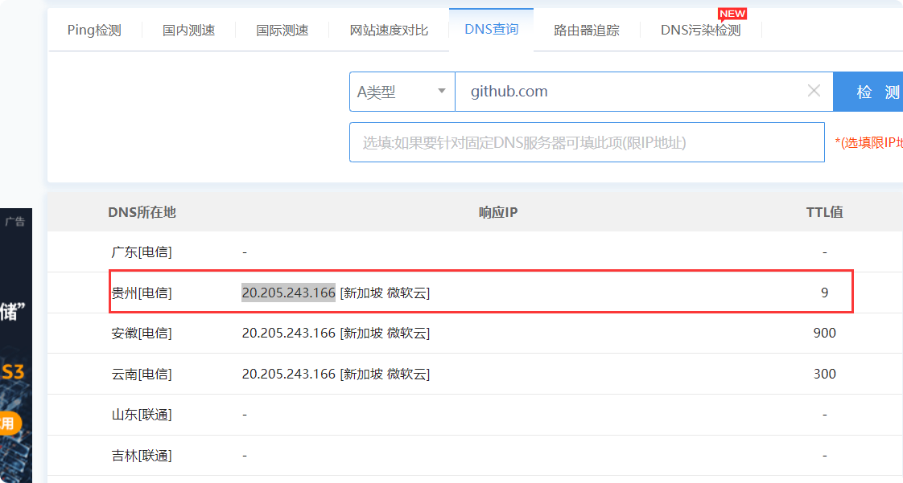
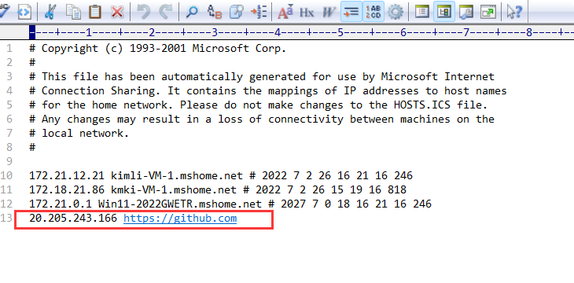
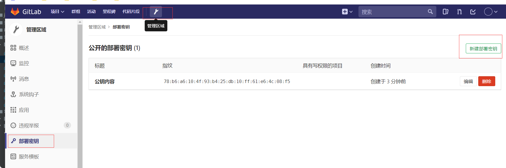

# git
## git安装与配置

## 日常命令
> 拉取项目
    
     1.git init 
     2.git remote add origin https://github.com/shuihuaxiang/kim-doc.git
     3.git pull origin master

## 设置网络
1.打开DNS查询工具：http://tool.chinaz.com/dns  

2.选择TTL值最低的那个，如果当前列表没有符合要求的IP，重新检测。

   
3.使用Win + R 组合键，在运行对话框里，复制并粘贴：C:\WINDOWS\system32\drivers\etc

4.打开以后，选择HOSTS文件。把刚才复制的IP地址，复制到这个文件里，格式如下：

  
  
## gitlab

### gitlab-docker 安装
中文版本：twang2218/gitlab-ce-zh:10.5.4  

1.拉取镜像

     docker pull twang2218/gitlab-ce-zh:10.5.4  
2. 运行容器

    sudo docker run --detach \
    --hostname 192.168.171.132  \
    --publish 443:443 \
    --publish 80:80 \
    --publish 8022:22  \
    --name gitlab  \
    --restart always   \
    --volume /usr/local/gitlab/config:/etc/gitlab  \
    --volume /usr/local/gitlab/logs:/var/log/gitlab \
    --volume /usr/local/gitlab/data:/var/opt/gitlab \
    twang2218/gitlab-ce-zh:10.5.4

    描述
    $ sudo docker run --detach \
      --hostname 192.168.10.46 \   # 设置主机名或域名
      --publish 443:443 --publish 80:80 --publish 22:22 \ # 本地端口的映射
      --name gitlab \     # gitlab-ce 的镜像运行成为一个容器，这里是对容器的命名
      --restart always \  # 设置重启方式，always 代表一直开启，服务器开机后也会自动开启的
      --volume /srv/gitlab/config:/etc/gitlab \   # 将 gitlab 的配置文件目录映射到 /srv/gitlab/config 目录中
      --volume /srv/gitlab/logs:/var/log/gitlab \ # 将 gitlab 的log文件目录映射到 /srv/gitlab/logs 目录中
      --volume /srv/gitlab/data:/var/opt/gitlab \ # 将 gitlab 的数据文件目录映射到 /srv/gitlab/data 目录中
      twang2218/gitlab-ce-zh:10.5.4 # 需要运行的镜像

3.访问地址

    # 我设置得访问端口是80.。。所以不用加端口
    192.168.171.132
    
    初始页面先修改密码，账号为root
***

### 添加sshkey
git仓库之间的代码传输协议主要使用ssh协议。而一般搭建gitlab的时候使用的git用户是没有密码的，因此直接ssh是不能登录的，就需要使用ssh-keygen上传公钥，使用非对称加密传输。下面讲述如何上传你的ssh公钥：
#### 1.生成sshkey

        ssh-keygen -t rsa -C "415403242@qq.com"
   
#### 2.添加ssh公钥
    秘钥目录：C:\Users\Administrator\.ssh
    复制id_rsa.pub公钥内容
    添加到gitlab
    
 

    
    
## 异常记录
>  1. idea  push的时候遇到问题：unable to access 'https://github.com/shuihuaxiang/kim-doc.git/':
OpenSSL SSL_read: SSL_ERROR_SYSCALL, errno 10054
    
    解决方案1：
         原因：  
            自2021年8月12日后，github不在使用以前的账号密码git push，所以需要申请token  
         处理：  
            1.点击idea中的terminal  
            2.git config --global --unset http.proxy 和 git config --global --unset https.proxy  
            3.重新关联自己的git：git remote add origin git (自己的git),  
               git remote add origin https://github.com/shuihuaxiang/kim-doc.git  
            4.git push -u origin master重新输入账号密码  
       
     方案2：  
       因为服务器的SSL证书没有经过第三方机构的签署
        git config --global http.sslVerify "false"
       解除ssl验证后，再次git即可
     方案3：
     取消代理
      git config --global --unset http.proxy 
      
      git config --global --unset https.proxy