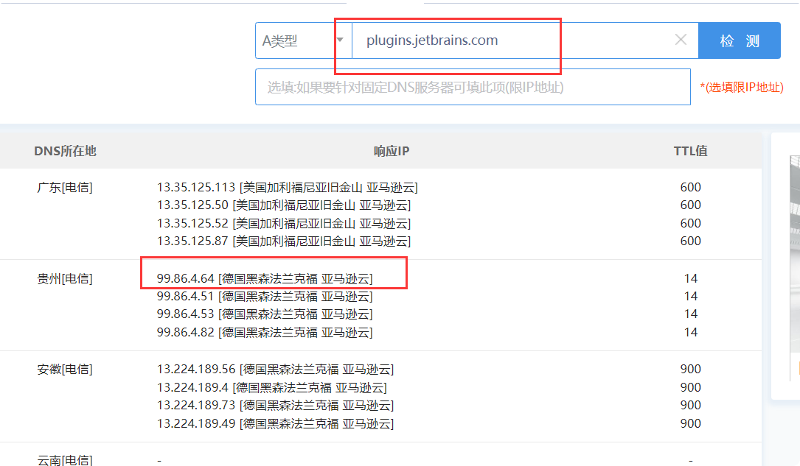
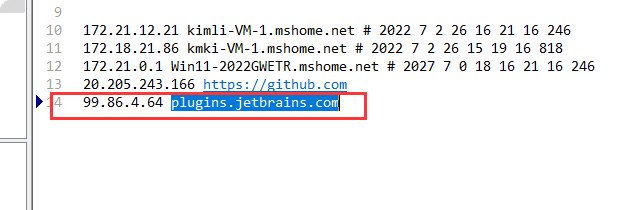
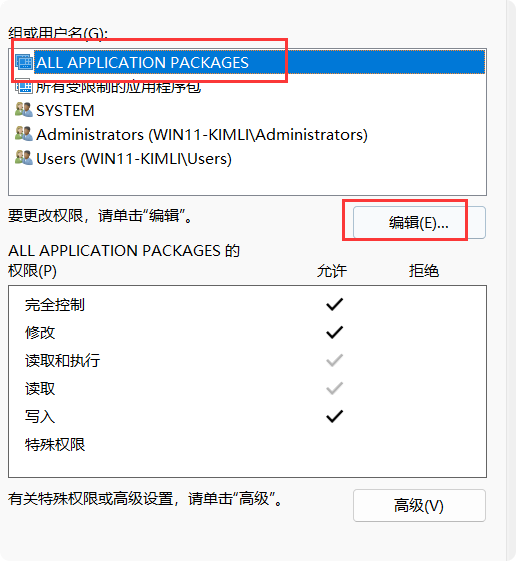
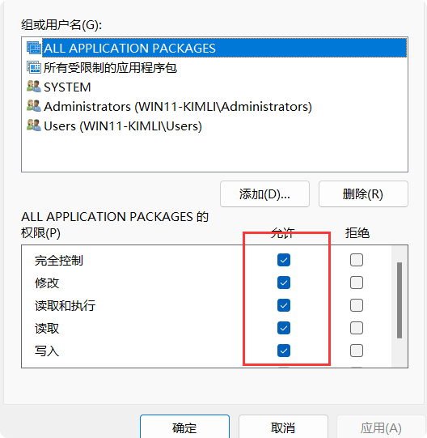

# idea
## 插件访问缓慢，更改host地址

*1、查询可用ip*

访问http://tool.chinaz.com/dns，然后在页面搜索框中输入plugins.jetbrains.com，点击检测按钮，复制第一个ip地址，操作如下：  

*2、修改电脑host文件，添加地址映射*

文件地址：C:\Windows\System32\drivers\etc

*3、修改host文件执行权限*

*4、刷新dns*
   
    运行
     
    cmd
    
    ipconfig /flushdns