# jmeter

> 使用取样器向服务器发送请求，从服务器获取响应结果，然后通过线程组模拟服务器压力(并发数)

注意：因为jmeter运行依赖**jdk环境**，所以在安装jmeter之前需要安装jdk且配置环境变量，需要**jdk1.8**以上版本

## 下载-安装
1、下载 https://jmeter.apache.org/download_jmeter.cgi

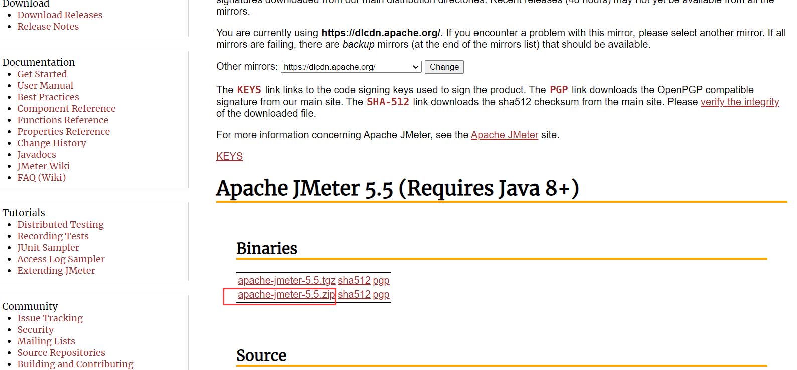

2、解压

## 启动
进入bin目录 
 
- 如果是windows，双击bin目录下的jmeter.bat 

- 如果是Linux或者Mac，双击bin目录下的jmeter.sh

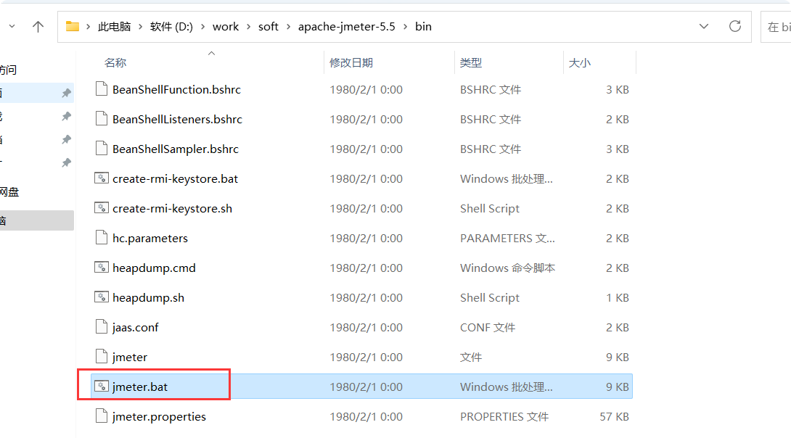

## 更改主题

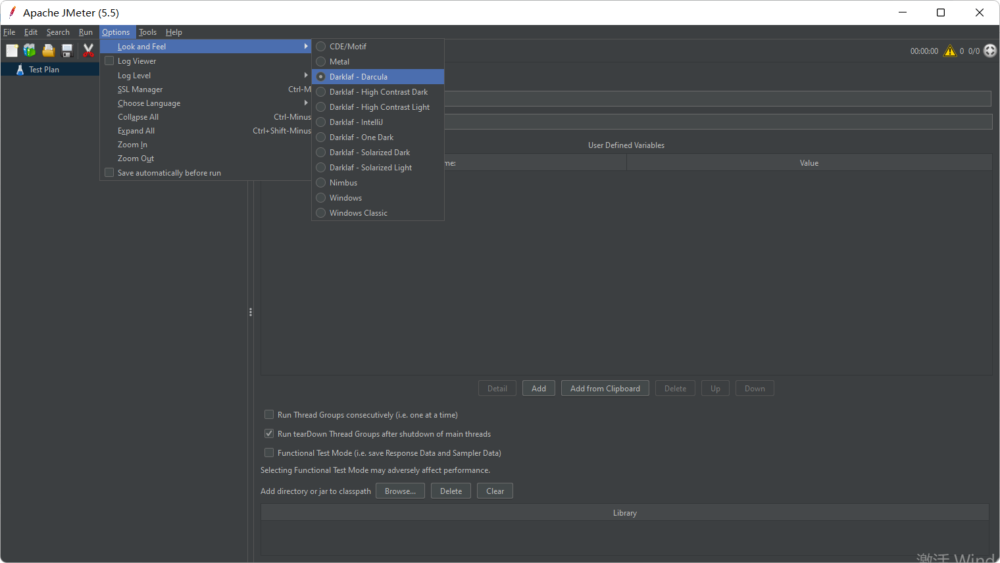

## 更改语言

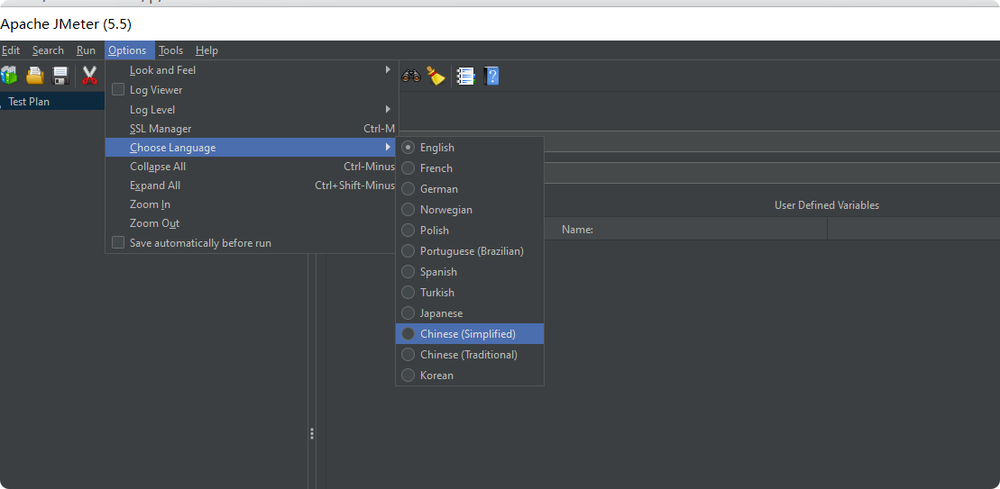

## 中文乱码
打开jmeter安装目录bin下的jmeter.properties，找到第1083行，

    #sampleresult.default.encoding=ISO-8859-1
    
    将此行的内容修改如下：
    sampleresult.default.encoding=utf-8

**重启jmeter**，再重新执行该采样器，则中文显示OK。

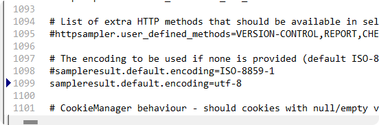

## 使用

### 新建测试
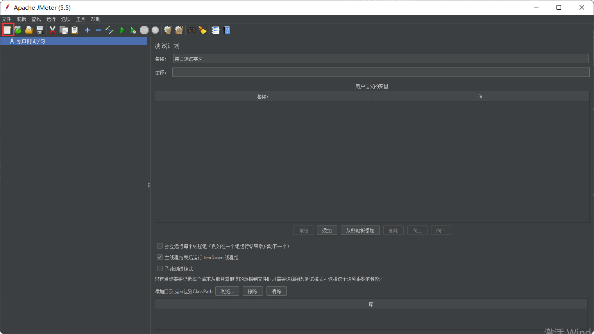

### 添加线程组

> 测试计划里面可以有很多很多的线程组 线程组可以把它理解为一个collection，在这个collection里面可以有很多的测试用例

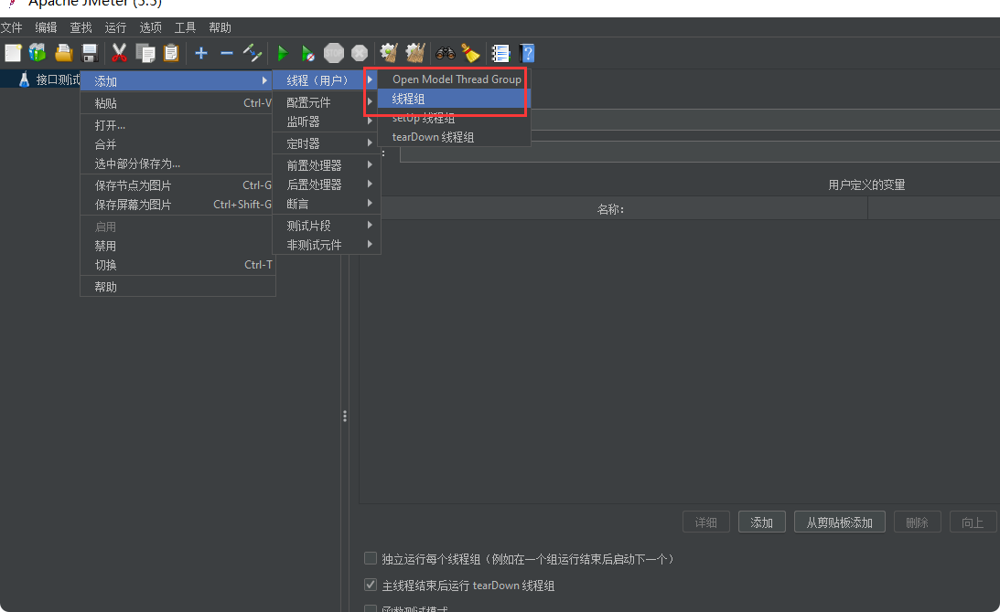

### 自定义变量

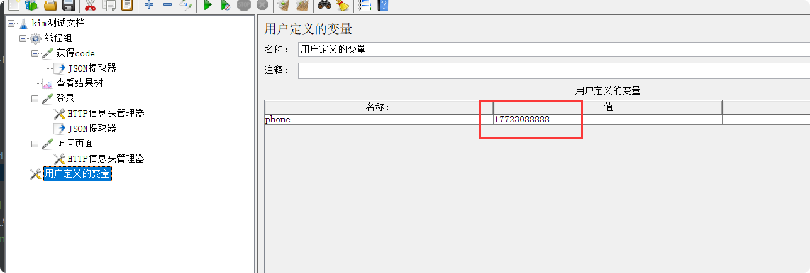

### 1、新建HTTP请求

> 添加-取样器-HTTP请求

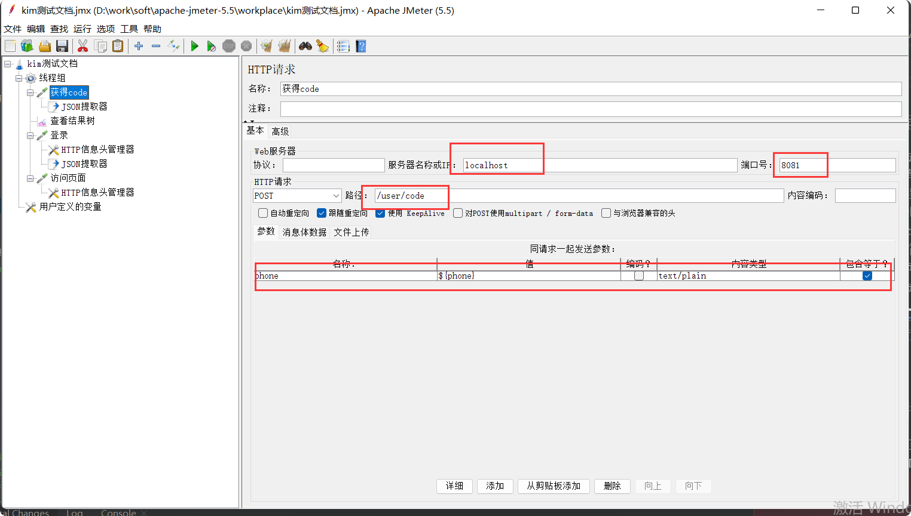

### 2、JSON提取器

> 添加-后置处理器-JSON提取器：提取返回值里面参数设置成变量用${}引用，例如${data}**

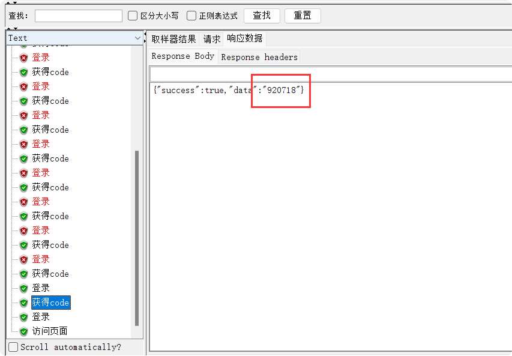

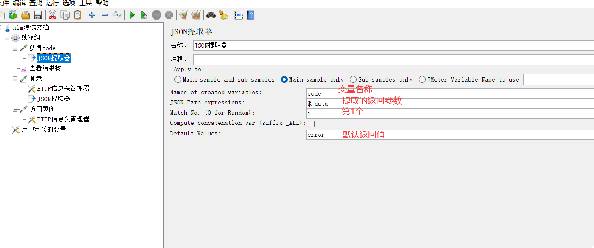

### 3、HTTP信息头管理器
> 添加-配置原件-HTTP信息头管理器：传参为RequestBody的时候需要添加消息头，或者登录authorization=${token}

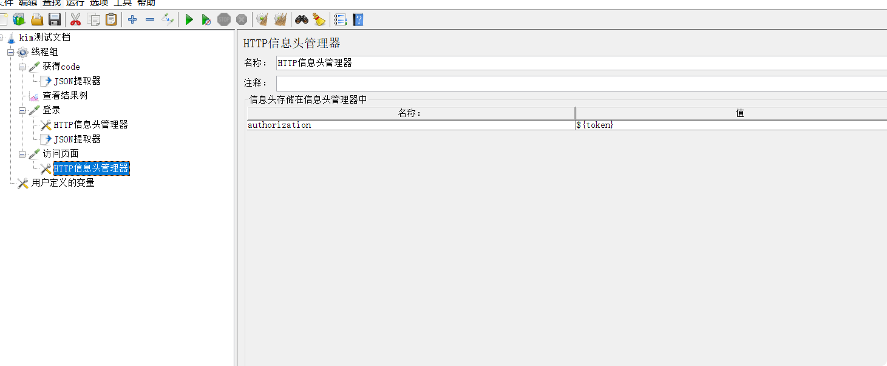

### 4.查看结果树
> 添加-监听器-查看结果树

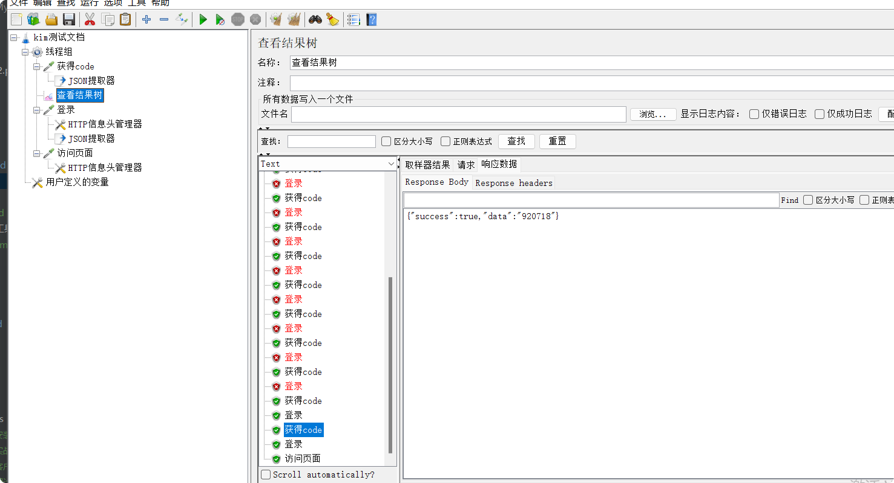

### 5.汇总报告
> 添加-监听器-汇总报告

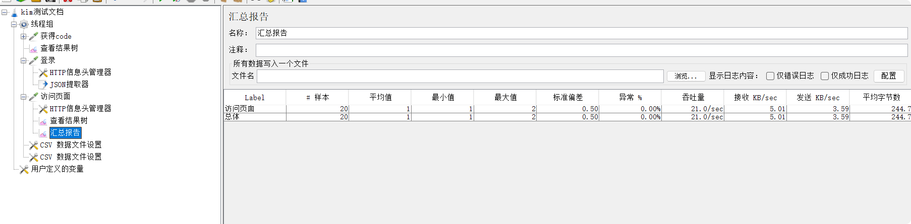

### 批量添加数据（参数）

1.**先建立文档**：新建txt文档phones

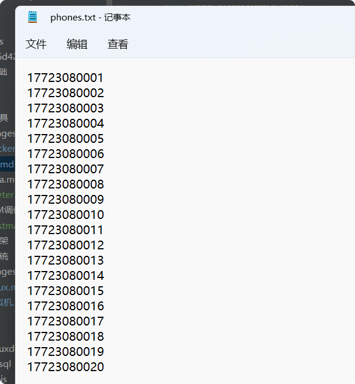

2.**CSV 数据文件设置**:添加-配置原件-CVS Data Set Config(CVS数据文件设置)

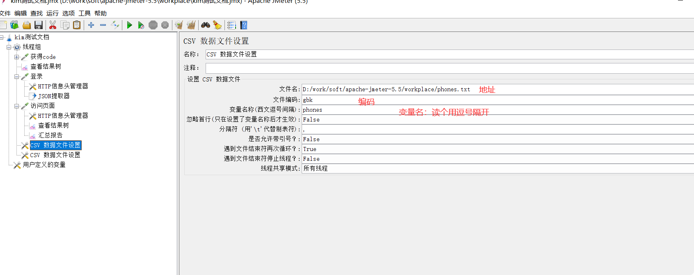

3.**多线程用${变量名}使用就行**

### 批量导出参数

> 线程组-添加-取样器-BeanShell取样器

    
    FileWriter file = new FileWriter("D:/work/soft/apache-jmeter-5.5/workplace/token_nums.txt",true);
    //创建一个字符缓存输出流
    
    BufferedWriter out = new BufferedWriter(file);
    
    //写文件内容
    
    //vars.get:获取 jmeter 中的变量值
    if(!vars.get("token").equals("error")){
    	
    out.write(vars.get("token")+"\n");
    }
    
    //关闭写数据流
    out.close();
    //关闭文件
    
    file.close();
    
    
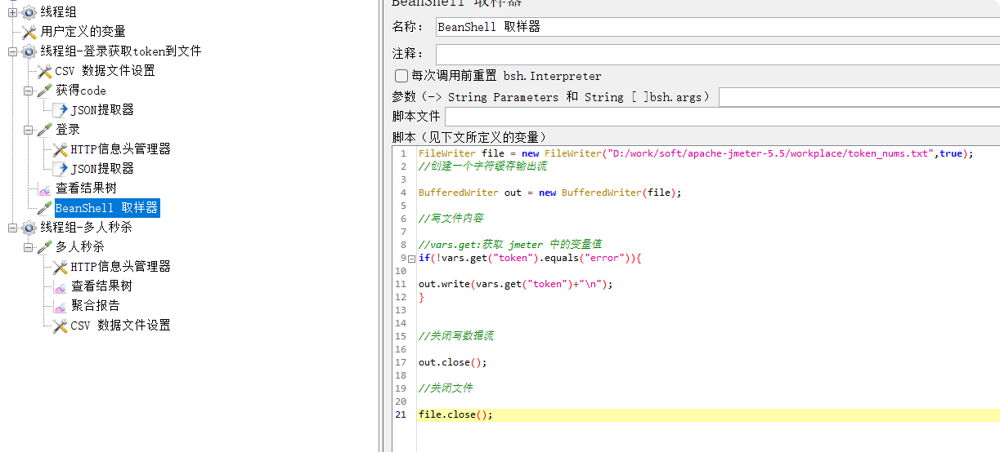  