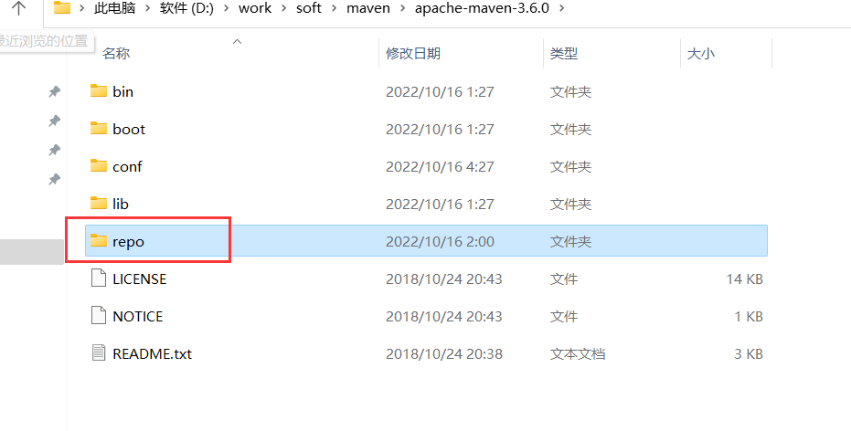

# maven
maven官网地址:https://maven.apache.org

## 安装配置

### 下载

> **如何选择**：根据idea版本，选择发布在idea版本之前的maven下载，**尽量3.6以后的版本**。

查看maven版本发布时间：[查看历史版本](https://maven.apache.org/docs/history.html)

> 下载地址：[maven官网下载地址](https://maven.apache.org/download.cgi)

可以选择最新版本

> 也可以选择老版本：[历史版本下载地址](https://archive.apache.org/dist/maven/maven-3/)

### 安装

解压到随便目录：例如：D:\work\soft\maven\apache-maven-3.6.0

#### 1.新建本地仓库repo文件

#### 2.修改配置文件
    
主要修改：

本地仓库路径
   
    
    <localRepository>D:/work/soft/maven/apache-maven-3.6.0/repo</localRepository>
    
修改镜像地址：

    <mirror>
                <id>alimaven</id>
                <mirrorOf>central</mirrorOf>
                <name>aliyun maven</name>
                <url>http://maven.aliyun.com/nexus/content/repositories/central/</url>
            </mirror>
    		 <mirror>
                <id>central</id>
                <name>Maven Repository Switchboard</name>
                <url>http://repo1.maven.org/maven2/</url>
                <mirrorOf>central</mirrorOf>
            </mirror>
            <mirror>
                <id>alimaven</id>
                <name>aliyun maven</name>
                <url>http://maven.aliyun.com/nexus/content/groups/public/</url>
                <mirrorOf>central</mirrorOf>
            </mirror>
            
            <mirror>
                <id>repo2</id>
                <mirrorOf>central</mirrorOf>
                <name>Human Readable Name for this Mirror.</name>
                <url>http://repo2.maven.org/maven2/</url>
            </mirror>
            <mirror>
                <id>ibiblio</id>
                <mirrorOf>central</mirrorOf>
                <name>Human Readable Name for this Mirror.</name>
                <url>http://mirrors.ibiblio.org/pub/mirrors/maven2/</url>
            </mirror>
            <mirror>
                <id>jboss-public-repository-group</id>
                <mirrorOf>central</mirrorOf>
                <name>JBoss Public Repository Group</name>
                <url>http://repository.jboss.org/nexus/content/groups/public</url>
            </mirror>
            <mirror>
                <id>google-maven-central</id>
                <name>Google Maven Central</name>
                <url>https://maven-central.storage.googleapis.com
                </url>
                <mirrorOf>central</mirrorOf>
            </mirror>
            <!-- 中央仓库在中国的镜像 -->
            <mirror>
                <id>maven.net.cn</id>
                <name>oneof the central mirrors in china</name>
                <url>http://maven.net.cn/content/groups/public/</url>
                <mirrorOf>central</mirrorOf>
            </mirror>    
    
完整settings.xml:新增了一些发布到中央仓库的配置
    
    <?xml version="1.0" encoding="UTF-8"?>
    
    <!--
    Licensed to the Apache Software Foundation (ASF) under one
    or more contributor license agreements.  See the NOTICE file
    distributed with this work for additional information
    regarding copyright ownership.  The ASF licenses this file
    to you under the Apache License, Version 2.0 (the
    "License"); you may not use this file except in compliance
    with the License.  You may obtain a copy of the License at
    
        http://www.apache.org/licenses/LICENSE-2.0
    
    Unless required by applicable law or agreed to in writing,
    software distributed under the License is distributed on an
    "AS IS" BASIS, WITHOUT WARRANTIES OR CONDITIONS OF ANY
    KIND, either express or implied.  See the License for the
    specific language governing permissions and limitations
    under the License.
    -->
    
    <!--
     | This is the configuration file for Maven. It can be specified at two levels:
     |
     |  1. User Level. This settings.xml file provides configuration for a single user, 
     |                 and is normally provided in ${user.home}/.m2/settings.xml.
     |
     |                 NOTE: This location can be overridden with the CLI option:
     |
     |                 -s /path/to/user/settings.xml
     |
     |  2. Global Level. This settings.xml file provides configuration for all Maven
     |                 users on a machine (assuming they're all using the same Maven
     |                 installation). It's normally provided in 
     |                 ${maven.home}/conf/settings.xml.
     |
     |                 NOTE: This location can be overridden with the CLI option:
     |
     |                 -gs /path/to/global/settings.xml
     |
     | The sections in this sample file are intended to give you a running start at
     | getting the most out of your Maven installation. Where appropriate, the default
     | values (values used when the setting is not specified) are provided.
     |
     |-->
    <settings xmlns="http://maven.apache.org/SETTINGS/1.0.0" 
              xmlns:xsi="http://www.w3.org/2001/XMLSchema-instance" 
              xsi:schemaLocation="http://maven.apache.org/SETTINGS/1.0.0 http://maven.apache.org/xsd/settings-1.0.0.xsd">
      <!-- localRepository
       | The path to the local repository maven will use to store artifacts.
       |
       | Default: ${user.home}/.m2/repository
      <localRepository>/path/to/local/repo</localRepository>
      -->
      <localRepository>D:/work/soft/maven/apache-maven-3.6.0/repo</localRepository>
      <!-- interactiveMode
       | This will determine whether maven prompts you when it needs input. If set to false,
       | maven will use a sensible default value, perhaps based on some other setting, for
       | the parameter in question.
       |
       | Default: true
      <interactiveMode>true</interactiveMode>
      -->
    
      <!-- offline
       | Determines whether maven should attempt to connect to the network when executing a build.
       | This will have an effect on artifact downloads, artifact deployment, and others.
       |
       | Default: false
      <offline>false</offline>
      -->
    
      <!-- pluginGroups
       | This is a list of additional group identifiers that will be searched when resolving plugins by their prefix, i.e.
       | when invoking a command line like "mvn prefix:goal". Maven will automatically add the group identifiers
       | "org.apache.maven.plugins" and "org.codehaus.mojo" if these are not already contained in the list.
       |-->
      <pluginGroups>
        <!-- pluginGroup
         | Specifies a further group identifier to use for plugin lookup.
        <pluginGroup>com.your.plugins</pluginGroup>
        -->
      </pluginGroups>
    
      <!-- proxies
       | This is a list of proxies which can be used on this machine to connect to the network.
       | Unless otherwise specified (by system property or command-line switch), the first proxy
       | specification in this list marked as active will be used.
       |-->
      <proxies>
        <!-- proxy
         | Specification for one proxy, to be used in connecting to the network.
         |
        <proxy>
          <id>optional</id>
          <active>true</active>
          <protocol>http</protocol>
          <username>proxyuser</username>
          <password>proxypass</password>
          <host>proxy.host.net</host>
          <port>80</port>
          <nonProxyHosts>local.net|some.host.com</nonProxyHosts>
        </proxy>
        -->
      </proxies>
    
      <!-- servers
       | This is a list of authentication profiles, keyed by the server-id used within the system.
       | Authentication profiles can be used whenever maven must make a connection to a remote server.
       |-->
      <servers>
        <!-- server
         | Specifies the authentication information to use when connecting to a particular server, identified by
         | a unique name within the system (referred to by the 'id' attribute below).
         | 
         | NOTE: You should either specify username/password OR privateKey/passphrase, since these pairings are 
         |       used together.
         |
        <server>
          <id>deploymentRepo</id>
          <username>repouser</username>
          <password>repopwd</password>
        </server>
        -->
        
        <!-- Another sample, using keys to authenticate.
        <server>
          <id>siteServer</id>
          <privateKey>/path/to/private/key</privateKey>
          <passphrase>optional; leave empty if not used.</passphrase>
        </server>
        
    	<server>
        <id>ossrh</id>
        <username>发布到中央仓库issues.sonatype.org的账号</username>
        <password>发布到中央仓库issues.sonatype.org的密码</password>
    	</server>
    	-->
      </servers>
    
      <!-- mirrors
       | This is a list of mirrors to be used in downloading artifacts from remote repositories.
       | 
       | It works like this: a POM may declare a repository to use in resolving certain artifacts.
       | However, this repository may have problems with heavy traffic at times, so people have mirrored
       | it to several places.
       |
       | That repository definition will have a unique id, so we can create a mirror reference for that
       | repository, to be used as an alternate download site. The mirror site will be the preferred 
       | server for that repository.
       |-->
      <mirrors>
        <!-- mirror
         | Specifies a repository mirror site to use instead of a given repository. The repository that
         | this mirror serves has an ID that matches the mirrorOf element of this mirror. IDs are used
         | for inheritance and direct lookup purposes, and must be unique across the set of mirrors.
         |
        <mirror>
          <id>mirrorId</id>
          <mirrorOf>repositoryId</mirrorOf>
          <name>Human Readable Name for this Mirror.</name>
          <url>http://my.repository.com/repo/path</url>
        </mirror>
         -->
    	
            <mirror>
                <id>alimaven</id>
                <mirrorOf>central</mirrorOf>
                <name>aliyun maven</name>
                <url>http://maven.aliyun.com/nexus/content/repositories/central/</url>
            </mirror>
    		 <mirror>
                <id>central</id>
                <name>Maven Repository Switchboard</name>
                <url>http://repo1.maven.org/maven2/</url>
                <mirrorOf>central</mirrorOf>
            </mirror>
            <mirror>
                <id>alimaven</id>
                <name>aliyun maven</name>
                <url>http://maven.aliyun.com/nexus/content/groups/public/</url>
                <mirrorOf>central</mirrorOf>
            </mirror>
            
            <mirror>
                <id>repo2</id>
                <mirrorOf>central</mirrorOf>
                <name>Human Readable Name for this Mirror.</name>
                <url>http://repo2.maven.org/maven2/</url>
            </mirror>
            <mirror>
                <id>ibiblio</id>
                <mirrorOf>central</mirrorOf>
                <name>Human Readable Name for this Mirror.</name>
                <url>http://mirrors.ibiblio.org/pub/mirrors/maven2/</url>
            </mirror>
            <mirror>
                <id>jboss-public-repository-group</id>
                <mirrorOf>central</mirrorOf>
                <name>JBoss Public Repository Group</name>
                <url>http://repository.jboss.org/nexus/content/groups/public</url>
            </mirror>
            <mirror>
                <id>google-maven-central</id>
                <name>Google Maven Central</name>
                <url>https://maven-central.storage.googleapis.com
                </url>
                <mirrorOf>central</mirrorOf>
            </mirror>
            <!-- 中央仓库在中国的镜像 -->
            <mirror>
                <id>maven.net.cn</id>
                <name>oneof the central mirrors in china</name>
                <url>http://maven.net.cn/content/groups/public/</url>
                <mirrorOf>central</mirrorOf>
            </mirror>
      </mirrors>
      
      <!-- profiles
       | This is a list of profiles which can be activated in a variety of ways, and which can modify
       | the build process. Profiles provided in the settings.xml are intended to provide local machine-
       | specific paths and repository locations which allow the build to work in the local environment.
       |
       | For example, if you have an integration testing plugin - like cactus - that needs to know where
       | your Tomcat instance is installed, you can provide a variable here such that the variable is 
       | dereferenced during the build process to configure the cactus plugin.
       |
       | As noted above, profiles can be activated in a variety of ways. One way - the activeProfiles
       | section of this document (settings.xml) - will be discussed later. Another way essentially
       | relies on the detection of a system property, either matching a particular value for the property,
       | or merely testing its existence. Profiles can also be activated by JDK version prefix, where a 
       | value of '1.4' might activate a profile when the build is executed on a JDK version of '1.4.2_07'.
       | Finally, the list of active profiles can be specified directly from the command line.
       |
       | NOTE: For profiles defined in the settings.xml, you are restricted to specifying only artifact
       |       repositories, plugin repositories, and free-form properties to be used as configuration
       |       variables for plugins in the POM.
       |
       |-->
      <profiles>
        <!-- profile
         | Specifies a set of introductions to the build process, to be activated using one or more of the
         | mechanisms described above. For inheritance purposes, and to activate profiles via <activatedProfiles/>
         | or the command line, profiles have to have an ID that is unique.
         |
         | An encouraged best practice for profile identification is to use a consistent naming convention
         | for profiles, such as 'env-dev', 'env-test', 'env-production', 'user-jdcasey', 'user-brett', etc.
         | This will make it more intuitive to understand what the set of introduced profiles is attempting
         | to accomplish, particularly when you only have a list of profile id's for debug.
         |
         | This profile example uses the JDK version to trigger activation, and provides a JDK-specific repo.
        <profile>
          <id>jdk-1.4</id>
    
          <activation>
            <jdk>1.4</jdk>
          </activation>
    
          <repositories>
            <repository>
              <id>jdk14</id>
              <name>Repository for JDK 1.4 builds</name>
              <url>http://www.myhost.com/maven/jdk14</url>
              <layout>default</layout>
              <snapshotPolicy>always</snapshotPolicy>
            </repository>
          </repositories>
        </profile>
        -->
    
        <!--
         | Here is another profile, activated by the system property 'target-env' with a value of 'dev',
         | which provides a specific path to the Tomcat instance. To use this, your plugin configuration
         | might hypothetically look like:
         |
         | ...
         | <plugin>
         |   <groupId>org.myco.myplugins</groupId>
         |   <artifactId>myplugin</artifactId>
         |   
         |   <configuration>
         |     <tomcatLocation>${tomcatPath}</tomcatLocation>
         |   </configuration>
         | </plugin>
         | ...
         |
         | NOTE: If you just wanted to inject this configuration whenever someone set 'target-env' to
         |       anything, you could just leave off the <value/> inside the activation-property.
         |
        <profile>
          <id>env-dev</id>
    
          <activation>
            <property>
              <name>target-env</name>
              <value>dev</value>
            </property>
          </activation>
    
          <properties>
            <tomcatPath>/path/to/tomcat/instance</tomcatPath>
          </properties>
        </profile>
        -->
    <!-- 	<profile>
          <id>jdk-1.8</id>
          <activation>
            <activeByDefault>true</activeByDefault>
            <jdk>1.8</jdk>
          </activation>
     
          <properties>
            <maven.compiler.source>1.8</maven.compiler.source>
            <maven.compiler.target>1.8</maven.compiler.target>
            <maven.compiler.compilerVersion>1.8</maven.compiler.compilerVersion>
          </properties>
    </profile> -->
    	 <profile>
          <id>ossrh</id>
          <activation>
            <activeByDefault>true</activeByDefault>
          </activation>
          <properties>
            <!--这里填你安装的GnuPG位置-->
            <gpg.executable>D:/work/soft/GnuPG/bin/gpg.exe</gpg.executable>
            <gpg.passphrase>44580498</gpg.passphrase>
         
      <!--       <gpg.homedir>C:\Users\Administrator\AppData\Roaming\gnupg</gpg.homedir> -->
          </properties>
        </profile>
    
      </profiles>
    
      <!-- activeProfiles
       | List of profiles that are active for all builds.
       |
      <activeProfiles>
        <activeProfile>alwaysActiveProfile</activeProfile>
        <activeProfile>anotherAlwaysActiveProfile</activeProfile>
      </activeProfiles>
      -->
    </settings>

#### 3.配置环境变量

1.新增MAVEN_HOME ： D:\work\soft\maven\apache-maven-3.6.0

2.path添加：%MAVEN_HOME%\bin

**注意**：必须要先有jdk配置环境

3.测试

查看版本号 :运行 -> cmd ->  mvn -v
 
## 发布到中央仓库

### 1.sonatype网站

#### 登录注册 
- 登录地址：https://issues.sonatype.org/

- 要先注册，注册密码要包括：大小写、特殊符号、数值等。比较复杂

#### 新建问题
    
 
 
 
 
 
 **注意事项**，特别是**groupId填写**
 - **groupId**:发布项目一般分两种；
     - 1.自己有域名，项目groupID就用：com.域名
     - 2.**没有域名**，使用github的pages。groupId就用：io.github.(你的github名字)，比如:io.github.shuihuaxiang
     
 - **项目包名**
    - 要把项目包名也改成：io.github.shuihuaxiang
    - pom.xml里面的groupId也修改： io.github.shuihuaxiang
    

#### 新建后，等待工作人员评论

> 评论之后:这里用的github免费域名，如果是自己域名要建立一个.txt文件，**主要为了证明是自己的项目**

**去github新建 public repository  名字：OSSRH-85369**

> OSSRH-85369项目新建之后，回复工作人员评论

    i hava ceate a temporary, public repository called https://github.com/shuihuaxiang/OSSRH-85369 to verify github account ownership.

  
      
> 成功

s01.oss.sonatype.org就是发布地址

### 2.GPG加密

Gpg4win - [Download Gpg4win](https://gpg4win.org/download.html)

#### 安装Gpg4Win

一键next，傻瓜式安装

#### 创建密钥对

#### 发布公钥到服务器

**注意**：这里有个**坑点**：发布地址有可能用不了，我使用的地址是：hkp://keyserver.ubuntu.com:80

修改服务器地址；

### 修改maven配置settings.xml

1.新增server

        <server>
        <id>ossrh</id>
        <username>sonatype网站登录用户名</username>
        <password>sonatype网站登录密码</password>
    	</server>
    	
**注意**：<id>ossrh</id>一定要记得，这里在后面项目pom.xml里面要用  
    
2.新增profile

     <profile>
      <id>ossrh</id>
      <activation>
        <activeByDefault>true</activeByDefault>
      </activation>
      <properties>
        <!--这里填你安装的GnuPG位置-->
        <gpg.executable>D:/work/soft/GnuPG/bin/gpg.exe</gpg.executable>
        <gpg.passphrase>12345678</gpg.passphrase>
     
     <!--       <gpg.homedir>C:\Users\Administrator\AppData\Roaming\gnupg</gpg.homedir> -->
      </properties>
    </profile>
  
    
**注意**：这里的 <gpg.passphrase>12345678</gpg.passphrase> 密码是：安装GPG输入的**确认密码**

### 修改项目pom.xml

> 多模块直接在父pom.xml里面配置

**注意**：maven版本最好3.6.0以上。不然很多莫名其妙的错误。脑瓜子嗡嗡的

#### 1.添加个人信息

    <!--添加个人信息-->
        <name>influxdb-spring-boot</name>
        <url>https://github.com/shuihuaxiang/influxdb-spring-boot</url>
        <description>
            This is template for influxDb.Convenient for future use.Welcome yours suggestions.
        </description>
        <developers>
            <developer>
                <name>kim.li</name>
                <email>415403242@qq.com</email>
                <url>https://github.com/shuihuaxiang/influxdb-spring-boot</url>
            </developer>
        </developers>
        
#### 2.添加开源版权信息

     <!--根据项目的开源协议-->
        <licenses>
            <license>
                <name>The Apache Software License, Version 2.0</name>
                <url>http://www.apache.org/licenses/LICENSE-2.0.txt</url>
                <distribution>repo</distribution>
            </license>
        </licenses>
        
#### 3.添加scm信息

    <!--项目在github或其它托管平台的地址-->
        <scm>
            <connection>https://github.com/shuihuaxiang/influxdb-spring-boot.git</connection>
            <developerConnection>scm:git:ssh://git@github.com:shuihuaxiang/influxdb-spring-boot.git</developerConnection>
            <url>https://github.com/shuihuaxiang/influxdb-spring-boot</url>
        </scm>      
   
   
#### 4.添加distributionManagement信息

     <distributionManagement>
            <snapshotRepository>
                <!--这个id和settings.xml中servers.server.id要相同，因为上传jar需要登录才有权限-->
                <id>ossrh</id>
                <name>OSS Snapshots Repository</name>
                <url>https://s01.oss.sonatype.org/content/repositories/snapshots/</url>
            </snapshotRepository>
            <repository>
                <!--这个id和settings.xml中servers.server.id要相同，因为上传jar需要登录才有权限-->
                <id>ossrh</id>
                <name>OSS Staging Repository</name>
                <url>https://s01.oss.sonatype.org/service/local/staging/deploy/maven2/</url>
            </repository>
        </distributionManagement>

#### 5.添加插件   

    <build>
            <plugins>
                <!--发布到中央SNAPSHOT仓库插件：自动close和release-->
                <plugin>
                    <groupId>org.sonatype.plugins</groupId>
                    <artifactId>nexus-staging-maven-plugin</artifactId>
                    <version>1.6.7</version>
                    <extensions>true</extensions>
                    <configuration>
                        <serverId>ossrh</serverId>
                        <nexusUrl>https://s01.oss.sonatype.org/</nexusUrl>
                        <autoReleaseAfterClose>true</autoReleaseAfterClose>
                    </configuration>
                </plugin>
    
                <!--生成源码插件-->
                <plugin>
                    <groupId>org.apache.maven.plugins</groupId>
                    <artifactId>maven-source-plugin</artifactId>
                    <version>2.2.1</version>
                    <executions>
                        <execution>
                            <id>attach-sources</id>
                            <goals>
                                <goal>jar-no-fork</goal>
                            </goals>
                        </execution>
                    </executions>
                </plugin>
    
                <!--生成API文档插件-->
                <plugin>
                    <groupId>org.apache.maven.plugins</groupId>
                    <artifactId>maven-javadoc-plugin</artifactId>
                    <version>2.9.1</version>
                    <configuration>
                        <source>11</source>
                        <aggregate>true</aggregate>
                        <charset>UTF-8</charset>
                        <encoding>UTF-8</encoding>
                        <docencoding>UTF-8</docencoding>
                        <additionalparam>-Xdoclint:none</additionalparam>
                    </configuration>
                    <executions>
                        <execution>
                            <id>attach-javadocs</id>
                            <goals>
                                <goal>jar</goal>
                            </goals>
                        </execution>
                    </executions>
                </plugin>
    
                <!--gpg插件-->
                <plugin>
                    <groupId>org.apache.maven.plugins</groupId>
                    <artifactId>maven-gpg-plugin</artifactId>
                    <version>1.5</version>
                    <executions>
                        <execution>
                            <id>sign-artifacts</id>
                            <phase>verify</phase>
                            <goals>
                                <goal>sign</goal>
                            </goals>
                        </execution>
                    </executions>
                </plugin>
            </plugins>
        </build>
        

#### 完整配置
    
    <?xml version="1.0" encoding="UTF-8"?>
    <project xmlns="http://maven.apache.org/POM/4.0.0"
             xmlns:xsi="http://www.w3.org/2001/XMLSchema-instance"
             xsi:schemaLocation="http://maven.apache.org/POM/4.0.0 http://maven.apache.org/xsd/maven-4.0.0.xsd">
        <modelVersion>4.0.0</modelVersion>
    
        <groupId>io.github.shuihuaxiang</groupId>
        <artifactId>influxdb-spring-boot</artifactId>
        <packaging>pom</packaging>
        <version>1.0.4</version>
        <properties>
            <java.version>1.8</java.version>
        </properties>
        <modules>
            <module>influxdb-spring-boot-starter</module>
            <module>influxdb-spring-boot-autoconfigure</module>
        </modules>
        <!--添加个人信息-->
        <name>influxdb-spring-boot</name>
        <url>https://github.com/shuihuaxiang/influxdb-spring-boot</url>
        <description>
            This is template for influxDb.Convenient for future use.Welcome yours suggestions.
        </description>
        <developers>
            <developer>
                <name>kim.li</name>
                <email>415403242@qq.com</email>
                <url>https://github.com/shuihuaxiang/influxdb-spring-boot</url>
            </developer>
        </developers>
    
        <!--根据项目的开源协议-->
        <licenses>
            <license>
                <name>The Apache Software License, Version 2.0</name>
                <url>http://www.apache.org/licenses/LICENSE-2.0.txt</url>
                <distribution>repo</distribution>
            </license>
        </licenses>
    
        <!--项目在github或其它托管平台的地址-->
        <scm>
            <connection>https://github.com/shuihuaxiang/influxdb-spring-boot.git</connection>
            <developerConnection>scm:git:ssh://git@github.com:shuihuaxiang/influxdb-spring-boot.git</developerConnection>
            <url>https://github.com/shuihuaxiang/influxdb-spring-boot</url>
        </scm>
    
        <distributionManagement>
            <snapshotRepository>
                <!--这个id和settings.xml中servers.server.id要相同，因为上传jar需要登录才有权限-->
                <id>ossrh</id>
                <name>OSS Snapshots Repository</name>
                <url>https://s01.oss.sonatype.org/content/repositories/snapshots/</url>
            </snapshotRepository>
            <repository>
                <!--这个id和settings.xml中servers.server.id要相同，因为上传jar需要登录才有权限-->
                <id>ossrh</id>
                <name>OSS Staging Repository</name>
                <url>https://s01.oss.sonatype.org/service/local/staging/deploy/maven2/</url>
            </repository>
        </distributionManagement>
    
        <build>
            <plugins>
                <!--发布到中央SNAPSHOT仓库插件：自动close和release-->
                <plugin>
                    <groupId>org.sonatype.plugins</groupId>
                    <artifactId>nexus-staging-maven-plugin</artifactId>
                    <version>1.6.7</version>
                    <extensions>true</extensions>
                    <configuration>
                        <serverId>ossrh</serverId>
                        <nexusUrl>https://s01.oss.sonatype.org/</nexusUrl>
                        <autoReleaseAfterClose>true</autoReleaseAfterClose>
                    </configuration>
                </plugin>
    
                <!--生成源码插件-->
                <plugin>
                    <groupId>org.apache.maven.plugins</groupId>
                    <artifactId>maven-source-plugin</artifactId>
                    <version>2.2.1</version>
                    <executions>
                        <execution>
                            <id>attach-sources</id>
                            <goals>
                                <goal>jar-no-fork</goal>
                            </goals>
                        </execution>
                    </executions>
                </plugin>
    
                <!--生成API文档插件-->
                <plugin>
                    <groupId>org.apache.maven.plugins</groupId>
                    <artifactId>maven-javadoc-plugin</artifactId>
                    <version>2.9.1</version>
                    <configuration>
                        <source>11</source>
                        <aggregate>true</aggregate>
                        <charset>UTF-8</charset>
                        <encoding>UTF-8</encoding>
                        <docencoding>UTF-8</docencoding>
                        <additionalparam>-Xdoclint:none</additionalparam>
                    </configuration>
                    <executions>
                        <execution>
                            <id>attach-javadocs</id>
                            <goals>
                                <goal>jar</goal>
                            </goals>
                        </execution>
                    </executions>
                </plugin>
    
                <!--gpg插件-->
                <plugin>
                    <groupId>org.apache.maven.plugins</groupId>
                    <artifactId>maven-gpg-plugin</artifactId>
                    <version>1.5</version>
                    <executions>
                        <execution>
                            <id>sign-artifacts</id>
                            <phase>verify</phase>
                            <goals>
                                <goal>sign</goal>
                            </goals>
                        </execution>
                    </executions>
                </plugin>
            </plugins>
        </build>
    </project>
    
    

### 发布

一切准备就绪，maven -> Lifecycle -> deploy 发布代码

发布成功收到评论：

### 查看结果

登录：https://s01.oss.sonatype.org/   
账号密码与 sonatype网站一样

### 搜索
> 方式1

地址：https://search.maven.org/

> 方式2

地址：https://s01.oss.sonatype.org/content/repositories/releases/io/github/shuihuaxiang/influxdb-spring-boot-starter/

