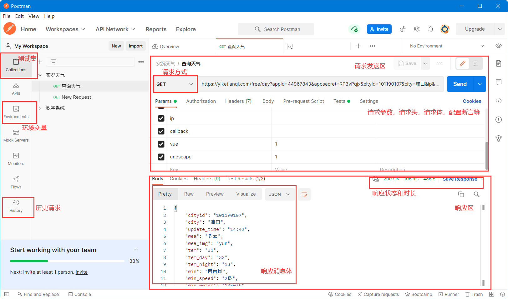
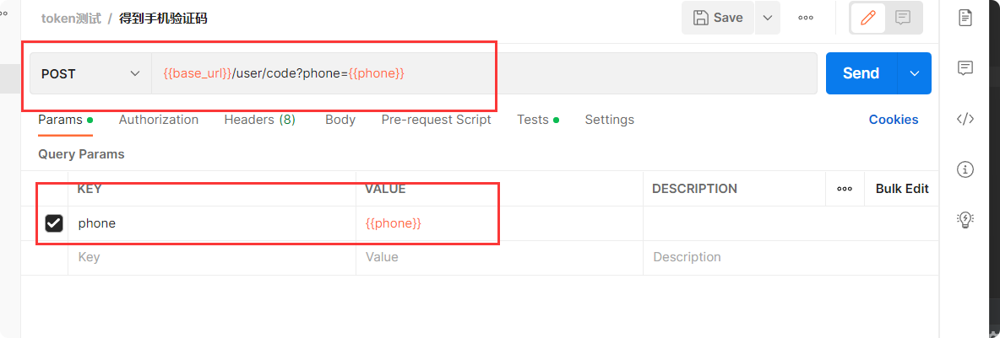
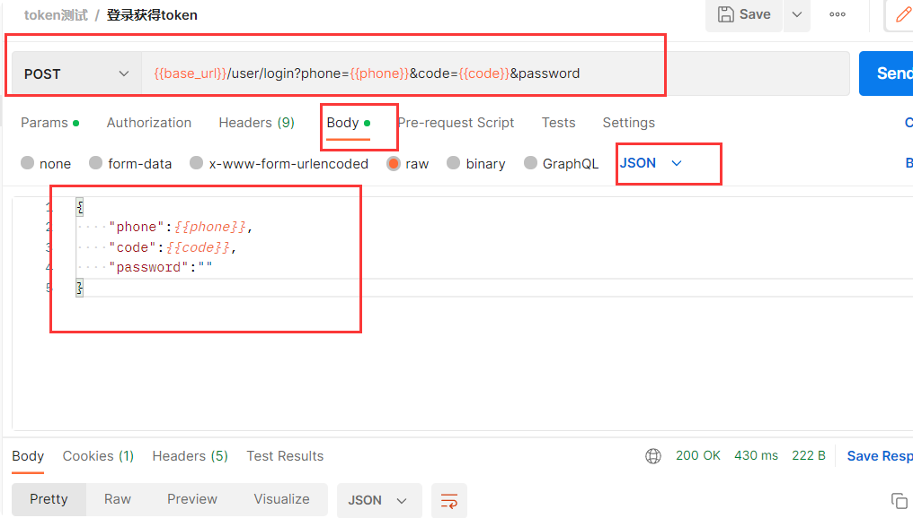
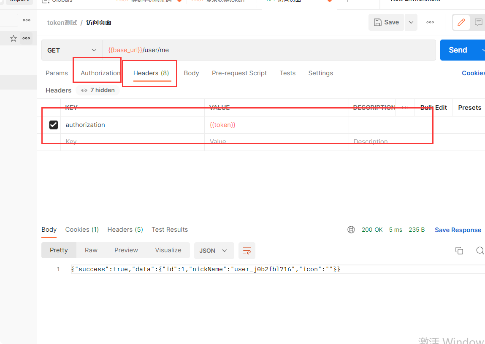

# postman
Postman官网下载地址：https://www.getpostman.com/apps

## 文档
1.官方英文文档 https://learning.postman.com/docs/getting-started/introduction/  

2 chrome插件整理的 [Postman API 中文白皮书文档_Postman使用教程 - Chrome开发者工具插件 - 画夹插件网](http://chromecj.com/web-development/2017-12/870.html)

## 下载
[Postman for windows X64](https://app.getpostman.com/app/download/win64?_ga=2.201562513.1250696341.1530543681-1582181135.1530543681)

[Postman for windows X86](https://app.getpostman.com/app/download/win32?_ga=2.21151352.2119858274.1527039878-1088353859.1527039878)

[Postman for linux X64](https://app.getpostman.com/app/download/linux64?_ga=2.96050783.2119858274.1527039878-1088353859.1527039878)

[Postman for Linux X86](https://app.getpostman.com/app/download/linux32?_ga=2.96050783.2119858274.1527039878-1088353859.1527039878)

## 安装

下载双击安装。需要注册登录。。。

## 使用

### 需求

1.手机得到验证码，把验证码保存到环境变量

2.手机登录，保存token到环境变量

3.访问所有页面，把token放到headers进行验证

### 实现

1)**获得手机验证码，新建断言Tests，添加到环境变量**

    
    //获取Response body
    var code = pm.response.json().data;
    //打印获取到的code，目的是看我们是否取到值
    console.log(code);
    //将code值 Set到环境变量里面，供后面的API调用
    pm.environment.set("code", code);
    
 
 

2)**登录获得token，新建断言Tests，添加到环境变量**

3) **最后一步，在需要token的接口中输入它{{token}}就可以了**

