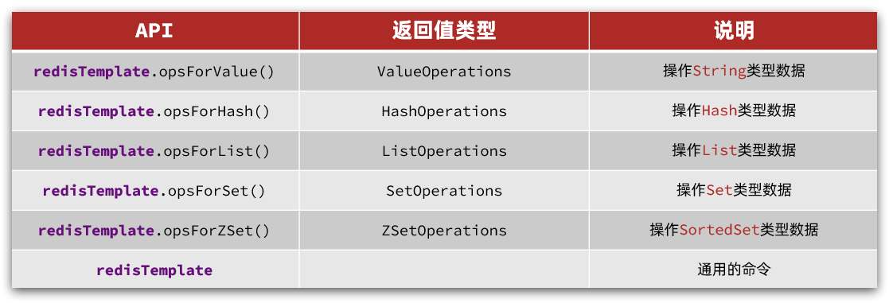
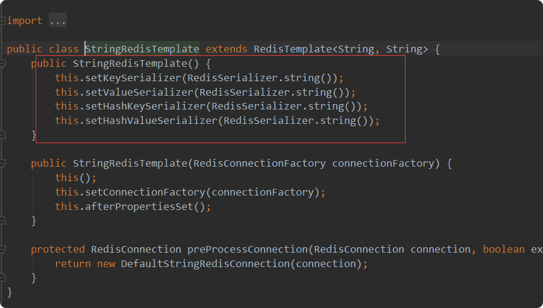

# spring-data-redis 客户端

SpringData 是 Spring 中数据操作的模块，包含对各种数据库的集成，其中对 Redis 的集成模块就叫做 SpringDataRedis，官网地址：https://spring.io/projects/spring-data-redis

- 提供了对不同 Redis 客户端的整合（Lettuce 和 Jedis）
- 提供了 RedisTemplate 统一 API 来操作 Redis
- 支持 Redis 的发布订阅模型
- 支持 Redis 哨兵和 Redis 集群
- 支持基于 Lettuce 的响应式编程
- 支持基于 JDK、JSON、字符串、Spring 对象的数据序列化及反序列化
- 支持基于 Redis 的 JDKCollection 实现

> SpringDataRedis 中提供了 RedisTemplate 工具类，其中封装了各种对 Redis 的操作。并且将不同数据类型的操作 API 封装到了不同的类型中：
  

## 依赖

> *SpringBoot 已经提供了对 SpringDataRedis 的支持，使用非常简单*。

        <!--redis依赖-->
        <dependency>
            <groupId>org.springframework.boot</groupId>
            <artifactId>spring-boot-starter-data-redis</artifactId>
        </dependency>
        <!--common-pool-->
        <dependency>
            <groupId>org.apache.commons</groupId>
            <artifactId>commons-pool2</artifactId>
        </dependency>

## yml配置
> spring 默认使用lettuce，要使用jedis需要引入jedis相关依赖

    spring:
      redis:
        host: 192.168.200.130
        port: 6379
        password: 123321
        lettuce:  //spring 默认使用lettuce，要使用jedis需要引入jedis相关依赖
          pool:
            max-active: 8 #最大连接
            max-idle: 8   #最大空闲连接
            min-idle: 0   #最小空闲连接
            max-wait: 1000ms  #连接等待时间

## 入门案例

    
      @SpringBootTest
      @RunWith(SpringRunner.class)
      public class SpringDataRedisApplicationTest {
      
          @Autowired
          private RedisTemplate redisTemplate;
      
          @Test
          public void String(){
              redisTemplate.opsForValue().set("springdataredis","测试OK");
      
              Object o = redisTemplate.opsForValue().get("springdataredis");
      
              System.out.println(o);
          }
      
      }     
      

## 自定义序列化

默认是采用 JDK 序列化，得到的结果是这样的,自定义一下
    
由于没有导入springMVC依赖，所以要导入一下 json依赖
    
     <!--Jackson依赖 ,springmvc中自带依赖，这里由于没有，故引用-->
            <dependency>
                <groupId>com.fasterxml.jackson.core</groupId>
                <artifactId>jackson-databind</artifactId>
            </dependency>
            
配置类：                
    
    @Configuration
    public class RedisConfig {
    
        @Bean
        public RedisTemplate<String,Object> redisTemplate(RedisConnectionFactory connectionFactory){
            //创建RedisTemplate
            RedisTemplate<String,Object> template=new RedisTemplate<>();
            //设置连接工厂
            template.setConnectionFactory(connectionFactory);
            //创建序列化工具
            GenericJackson2JsonRedisSerializer jsonRedisSerializer=new GenericJackson2JsonRedisSerializer();
    
            //设置key的序列化
    
            template.setKeySerializer(RedisSerializer.string());
            template.setHashKeySerializer(RedisSerializer.string());
            //设置value的序列化
            template.setValueSerializer(jsonRedisSerializer);
            template.setHashValueSerializer(jsonRedisSerializer);
    
            return template;
    
        }
    }  
    
使用类：

user类：
 
    @Data
    @AllArgsConstructor
    @NoArgsConstructor
    public class User {
        private String name;
    
        private Integer age;
    }
    
    
test类：
    
    @SpringBootTest
    public class SpringDataRedisApplicationTest {
    
        @Autowired
        private RedisTemplate<String, Object> redisTemplate;
    
        @Test
        public void String() {
            redisTemplate.opsForValue().set("springdataredis", "测试OK");
    
            Object o = redisTemplate.opsForValue().get("springdataredis");
    
            System.out.println(o);
        }
    
        @Test
        public void putUser() {
            redisTemplate.opsForValue().set("user:1", new User("kimli", 20));
            Object o = redisTemplate.opsForValue().get("user:1");
            System.out.println(o);
    
        }
    
    }

**优点**：
- 自定义RedisTemplate方便，**自动序列化**
**缺点**
- 因为要自动序列化，redis存储内容带了class字节码文件，**浪费存储空间**

## StringRedisTemplate

> SpringDataRedis自带的StringRedisTemplate，定义了序列化都是**RedisSerializer.string()**

    
    public class SpringDataRedisStringTest {
    
        @Autowired
        private StringRedisTemplate redisTemplate;
    
        private static  ObjectMapper mapper=new ObjectMapper();//jackJson序列化
    
        @Test
        public void String() {
            redisTemplate.opsForValue().set("StringRedis", "测试OK");
    
            String s = redisTemplate.opsForValue().get("StringRedis");
    
            System.out.println(s );
        }
    
        @Test
        public void putUser() throws JsonProcessingException {
            User user = new User("洋哥", 22);
            //序列化存入
            redisTemplate.opsForValue().set("user:2",mapper.writeValueAsString(user));
    
            String s = redisTemplate.opsForValue().get("user:2");
            
            //反序列化
            User user1 = mapper.readValue(s, user.getClass());
    
            System.out.println(user1.toString());
        }
    }

