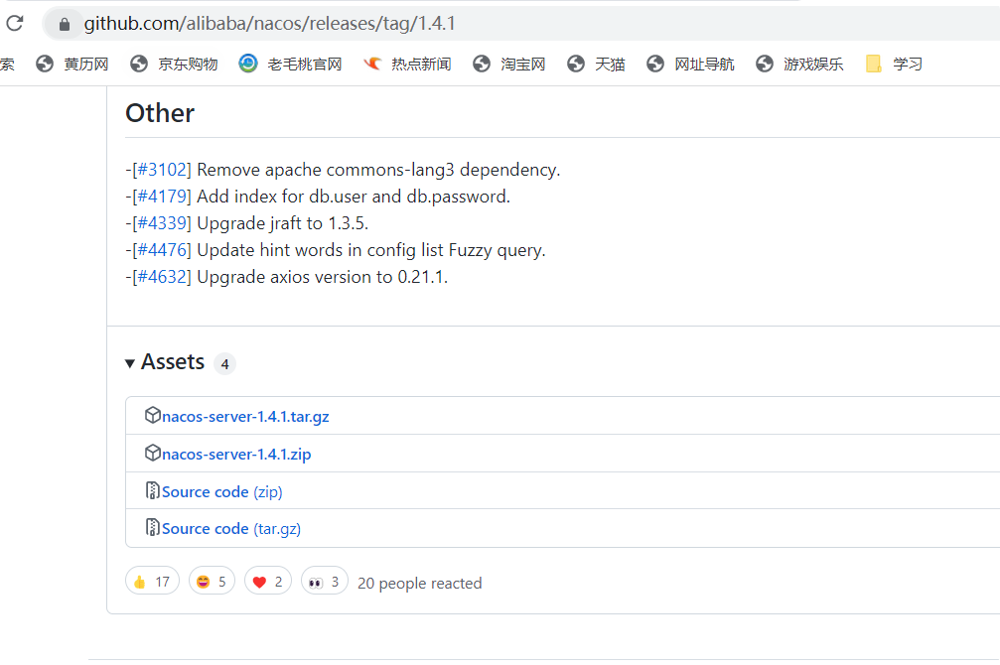
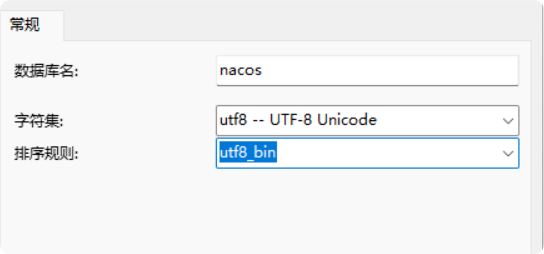
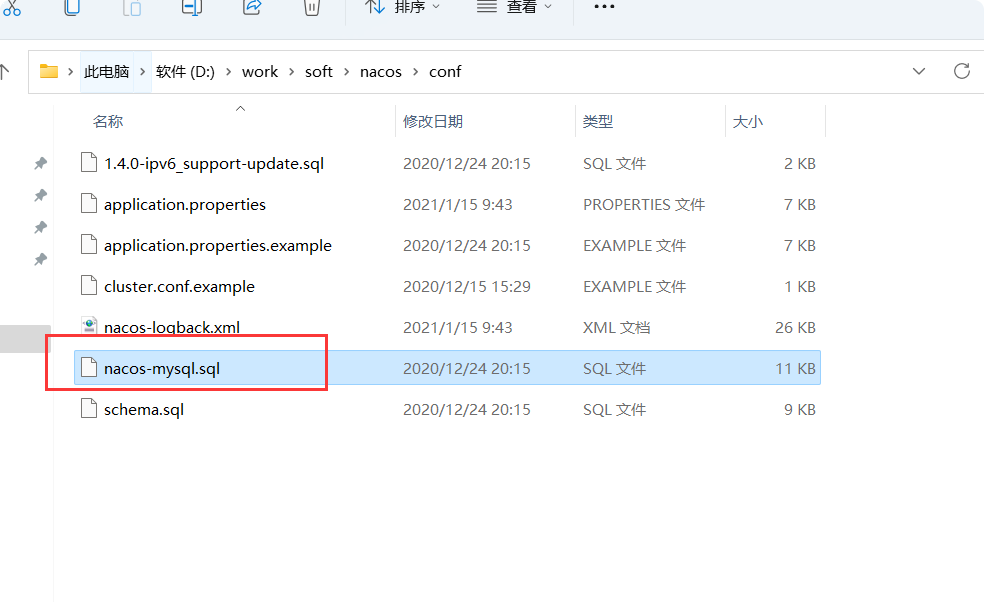
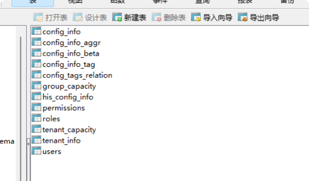
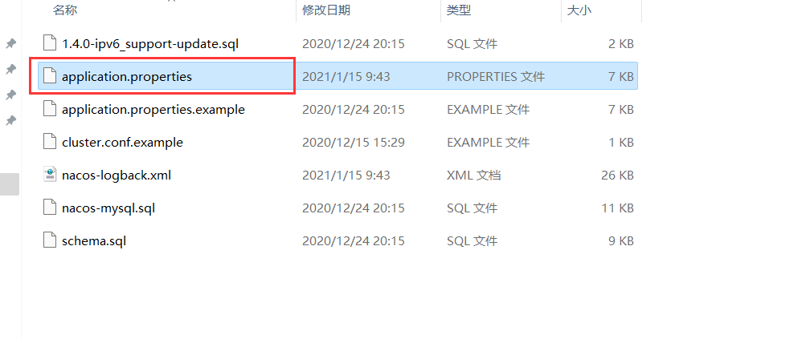
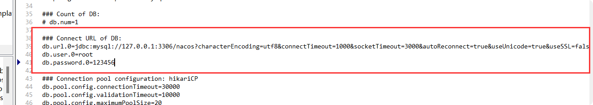
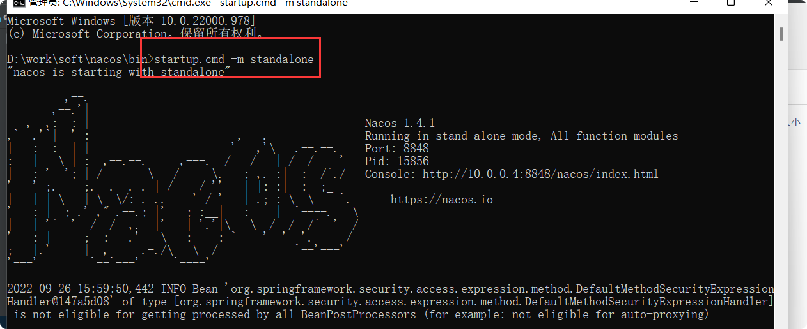
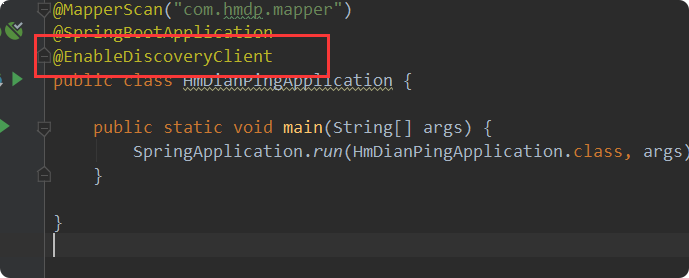
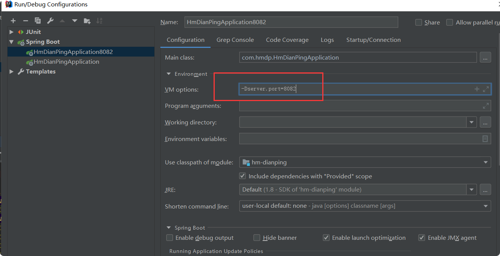

# Nacos安装与使用

官网地址:https://github.com/alibaba/nacos

## 下载地址
下载的是1.4.1版本：https://github.com/alibaba/nacos/releases/tag/1.4.1

## Windows安装
### 解压
> 直接解压到D:\work\soft\nacos

### 创建nacos数据库
1)**创建数据库**

2)**导入nacos数据**
> nacos数据库文件地址：nacos/conf 下

### 修改配置文件
1)**修改config下application.properties**

 这里修改为自己的数据库链接地址，填写数据库账号和密码  
 
     db.url.0=jdbc:mysql://127.0.0.1:3306/nacos?characterEncoding=utf8&connectTimeout=1000&socketTimeout=3000&autoReconnect=true&useUnicode=true&useSSL=false&serverTimezone=UTC
     db.user.0=root
     db.password.0=123456

### 启动
进入：D:\work\soft\nacos\bin目录。cmd

#### 单机启动
    
    startup.cmd -m standalone
    

访问地址:http://localhost:8848/nacos/index.html  
账号：nacos  
密码：nacos  

## Linux安装

## 依赖与配置
### 依赖
    
    <dependency>
                <groupId>com.alibaba.cloud</groupId>
                <artifactId>spring-cloud-starter-alibaba-nacos-discovery</artifactId>
                <version>2.2.6.RELEASE</version>
            </dependency>
            
            
### 配置

        server:
          port: 8081
        spring:
          application:
            name: hmdp
          cloud:
            nacos:
              discovery:
                namespace: public
                server-addr: localhost:8848 #nacos服务地址
                username: nacos
                password: nacos
                
                
    
### @EnableDiscoveryClient

在启动类上开启服务发现

### 启动项目
    

### 项目修改端口8082启动

    -Dserver.port=8082

