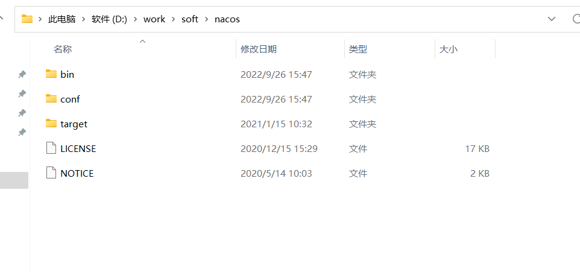
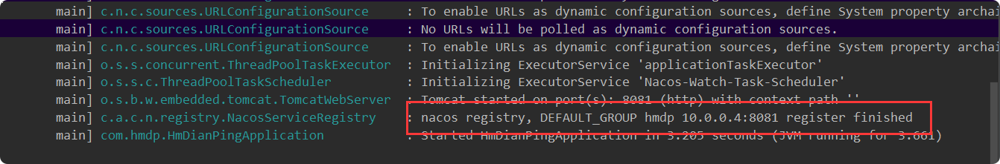

# Nacos安装与使用

官网地址:https://github.com/alibaba/nacos

## 下载地址
下载的是1.4.1版本：https://github.com/alibaba/nacos/releases/tag/1.4.1

## Windows安装
### 解压
> 直接解压到D:\work\soft\nacos

### 创建nacos数据库
1)**创建数据库**

2)**导入nacos数据**
> nacos数据库文件地址：nacos/conf 下

### 修改配置文件
1)**修改config下application.properties**

 这里修改为自己的数据库链接地址，填写数据库账号和密码  
 
     db.url.0=jdbc:mysql://127.0.0.1:3306/nacos?characterEncoding=utf8&connectTimeout=1000&socketTimeout=3000&autoReconnect=true&useUnicode=true&useSSL=false&serverTimezone=UTC
     db.user.0=root
     db.password.0=123456

### 启动
进入：D:\work\soft\nacos\bin目录。cmd

#### 单机启动
    
    startup.cmd -m standalone
    

访问地址:http://localhost:8848/nacos/index.html  
账号：nacos  
密码：nacos  

## docker安装
1.拉取镜像

    docker pull nacos/nacos-server:1.4.1

2.创建数据卷

    mkdir -p  /usr/local/nacos/logs/                      #新建logs目录
    mkdir -p /usr/local/nacos/init.d/          
    
3.新建数据库
    
    初始化数据库表
    创建名为nacos的数据库
    运行 nacos-mysql.sql文件建表
      
4，新建配置文件

    vim /usr/local/nacos/init.d/application.properties 

> 配置文件内容
    
    # spring
    
    server.contextPath=/nacos
    server.servlet.contextPath=/nacos
    server.port=8848
    
    spring.datasource.platform=mysql
    db.num=1
    db.url.0=jdbc:mysql://10.0.0.1:3306/nacos?characterEncoding=utf8&connectTimeout=1000&socketTimeout=3000&autoReconnect=true&useUnicode=true&useSSL=false&serverTimezone=UTC
    db.user=root
    db.password=123456
    # nacos.cmdb.dumpTaskInterval=3600
    # nacos.cmdb.eventTaskInterval=10
    # nacos.cmdb.labelTaskInterval=300
    # nacos.cmdb.loadDataAtStart=false
    
    
    # metrics for prometheus
    #management.endpoints.web.exposure.include=*
    
    # metrics for elastic search
    management.metrics.export.elastic.enabled=false
    #management.metrics.export.elastic.host=http://localhost:9200
    
    # metrics for influx
    management.metrics.export.influx.enabled=false
    #management.metrics.export.influx.db=springboot
    #management.metrics.export.influx.uri=http://localhost:8086
    #management.metrics.export.influx.auto-create-db=true
    #management.metrics.export.influx.consistency=one
    #management.metrics.export.influx.compressed=true
    
    server.tomcat.accesslog.enabled=true
    server.tomcat.accesslog.pattern=%h %l %u %t "%r" %s %b %D %{User-Agent}i
    # default current work dir
    server.tomcat.basedir=
    
    ## spring security config
    ### turn off security
    #spring.security.enabled=false
    #management.security=false
    #security.basic.enabled=false
    #nacos.security.ignore.urls=/**
    
    nacos.security.ignore.urls=/,/**/*.css,/**/*.js,/**/*.html,/**/*.map,/**/*.svg,/**/*.png,/**/*.ico,/console-fe/public/**,/v1/auth/login,/v1/console/health/**,/v1/cs/**,/v1/ns/**,/v1/cmdb/**,/actuator/**,/v1/console/server/**
    
    # nacos.naming.distro.taskDispatchPeriod=200
    # nacos.naming.distro.batchSyncKeyCount=1000
    # nacos.naming.distro.syncRetryDelay=5000
    # nacos.naming.data.warmup=true
    # nacos.naming.expireInstance=true
    
    nacos.istio.mcp.server.enabled=false

5.运行
    
    docker  run \
    --name nacos -d \
    -p 8848:8848 \
    --privileged=true \
    --restart=always \
    -e JVM_XMS=256m \
    -e JVM_XMX=256m \
    -e MODE=standalone \
    -e PREFER_HOST_MODE=hostname \
    -v /usr/local/nacos/logs:/home/nacos/logs \
    -v /usr/local/nacos/init.d/application.properties:/home/nacos/init.d/custom.properties \
    nacos/nacos-server:1.4.1
    
    
6.访问
## 依赖与配置
### 依赖
    
    <dependency>
                <groupId>com.alibaba.cloud</groupId>
                <artifactId>spring-cloud-starter-alibaba-nacos-discovery</artifactId>
                <version>2.2.6.RELEASE</version>
            </dependency>
            
            
### 配置

        server:
          port: 8081
        spring:
          application:
            name: hmdp
          cloud:
            nacos:
              discovery:
                namespace: public
                server-addr: localhost:8848 #nacos服务地址
                username: nacos
                password: nacos
                
                
    
### @EnableDiscoveryClient

在启动类上开启服务发现

### 启动项目
    

### 项目修改端口8082启动

    -Dserver.port=8082

日常问题记录