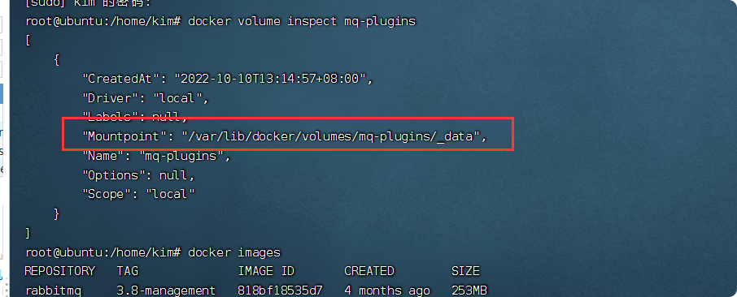
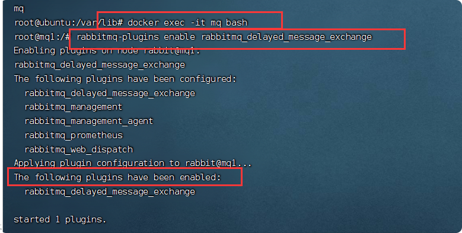
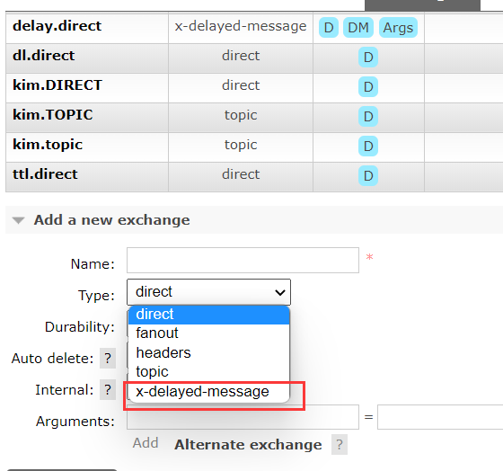

# RabbitMQ安装与使用

##  docker单机部署

### 拉取镜像
    docker pull rabbitmq:3.8-management
    
### 运行容器

- -e RABBITMQ_DEFAULT_USER=kim设置用户名为kim；
- -e RABBITMQ_DEFAULT_PASS=123456设置密码为123456；
- -v mq-plugins:/plugins挂载数据卷；
- --name mq容器名mq；
- --hostname mq1主机名mq1；
- -p 15672:15672管理界面端口（此处前面的端口是我们设置的，后面的是需要被映射的，下同）；
- -p 5672:5672MQ端口（内部使用）；

    docker run \
     -e RABBITMQ_DEFAULT_USER=kim \
     -e RABBITMQ_DEFAULT_PASS=123456 \
     -v mq-plugins:/plugins \
     --name mq \
     --hostname mq1 \
     -p 15672:15672 \
     -p 5672:5672 \
     -d \
     rabbitmq:3.8-management
     
     

访问地址：http://192.168.171.132:15672

## 延迟队列插件

插件安装指南：[Scheduling Messages with RabbitMQ](https://links.jianshu.com/go?to=https%3A%2F%2Fblog.rabbitmq.com%2Fposts%2F2015%2F04%2Fscheduling-messages-with-rabbitmq)。
官方插件社区：[Community Plugins — RabbitMQ](https://links.jianshu.com/go?to=https%3A%2F%2Fwww.rabbitmq.com%2Fcommunity-plugins.html)。
插件下载地址：[Releases · rabbitmq/rabbitmq-delayed-message-exchange · GitHub](https://links.jianshu.com/go?to=https%3A%2F%2Fgithub.com%2Frabbitmq%2Frabbitmq-delayed-message-exchange%2Freleases)。
### 下载插件
- 数据卷地址查看指令：docker volume inspect mq-plugins
- chmod -R 777 /var/lib/docker
- 将插件上传到数据卷目录/var/lib/docker/volumes/mq-plugins/_data

### 安装插件

- 进入容器内部：docker exec -it mq bash
- 启动插件：rabbitmq-plugins enable rabbitmq_delayed_message_exchange

### [error] Cookie file /var/lib/rabbitmq/.erlang.cookie must be accessible by owner only

    docker exec -it mq bash
    
    chmod 600 /var/lib/rabbitmq/.erlang.cookie
    
    
    rabbitmq-plugins enable rabbitmq_delayed_message_exchange

    