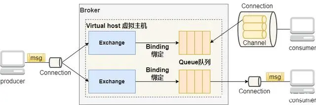
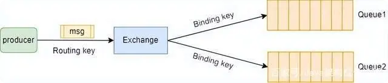
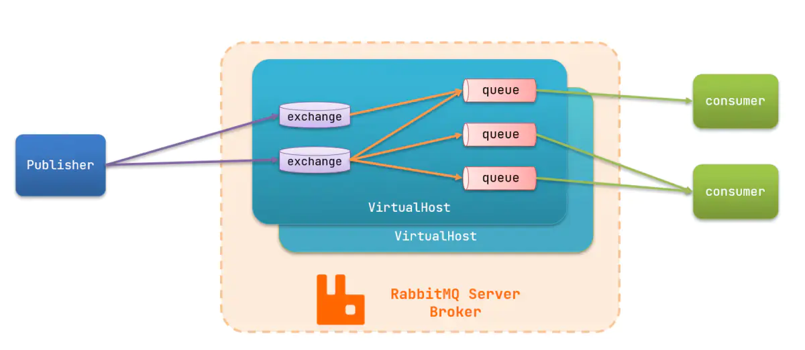
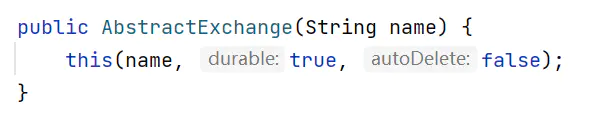
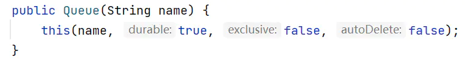
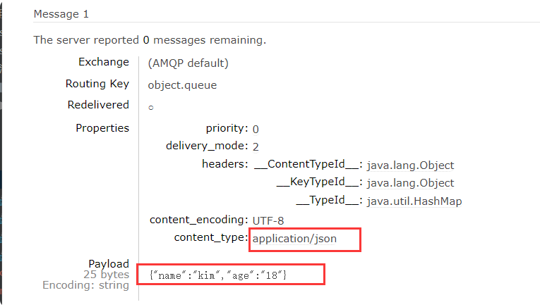

# RabbitMQ理论与原理

## RabbitMQ的5大核心概念
> RabbitMQ的5大核心概念：**Connection（连接）**、**Channel（信道）**、**Exchange（交换机）**、**Queue（队列）**、**Virtual host（虚拟主机）**

RabbitMQ的工作模型

**描述**：  
中间的Broker表示RabbitMQ服务，每个Broker里面至少有一个Virtual host虚拟主机，每个虚拟主机中有自己的Exchange交换机、Queue队列以及Exchange交换机与Queue队列之间的绑定关系Binding。producer（生产者）和consumer（消费者）通过与Broker建立Connection来保持连接，然后在Connection的基础上建立若干Channel信道，用来发送与接收消息。  

### **Connection（连接）**

每个producer（生产者）或者consumer（消费者）要通过RabbitMQ发送与消费消息，首先就要与RabbitMQ建立连接，这个连接就是Connection。Connection是一个TCP长连接。

### **Channel（信道）**

Channel是在Connection的基础上建立的虚拟连接，RabbitMQ中大部分的操作都是使用Channel完成的，比如：声明Queue、声明Exchange、发布消息、消费消息等。  

**多线程下，每个线程创建单独的Channel进行通信**，Connection与Channel之间的关系可以比作光纤电缆，如果把Connection比作一条光纤电缆，那么Channel就相当于是电缆中的一束光纤。

### **Virtual host（虚拟主机）**

Virtual host是一个虚拟主机的概念，一个Broker中可以有多个Virtual host，每个Virtual host都有一套自己的Exchange和Queue，同一个Virtual host中的Exchange和Queue不能重名，不同的Virtual host中的Exchange和Queue名字可以一样。这样，不同的用户在访问同一个RabbitMQ Broker时，可以创建自己单独的Virtual host，然后在自己的Virtual host中创建Exchange和Queue，很好地做到了**不同用户之间相互隔离的效果**。  

### **Queue（队列）**

Queue是一个用来存放消息的队列，生产者发送的消息会被放到Queue中，消费者消费消息时也是从Queue中取走消息。

### **Exchange（交换机）**
> 主要负责根据不同的分发规则将消息分发到不同的Queue,Exchange通过Routing key（路由键，通常叫作Binding key）来绑定交换机与队列，用于转发消息到相应的队列里面

#### fanout(广播)
fanout是扇形的意思，该类型通常叫作广播类型。fanout类型的Exchange不处理Routing key，而是会**将发送给它的消息路由到所有与它绑定的Queue上**。

#### direct（直接）
direct的意思是直接的，direct类型的Exchange会将消息转发到指定Routing key的Queue上，Routing key的解析规则为**精确匹配**。也就是只有当producer发送的消息的Routing key与某个Binding key相等时，消息才会被分发到对应的Queue上。
#### topic（主题）

topic的意思是主题，topic类型的Exchange会根据通配符对Routing key进行匹配，只要Routing key满足某个通配符的条件，就会被路由到对应的Queue上。通配符的匹配规则如下：

- Routing key必须是一串字符串，每个单词用“.”分隔；

- 符号“#”表示匹配一个或多个单词:如：“#.123” 既能够匹配到 “abc.123”，也能匹配到 “abc.def.123”。

- 符号“*”表示匹配一个单词。如：“*.123” 能够匹配到 “abc.123”,但匹配不到 “abc.def.123”

#### headers

headers Exchange中，Exchange与Queue之间的绑定不再通过Binding key绑定，而是通过Arguments绑定  

producer在发送消息时可以添加headers属性，Exchange接收到消息后，会解析headers属性，只要我们上面配置的Arguments中的所有属性全部被包含在Headers中并且值相等，那么这条消息就会被路由到对应的Queue中。

### 简单例子
#### 依赖
    
      <!--AMQP依赖，包含RabbitMQ-->
            <dependency>
                <groupId>org.springframework.boot</groupId>
                <artifactId>spring-boot-starter-amqp</artifactId>
            </dependency>

#### yml配置
pulisher
    
    logging:
      pattern:
        dateformat: MM-dd HH:mm:ss:SSS
    server:
      port: 8080
    
    spring:
      application:
        name: mq-pulisher
      rabbitmq:
        host: 192.168.171.132 # rabbitMQ的ip地址
        port: 5672 # 端口
        username: kim
        password: 123456
        virtual-host: /
        
comsumer

    server:
      port: 8081
    spring:
      application:
        name: mq-comsumer
      rabbitmq:
        host: 192.168.171.132 # rabbitMQ的ip地址
        port: 5672 # 端口
        username: kim
        password: 123456
        virtual-host: /
    logging:
      pattern:
        dateformat: MM-dd HH:mm:ss:SSS        

#### 代码
publisher：生产者测试类
    
    @SpringBootTest
    public class MQTest {
        @Autowired
        private RabbitTemplate rabbitTemplate;
    
        @Test
        public void dirctTest() {
            String exchangeName = "kim.DIRECT";
            String msg = "dirctTest测试";
            rabbitTemplate.convertAndSend(exchangeName, "red", msg);
        }
        @Test
        public void TOPICTest() {
            String exchangeName = "kim.TOPIC";
            String msg = "TOPICTest测试";
            rabbitTemplate.convertAndSend(exchangeName, "3333.2222.red.1111.4444", msg);
        }
    }
    
comsumer：消费者监听类
    
    @Slf4j
    @Component
    public class RabbitListenerTest {
    
        @RabbitListener(bindings = @QueueBinding(
                value=@Queue("DIRECT.queue"),
                exchange = @Exchange(name ="kim.DIRECT",type = ExchangeTypes.DIRECT),
                key ={"red","blue"}
        ))
        public void DIRECTListener(String msg ){
            System.out.println("MQ收到消息==="+msg);
        }
        @RabbitListener(bindings = @QueueBinding(
                value=@Queue("TOPIC.queue"),
                exchange = @Exchange(name ="kim.TOPIC",type = ExchangeTypes.TOPIC),
                key ={"*.red"}
        ))
        public void TOPICListener(String msg ){
            System.out.println("MQ收到消息==="+msg);
        }
        @RabbitListener(bindings = @QueueBinding(
                value=@Queue("TOPIC.queue"),
                exchange = @Exchange(name ="kim.TOPIC",type = ExchangeTypes.TOPIC),
                key ={"#.red.#"}
        ))
        public void TOPICListener2(String msg ){
            System.out.println("MQ收到消息===2222222"+msg);
        }
    }    

## RabbitMQ保证消息可靠性

### 消息丢失可能发生的节点

- 1.**发送时丢失**
    - 生产者发送的消息**未送达exchange**
    - 消息到达exchange后**未到达queue**
- 2.**MQ宕机**，queue队列里消息丢失
- 3.consumer接收到消息后**消费者未消费就宕机**

### 解决方案

#### 1.发送时丢失
> 生产者确认机制

RabbitMQ提供了publisher **confirm机制**来避免消息发送到MQ过程中丢失。消息发送到MQ以后，会返回一个结果给发送者，表示消息是否处理成功。

- **publisher-confirm**，发送者确认
    - 消息**成功投递**到exchange交换机，返回**ack**；
    - 消息**未投递**到exchange交换机，返回**nack**。
- **publisher-return**，发送者回执
    - 消息投递到交换机了，但是**没有路由到queue队列**。返回**ACK**，及路由失败原因。

注意：确认机制发送消息时，需要给每个消息**设置一个全局唯一id**，以区分不同消息，避免ack冲突。

>  1.application.yml配置

    spring:
      application:
        name: mq-comsumer
      rabbitmq:
        host: 192.168.171.132 # rabbitMQ的ip地址
        port: 5672 # 端口
        username: kim
        password: 123456
        virtual-host: /
        publisher-confirm-type: correlated
        publisher-returns: true
        template:
          mandatory: true
          
          
- **publish-confirm-type**：开启publisher-confirm，这里支持两种类型：
    - **simple**：同步等待confirm结果，直到超时;
    - **correlated**：异步回调，定义ConfirmCallback，MQ返回结果时会回调这个ConfirmCallback；
- **publish-returns**：开启publish-return功能，同样是基于callback机制，不过是定义ReturnCallback；
- **template.mandatory**：定义消息路由失败时的策略。
    - **true**，则调用ReturnCallback；
    - **false**：则直接丢弃消息。
 
    
> 2.给**生产者**RabbitTemplate配置ReturnCallback (**到交换机，没到队列queue**)   

注意：每个RabbitTemplate只能配置一个ReturnCallback。   

    @Slf4j
    @Configuration
    public class CommonConfig implements ApplicationContextAware {
        @Override
        public void setApplicationContext(ApplicationContext applicationContext) throws BeansException {
            RabbitTemplate rabbitTemplate = applicationContext.getBean(RabbitTemplate.class);
            rabbitTemplate.setReturnCallback((message, replyCode, replyTest, exchange, routingKey) -> {
                // 记录日志
                log.info("发送消息到队列失败，应答码{}，原因{}，交换机{}，路由键{}，消息{}",
                        replyCode, replyTest, exchange, routingKey, message.toString());
                // 重发消息代码........
    
                //此处省略了重发消息的代码实现，具体可以根据业务需求编写。
            });
        }
    }
    
    
> 3.代码实现ConfirmCallback;每个发送操作实现代码。（**判断是否到交换机exchange**）

        @Test
        public void testSendMessage2SimpleQueue() {
    
            String exchangeName = "kim.DIRECT";
            String msg = "testSendMessage2SimpleQueue测试";
            String routingKey = "red";
    
            // 消息ID，封装到
            CorrelationData correlationData = new CorrelationData(UUID.randomUUID().toString());
    
            correlationData.getFuture().addCallback(
                    result -> {
                        if (result.isAck()) {
                            // ack，消息发送成功
                            log.debug("消息发送到交换机成功，ID:{}", correlationData.getId());
                        } else {
                            // nack，消息发送失败
                            log.error("消息发送到交换机失败，ID:{}，原因{}", correlationData.getId(), result.getReason());
                            // 重发消息
                        }
                    },
                    ex -> {
                        // 记录日志
                        log.error("消息发送异常，ID:{}，原因{}", correlationData.getId(), ex.getMessage());
                        // 重发消息TODO
    
                    }
            );
    
            rabbitTemplate.convertAndSend(exchangeName, routingKey, msg,correlationData);
        }
    }
   
   
#### 2.**MQ宕机**，queue队列里消息丢失

##### 1.exchange交换机持久化(默认)
 
     @Bean
     public DirectExchange simpleExchange(){
         // 三个参数：交换机名称、是否持久化、当没有queue与其绑定时是否自动删除
         return new DirectExchange("simple.exchange", true, false);
     }
     
     
     
    @RabbitListener(bindings = @QueueBinding(
             value=@Queue(value = "TOPIC.queue",durable = "true"),
             exchange = @Exchange(name ="kim.TOPIC",type = ExchangeTypes.TOPIC,durable = "true"),
             key ={"#.red.#"}
     )) 
注意：其实直接new也是持久化，默认走如下方法：  

##### 2.queue消息队列持久化(默认)
    
    @Bean
    public Queue simpleQueue(){
        // 使用QueueBuilder构建队列，durable持久化
        return QueueBuilder.durable("simple.queue").build();
    }
    
    
    
    
       @RabbitListener(bindings = @QueueBinding(
                value=@Queue(value = "TOPIC.queue",durable = "true"),
                exchange = @Exchange(name ="kim.TOPIC",type = ExchangeTypes.TOPIC,durable = "true"),
                key ={"#.red.#"}
        ))

注意：直接new Queue("simple.queue");也是持久化的，如下：

##### 3.消息体msg持久化（默认）

    @Test
    public void testDurableMsg(){
        // 路由键
        String routingKey = "simple";
        // 消息体
        String message = "Hello, durable.";
        // 消息持久化
        Message msg = MessageBuilder
                .withBody(message.getBytes(StandardCharsets.UTF_8)) //消息体
                .setDeliveryMode(MessageDeliveryMode.PERSISTENT) //持久化
                .build();
        // 发送消息
        rabbitTemplate.convertAndSend("simple.exchange", routingKey, msg);
    }
    
注意：直接发送普通消息，默认也是持久化的，如下：    

    public static final MessageDeliveryMode DEFAULT_DELIVERY_MODE = MessageDeliveryMode.PERSISTENT;
    
    
#### 3.消费者未消费丢失（消费者确认消息）

##### 1.默认机制

> 当消费者出现异常后，消息会不断requeue（重新入队）到队列，再重新发送给消费者，然后再次异常，再次requeue，无限循环。

    spring:
      rabbitmq:
        listener:
          simple:
            prefetch: 1
            acknowledge-mode: auto # none，关闭ack；manual，手动ack；auto：自动ack
            
            
- **manual**：**手动ack**，需要在业务代码结束后，调用api发送ack；
- **auto**：**自动ack**，由spring监测listener代码是否出现异常，没有异常则返回ack；抛出异常则返回nack；
- **none**：**关闭ack**，MQ假定消费者获取消息后会成功处理，因此消息投递后立即被删除。

##### 2.Spring的retry机制

> Spring机制重试次数耗尽后，消息会被reject，丢弃。

    spring:
      rabbitmq:
        listener:
          simple:
            prefetch: 1
            retry:
              enabled: true # 开启消费失败重试
              initial-interval: 1000 # 初始失败等待时间为1秒
              multiplier: 3 # 下次失败等待时间的倍数，下次等待时长last*multiplier
              max-attempts: 3 # 最大重试次数
              stateless: true # 无状态；false则为有状态。业务中包含事务则改为false。
              

- 失败消息处理策略:在开启重试模式后，重试次数耗尽，如果消息依然失败，则需要由MessageRecoverer接口来处理。    

    - **RejectAndDontRequeueRecoverer**：重试耗尽后，直接reject，丢弃消息，**默认**就是这种方式；
    - **ImmediateRequeueMessageRecovere**r：重试耗尽后，**返回nack，消息重新入队**；
    - **RepublishMessageRecoverer**：重试耗尽后，将失败消息**投递到指定的交换机**。
    
    
> 代码实现

1.定义交换机和队列
   
    @Bean
    public DirectExchange errorMessageExchange(){
        return new DirectExchange("error.direct");
    }
    
    @Bean
    public Queue errorQueue(){
        return new Queue("error.queue", true);
    }
    
    @Bean
    public Binding errorBinding(){
        return BindingBuilder.bind(errorQueue()).to(errorMessageExchange()).with("error");
    }
    
    
2.覆盖重试机制
    
    @Bean
    public MessageRecoverer republishMessageRecoverer(RabbitTemplate rabbitTemplate){
        return new RepublishMessageRecoverer(rabbitTemplate, "error.exchange", "error");
    }
    
    
## 更改序列化方式

> 默认是jdk序列化，修改成json序列化

### 依赖

      <dependency>
                <groupId>com.fasterxml.jackson.core</groupId>
                <artifactId>jackson-databind</artifactId>
            </dependency>
            

### 覆盖配置
    
        @Bean
        public MessageConverter messageConverter(){
            return new Jackson2JsonMessageConverter();
        }
        
### 测试

      @Test
        public void  sentObject(){
            Map<String,String> map=new HashMap<>();
            map.put("name", "kim");
            map.put("age", "18");
            rabbitTemplate.convertAndSend("object.queue", map);
        }
        

## 死信交换机

> 如果队列**配置了dead-letter-exchange属性**，指定了一个交换机，那么队列中的死信就会投递到这个交换机中，而这个交换机称为死信交换机（Dead Letter Exchange，简称**DLX**）。
  

- **死信**
    - 消费者使用basic.reject或basic.nack声明**消费失败**，并且消息的requeue参数设置为false；
    - 消息是一个过期消息，**超时无人消费**；
    - 要投递的**队列消息堆积满**了，**最早的消息**可能成为死信。

- **TTL**也就是Time-To-Live。如果一个队列中的消息TTL结束仍未消费，则会变为死信。

    - 消息所在的**队列**设置了存活时间；
    - **消息本身**设置了存活时间。

### 死信交换机&TTL代码实现

#### 定义死信交换机（注解）
    
        /**
         * 死信交换机
         */
        @RabbitListener(
                bindings = @QueueBinding(
                        value = @Queue(name = "dl.queue",durable = "true"),
                        exchange = @Exchange(name = "dl.direct"),
                        key = {"dl"}
                )
        )
        public void DLListener(String msg){
            log.info("接收到dl.queue的延迟消息：{}", msg);
        }
        
        

#### 定义TTL交换机（配置）
    
    @Configuration
    public class TTLExchageConfig {
        @Bean
        public DirectExchange ttlExchage(){
            return new DirectExchange("ttl.direct");
        }
        @Bean
        public Queue ttlQueue(){
            return QueueBuilder.durable("ttl.queue")
                    .ttl(20000)
                    .deadLetterExchange("dl.direct")
                    .deadLetterRoutingKey("dl")
                    .build();
        }
        @Bean
        public Binding ttlBinding(){
            return BindingBuilder.bind(ttlQueue()).to(ttlExchage()).with("ttl");
        }
    
    }
    

#### 消费者
    
     @Test
        public void testTTLMsg(){
            // 路由键
            String routingKey = "ttl";
            // 消息体
            String message = "延迟队列测试";
            // 消息持久化
            Message msg = MessageBuilder
                    .withBody(message.getBytes(StandardCharsets.UTF_8)) //消息体
                    .setDeliveryMode(MessageDeliveryMode.PERSISTENT) //持久化
                    .setExpiration("8000")
                    .build();
            // 发送消息
            rabbitTemplate.convertAndSend("ttl.direct", routingKey, msg);
            log.debug("消息已经发送！！！");
        }
        

#### 总结

此处我们**设置了queue的超时时间**，以及**msg的超时时间**，最后MQ会以其中**较短的时间**来实现。   

## 延迟消息
>  利用TTL结合死信交换机，实现了消息发出后，消费者延迟收到消息的效果。这种消息模式就称为延迟队列（Delay Queue）模式。

- 两种方案
    - TTL+死信队列
    - 延迟队列插件
    
    
- 应用场景

- 延迟发送短信；
- 用户下单，如果用户在15 分钟内未支付，则自动取消；
- 预约工作会议，20分钟后自动通知所有参会人员。

### 延迟队列插件安装

查看[RabbitMQ安装与使用](RabbitMQ安装与使用.md)

### 延迟队列代码实现
#### 注解方式
> DelayExchange的本质还是官方的三种交换机，只是添加了延迟功能。因此使用时只需要声明一个交换机，交换机的类型可以是任意类型，然后设定delayed属性为true即可。
     
     @RabbitListener(bindings = @QueueBinding(
                value = @Queue(name = "delay.queue", durable = "true"),
                exchange = @Exchange(name = "delay.direct", delayed = "true"),
                key = "delay"
        ))
        public void listenDelayQueue(String msg){
            log.info("接收到delay.queue的延迟消息：{}", msg);
        }

#### 配置方式
    
    @Configuration
    public class DelayExchageConfig {
        @Bean
        public DirectExchange delayedExchange(){
            return ExchangeBuilder
                    .directExchange("delay.direct")
                    .delayed()
                    .durable(true)
                    .build();
        }
    
        @Bean
        public Queue delayedQueue(){
            return new Queue("delay.queue");
        }
    
        @Bean
        public Binding delayedBinding(){
            return BindingBuilder.bind(delayedQueue()).to(delayedExchange()).with("delay");
        }
    }

#### 发送消息
    
    @Test
        public void testDelayedMsg(){
            // 路由键
            String routingKey = "delay";
            // 消息体
            String message = "Delay.延迟消息";
            // 消息延迟设置
            Message msg = MessageBuilder
                    .withBody(message.getBytes(StandardCharsets.UTF_8)) //消息体
                    .setHeader("x-delay", 10000)
                    .build();
            // 发送消息
            rabbitTemplate.convertAndSend("delay.direct", routingKey, msg);
        }
        
        
#### ReturnCallback处理逻辑
ReturnCallback里面添加判断

    // 判断是否是延迟消息
    if (message.getMessageProperties().getReceivedDelay() > 0) {
        // 是一个延迟消息，忽略这个错误提示
        return;
    }
    
## 消息堆积-惰性队列

- 解决消息堆积方法

    - 增加更多消费者，提高消费速度；
    - 在消费者内开启线程池加快消息处理速度；
    - 扩大队列容积，提高堆积上限。
    
### 惰性队列

> 从RabbitMQ的3.6.0版本开始，就增加了Lazy Queues的概念，也就是惰性队列。

- 接收到消息后直接**存入磁盘**而非内存；
- **消费者要消费消息时才会从磁盘中读取并加载到内存**；
- 支持数百万条的消息存储。

####  设置惰性队列

> 要设置一个队列为惰性队列，只需要在声明队列时，指定x-queue-mode属性为lazy即可。

可以通过命令行将一个运行中的队列修改为惰性队列，如下：

    rabbitmqctl set_policy Lazy "^lazy-queue$" '{"queue-mode":"lazy"}' --apply-to queues
    

#### SpringAMQP声明惰性队列

##### 配置方式
    
    @Bean
    public Queue lazyQueue(){
        return QueueBuilder
                .durable("lazy.queue")
                .lazy() // 开启x-queue-mode为lazy
                .build();
    }
    

##### 注解方式

    @RabbitListener(queuesToDeclare = @Queue(
            name = "lazy.queue",
            durable = "true",
            arguments = @Argument(name = "x-queue-mode", value = "lazy")
    ))
    public void listenLazyQueue(String msg){
        log.info("接收到lazy.queue的延迟消息：{}", msg);
    }
    
### 优缺点

- 优点
    - 基于磁盘存储，消息上限高；
    - 没有间歇性的page-out，性能比较稳定；
    
- 缺点
    - 基于磁盘存储，消息时效性会降低；
    - 性能受限于磁盘的IO。