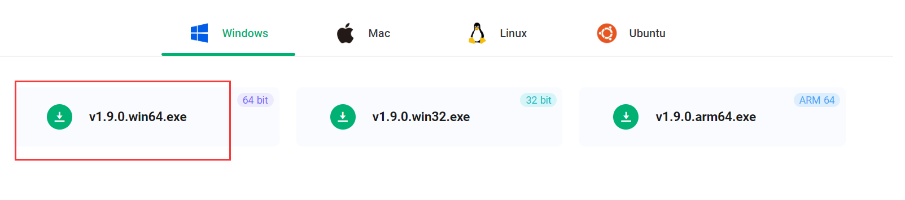
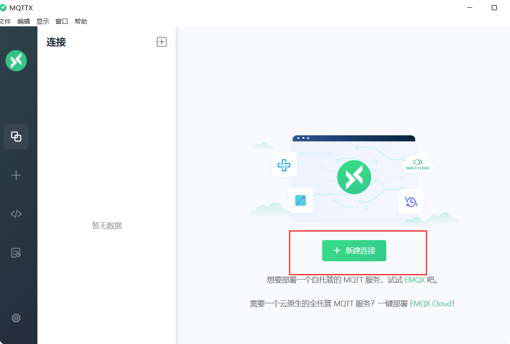
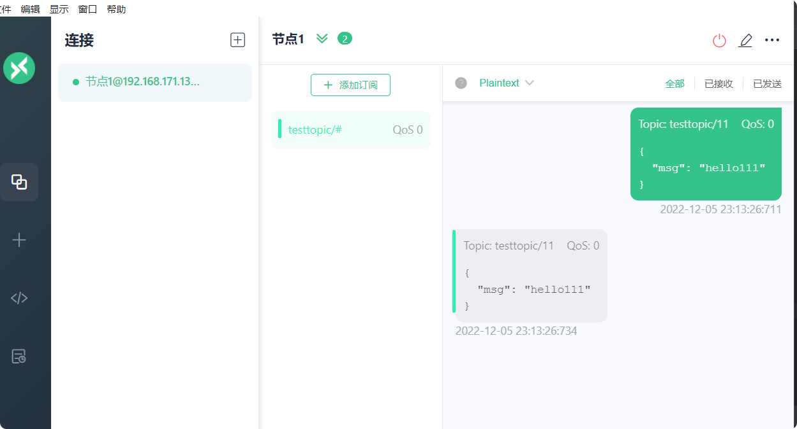

# emqx安装与使用

5.0官网地址 https://www.emqx.io/docs/zh/v5.0/

官网下载地址：https://www.emqx.com/zh/try?product=broker  

Github下载https://github.com/emqx/emqx/releases  

访问 (emqx.com)[https://www.emqx.com/zh/try?product=broker]或 (Github) [https://github.com/emqx/emqx/releases]下载EMQX 版本的二进制包。

> window和linux安装直接查看官网教程，https://www.emqx.io/docs/zh/v4.4/  

**直接记录docker安装集群**

## docker单机
> EMQX 5.0.11 for Docker

1. 获取 Docker 镜像

    docker pull emqx/emqx:5.0.11
    
2. 启动 Docker 容器

    docker run -d --name emqx -p 1883:1883 -p 8083:8083 -p 8084:8084 -p 8883:8883 -p 18083:18083 emqx/emqx:5.0.11
3.端口说明
    
这里开放了若干个端口，端口对应协议如下,最后一个没开，但是作为了解放在下表了。
    
端口|	描述
--|--
18083|	web端后台管理页端口
1883|	MQTT TCP 端口
8883|	MQTT TCP TLS/SSL 端口
8083|	HTTP and WebSocket 端口
8084|	HTTPS and WSS 端口
8080|	MGMT API 端口

4.访问 http://192.168.171.132:18083/

    admin 
    public
    
    进去之后要修改密码
    
## 客户端
下载地址：https://mqttx.app/zh

## 集群

## 使用
