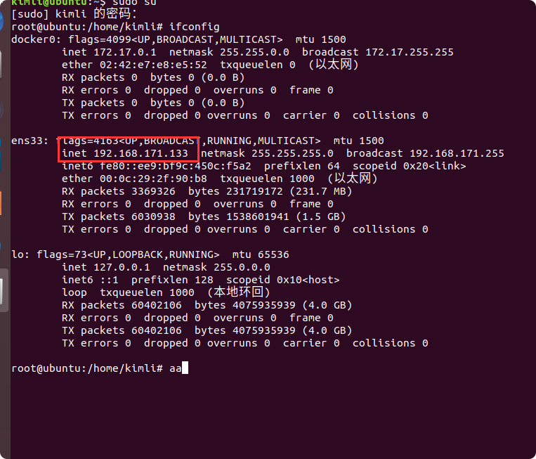

# Linux

## 目录结构

目录|功能|缩写备注
--|--|--
/bin ->/usr/bin|普通用户使用的命|Binary(二进制)
/boot|系统内核，引导程序相关文件	
/dev|设备文件|	Device(设备)
/etc|配置文件	
/home|普通用户的默认家目录	
/lib ->/usr/lib|库文件	
/lib64|库文件	
/media|挂载目录。系统建议用来挂载媒体设备，如软盘和光盘	
/mnt|挂载目录。如u盘,移动硬盘和其他操作系统的分区	
/opt|第三方安装的软件保存位置	
/proc|虚拟的文件系统（反映内核信息）	
/root|管理员root的家目录	
/sbin ->/usr/sbin|管理员使用的命令|Super User
/sys|文件系统sysfs	
/tmp|存放临时文件	
/var|日志文件	

## 常用命令
### 登录与注销

    1)	sudo useradd lilei  //添加用户 (不能被立即使用，需设置密码 sudo passwd lilei)  
    2)	sudo adduser lilei  //添加用户
    3)	login  //登录或切换用户
    4)	logout //注销用户（命令行）  exit(shell-退出控制台)
    5)	shutdown -h 10  //10分钟后自动关机	shutdown -c  //取消
    6)	halt(root用户)  //关闭所有进程后自动关机
    7)	poweroff //同上
    8)	shutdown -r 10 //十分钟后自动重启
    9)	init 6  //重启 （0-停机，1-单用户，2-多用户，3-完全多用户，4-图形化，5-安全模式，6-重启）
    10)	reboot  //重启
    

### 目录与文件
    
    1)	pwd   //显示当前工作目录
    2)	mkdir mydir  //创建工作目录
    3)	cd mydir  //更改工作目录
    4)	rmdir mydir //删除工作目录
    5)	touch myfile  //创建文件
    6)	mv myfile mydir  //移动目录或文件
    7)	cp myfile myfir  //复制目录或文件
    8)	rm -rf mydir  //删除目录或文件
    9)	ls -l myfile  //查看文件最后被编辑时间
    10)	ls -lu myfile //查看文件最后被访问时间
    11)	touch -at 01011212 myfile  //修改文件最后被访问时间
    12)	ls //列出所有文件和目录
    13)	ls -a //查看所有文件
    14)	ls -i //显示文件索引节点号
    15)	ls -l //详细显示
    16)	ls -m //以逗号分隔
    17)	sudo apt-get install tree 
    18)	tree -l//以树状图列出目录内容
    19)	tree -a //所有
    20)	tree -i //不以阶梯状
    21)	tree -s  //列出文件或目录大小
    22)	tree -t  //按更改时间
    23)	file -b myfile  //显示目录或文件的详细信息
    24)	stat myfile  //同上
    

### 文件内容显示
    
    1)	cat > myfile  //创建文件并编辑内容（ctrl+D结束编辑）
    2)	cat -n myfile  //查看文件
    3)	chmod [u/g/o/a][+/-/=][r/w/x] myfile  //更改文件权限
    u-user,g-group,o-others,a-all  .   +-添加,--删除,=-重置   .
    r-read读（4），w-write写（2），x-execute执行（1）
    4)	more myfile  //分页往后显示文件（Space空格）
    5)	less myfile  //分页自由显示文件（Page Down / Page Up）
    6)	head (-10) myfile  //指定显示文件前若干行（默认前10）
    7)	tail (-10) myfile  //指定显示文件后若干行（默认后10）

### 文件内容处理
    
    1)	sort myfile  //对文件内容进行排序
    2)	sort -r myfile  //逆序
    3)	uniq myfile  //检查文件中的重复内容
    4)	grep （-c）'a' myfile  //在文件中查找指定内容 (显示行号)
    5)	diff myfile01 myfile02  //对不同文件进行比较
    6)	diff3 myfile01 myfile02 myfile03  //三个文件
    7)	sdiff myfile01 myfile02  //合并
    8)	cmp myfile01 myfile02  //通过字节对不同文件进行比较
    9)	comm myfile01 myfile02  //对有序文件进行比较
    10)	cut -b(-c)(-d) 2(3) myfile  //对文件内容进行剪切
    11)	paste myfile02 myfile01 //对文件内容进行粘贴 02-）01
    12)	wc （-参数） myfile  //对文件内容进行统计 （c-字符数,w-单词数,l-行数） 
    
### 压缩
    
    1)	zip myfile.zip myfile  //压缩
    2)	zip -d myfile.zip myfile  //添加
    3)	zip -m myfile.zip myfile  //删除
    4)	unzip -o myfile.zip  //解压（覆盖）
    5)	unzip -n myfile.zip  //解压（不覆盖）
    6)	zipinfo myfile.zip  //列出压缩文件信息
    
### 获取帮助

    1)	man ls  //获取帮助
    2)	man -k ls  //不清楚完整名字
    3)	whatis ls  //获取帮助
    4)	help cd  / cd –help  //获取帮助 -d(简短描述) -s(用法简介)
    5)	info who  //获取帮助
    

### 其他命令
    
    1)	clear  //清楚屏幕信息
    2)	echo xx  //显示文本  x=0  echo $x . echo -e \$x . echo $(pwd)
    3)	date  //显示日期和时间（+%y 年  +%m 月  +%d日）
    4)	cal  //显示当前日期  cal -y
    5)	ps  //查看当前进程  -A(所有)  U  lilei (用户lilei)
    6)	kill -9 2315  //终止某一进程  
    7)	ps -ef | grep Jincheng
    8)	pkill Jincheng
    9)	killall Jincheng
    10)	last  //显示最近登录系统的用户信息-6列
    11)	history （10） //显示历史指令-默认1000行
    12)	sudo adduser lilei sudo  //给普通用户赋予root权限
    13)	sudo usermod -G sudo lilei  //同上
    14)	alias l=’ls’  //定义命令别名
    15)	unalias l  //删除别名
    16)	alias  //列出别名
    17) ifconfig ：查看网卡信息
    18) ping：查看与某台机器的连接情况
    19) netstat -an：查看当前系统端口
    20) chmod：修改文件权限
    

## 日常使用
### 更改镜像源ubuntu 18.04(bionic)

    1、进入目录
    cd /etc/apt
    2、拷贝文件
    cp sources.list source.list.bak
    
    更改镜像源
    vi sources.list
    :%d 快速清空内容
    添加
    
    deb http://mirrors.aliyun.com/ubuntu/ bionic main restricted universe multiverse
    deb-src http://mirrors.aliyun.com/ubuntu/ bionic main restricted universe multiverse
    
    deb http://mirrors.aliyun.com/ubuntu/ bionic-security main restricted universe multiverse
    deb-src http://mirrors.aliyun.com/ubuntu/ bionic-security main restricted universe multiverse
    
    deb http://mirrors.aliyun.com/ubuntu/ bionic-updates main restricted universe multiverse
    deb-src http://mirrors.aliyun.com/ubuntu/ bionic-updates main restricted universe multiverse
    
    # deb http://mirrors.aliyun.com/ubuntu/ bionic-proposed main restricted universe multiverse
    # deb-src http://mirrors.aliyun.com/ubuntu/ bionic-proposed main restricted universe multiverse
    
    deb http://mirrors.aliyun.com/ubuntu/ bionic-backports main restricted universe multiverse
    deb-src http://mirrors.aliyun.com/ubuntu/ bionic-backports main restricted universe multiverse
    
    更新镜像源
    
    apt-get update    
    

### 更改时区Ubuntu 18.04.5
    //查看时区
     timedatectl
    //更改为上海时区
    sudo timedatectl set-timezone Asia/Shanghai
    //查看时间
    date -R

### 更改IP地址Ubuntu 18.04.5

1) **切换到root权限**
    
    
    sudo su

2) **输入ifconfig 命令，查看当前网卡**
    
    
    ifconfig

 

3) **输入 route -n 查看当前网关**，这一步要注意，不然配置的时候网关不对会导致配置完之后虽然有IP，但是无法连接网络的情况。
    
    
    route -n

4) **编辑文件，设置固定IP，打开文件 vim /etc/netplan/01-network-manager-all.yaml 进行编辑**，如以下内容。

    network:
            version: 2
            renderer: NetworkManager
            ethernets:
                    ens33:
                            addresses: [192.168.171.132/24]
                            gateway4: 192.168.171.2
                            dhcp4: no

5) **重启网络命令 netplan apply 即可**

    netplan apply

### xshell不能连接虚拟机
> 由于xshell远程连接ubuntu是通过ssh协议的，所以，需要给ubuntu安装ssh服务器。

1.查看是有有shh

    ps -e | grep ssh   

没有看到sshd就说明未启动，选择下面的一种方式手动启动就好了

2.重启ssh
    
    service sshd start
    
如果Failed to start sshd.service: Unit sshd.service not found，就安装openssh-server  

3.按照openssh-server

    apt-get install openssh-server
    
4.重启ssh
    
    service ssh restart
