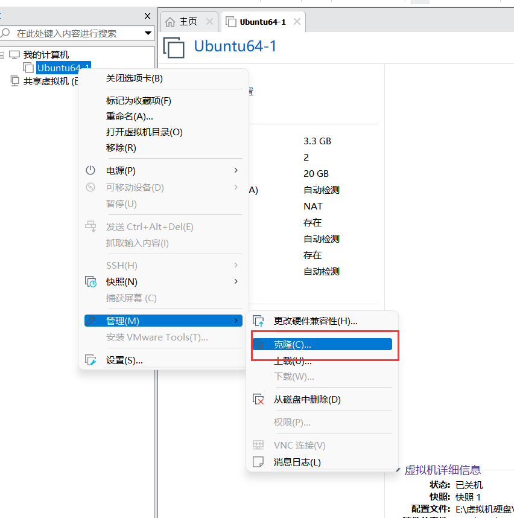

# 主要是VMware使用
## 克隆虚拟机
### 1.克隆文件

### 2.设置网络

### 3.设置新的hostname和ip

如果ip冲突需要重新设置ip

    //设置新的主机名。
    sudo vim /etc/hostname

    编辑网络配置文件：sudo vim /etc/network/interface
    
    重启网卡：sudo /etc/init.d/networking restart，然后查看ip地址，如果有错误就直接reboot。  
    

    

