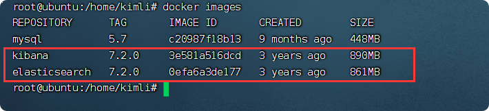
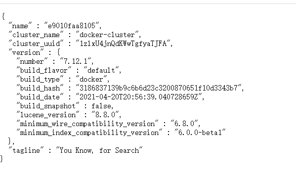
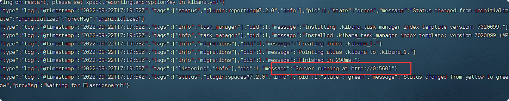
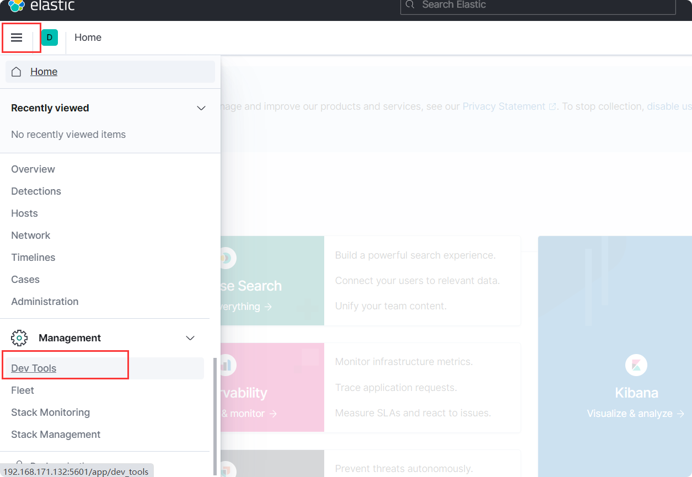
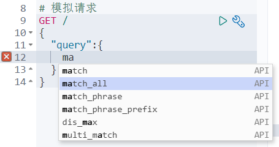
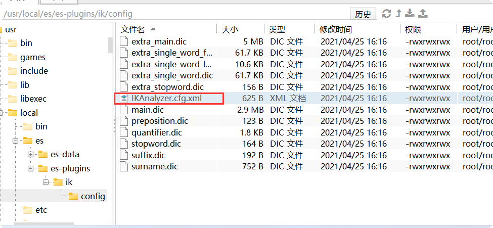
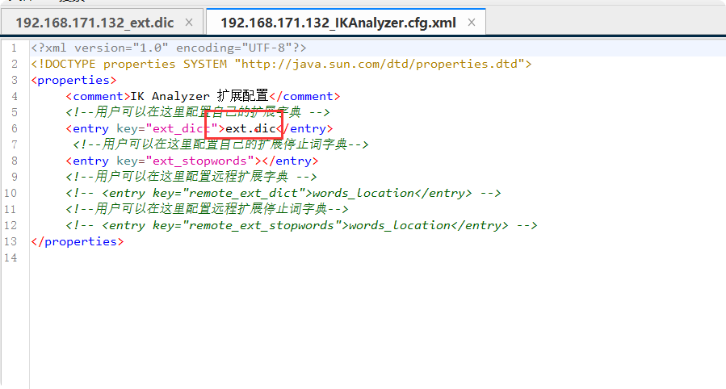
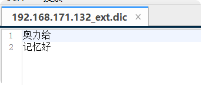
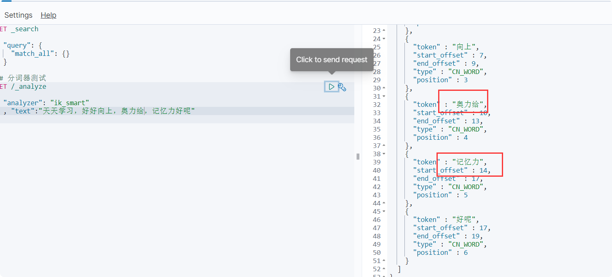
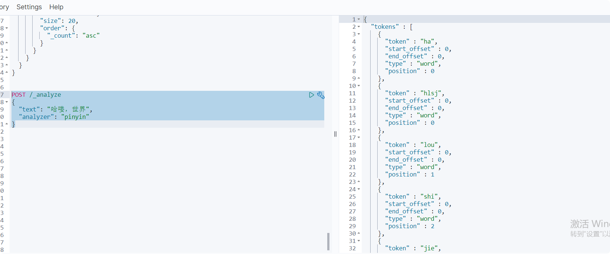

# ES安装与使用
安装环境：
- Ubuntu 18.04.5
- docker[安装步骤查看](/常用工具/docker.md)

## 单节点ES

### 1.创建网络
> 在docker里容器和容器之间是不通的需要创建一个网络

    docker network create elk

### 2.拉取es镜像
    
    docker pull elasticsearch:7.12.1
    docker pull kibana:7.12.1
    

### 3.运行docker命令，部署单点ES
    
       docker run -d \
        --name es \
           -e "ES_JAVA_OPTS=-Xms512m -Xmx512m" \
           -e "discovery.type=single-node" \
           -v /usr/local/es/es-data:/usr/share/elasticsearch/data \
           -v /usr/local/es/es-plugins:/usr/share/elasticsearch/plugins \
           --privileged \
           --network es-net \
           -p 9200:9200 \
           -p 9300:9300 \
       elasticsearch:7.12.1

命令解释：
- -e "cluster.name=es-docker-cluster"：设置集群名称
- -e "http.host=0.0.0.0"：监听的地址，可以外网访问
- -e "ES_JAVA_OPTS=-Xms512m -Xmx512m"：内存大小
- -e "discovery.type=single-node"：非集群模式
- -v es-data:/usr/share/elasticsearch/data：挂载逻辑卷，绑定es的数据目录/usr/local/es下
- -v es-logs:/usr/share/elasticsearch/logs：挂载逻辑卷，绑定es的日志目录/usr/local/es
- -v es-plugins:/usr/share/elasticsearch/plugins：挂载逻辑卷，绑定 es的插件目录
- --privileged：授予逻辑卷访问权
- --network es-net ：加入一个名为 es-net 的网络中
- -p 9200:9200：端口映射配置
- -p 9300:9300 ：docker内部集群通信端口。单点es可以去掉这个

### 4.验证启动

> http://192.168.171.132:9200 即可看到elasticsearch的响应结果：

**注意**：要给挂载文件权限。不然会报错
    
    cd /usr/local/es
    chmod 777 es
   

## 部署 kibana

### 1.运行docker命令，部署kibana

    docker run -d \
        --name kibana \
        -e ELASTICSEARCH_HOSTS=http://es:9200 \
        --network=es-net \
        -p 5601:5601  \
    kibana:7.12.1
    
- --network es-net ：加入一个名为es-net的网络中，与elasticsearch在同一个网络中
- -e ELASTICSEARCH_HOSTS=http://es:9200"：设置 elasticsearch的地址，**因为 kibana已经与 elasticsearch在一个网络，因此可以用容器名直接访问 elasticsearch**
- -p 5601:5601：端口映射配置

> kibana启动一般比较慢，需要多等待一会，可以通过命令：

    docker logs -f kibana

看到一下命令说明启动成功：

### 2.验证成功
> 访问 http://192.168.171.132:5601 ，即可看到结果

### 3.使用Dev Tools

> 可以编写DSL来操作elasticsearch,并且对DSL语句有自动补全功能。

## 安装IK分词器

> 在内部集成的分词不管使用英文还是中文，对于词的拆分都不是精确的。一般我们处理中文分词，会使用 IK分词器。
### 在线安装
    #cd 到挂载数据卷
    cd /usr/local/es/es-plugins
     
    mkdir ik
     
    chmod 777 ik
     
    cd ik
     
    wget https://github.com/medcl/elasticsearch-analysis-ik/releases/download/v7.12.1/elasticsearch-analysis-ik-7.12.1.zip

    unzip elasticsearch-analysis-ik-7.12.1.zip
    
    #解压之后一定要删除 zip，不然启动不了
    
    docker restart es
    
    docker logs -f es
    
    # 进入docker 查看
    docker exec -it es /bin/bash
     /usr/share/elasticsearch/plugins
     
### 使用
- IK分词器包含两种模式：

    - **ik_smart**：最少切分
    - **ik_max_word**：最细切分
    
    

### 扩展词词典

> 随着互联网的发展，“造词运动”也越发的频繁。出现了很多新的词语，在原有的词汇列表中并不存在。比如：“奥力给” 等。

所以我们的词汇也需要不断的更新，IK分词器提供了扩展词汇的功能。
1) **打开IK分词器config目录：**

2)**在IKAnalyzer.cfg.xml配置文件内容添加：**

3)**新建一个 ext.dic，可以参考config目录下复制一个配置文件进行修改**

4)**重启elasticsearch**

    docker restart es
    
    # 查看 日志
    docker logs -f es

5)**查看效果**

**其他字典配置类似**

## 拼音分词器
### 在线安装

    cd 到挂载数据卷
    cd /usr/local/es/es-plugins
     
    mkdir py
     
    chmod 777 py
     
    cd py
     
    wget https://github.com/medcl/elasticsearch-analysis-pinyin/releases/download/v7.12.1/elasticsearch-analysis-pinyin-7.12.1.zip

    unzip elasticsearch-analysis-pinyin-7.12.1.zip
    
    #解压之后一定要删除 zip，不然启动不了
    rm -rf  elasticsearch-analysis-pinyin-7.12.1.zip
    
    
    docker restart es
    
    docker logs -f es
    
    # 进入docker 查看
    docker exec -it es /bin/bash
    
### 测试
    
     POST /_analyze
     {
       "text": "哈喽，世界",
       "analyzer": "pinyin"
     }
     

   