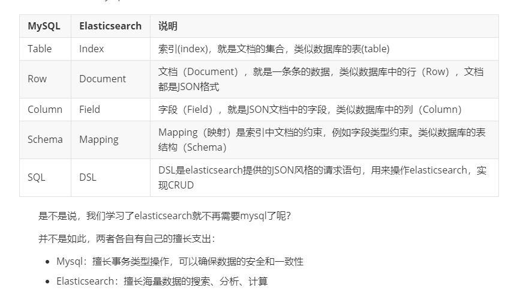
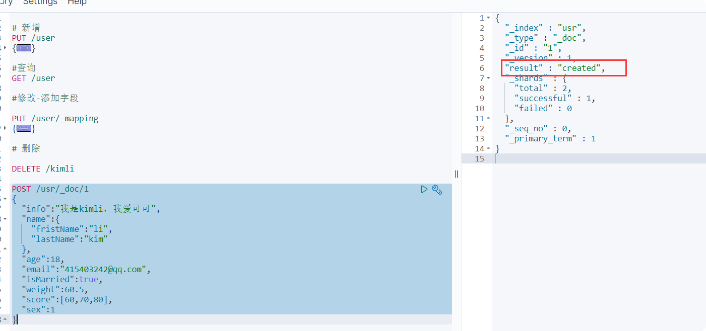
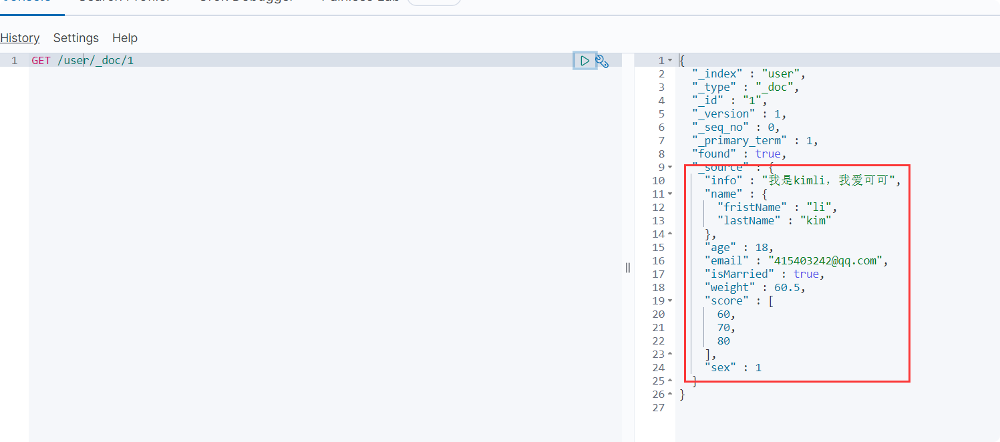
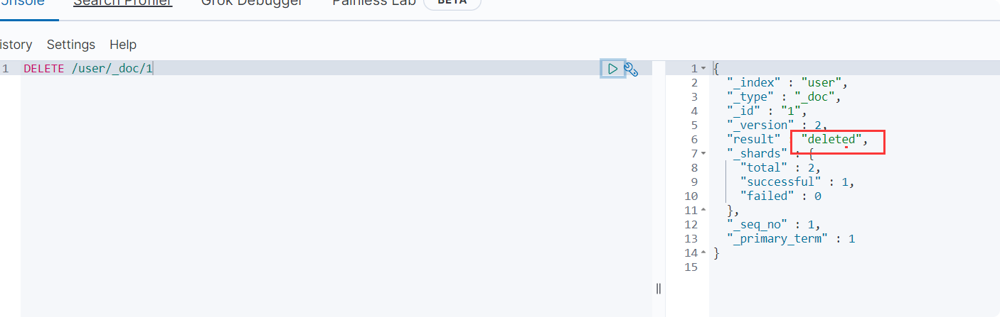
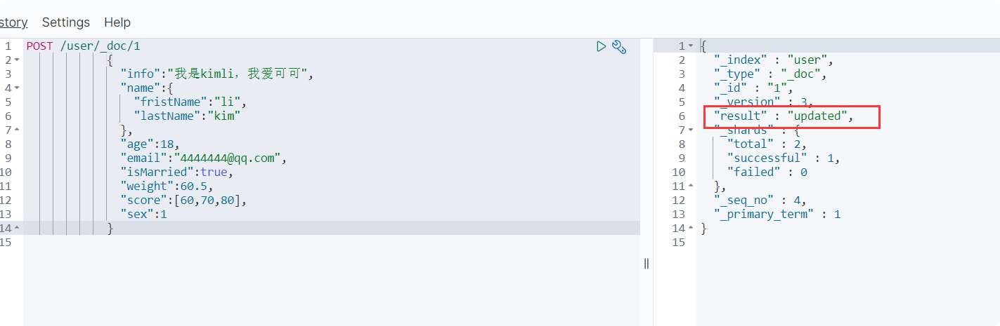
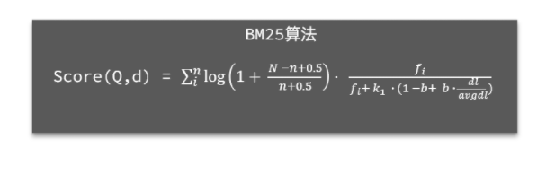
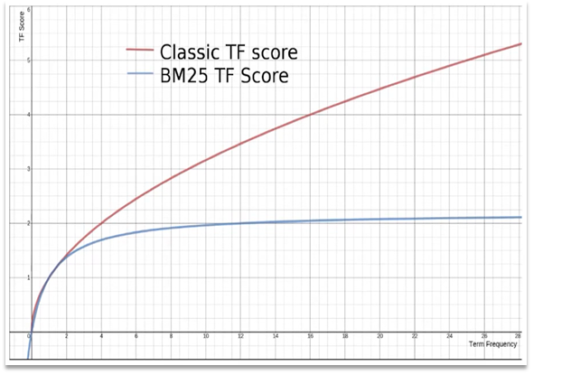
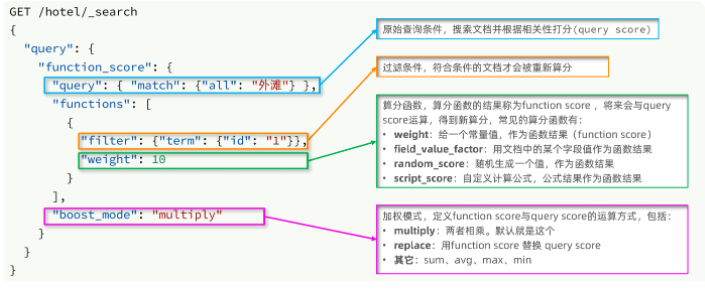
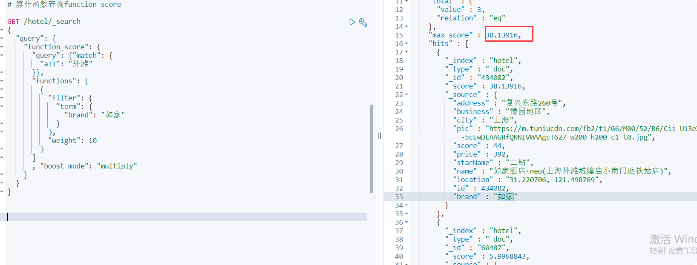
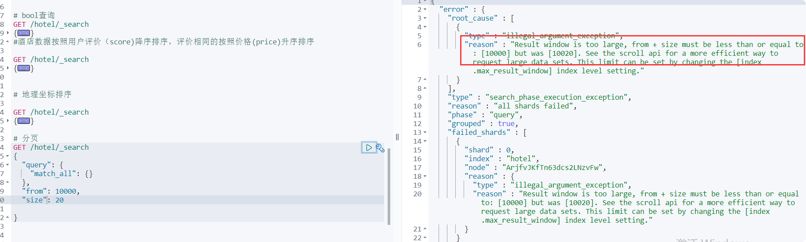

# ES理论与原理
> restf 接口

## ES与Mysql的对比

## 索引库CRUD

#### mapping映射属性

- mapping是对索引库中文档的约束，常见的mapping属性包括：

- type：字段数据类型，常见的简单类型有：
    - 字符串：text（可分词的文本）、keyword（精确值，例如：品牌、国家、ip地址）
    - 数值：long、integer、short、byte、double、float、
    - 布尔：boolean
    - 日期：date
    - 对象：object
    - 地理位置：geo_point/geo_shape
- index：是否创建倒排索引，默认为true
- analyzer：使用哪种分词器
- properties：该字段的子字段

### 新增

#### 基本语法

    - 请求方式：PUT
    - 请求路径：/索引库名，可以自定义
    - 请求参数：mapping映射
    - 格式：
    
    
    PUT /索引库名称
    {
      "mappings": {
        "properties": {
          "字段名":{
            "type": "text",
            "analyzer": "ik_smart"
          },
          "字段名2":{
            "type": "keyword",
            "index": "false"
          },
          "字段名3":{
            "properties": {
              "子字段": {
                "type": "keyword"
              }
            }
          },
          // ...略
        }
      }
    }

#### 示例
    
    PUT /user
    {
      "mappings": {
        "properties": {
          "info": {
            "type": "text",
            "analyzer": "ik_smart"
          },
          "email": {
            "type": "keyword",
            "index": false
          },
          "name": {
            "type": "object",
            "properties": {
              "fristName": {
                "type": "keyword"
              },
              "lastName": {
                "type": "keyword"
              }
            }
          },
          "age": {
            "type": "keyword",
            "index": false
          },
          "weight": {
            "type": "double",
            "index": false
          },
          "score": {
            "type": "integer",
            "index": false
          },
          "isMarried": {
            "type": "boolean",
            "index": false
          }
        }
      }
    }
    

### 查询

- 请求方式：GET /索引库名称

    - 请求路径：/索引库名
    
    - 请求参数：无
    

    GET /user

### 修改

> 倒排索引结构虽然不复杂，但是一旦数据结构改变（比如改变了分词器），就需要重新创建倒排索引，这简直是灾难。因此**索引库一旦创建，无法修改mapping**。  

- 修改索引库，添加新字段 

- 请求语法：PUT /索引库名/_mapping

    #修改-添加字段
    
    PUT /user/_mapping
    {
      "properties":{
        "sex":{
          "type":"integer",
          "index":false
        }
      }
    }

### 删除

语法：DELETE /索引库名

- 请求方式：DELETE

- 请求路径：/索引库名

- 请求参数：无

    DELETE /kimli
    
    

### 总结
   
   
- **创建**索引库：PUT /索引库名
- **查询**索引库：GET /索引库名
- **删除**索引库：DELETE /索引库名
- **修改**字段：PUT /索引库名/_mapping

## 文档CRUD
### 新增
#### 语法
    
    POST /索引库名/_doc/文档id
    {
        "字段1": "值1",
        "字段2": "值2",
        "字段3": {
            "子属性1": "值3",
            "子属性2": "值4"
        },
        // ...
    }

#### 例子
    
    POST /user/_doc/1
    {
      "info":"我是kimli，我爱可可",
      "name":{
        "fristName":"li",
        "lastName":"kim"
      },
      "age":18,
      "email":"415403242@qq.com",
      "isMarried":true,
      "weight":60.5,
      "score":[60,70,80],
      "sex":1
    }
    

### 查询

    GET /user/_doc/1

### 删除
#### 语法

    DELETE /{索引库名}/_doc/id值
#### 例子
    
    DELETE /user/_doc/1
    
   

### 修改 
- 修改有两种方式
    - **全量修改**：直接覆盖原理的文档，本质是：*根据id删除文档，新增一个相同的文档*
    - **增量修改**：修改文档的部分字段
    
#### 全量修改
    
    
            PUT  /user/_doc/1
            {
              "info":"我是kimli，我爱可可",
              "name":{
                "fristName":"li",
                "lastName":"kim"
              },
              "age":18,
              "email":"4444444@qq.com",
              "isMarried":true,
              "weight":60.5,
              "score":[60,70,80],
              "sex":1
            }

#### 增量修改

    
    POST /user/_update/1
    {
      "doc": {
        "info": "我是kimli，我爱可可妈妈"
      }
    }
    
    

### 总结

- **创建**文档：post /索引/_doc/id
- **查询**文档：GET  /索引/_doc/id
- **修改**文档：put  /索引/_doc/id或者 POST /索引/_update/id
- **删除**文档：delete   /索引/_doc/id

## 查询语法

### mysql批量导入数据

####依赖
    
            <dependency>
                <groupId>org.elasticsearch.client</groupId>
                <artifactId>elasticsearch-rest-high-level-client</artifactId>
                <version>7.12.1</version>
            </dependency>
    
            <properties>
                    <java.version>1.8</java.version>
                    <elasticsearch.version>7.12.1</elasticsearch.version>
                </properties>
                

#### 代码          
                
     @SpringBootTest
     public class HotelDataTest {
         private RestHighLevelClient client;
         @Autowired
         private IHotelService hotelService;
     
         /**
          * 批量添加数据
          */
         @Test
         void creatHotelIndex() throws IOException {
             List<Hotel> list = hotelService.list();
             BulkRequest request = new BulkRequest();
             for (Hotel hotel : list) {
                 HotelDoc hotelDoc = new HotelDoc(hotel);
                 request.add(new IndexRequest("hotel").id(hotel.getId().toString()).source(JSONUtil.toJsonStr(hotelDoc),XContentType.JSON));
             }
             client.bulk(request,RequestOptions.DEFAULT);
     
         }
     
         @BeforeEach
         void setUp() {
             client = new RestHighLevelClient(RestClient.builder(HttpHost.create("http://192.168.171.132:9200")));
         }
     
         @AfterEach
         void tearDown() throws IOException {
             client.close();
         }
     }

### 全文检索查询match_all、match、multi_match

> 对用户搜索的内容做**分词**，得到词条,根据词条去倒排索引库中匹配，得到文档id,根据文档id找到文档，返回给用户

- **match_all**:查询全部
- **match查询**：单字段查询(推荐用这个)，*把多个字段copy-to拷贝到一个字段去。因为多个字段查询低*
- **multi_match**查询：多字段查询，任意一个字段符合条件就算符合查询条件
- **wildcard**:通配符查询，类似**模糊查询**，前后跟**，例如："city":"北*"，查询城市以 北 开头的
#### match_all语法

    GET /hotel/_search
    {
      "query": {
        "match_all": {
        }
      }
    }
    
#### match语法
    
    GET /indexName/_search
    {
      "query": {
        "match": {
          "FIELD": "TEXT"
        }
      }
    }

#### multi_match语法

    GET /indexName/_search
    {
      "query": {
        "multi_match": {
          "query": "TEXT",
          "fields": ["FIELD1", " FIELD12"，...]
        }
      }
    }

#### wildcard 通配符查询

    # 通配符查询
    GET /hotel/_search
    {
      "query": {
        "wildcard": {
          "city": "*京"
        }
      }
    }

 ### 精准查询term、range
 
> 精确查询一般是查找**keyword、数值、日期、boolean等类**型字段。所以**不会**对搜索条件**分词**。常见的有：
 
- **term**：根据词条精确值查询(精确匹配)：比如:城市

- **range**：根据值的范围查询（范围查询）：如果:大小、日期

#### term语法

    // term查询
    GET /indexName/_search
    {
      "query": {
        "term": {
          "FIELD": {
            "value": "VALUE"
          }
        }
      }
    }
    
    # term 查询
    GET /hotel/_search
    {
      "query": {
        "term": {
          "city": {
            "value": "上海"
          }
        }
      }
    }
    
    
#### range语法
    
    // range查询
    GET /indexName/_search
    {
      "query": {
        "range": {
          "FIELD": {
            "gte": 10, // 这里的gte代表大于等于，gt则代表大于
            "lte": 20 // lte代表小于等于，lt则代表小于
          }
        }
      }
    }
    
    #range查询
    
    GET /hotel/_search
    {
      "query": {
        "range": {
          "price": {
            "gte": 200,
            "lte": 300
          }
        }
      }
    }

### 地理坐标查询geo_bounding_box、geo_distance

> 所谓的地理坐标查询，其实就是根据**经纬度查询**，官方文档：https://www.elastic.co/guide/en/elasticsearch/reference/current/geo-queries.html
常见的使用场景包括：

- 携程：搜索我附近的酒店
- 滴滴：搜索我附近的出租车
- 微信：搜索我附近的人

#### 矩形范围查询(geo_bounding_box）

> 矩形范围查询，也就是**geo_bounding_box**查询，查询坐标落在某个矩形范围的所有文档：查询时，需要指定**矩形的左上、右下两个点的坐标**，然后画出一个矩形，落在该矩形内的都是符合条件的点。  
    
    
    // geo_bounding_box查询
    GET /indexName/_search
    {
      "query": {
        "geo_bounding_box": {
          "FIELD": {
            "top_left": { // 左上点
              "lat": 31.1,
              "lon": 121.5
            },
            "bottom_right": { // 右下点
              "lat": 30.9,
              "lon": 121.7
            }
          }
        }
      }
    }

#### 附近查询geo_distance

> **附近查询**，也叫做距离查询（**geo_distance**）：查询到指定**中心点**小于某个距离值的所有文档。换句话来说，在地图上找一个点作为圆心，以指定距离为**半径**，画一个圆，落在圆内的坐标都算符合条件：

    // geo_distance 查询
    GET /indexName/_search
    {
      "query": {
        "geo_distance": {
          "distance": "15km", // 半径
          "FIELD": "31.21,121.5" // 圆心
        }
      }
    }

#### 示例geo_distance

    #geo_distance地理位置查询
    
    GET /hotel/_search
    {
      "query": {
        "geo_distance":{
          "distance":"15km",
          "location":"31.21,121.5"
        }
      }
    }
    
### 复合查询function score、（must、should、must_not、filter）
> 复合（compound）查询：复合查询可以将其它简单查询组合起来，实现更复杂的搜索逻辑。常见的有两种：

- **fuction score**：**算分函数查询**，可以控制文档相关性算分，控制文档排名.例如百度竞价排名
- **bool query**：**布尔查询**，利用逻辑关系组合多个其它的查询，实现复杂搜索
   
#### 相关性算分（BM25算法）
> 当我们利用match查询时，文档结果会根据与搜索词条的关联度打分（_score），返回结果时按照分值降序排列。

例如，我们搜索 “虹桥如家”，结果如下： 

    [
      {
        "_score" : 17.850193,
        "_source" : {
          "name" : "虹桥如家酒店真不错",
        }
      },
      {
        "_score" : 12.259849,
        "_source" : {
          "name" : "外滩如家酒店真不错",
        }
      },
      {
        "_score" : 11.91091,
        "_source" : {
          "name" : "迪士尼如家酒店真不错",
        }
      }
    ]

在elasticsearch中，早期使用的打分算法是TF-IDF算法，公式如下：  

在后来的5.1版本升级中，elasticsearch将算法改进为BM25算法，公式如下：  

TF-IDF算法有一各缺陷，就是**词条频率越高，文档得分也会越高**，单个词条对文档影响较大。**而BM25则会让单个词条的算分有一个上限，曲线更加平滑**：

#### 算分函数查询function score
> 对一定条件的文档，重新算分。一般用于搜索广告排名靠前使用

**function score 查询中包含四部分内容：**

- **原始查询条件**：query部分，基于这个条件搜索文档，并且基于**BM25**算法给文档打分，原始算分（query score)
- **过滤条件**：filter部分，符合该条件的文档才会重新算分
- **算分函数**：符合filter条件的文档要根据这个函数做运算，得到的函数算分（function score），有四种函数
    - weight：函数结果是常量
    - field_value_factor：以文档中的某个字段值作为函数结果
    - random_score：以随机数作为函数结果
    - script_score：自定义算分函数算法
- **运算模式**：算分函数的结果、原始查询的相关性算分，两者之间的运算方式，包括：
    - multiply：相乘(默认)
    - replace：用function score替换query score
    - 其它，例如：sum、avg、max、min

##### 案例

需求：给“如家”这个品牌的酒店排名靠前一些

翻译一下这个需求，转换为之前说的四个要点：
- 原始条件：不确定，可以任意变化
- 过滤条件：brand = “如家”
- 算分函数：可以简单粗暴，直接给固定的算分结果，weight
- 运算模式：比如求和

##### 小结
function score query定义的三要素是什么？
      
- 过滤条件：哪些文档要加分
- 算分函数：如何计算function score
- 加权方式：function score 与 query score如何运算 ：相乘、相加 等

#### 布尔查询must、should、must_not、filter
布尔查询是一个或多个查询子句的组合，每一个子句就是一个子查询。子查询的组合方式有：

- must：必须匹配每个子查询，类似“与”：**需要算分的放must**
- should：选择性匹配子查询，类似“或”
- must_not：必须不匹配，**不参与算分**，类似“非”，会放到缓存里面，效率快（**推荐经常使用**）
- filter：必须匹配，**不参与算分**，会放到缓存里面，效率快（**推荐经常使用**）

比如在搜索酒店时，除了关键字搜索外，我们还可能根据品牌、价格、城市等字段做过滤：
- 搜索框的关键字搜索，是全文检索查询，使用must查询，参与算分
- 其它过滤条件，采用filter查询。不参与算分

##### 语法
    
    GET /hotel/_search
    {
      "query": {
        "bool": {
          "must": [
            {"term": {"city": "上海" }}
          ],
          "should": [
            {"term": {"brand": "皇冠假日" }},
            {"term": {"brand": "华美达" }}
          ],
          "must_not": [
            { "range": { "price": { "lte": 500 } }}
          ],
          "filter": [
            { "range": {"score": { "gte": 45 } }}
          ]
        }
      }
    }

##### 示例
需求：搜索名字包含“如家”，价格不高于400，在坐标31.21,121.5周围10km范围内的酒店。  

分析：

- 名称搜索，属于全文检索查询，应该参与算分。放到must中
- 价格不高于400，用range查询，属于过滤条件，不参与算分。放到must_not中
- 周围10km范围内，用geo_distance查询，属于过滤条件，不参与算分。放到filter中

    
    
        # bool查询
        GET /hotel/_search
        {
          "query": {
            "bool": {
              "must": [
                {
                  "match": {
                    "name": "如家"
                  }
                }
              ],
              "filter": [
                {
                  "geo_distance": {
                    "distance": "10km",
                    "location": {
                      "lat": 31.21,
                      "lon": 121.5
                    }
                  }
                }
              ],
              "must_not": [
                {
                  "range": {
                    "price": {
                      "gt": 400
                    }
                  }
                }
              ]
            }
          }
        }

## 搜索结果处理

### 排序
> 与查询query是同一级别的，elasticsearch**默认是根据相关度算分（_score）来排序**，但是也支持自定义方式对搜索结果排序。可以排序字段类型有：**keyword类型、数值类型、地理坐标类型、日期类型等**。

#### 普通字段排序

keyword、数值、日期类型排序的语法基本一致。 

##### 语法
    
    GET /indexName/_search
    {
      "query": {
        "match_all": {}
      },
      "sort": [
        {
          "FIELD": "desc"  // 排序字段、排序方式ASC、DESC
        }
      ]
    }
##### 示例
    
需求：酒店数据按照用户评价（score)降序排序，评价相同的按照价格(price)升序排序   

    GET /hotel/_search
    {
      "query": {
        "match_all": {}
      },
      "sort": [
        {
          "score": {
            "order": "desc"
          },
          "price": {
            "order": "asc"
          }
        }
      ]
    }
    

#### 地理坐标排序

地理坐标排序略有不同。

##### 语法
    
    GET /indexName/_search
    {
      "query": {
        "match_all": {}
      },
      "sort": [
        {
          "_geo_distance" : {
              "FIELD" : "纬度，经度", // 文档中geo_point类型的字段名、目标坐标点
              "order" : "asc", // 排序方式
              "unit" : "km" // 排序的距离单位
          }
        }
      ]
    }

##### 例子

需求：实现对酒店数据按照到你的位置坐标的距离升序排序  

提示：获取你的位置的经纬度的方式：https://lbs.amap.com/demo/jsapi-v2/example/map/click-to-get-lnglat/  

假设我的位置是：31.034661，121.612282，寻找我周围距离最近的酒店。  

    GET /hotel/_search
    {
      "query": {
        "match_all": {}
      },
      "sort": [
        {
          "_geo_distance": {
            "order": "asc",
            "location": {
              "lat": 31.034661,
              "lon": 121.612282
            },
            "unit": "km"
          }
        }
      ]
    }
    
### 分页
elasticsearch **默认情况下只返回top10的数据**。而如果要查询更多数据就**需要修改分页参数**了。elasticsearch中通过修改from、size参数来控制要返回的分页结果：

- from：从第几个文档开始
- size：总共查询几个文档

类似于mysql中的limit ?, ?

#### 语法
    
    GET /hotel/_search
    {
      "query": {
        "match_all": {}
      },
      "from": 990, // 分页开始的位置，默认为0
      "size": 10, // 期望获取的文档总数
      "sort": [
        {"price": "asc"}
      ]
    }

#### 逻辑分页
> elasticsearch因为是倒排索引，所以只能用逻辑排序。**查询所有数据，然后根据逻辑切取**

例如：从990开始，搜索10：from 990，size 10；先搜索1000条文档，然后切取990-1000

> **出现的问题**：ES经常是**分布式**的，*在分布式清空下，会有深度分页问题*  

1.把所有节点前1000条文档都查询出来  
2.把所有节点的结果**聚合到一起**，在内存中重新选出前1000条文档  
3.最后从这1000条文档中切取990-1000 这10条数据  

**结论**：*如果搜索页数过深，或者结果集（from+size）越大，对内存和cpu消耗过高，因此es设定结果集（from+size）上限是10000*

> 针对深度分页，ES提供了两种解决方案，[官方文档](https://www.elastic.co/guide/en/elasticsearch/reference/current/paginate-search-results.html)：

- **search after**：(记录上一次最后一条)分页时需要排序，原理是从上一次的排序值开始，查询下一页数据。**官方推荐使用**的方式。
- **scroll**：原理将排序后的文档id形成**快照**，保存在内存。**官方已经不推荐使用**。

##### 小结
分页查询的常见实现方案以及优缺点：
      
- **from + size**：

    - 优点：支持随机翻页
    - 缺点：深度分页问题，默认查询上限（from + size）是10000
    - 场景：百度、京东、谷歌、淘宝这样的**随机翻页**搜索
- **after search**：

    - 优点：没有查询上限（单次查询的size不超过10000）
    - 缺点：**只能向后逐页查询,不支持随机翻页**
    - 场景：没有随机翻页需求的搜索，例如手机**向下滚动翻页**
- **scroll**：

    - 优点：没有查询上限（单次查询的size不超过10000）
    - 缺点：会有额外内存消耗，并且搜索结果是非实时的，因为是快照可能是旧的数据
    - 场景：海量数据的获取和迁移。从ES7.1开始不推荐，**建议用 after search方案**。

### 高亮
> 就是关键字突出，**与query同级**

比如：我们在百度，京东搜索时，关键字会变成红色，比较醒目，这叫高亮显示：  

- 高亮显示的实现分为两步：

    - 1）给文档中的所有关键字都添加一个标签，例如<em>标签
    - 2）页面给<em>标签编写CSS样式
    
#### 语法

> 自定义标签（默认标签<em></em>）

    GET /hotel/_search
    {
      "query": {
        "match": {
          "FIELD": "TEXT" // 查询条件，高亮一定要使用全文检索查询
        }
      },
      "highlight": {
        "fields": { // 指定要高亮的字段
          "FIELD": {
            "pre_tags": "<em>",  // 用来标记高亮字段的前置标签
            "post_tags": "</em>" // 用来标记高亮字段的后置标签
          }
        }
      }
    }
注意：

- 高亮是对关键字高亮，因此**搜索条件必须带有关键字**，而不能是范围这样的查询。
- 默认情况下，**高亮的字段，必须与搜索指定的字段一致**，否则无法高亮
- 如果要对非搜索字段高亮，则需要添加一个属性：required_field_match=false（默认为true）

#### 例子

    
    GET /hotel/_search
    {
      "query": {
        "match": {
          "all": "如家"
        }
      },
      "highlight": {
        "fields": {
          "name": {
           "require_field_match": "false" //默认为true
          }
        }
      }
    }
    
    
    
### 总结

- 查询的DSL是一个大的JSON对象，包含下列属性：
    - query：查询条件
    - from和size：分页条件
    - sort：排序条件
    - highlight：高亮条件
