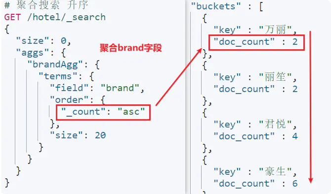
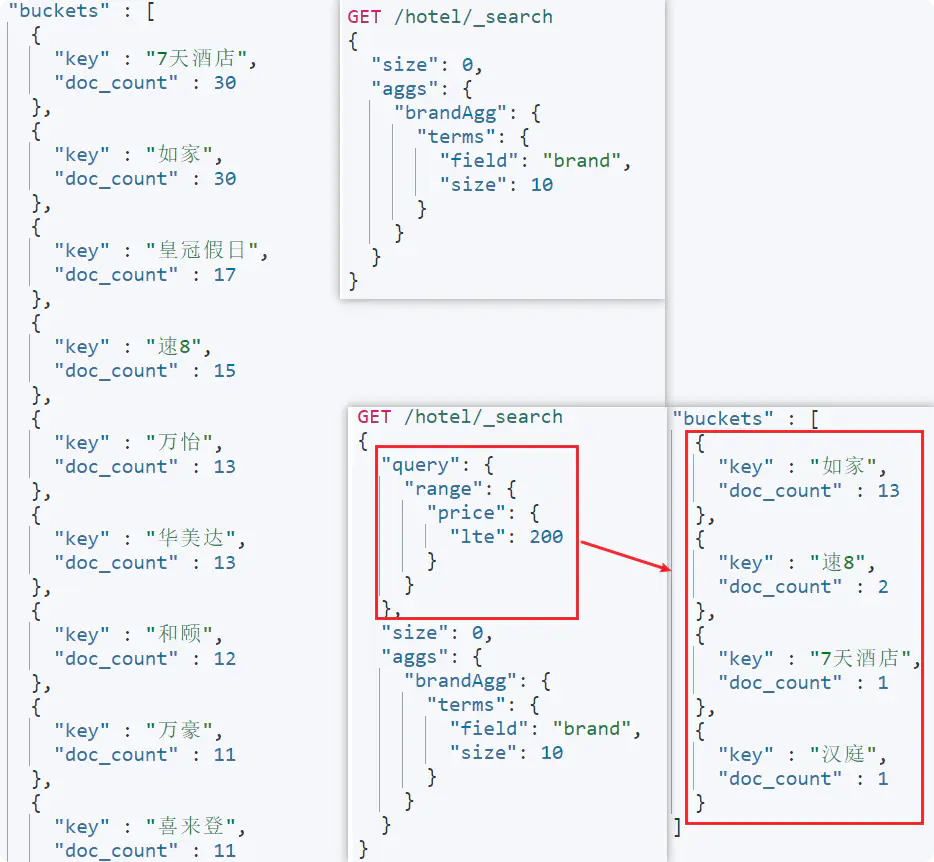
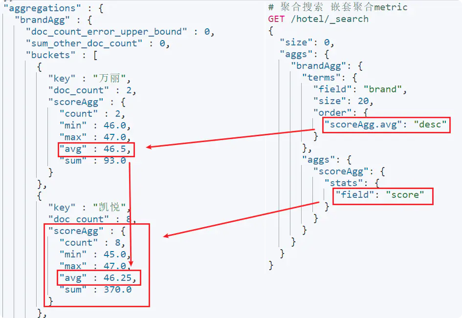
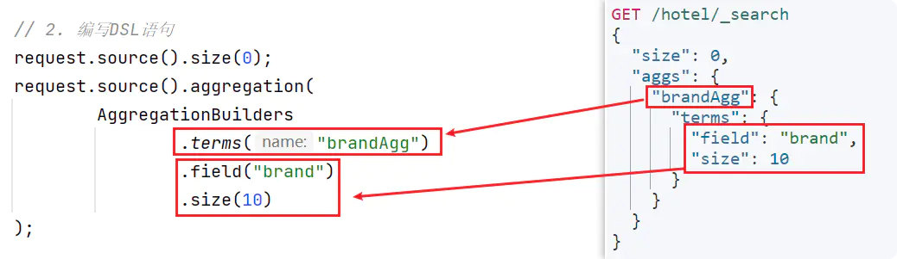
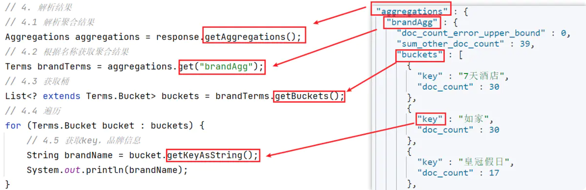
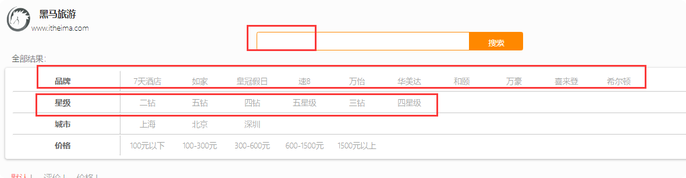

# ES聚合查询
> 聚合（aggregations）可以实现对文档数据的统计、分析、运算。

官方文档：[Aggregations](https://links.jianshu.com/go?to=https%3A%2F%2Fwww.elastic.co%2Fguide%2Fen%2Felasticsearch%2Freference%2Fcurrent%2Fsearch-aggregations.html%23search-aggregations)

## 分类
> 常见的聚合类型

- **桶（Bucket）聚合**:用来对文档做分组：
    - **TermAggregation**：按照文档字段值分组；
    - **Date Histogram**：按照日期阶梯分组，例如一周为一组，或者一月为一组。

- **度量（Metric）聚合**:用以计算一些值，比如：最大值、最小值、平均值等：
    - **Avg**：求平均值；
    - **Max**：求最大值；
    - **Min**：求最小值；
    - **Stats**：同时求max、min、avg、sum等。

- **管道（pipeline）聚合**:其它聚合的结果为基础做聚合。

> 参与聚合的字段类型

keyword、数值、日期、布尔。

## DSL语句
### 桶（Bucket）聚合
    GET /indexName/_search
    {
        "size" : 0, //结果中仅包含聚合数据
        "aggs" : { //定义聚合，也可以写作aggregations
            "AGGNAME" : { //指定聚合名称，自定义
                "terms" : { //指定桶类型
                  "field" : "FIELDNAME", //参与聚合的字段
                  "size": VALUE //希望获取的聚合结果数量
                }
            }
        }
    }

> 桶聚合结果排序

    GET /hotel/_search
    {
      "size": 0,
      "aggs": {
        "brandAgg": {
          "terms": {
            "field": "brand",
            "order": {
              "_count": "asc" //根据_count字段升序排序
            }, 
            "size": 20
          }
        }
      }
    }
    

> 限定桶聚合范围

    
    GET /hotel/_search
    {
      "query": {
        "range": {
          "price": {
            "lte": 200
          }
        }
      }, 
      "size": 0,
      "aggs": {
        "brandAgg": {
          "terms": {
            "field": "brand",
            "size": 20
          }
        }
      }
    }
    
下图对比了两种搜索，未限制条件时10条可以完整查询到；限制条件后，仅剩4条结果符合限制条件。具体如下：     

### 度量（Metric）聚合

    GET /hotel/_search
    {
      "size": 0,
      "aggs": {
        "brandAgg": {
          "terms": {
            "field": "brand",
            "size": 20,
            "order": {
              "scoreAgg.avg": "desc" //根据子查询中的avg降序排序
            }
          },
          "aggs": { //是brandAgg聚合的子聚合，brandAgg聚合后再分组计算
            "scoreAgg": { //子聚合名称
              "stats": { // 聚合类型，可以计算count、min、max、sum、avg
                "field": "score" //聚合字段，此处为score
              }
            }
          }
        }
      }
    }
    

  
## RestClient实现
    
       @Test
        void testAgg() throws IOException {
    
            SearchRequest request = new SearchRequest("hotel");
            request.source().size(0);
            request.source().aggregation(
                    AggregationBuilders.terms("brandAgg")
                            .field("brand")
                            .size(10)
            );
            SearchResponse response = client.search(request, RequestOptions.DEFAULT);
    
            //结果解析
    
            Aggregations aggregations = response.getAggregations();
            Terms brandTerms = aggregations.get("brandAgg");
            List<? extends Terms.Bucket> buckets = brandTerms.getBuckets();
            for (Terms.Bucket bucket : buckets) {
                String brandName = bucket.getKey().toString();
                System.out.println(brandName);
            }
    
        }

## 例子
    
### 需求
接口：动态显示筛选内容

### controller

        @PostMapping("/filters")
        public Map<String,List<String>> filters(@RequestBody RequestParams params){
    
            return hotelService.filters(params);
        }
        
### 接口实现

     @Override
        public Map<String, List<String>> filters(RequestParams params) {
    
            try {
                Map<String, List<String>> resultMap = new HashMap<>();
    
                SearchRequest request = new SearchRequest("hotel");
                buildBasicQuery(params, request);
    
                request.source().size(0);
                request.source().aggregation(AggregationBuilders.terms("brandAgg").field("brand")).size(100);
                request.source().aggregation(AggregationBuilders.terms("starNameAgg").field("starName")).size(100);
                request.source().aggregation(AggregationBuilders.terms("cityAgg").field("city")).size(100);
                SearchResponse response = client.search(request, RequestOptions.DEFAULT);
    
                Aggregations aggregations = response.getAggregations();
                List<String> brandList = getAggByName(aggregations, "brandAgg");
                resultMap.put("品牌", brandList);
                List<String> cityList = getAggByName(aggregations, "cityAgg");
                resultMap.put("城市",cityList);
                List<String> starNameList = getAggByName(aggregations, "starNameAgg");
                resultMap.put("星级", starNameList);
    
    
                return resultMap;
    
            } catch (IOException e) {
                throw new RuntimeException(e);
            }
        }
        
        private List<String> getAggByName(Aggregations aggregations, String name) {
                List<String> list = new ArrayList<>();
                Terms terms = aggregations.get(name);
                List<? extends Terms.Bucket> buckets = terms.getBuckets();
        
                buckets.stream().forEach(bucket -> list.add((bucket.getKeyAsString())));
                return list;
            }
        
            private void buildBasicQuery(RequestParams params, SearchRequest request) {
                BoolQueryBuilder boolQuery = QueryBuilders.boolQuery();
        
                if (StrUtil.isNotBlank(params.getKey())) {
                    boolQuery.must(QueryBuilders.matchQuery("all", params.getKey()));
                } else {
                    boolQuery.must(QueryBuilders.matchAllQuery());
                }
                // 3.城市条件
                if (StrUtil.isNotBlank(params.getCity())) {
                    boolQuery.must(QueryBuilders.termQuery("city", params.getCity()));
                }
                // 4.品牌条件
                if (StrUtil.isNotBlank(params.getBrand())) {
                    boolQuery.must(QueryBuilders.termQuery("brand", params.getBrand()));
                }
                // 5.星级条件
                if (StrUtil.isNotBlank(params.getStarName())) {
                    boolQuery.must(QueryBuilders.termQuery("starName", params.getStarName()));
                }
                if (params.getMaxPrice() != null && params.getMinPrice() != null) {
                    boolQuery.must(QueryBuilders.rangeQuery("price")
                            .gte(params.getMinPrice())
                            .lte(params.getMaxPrice()));
                }
                //复合查询，权重加分
                FunctionScoreQueryBuilder.FilterFunctionBuilder[] filterFunctionBuilders =
                        new FunctionScoreQueryBuilder.FilterFunctionBuilder[]{
                                new FunctionScoreQueryBuilder.FilterFunctionBuilder(
                                        QueryBuilders.termQuery("isAD", true),
                                        ScoreFunctionBuilders.weightFactorFunction(1000))
                        };
        
        
                //打分
                FunctionScoreQueryBuilder builder = QueryBuilders.functionScoreQuery(boolQuery, filterFunctionBuilders)
                        .boostMode(CombineFunction.SUM);
        //                .maxBoost(10);
                request.source().query(builder);
            }
      