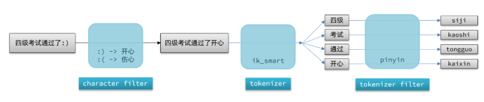
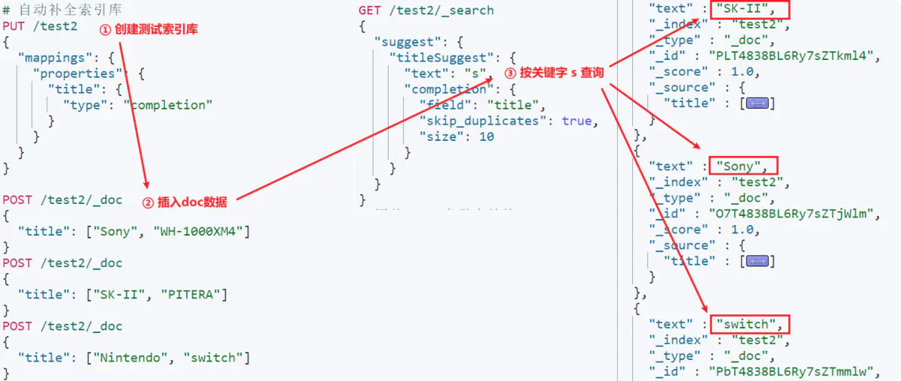
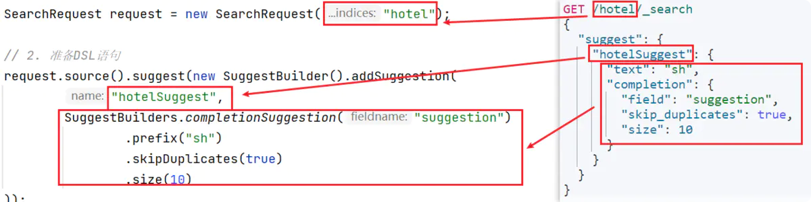
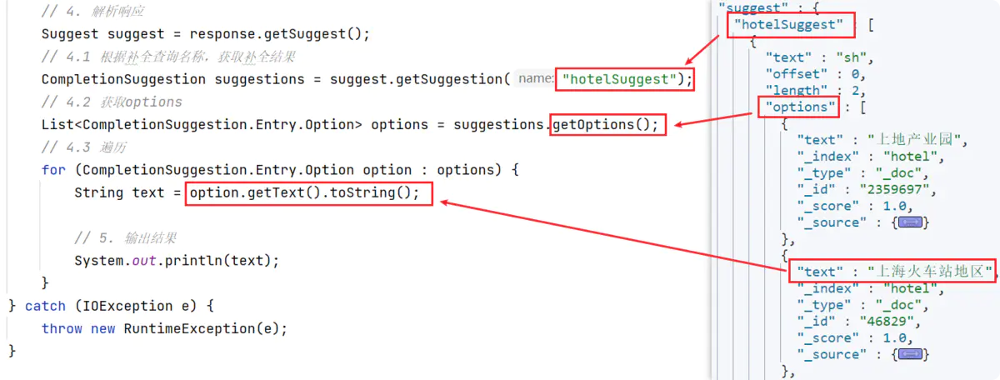

# ES自动补全

## 安装拼音分词器

查看[ES安装与使用](ES安装与使用.md)下面的拼音分词器安装

## 自定义分词器

elasticsearch中分词器（analyzer）的组成包含三部分：

- character filters：在tokenizer之前对文本进行处理。例如删除字符、替换字符
- tokenizer：将文本按照一定的规则切割成词条（term）。例如keyword，就是不分词；还有ik_smart
- tokenizer filter：将tokenizer输出的词条做进一步处理。例如大小写转换、同义词处理、拼音处理等

### 测试

        PUT /test2
              {
                "mappings": {
                  "properties": {
                    "title": {
                      "type": "completion"
                    }
                  }
                }
              }
       
              
            POST /test2/_doc
            {
              "title": ["Sony", "WH-1000XM4"]
            }
            POST /test2/_doc
            {
              "title": ["SK-II", "PITERA"]
            }
            POST /test2/_doc
            {
              "title": ["Nintendo", "switch"  ]
            }
            
            
            GET /test2/_search
            {
              "suggest": {
                "titleSuggest": {
                  "text": "s", //查询的关键字
                  "completion": {
                    "field": "title", //补全查询的字段
                    "skip_duplicates": true, //跳过重复数据
                    "size": 10 //获取前10条结果
                  }
                }
              }
            }

### 自定义
结合ik_smart自定义分词器的语法如下： 

      PUT /test
              {
                "settings": {
                  "analysis": {
                    "analyzer": { // 自定义分词器
                      "my_analyzer": {  // 分词器名称
                        "tokenizer": "ik_max_word",
                        "filter": "py"
                      }
                    },
                    "filter": { // 自定义tokenizer filter
                      "py": { // 过滤器名称
                        "type": "pinyin", // 过滤器类型，这里是pinyin
                        "keep_full_pinyin": false,
                        "keep_joined_full_pinyin": true,
                        "keep_original": true,
                        "limit_first_letter_length": 16,
                        "remove_duplicated_term": true,
                        "none_chinese_pinyin_tokenize": false
                      }
                    }
                  }
                },
                "mappings": {
                  "properties": {
                    "name": {
                      "type": "text",
                      "analyzer": "my_analyzer",
                      "search_analyzer": "ik_smart"
                    }
                  }
                }
              }

   

## RestClient使用

### 修改es的mapping映射
    
    DELETE /hotel
    # 酒店数据索引库
    PUT /hotel
    {
      "settings": {
        "analysis": {
          "analyzer": {
            "text_analyzer": {
              "tokenizer": "ik_max_word",
              "filter": "py"
            },
            "completion_analyzer": {
              "tokenizer": "keyword",
              "filter": "py"
            }
          },
          "filter": {
            "py": {
              "type": "pinyin",
              "keep_full_pinyin": false,
              "keep_joined_full_pinyin": true,
              "keep_original": true,
              "limit_first_letter_length": 16,
              "remove_duplicated_term": true,
              "none_chinese_pinyin_tokenize": false
            }
          }
        }
      },
      "mappings": {
        "properties": {
          "id": {
            "type": "keyword"
          },
          "name": {
            "type": "text",
            "analyzer": "text_analyzer",
            "search_analyzer": "ik_smart", 
            "copy_to": "all"
          },
          "address": {
            "type": "keyword",
            "index": false
          },
          "price": {
            "type": "integer"
          },
          "score": {
            "type": "integer"
          },
          "brand": {
            "type": "keyword",
            "copy_to": "all"
          },
          "city": {
            "type": "keyword",
            "copy_to": "all"
          },
          "starName": {
            "type": "keyword"
          },
          "business": {
            "type": "keyword",
            "copy_to": "all"
          },
          "location": {
            "type": "geo_point"
          },
          "pic": {
            "type": "keyword",
            "index": false
          },
          "all": {
            "type": "text",
            "analyzer": "text_analyzer",
            "search_analyzer": "ik_smart"
          },
          "suggestion":{
            "type": "completion",
            "analyzer": "completion_analyzer"
          }
        }
      }
    }
    
### 实现

> 改造实体类
    
    @Data
    @NoArgsConstructor
    public class HotelDoc {
        private Long id;
        private String name;
        private String address;
        private Integer price;
        private Integer score;
        private String brand;
        private String city;
        private String starName;
        private String business;
        private String location;
        private String pic;
    
        // 排序时的 距离值
        private Object distance;
    
        private Boolean isAD;
    
        /**
         * 新增自动补全字段
         *
         * @param hotel
         */
        private List<String> suggestion;
    
    
        public HotelDoc(Hotel hotel) {
            this.id = hotel.getId();
            this.name = hotel.getName();
            this.address = hotel.getAddress();
            this.price = hotel.getPrice();
            this.score = hotel.getScore();
            this.brand = hotel.getBrand();
            this.city = hotel.getCity();
            this.starName = hotel.getStarName();
            this.business = hotel.getBusiness();
            this.location = hotel.getLatitude() + ", " + hotel.getLongitude();
            this.pic = hotel.getPic();
            if (this.business.contains("/")) {
                String[] arr = this.business.split("/");
                this.suggestion = new ArrayList<>();
                this.suggestion.add(this.brand);
                Collections.addAll(this.suggestion, arr);
            } else {
                this.suggestion = Arrays.asList(this.brand, this.business);
    
            }
    
        }
    }
    
> 批量导入

      /**
         * 批量添加数据
         */
        @Test
        void testBulkRequest() throws IOException {
            List<Hotel> hotels = hotelService.list();
    
            BulkRequest bulkRequest = new BulkRequest();
    
            for (Hotel hotel : hotels) {
                HotelDoc hotelDoc = new HotelDoc(hotel);
    
                bulkRequest.add(new IndexRequest("hotel")
                        .source(JSONUtil.toJsonStr(hotelDoc),XContentType.JSON));
            }
    
            client.bulk(bulkRequest,RequestOptions.DEFAULT);
        }

> 查询与响应

    
     @Test
        public void testSuggest() throws IOException {
            SearchRequest request = new SearchRequest("hotel");
    
            request.source().suggest(new SuggestBuilder().addSuggestion("suggestions",
                    SuggestBuilders.completionSuggestion("suggestion")
                    .prefix("sh")
                    .skipDuplicates(true)
                    .size(10)
    
            ));
            SearchResponse response = client.search(request, RequestOptions.DEFAULT);
    
            Suggest suggest = response.getSuggest();
            CompletionSuggestion suggestions = suggest.getSuggestion("suggestions");
    
            List<CompletionSuggestion.Entry.Option> options = suggestions.getOptions();
            for (CompletionSuggestion.Entry.Option option : options) {
                String text = option.getText().toString();
                System.out.println(text);
            }
    
        }

