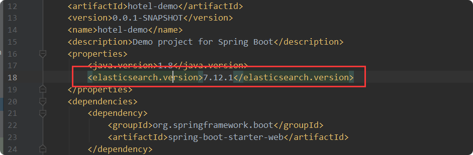
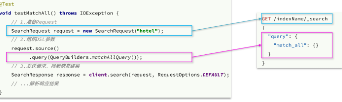
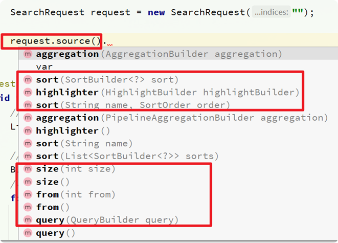
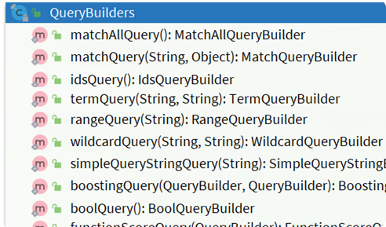
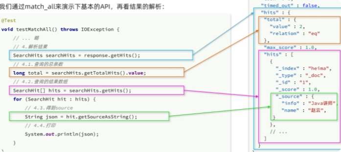
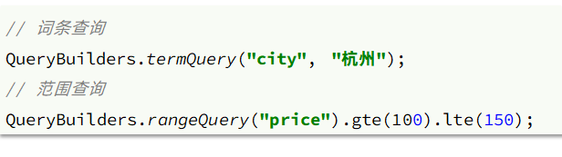
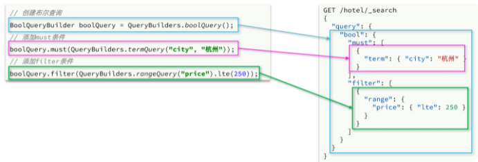

# RestClient与ES
## 依赖

新增：

    <dependency>
         <groupId>org.elasticsearch.client</groupId>
         <artifactId>elasticsearch-rest-high-level-client</artifactId>
         <version>7.12.1</version>
    </dependency>

添加：因为有两个子jar版本不一样，所以还要单独指定一下
    
    <elasticsearch.version>7.12.1</elasticsearch.version>
    

## yml配置

    
    spring:
      elasticsearch:
        rest:
          uris: http://192.168.171.132:9200
              

## config
    
    @Configuration
    public class ElasticSearchConfig {
    
        @Bean
        public RestHighLevelClient restHighLevelClient(){
            return new RestHighLevelClient(RestClient.builder(HttpHost.create("http://192.168.171.132:9200")));
        }
    }
**yml和config选一个就行**
## 快速入门match_all
    
> 我们以match_all查询为例

### 发送查询请求

代码解读：

- 第一步，创建SearchRequest对象，指定索引库名

- 第二步，利用request.source()构建DSL，DSL中可以包含查询、分页、排序、高亮等
    - query()：代表查询条件，利用QueryBuilders.matchAllQuery()构建一个match_all查询的DSL
- 第三步，利用client.search()发送请求，得到响应

> 两个关键的API

- **request.source()**，其中包含了查询、排序、分页、高亮等所有功能：
  
- **QueryBuilders**，其中包含match、term、function_score、bool等各种查询：

### 解析响应结果

响应结果的解析：
- elasticsearch返回的结果是一个JSON字符串，结构包含：

    - hits：命中的结果
    - total：总条数，其中的value是具体的总条数值
    - max_score：所有结果中得分最高的文档的相关性算分
    - hits：搜索结果的文档数组，其中的每个文档都是一个json对象
    - _source：文档中的原始数据，也是json对象
    
因此，我们解析响应结果，就是逐层解析JSON字符串，流程如下：

- SearchHits：通过response.getHits()获取，就是JSON中的最外层的hits，代表命中的结果
    - SearchHits#getTotalHits().value：获取总条数信息
    - SearchHits#getHits()：获取SearchHit数组，也就是文档数组
        - SearchHit#getSourceAsString()：获取文档结果中的_source，也就是原始的json文档数据
        
### 完整代码

    @SpringBootTest
    public class HotelDataTest {
        private RestHighLevelClient client;
        @Autowired
        private IHotelService hotelService;
    
       
        /**
              * 批量添加数据
              */
             @Test
             void testBulkRequest() throws IOException {
                 List<Hotel> hotels = hotelService.list();
         
                 BulkRequest bulkRequest = new BulkRequest();
         
                 for (Hotel hotel : hotels) {
                     HotelDoc hotelDoc = new HotelDoc(hotel);
         
                     bulkRequest.add(new IndexRequest("hotel")
                             .source(JSONUtil.toJsonStr(hotelDoc),XContentType.JSON));
                 }
         
                 client.bulk(bulkRequest,RequestOptions.DEFAULT);
             }         
        @Test
        void matchAllTest() throws IOException {
            // 1.准备Request
            SearchRequest request = new SearchRequest("hotel");
            // 2.准备DSL
            MatchAllQueryBuilder matchAllQueryBuilder = QueryBuilders.matchAllQuery();
            request.source().query(matchAllQueryBuilder);
            request.source().from(10);
            request.source().size(20);
            // 3.发送请求
            SearchResponse response = client.search(request, RequestOptions.DEFAULT);
            // 4.解析响应
    
            handleResponse(response);
    
        }
    
        /**
         * 解析响应结果
         *
         * @param response
         */
        private void handleResponse(SearchResponse response) {
            SearchHits searchHits = response.getHits();
            long total = searchHits.getTotalHits().value;
            if (total > 0) {
                System.out.println("一共得到" + total + "条数据");
                SearchHit[] hits = searchHits.getHits();
                for (SearchHit hit : hits) {
                    String dataJson = hit.getSourceAsString();
                    HotelDoc hotelDoc = JSONUtil.toBean(dataJson, HotelDoc.class);
                    System.out.println("hotelDoc==" + hotelDoc);
                }
            }
    
        }
    
        @BeforeEach
        void setUp() {
            client = new RestHighLevelClient(RestClient.builder(HttpHost.create("http://192.168.171.132:9200")));
        }
    
        @AfterEach
        void tearDown() throws IOException {
            client.close();
        }
    }

## match查询

> 全文检索的match和multi_match查询与match_all的API基本一致。差别是查询条件，也就是query的部分。

         @Test
        void matchTest() throws IOException {
            // 1.准备Request
            SearchRequest request = new SearchRequest("hotel");
            // 2.准备DSL
            MatchQueryBuilder builder = QueryBuilders.matchQuery("all", "如家");
            request.source().query(builder);
            request.source().from(10);
            request.source().size(20);
            // 3.发送请求
            SearchResponse response = client.search(request, RequestOptions.DEFAULT);
            // 4.解析响应
    
            handleResponse(response);
    
        }   
        
        

## wildcard模糊查询

     @Test
        void wildcardTest() throws IOException {
            // 1.准备Request
            SearchRequest request = new SearchRequest("hotel");
            // 2.准备DSL
            WildcardQueryBuilder builder = QueryBuilders.wildcardQuery("all", "北*");
            request.source().query(builder);
            request.source().from(10);
            request.source().size(20);
            // 3.发送请求
            SearchResponse response = client.search(request, RequestOptions.DEFAULT);
            // 4.解析响应
    
            handleResponse(response);
    
        }

## 精确查询
精确查询主要是两者：

- term：词条精确匹配
- range：范围查询

与之前的查询相比，差异同样在查询条件，其它都一样。

     @Test
        void rangeTest() throws IOException {
            // 1.准备Request
            SearchRequest request = new SearchRequest("hotel");
            // 2.准备DSL
            RangeQueryBuilder builder = QueryBuilders.rangeQuery("price").gte(500).lte(1000);
            request.source().query(builder);
            request.source().from(10);
            request.source().size(20);
            // 3.发送请求
            SearchResponse response = client.search(request, RequestOptions.DEFAULT);
            // 4.解析响应
    
            handleResponse(response);
    
        }
        

## 布尔查询

布尔查询是用must、must_not、filter等方式组合其它查询，代码示例如下： 

可以看到，API与其它查询的差别同样是在查询条件的构建，QueryBuilders，结果解析等其他代码完全不变。  

    
    @Test
        void boolTest() throws IOException {
            // 1.准备Request
            SearchRequest request = new SearchRequest("hotel");
            // 2.准备DSL
            BoolQueryBuilder builder = QueryBuilders.boolQuery();
            //范围查询
    //        builder.filter(QueryBuilders.rangeQuery("price").gte(500).lte(1000));
    
            builder.must(QueryBuilders.termQuery("name","如家"));
            request.source().query(builder);
            request.source().from(10);
            request.source().size(20);
            // 3.发送请求
            SearchResponse response = client.search(request, RequestOptions.DEFAULT);
            // 4.解析响应
    
            handleResponse(response);
    
        }
        
        

## 排序、分页

     @Test
        void testPageAndSort() throws IOException {
            // 页码，每页大小
            int page = 1, size = 5;
            // 1.准备Request
            SearchRequest request = new SearchRequest("hotel");
            // 2.准备DSL
            MatchAllQueryBuilder builder = QueryBuilders.matchAllQuery();
    
            request.source().query(builder);
            request.source().from((page - 1) * size);
            request.source().size(size);
            // 3.发送请求
            SearchResponse response = client.search(request, RequestOptions.DEFAULT);
            // 4.解析响应
            handleResponse(response);
        }
        

## 高亮
### 发送请求
    
             @Test
            void testHighlight() throws IOException {
                // 1.准备Request
                SearchRequest request = new SearchRequest("hotel");
                // 2.准备DSL
                MatchQueryBuilder builder = QueryBuilders.matchQuery("all", "如家");
                request.source().query(builder);
                // requireFieldMatch(false)表示不要求整个字段相同，默认true
                request.source().highlighter(
                        new HighlightBuilder().field("name").requireFieldMatch(false)
                );
        
                // 3.发送请求
                SearchResponse response = client.search(request, RequestOptions.DEFAULT);
                // 4.解析响应
                handleResponse(response);
            }
  
            
### 结果解析

    private void handleResponse(SearchResponse response) {
            SearchHits searchHits = response.getHits();
            long total = searchHits.getTotalHits().value;
            if (total > 0) {
                System.out.println("一共得到" + total + "条数据");
                SearchHit[] hits = searchHits.getHits();
                for (SearchHit hit : hits) {
                    String dataJson = hit.getSourceAsString();
                    HotelDoc hotelDoc = JSONUtil.toBean(dataJson, HotelDoc.class);
                    //高亮结果分析
                    Map<String, HighlightField> fields = hit.getHighlightFields();
                    if(!fields.isEmpty()){
                        HighlightField highlightField = fields.get("name");
                        if(highlightField!=null){
                            String name = highlightField.getFragments()[0].toString();
                            hotelDoc.setName(name);
                        }
                    }
    
                    System.out.println("hotelDoc==" + hotelDoc);
                }
            }
        }  

## 示例代码
    
> yml配置：
    
    spring:
      elasticsearch:
        rest:
          uris: http://192.168.171.132:9200

> vo：

    @Data
    @AllArgsConstructor
    public class RequestParams {
        /**
         * 关键字
         */
        private String key;
        private Integer page;
        private Integer size;
        /**
         * 排名条件
         */
        private String sortBy;
        /**
         * 城市
         */
        private String city;
        /**
         * 品牌
         */
        private String brand;
        /**
         * 星级
         */
        private String starName;
        /**
         * 最小价格
         */
        private Integer minPrice;
        /**
         * 最大价格
         */
        private Integer maxPrice;
        /**
         * 我当前的地理坐标
         */
        private String location;
    }  

> dto：
    
    @Data
    @NoArgsConstructor
    public class HotelDoc {
        private Long id;
        private String name;
        private String address;
        private Integer price;
        private Integer score;
        private String brand;
        private String city;
        private String starName;
        private String business;
        private String location;
        private String pic;
    
        // 排序时的 距离值
        private Object distance;
        //权重打分，广告
        private Boolean isAD;
    
        /**
         * 新增自动补全字段
         *
         * @param hotel
         */
        private List<String> suggestion;
    
    
        public HotelDoc(Hotel hotel) {
            this.id = hotel.getId();
            this.name = hotel.getName();
            this.address = hotel.getAddress();
            this.price = hotel.getPrice();
            this.score = hotel.getScore();
            this.brand = hotel.getBrand();
            this.city = hotel.getCity();
            this.starName = hotel.getStarName();
            this.business = hotel.getBusiness();
            this.location = hotel.getLatitude() + ", " + hotel.getLongitude();
            this.pic = hotel.getPic();
            if (this.business.contains("/")) {
                String[] arr = this.business.split("/");
                this.suggestion = new ArrayList<>();
                this.suggestion.add(this.brand);
                Collections.addAll(this.suggestion, arr);
            } else {
                this.suggestion = Arrays.asList(this.brand, this.business);
    
            }
    
        }
    }

> HotelServiceImpl：

       @Slf4j
       @Service
       public class HotelServiceImpl extends ServiceImpl<HotelMapper, Hotel> implements IHotelService {
           @Autowired
           private RestHighLevelClient client;
       
           /**
            * 查询全部
            * @param params
            * @return
            * @throws IOException
            */
           @Override
           public PageResult listAll(RequestParams params) throws IOException {
       
               SearchRequest request = new SearchRequest("hotel");
       
               if (StrUtil.isBlank(params.getKey())) {
                   MatchAllQueryBuilder matchQuery = QueryBuilders.matchAllQuery();
                   request.source().query(matchQuery);
               } else {
                   MatchQueryBuilder matchQuery = QueryBuilders.matchQuery("all", params.getKey());
                   request.source().query(matchQuery);
               }
               // 2.2.分页
               int page = params.getPage();
               int size = params.getSize();
               request.source().from((page - 1) * size).size(size);
       
               SearchResponse response = client.search(request, RequestOptions.DEFAULT);
       
               return basicResponseHandler(response);
           }
       
           /**
            * 带查询条件查询
            * @param params
            * @return
            */
           @Override
           public PageResult search(RequestParams params) {
               try {
                   SearchRequest request = new SearchRequest("hotel");
                   buildBasicQuery(params, request);
                   // 2.2.分页
                   int page = params.getPage();
                   int size = params.getSize();
                   request.source().from((page - 1) * size).size(size);
       
                   if (StrUtil.isNotBlank(params.getSortBy()) && !("default").equals(params.getSortBy())) {
                       request.source().sort(params.getSortBy(), SortOrder.ASC);
                   }
                   //地理位置
                   if (StrUtil.isNotBlank(params.getLocation())) {
                       request.source().sort(SortBuilders.geoDistanceSort("location", new GeoPoint(params.getLocation())).order(SortOrder.ASC).unit(DistanceUnit.KILOMETERS));
                   }
                   //高亮
                   request.source().highlighter(
                           new HighlightBuilder().field("name").requireFieldMatch(false)
                   );
       
                   SearchResponse response = client.search(request, RequestOptions.DEFAULT);
                   return basicResponseHandler(response);
       
               } catch (IOException e) {
                   throw new RuntimeException(e);
               }
       
           }
       
           /**
            * 自动补全查询
            * @param key
            * @return
            * @throws IOException
            */
           @Override
           public List<String> getSuggestion(String key) throws IOException {
               SearchRequest request = new SearchRequest("hotel");
       
               request.source().suggest(new SuggestBuilder().addSuggestion("suggestions",
                       SuggestBuilders.completionSuggestion("suggestion")
                               .prefix(key)
                               .skipDuplicates(true)
                               .size(10)
               ));
       
               SearchResponse response = client.search(request, RequestOptions.DEFAULT);
       
               Suggest suggest = response.getSuggest();
               CompletionSuggestion suggestions = suggest.getSuggestion("suggestions");
               List<CompletionSuggestion.Entry.Option> options = suggestions.getOptions();
               List<String> list = new ArrayList<>(options.size());
               for (CompletionSuggestion.Entry.Option option : options) {
                   String text = option.getText().toString();
                   list.add(text);
               }
       
               return list;
           }
       
           /**
            * 聚合查询
            * @param params
            * @return
            */
           @Override
           public Map<String, List<String>> filters(RequestParams params) {
       
               try {
                   Map<String, List<String>> resultMap = new HashMap<>();
       
                   SearchRequest request = new SearchRequest("hotel");
                   buildBasicQuery(params, request);
       
                   request.source().size(0);
                   request.source().aggregation(AggregationBuilders.terms("brandAgg").field("brand")).size(100);
                   request.source().aggregation(AggregationBuilders.terms("starNameAgg").field("starName")).size(100);
                   request.source().aggregation(AggregationBuilders.terms("cityAgg").field("city")).size(100);
                   SearchResponse response = client.search(request, RequestOptions.DEFAULT);
       
                   Aggregations aggregations = response.getAggregations();
                   List<String> brandList = getAggByName(aggregations, "brandAgg");
                   resultMap.put("品牌", brandList);
                   List<String> cityList = getAggByName(aggregations, "cityAgg");
                   resultMap.put("城市",cityList);
                   List<String> starNameList = getAggByName(aggregations, "starNameAgg");
                   resultMap.put("星级", starNameList);
       
       
                   return resultMap;
       
               } catch (IOException e) {
                   throw new RuntimeException(e);
               }
           }
       
           /**
            * 聚合查询解析 封装
            * @param aggregations
            * @param name
            * @return
            */
           private List<String> getAggByName(Aggregations aggregations, String name) {
               List<String> list = new ArrayList<>();
               Terms terms = aggregations.get(name);
               List<? extends Terms.Bucket> buckets = terms.getBuckets();
       
               buckets.stream().forEach(bucket -> list.add((bucket.getKeyAsString())));
               return list;
           }
       
           /**
            * query查询request 封装
            * @param params
            * @param request
            */
           private void buildBasicQuery(RequestParams params, SearchRequest request) {
               BoolQueryBuilder boolQuery = QueryBuilders.boolQuery();
       
               if (StrUtil.isNotBlank(params.getKey())) {
                   boolQuery.must(QueryBuilders.matchQuery("all", params.getKey()));
               } else {
                   boolQuery.must(QueryBuilders.matchAllQuery());
               }
               // 3.城市条件
               if (StrUtil.isNotBlank(params.getCity())) {
                   boolQuery.must(QueryBuilders.termQuery("city", params.getCity()));
               }
               // 4.品牌条件
               if (StrUtil.isNotBlank(params.getBrand())) {
                   boolQuery.must(QueryBuilders.termQuery("brand", params.getBrand()));
               }
               // 5.星级条件
               if (StrUtil.isNotBlank(params.getStarName())) {
                   boolQuery.must(QueryBuilders.termQuery("starName", params.getStarName()));
               }
               if (params.getMaxPrice() != null && params.getMinPrice() != null) {
                   boolQuery.must(QueryBuilders.rangeQuery("price")
                           .gte(params.getMinPrice())
                           .lte(params.getMaxPrice()));
               }
               //复合查询，权重加分
               FunctionScoreQueryBuilder.FilterFunctionBuilder[] filterFunctionBuilders =
                       new FunctionScoreQueryBuilder.FilterFunctionBuilder[]{
                               new FunctionScoreQueryBuilder.FilterFunctionBuilder(
                                       QueryBuilders.termQuery("isAD", true),
                                       ScoreFunctionBuilders.weightFactorFunction(1000))
                       };
       
       
               //打分
               FunctionScoreQueryBuilder builder = QueryBuilders.functionScoreQuery(boolQuery, filterFunctionBuilders)
                       .boostMode(CombineFunction.SUM);
       //                .maxBoost(10);
               request.source().query(builder);
           }
       
           /**
            * query查询处理response结果 封装
            * @param response
            * @return
            */
           private PageResult basicResponseHandler(SearchResponse response) {
               SearchHits searchHits = response.getHits();
               long total = searchHits.getTotalHits().value;
       
               List<Object> list = new ArrayList<>();
               SearchHit[] hits = searchHits.getHits();
               for (SearchHit hit : hits) {
                   String source = hit.getSourceAsString();
                   HotelDoc hotelDoc = JSONUtil.toBean(source, HotelDoc.class);
                   //从地理排序中获得距离
                   Object[] sortValues = hit.getSortValues();
                   if (sortValues.length > 0) {
                       hotelDoc.setDistance(sortValues[0]);
                   }
                   //高亮结果分析
                   Map<String, HighlightField> fields = hit.getHighlightFields();
                   if (!fields.isEmpty()) {
                       HighlightField highlightField = fields.get("name");
                       if (highlightField != null) {
                           String name = highlightField.getFragments()[0].toString();
                           hotelDoc.setName(name);
                       }
                   }
                   list.add(hotelDoc);
               }
               list.forEach(h -> System.out.println(h.toString()));
       
               return new PageResult(total, list);
           }
       }

