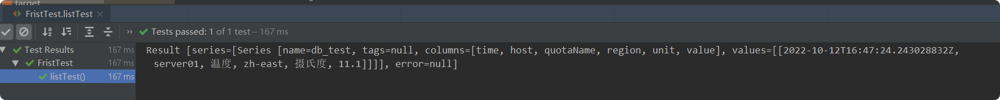

# Springboot与InfluxDB

## 依赖

        <dependency>
            <groupId>org.influxdb</groupId>
            <artifactId>influxdb-java</artifactId>
            <version>2.19</version>
        </dependency>
        

## yml配置
    
    spring:
      influx:
        url: http://192.168.171.132:8086 #influxdb服务器的地址
        user: test #用户名
        password: 123456 #密码
        database: mydb #指定的数据库

## 简单例子
    
     /**
         * 普通插入数据
         */
        @Test
        public void addTest() {
            influxDB.setDatabase(database);
            Point point = Point.measurement("db_test")
                    .tag("host", "server01")
                    .tag("region", "zh-east")
                    .addField("quotaName", "温度")
                    .addField("unit", "摄氏度")
                    .addField("value", 11.1D)
                    .build();
            influxDB.write(point);
        }
    
        /**
         * 测试查找全部
         */
        @Test
        public void listTest() {
            Query sql = new Query("select * from db_test ", database);
            QueryResult result = influxDB.query(sql);
            result.getResults().forEach(System.out::println);
        }
        

## 封装实体类
### 依赖
    
      <dependencies>
            <dependency>
                <groupId>org.springframework.boot</groupId>
                <artifactId>spring-boot-starter-web</artifactId>
            </dependency>
            <dependency>
                <groupId>org.springframework.boot</groupId>
                <artifactId>spring-boot-starter</artifactId>
            </dependency>
    
            <dependency>
                <groupId>org.springframework.boot</groupId>
                <artifactId>spring-boot-starter-test</artifactId>
                <scope>test</scope>
            </dependency>
            <dependency>
                <groupId>org.influxdb</groupId>
                <artifactId>influxdb-java</artifactId>
                <version>2.19</version>
            </dependency>
            <dependency>
                <groupId>org.projectlombok</groupId>
                <artifactId>lombok</artifactId>
            </dependency>
            <dependency>
                <groupId>cn.hutool</groupId>
                <artifactId>hutool-all</artifactId>
                <version>5.7.17</version>
            </dependency>
            <dependency>
                <groupId>com.baomidou</groupId>
                <artifactId>mybatis-plus</artifactId>
                <version>3.3.1</version>
            </dependency>
            <dependency>
                <groupId>mysql</groupId>
                <artifactId>mysql-connector-java</artifactId>
            </dependency>
        </dependencies>
        
### 实体类
    
    @Data
    @Measurement(name = "quota")
    public class QuotaInfo {
        @Column(name = "host",tag = true)
        private String host;
    
        @Column(name = "region",tag = true)
        private String region;
    
        @Column(name = "quotaId",tag = true)
        private String quotaId;
    
        @Column(name = "quotaName",tag = true)
        private String quotaName;
    
        @Column(name = "unit",tag = true)
        private String unit;
    
        @Column(name = "value")
        private Double value;
    }
    
### 分页类
    
    @Data
    public class Pager<T> implements Serializable{
        /**
         * 总条数
         */
        private long counts;
        /**
         * 每页条数
         */
        private long pageSize;
        /**
         * 总页数
         */
        private long pages;
        /**
         * 当前页数
         */
        private long page;
    
        /**
         * mybaits-plus分页
         * 在controller 里面return new Pager<>(quotaService.queryNumberQuota(page,pageSize));
         */
        private List<T> items;
    
        /**
         * influxDB查询分页
         * @param page
         */
        public Pager(IPage page) {
            this.pageSize = page.getSize();
            this.counts = page.getTotal();
            this.page = page.getCurrent();
            this.pages = page.getPages();
            this.items = page.getRecords();
        }
    
        public Pager(Long counts, Long pageSize){
            this.counts = counts;
            this.pageSize = pageSize;
            if(pageSize <= 0){
                pages = 0;
            }else {
                pages = counts%pageSize ==0? (counts/pageSize) : (counts/pageSize) +1;
            }
        }
    }
    
### 封装influxDao

    
    @Slf4j
    @Component
    public class InfluxDao {
    
        @Resource
        private InfluxDB influxDB;
        @Value("${spring.influx.database}")
        private String database;
    
        /**
         * 添加实体类
         * @param object
         */
        public void addObject(Object object){
            influxDB.setDatabase(database);
            Point.Builder pointBuilder= Point.measurementByPOJO(object.getClass());
    
            Point point = pointBuilder.addFieldsFromPOJO(object)
                    //influxDB的默认时间是UTC,比北京时间相差8小时；所以需要在此处手动处理下时间
                    .time(LocalDateTime.now().plusHours(8).toInstant(ZoneOffset.of("+8")).toEpochMilli() , TimeUnit.MILLISECONDS)
                    .build();
            influxDB.write(point);
            influxDB.close();
        }
    
        /**
         * 查询数据方法
         * @param sql
         * @param clazz
         * @return List<T>
         */
        public <T> List<T> queryList(String sql, Class<T> clazz){
            QueryResult queryResult = influxDB.query(new Query(sql, database));
            influxDB.close();
            //使用influx自带的解析类得到数据
            InfluxDBResultMapper resultMapper = new InfluxDBResultMapper();
            return resultMapper.toPOJO(queryResult, clazz);
        }
    }    
    
### 测试类
    
    @SpringBootTest
    public class FristTest {
        @Resource
        private InfluxDB influxDB;
        @Value("${spring.influx.database}")
        private String database;
        @Autowired
        private InfluxDao influxDao;
        
    
        @Test
        public void addObjectTest() {
            QuotaInfo quotaInfo = new QuotaInfo();
            quotaInfo.setHost("server01");
            quotaInfo.setRegion("zh-east");
            quotaInfo.setQuotaId("00001");
            quotaInfo.setQuotaName("温度");
            quotaInfo.setUnit("摄氏度");
            quotaInfo.setValue(12.30D);
            influxDao.addObject(quotaInfo);
        }
    
        @Test
        public void getListTest() {
            long page = 2;
            long pageSize = 3;
            //"select * from quota  order by desc limit 3 offset 3"
            //分页语句
            String pageSql = " limit " + pageSize + " offset " + (page - 1) * pageSize;
            //查询语句
            String sql = "select * from quota  order by time desc";
    
            List<QuotaInfo> quotaInfos = influxDao.queryList(sql + pageSql, QuotaInfo.class);
            for (QuotaInfo quotaInfo : quotaInfos) {
                System.out.println(JSONUtil.toJsonStr(quotaInfo));
            }
        }
    
    }
    
### 分页
新增带时间戳的measurement

    @Data
    @Measurement(name = "quota")
    public class QuotaAllInfo extends QuotaInfo{
        @Column(name = "time")
        private String time;
    }

新增总条数的measurement

    @Data
    @Measurement(name = "quota")
    public class QuotaCount {
    
        @Column(name = "count")
        private Long count;
    
    }
    
分页类
    
    @Data
    public class Pager<T> implements Serializable{
        /**
         * 总条数
         */
        private long counts;
        /**
         * 每页条数
         */
        private long pageSize;
        /**
         * 总页数
         */
        private long pages;
        /**
         * 当前页数
         */
        private long page;
    
        /**
         * mybaits-plus分页
         * 在controller 里面return new Pager<>(quotaService.queryNumberQuota(page,pageSize));
         */
        private List<T> items;
    
        /**
         * influxDB查询分页
         * @param page
         */
        public Pager(IPage page) {
            this.pageSize = page.getSize();
            this.counts = page.getTotal();
            this.page = page.getCurrent();
            this.pages = page.getPages();
            this.items = page.getRecords();
        }
    
        public Pager(Long counts, Long pageSize){
            this.counts = counts;
            this.pageSize = pageSize;
            if(pageSize <= 0){
                pages = 0;
            }else {
                pages = counts%pageSize ==0? (counts/pageSize) : (counts/pageSize) +1;
            }
        }
    }

    
## InfluxdbTemplate使用
### 依赖
   
    
