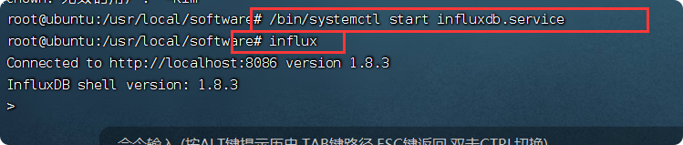
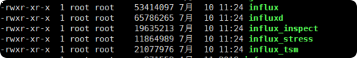
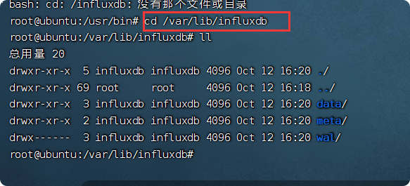
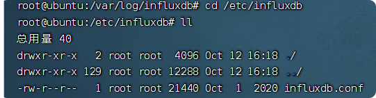
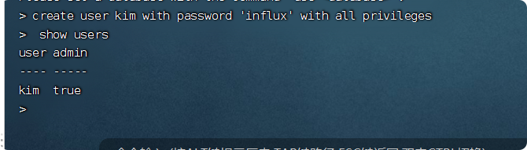
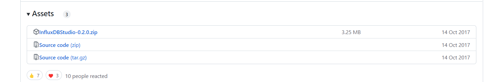
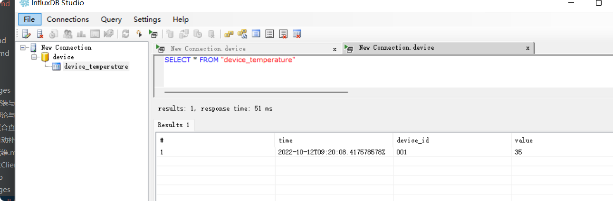

# influxdb安装与使用

版本：1.8.10

系统：ubuntu-18.04.5

web：chronograf

## 下载

[InfluxDB下载地址](https://portal.influxdata.com/downloads/)

我安装的是**InfluxDB 1.8**版本的，需要注意的是**InfluxDB在0.11版本以后集群方案就不再开源**

## rpm安装

### 下载安装

    mkdir /usr/local/software #在/usr/local下创建software文件夹
    cd /usr/local/software
    wget https://dl.influxdata.com/influxdb/releases/influxdb_1.8.3_amd64.deb #下载对应版本的安装包
    sudo dpkg -i influxdb_1.8.3_amd64.deb 安装软件

### 启动

    /bin/systemctl start influxdb.service //启动
    
    influx //使用
    
    

### InfluxDB的配置说明

以服务的形式安装完毕后，在/usr/bin下面有如下文件

    influxd   #influxdb服务器
    influx      #influxdb命令行客户端
    influx_inspect  #查看工具
    influx_stress  #压力测试工具
    influx_tsm  #数据库转换工具（将数据库从b1或bz1格式转换为tsm1格式）

在/var/lib/influxdb/下面会有如下文件夹

    data  #存放最终存储的数据，文件以.tsm结尾
    meta  #存放数据库元数据
    wal  #存放预写日志文件

influxdb的**日志文件**在/var/log/influxdb下面    

influxdb的**配置文件**在/etc/influxdb下面有如下文件：  
    

### 配置文件
配置项|含义
--|--
reporting-disabled	|该选项用于上报influxdb的使用信息给InfluxData公司，默认值为false
bind-address	|绑定地址以用于RPC服务以进行备份和还原，默认配置是127.0.0.1:8088
[meta]	|控制存储有关InfluxDB群集的元数据的Raft共识组的参数
dir	|存储元数据/ raft数据库的目录，默认值：/var/lib/influxdb/meta
retention-autocreate|	用于控制默认存储策略，数据库创建时，会自动生成autogen的存储策略，默认值：true。
logging-enabled|	为元服务打印日志消息，默认值：true
[data]	|控制InfluxDB的实际分片数据的生存位置以及它从WAL中刷新的方式。 “dir”可能需要更改为适合您系统的位置，但WAL设置是高级配置。 默认值应适用于大多数系统。
dir|	最终数据（TSM文件）存储目录，默认值：/var/lib/influxdb/data
wal-dir	|预写日志存储目录，默认值：/var/lib/influxdb/wal
wal-fsync-delay|	写入在fsyncing之前等待的时间。 持续时间大于0可用于批量处理多个fsync调用。 这对于较慢的磁盘或看到WAL写入争用时很有用。 每次写入WAL时值为0s fsyncs。 对于非SSD磁盘，建议使用0-100ms范围内的值。
index-version	|用于新分片的分片索引的类型。 默认值是在启动时重新创建的内存中索引。 值“tsi1”将使用支持更高的基于磁盘的索引基数数据集
trace-logging-enabled	|是否开启跟踪（trace）日志，默认值：false。
query-log-enabled|是否开启tsm引擎查询日志，默认值： true	
validate-keys|	验证传入的写入以确保密钥仅具有有效的unicode字符。 此设置将产生很小的开销，因为必须检查每个密钥，默认值false
cache-max-memory-size|	用于限定shard最大值，大于该值时会拒绝写入，默认值：1GB
cache-snapshot-memory-size	|用于设置快照大小，大于该值时数据会刷新到tsm文件，默认值：25MB
cache-snapshot-write-cold-duration|	tsm1引擎 snapshot（快照）写盘延迟，默认值：10m
compact-full-write-cold-duration|	tsm文件在压缩前可以存储的最大时间，默认值：4h
max-concurrent-compactions	|可以一次运行的最大并发完全和级别压缩数。 值为0会导致运行时使用50％运行时.GOMAXPROCS（0）。 任何大于0的数字都会限制对该值的压缩。 此设置不适用于缓存快照，默认值：0
compact-throughput	|是我们允许TSM压缩写入磁盘的速率限制（以字节/秒为单位）。 请注意，短脉冲串允许以可能更大的值发生，由Compact-Throughput-Burst设置，默认值：48m
compact-throughput-burst|	是我们允许TSM压缩写入磁盘的速率限制，以每秒字节数为单位，默认值：48m
max-index-log-file-size|	索引预写日志文件压缩到索引文件中时的阈值（以字节为单位）。 较小的大小将导致日志文件更快地压缩，并导致较低的堆使用量，但代价是写入吞吐量。 更高的大小将更少压缩，在内存中存储更多系列，并提供更高的写入吞吐量。有效大小的后缀为k，m或g（不区分大小写，1024 = 1k）。没有大小后缀的值以字节为单位，默认值：1m
max-series-per-database	|限制数据库的级数，该值为0时取消限制，默认值：1000000
max-values-per-tag	|一个tag最大的value数，0取消限制，默认值：100000
tsm-use-madv-willneed	|如果为true，则将针对TSM文件向内核提供mmap建议值MADV_WILLNEED。 已发现此设置在某些内核上存在问题，默认值：false。 在某些情况下，它可能会帮助磁盘速度较慢的用户
[coordinator]	|控制群集服务配置
write-timeout	|写操作超时时间，默认值： 10s
max-concurrent-queries|	最大并发查询数，0无限制，默认值： 0
query-timeout|	查询操作超时时间，0无限制，默认值：0s
log-queries-after	|慢查询超时时间，0无限制，默认值：0s
max-select-point	|select语句可以处理的最大点数（points），0无限制，默认值：0
max-select-series	|select语句可以处理的最大级数（series），0无限制，默认值：0
max-select-buckets	|select语句可以处理的最大"GROUP BY time()"的时间周期，0无限制，默认值：0
[retention]	|旧数据的保留策略
enabled	|是否启用该模块，默认值 ： true
check-interval	|检查时间间隔，默认值 ：“30m”
[shard-precreation]|	分区预创建
enabled	|是否启用该模块，默认值 ： true
check-interval|	检查时间间隔，默认值 ：“10m”
advance-period|	预创建分区的最大提前时间，默认值 ：30m
[admin]|	influxdb提供的简单web管理页面
enabled	|是否启用该模块，默认值 ： false
bind-address|	绑定地址，默认值 ：":8083"
https-enabled|	是否开启https ，默认值 ：false
https-certificate|	https证书路径，默认值："/etc/ssl/influxdb.pem"
[monitor]|这一部分控制InfluxDB自有的监控系统。 默认情况下，InfluxDB把这些数据写入_internal 数据库，如果这个库不存在则自动创建。 _internal 库默认的retention策略是7天，如果你想使用一个自己的retention策略，需要自己创建
store-enabled|	是否启用该模块，默认值 ：true
store-database|	默认数据库："_internal"
store-interval|	统计间隔，默认值：“10s”
[http]|	influxdb的http接口配置
enabled	|是否启用该模块，默认值 ：true
flux-enabled|	是否启用流查询端点，默认值 ：false
bind-address|	绑定地址，默认值：":8086"
auth-enabled|	是否开启认证，默认值：false
realm	|发出基本身份验证质询时发送回的默认域，默认值： “InfluxDB”
log-enabled|	是否开启http请求日志，默认值：true
suppress-write-log|	在启用日志时是否应禁止HTTP写入请求日志，默认值：false
access-log-path|	启用HTTP请求日志记录时，此选项指定应写入日志条目的路径,如果未指定，则默认为写入stderr，它将HTTP日志与内部InfluxDB日志记录混合。如果涌入无法访问指定路径，它将记录错误并回退到将请求日志写入stderr
access-log-status-filters|	应记录哪些请求的过滤器。 每个过滤器的格式为NNN，NNX或NXX，其中N是数字，X是任意数字的通配符。 要过滤所有5xx响应，请使用字符串5xx。 如果使用多个过滤器，则只需要匹配一个过滤器。 默认情况下没有过滤器会导致每个请求都被打印
write-tracing	|是否开启写操作日志，如果置成true，每一次写操作都会打日志，默认值：false
pprof-enabled	|是否开启pprof，此端点用于故障排除和监视，默认值：true
debug-pprof-enabled|	在启动时立即启用绑定到localhost：6060的pprof端点。这只需要调试启动问题。默认值：false
https-enabled	|是否开启https，默认值：false
https-certificate	|设置https证书路径，默认值："/etc/ssl/influxdb.pem"
https-private-key	|设置https私钥，无默认值
shared-secret	|用于JWT签名的共享密钥，无默认值
max-row-limit	|配置查询返回最大行数，默认值：10000
max-connection-limit|	配置最大连接数，超出此限制的新连接将被删除，0无限制，默认值：0
unix-socket-enabled	|通过unix域套接字启用http服务，默认值：false
bind-socket	|unix-socket路径，默认值："/var/run/influxdb.sock"
max-body-size	|客户端请求正文的最大大小（以字节为单位）， 将此值设置为0将禁用该限制。默认值：25000000
max-concurrent-write-limit|	并发处理的最大写入次数，将此设置为0将禁用该限制。默认值：0
max-enqueued-write-limit|	排队等待处理的最大写入次数。将此设置为0将禁用该限制。默认值：0
enqueued-write-timeout|	写入等待队列中写入的最长持续时间。将此设置为0或将max-concurrent-write-limit设置为0将禁用该限制。默认值：0
[logging]|	控制记录器如何将日志发送到输出
format|	确定用于日志的日志编码器。 可用选项包括auto，logfmt和json。 如果输出终端是TTY，则auto将使用更加用户友好的输出格式，但格式不易于机器读取。 当输出是非TTY时，auto将使用logfmt。默认值：“auto”
level|	确定将发出的日志级别。 可用的级别包括错误，警告，信息和调试。 将发出等于或高于指定级别的日志。默认值：“info”
suppress-logo|	禁止在程序启动时打印的徽标输出。 如果STDOUT不是TTY，则始终禁止使用徽标。默认值：false
[subscriber]|	控制Kapacitor接受数据的配置。enabled：是否启用该模块，默认值 ：true
http-timeout	|http超时时间，默认值：“30s”
insecure-skip-verify|	是否允许不安全的证书，当测试自己签发的证书时比较有用。默认值： false
ca-certs|	设置CA证书，无默认值
write-concurrency|	设置并发数目，默认值：40
write-buffer-size	|设置buffer大小，默认值：1000
[[graphite]]	|graphite相关配置
enabled	|是否启用该模块，默认值 ：false
database	|数据库名称，默认值：“graphite”
retention-policy|	存储策略，无默认值
bind-address|	绑定地址，默认值：":2003"
protocol	|协议，默认值：“tcp”
consistency-level|	一致性等级，默认值：“one”
batch-size	|批量size，默认值：5000
batch-pending|	配置在内存中等待的batch数，默认值：10
batch-timeout|	超时时间，默认值：“1s”
udp-read-buffer|	udp读取buffer的大小，0表示使用操作系统提供的值，如果超过操作系统的默认配置则会出错。 该配置的默认值：0
separator	|多个measurement间的连接符，默认值： “.”
tags|	将添加到所有指标的默认标记。 这些可以在模板级别或从度量标准中提取的标签中覆盖，[“region=us-east”, “zone=1c”]
templates|	每个模板行都需要模板模式。 它可以在模板之前有一个可选的过滤器，并用空格分隔。 它还可以在模板后面添加可选的额外标签。 多个标签应该用逗号分隔，并且没有类似于行协议格式的空格。 只能有一个默认模板。templates = [".app env.service.resource.measurement", # Default template “server.”,]
[[collectd]]|	控制一个或多个收集数据的侦听器
enabled|	是否启用该模块，默认值 ：false
bind-address|	绑定地址，默认值： “:25826”
database|	数据库名称，默认值：“collectd”
retention-policy|	存储策略，无默认值
typesdb	|“/usr/local/share/collectd”
security-level|	“none”
auth-file|	“/etc/collectd/auth_file”
batch-size	|这些下一行控制批处理的工作方式。 您应该已启用此功能，否则您可能会丢失指标或性能不佳。 如果有很多人进入，批处理将缓冲内存中的点。如果这么多点被缓冲，则刷新，默认值：5000
batch-pending|	内存中可能挂起的批次数，默认值：10
batch-timeout|	即使我们没有达到缓冲限制，也要经常冲洗至少这个，默认值：“10s”
parse-multivalue-plugin|	多值插件可以通过两种方式处理。 默认值：“split”,“split”将解析并将多值插件数据存储到单独的测量中“join”将解析并将多值插件存储为单个多值测量。“split”是与以前版本的Influxdb向后兼容的默认行为
read-buffer	|udp读取buffer的大小，0表示使用操作系统提供的值，如果超过操作系统的默认配置则会出错。默认值：0
[[opentsdb]]|	opentsdb配置
enabled	|是否启用该模块，默认值：false
bind-address|	绑定地址，默认值：":4242"
database|	默认数据库：“opentsdb”
retention-policy|	存储策略，无默认值
consistency-level|	一致性级别，默认值：“one”
tls-enabled = false|	是否开启tls，默认值：false
certificate|证书路径，默认值："/etc/ssl/influxdb.pem"
log-point-errors|	出错时是否记录日志，默认值：true
batch-size	|这些下一行控制批处理的工作方式。 您应该已启用此功能，否则您可能会丢失指标或性能不佳。 仅通过telnet协议接收的指标进行批处理。如果这么多点被缓冲，请刷新。默认值：1000
batch-pending|	内存中可能挂起的批次数，默认值：5
batch-timeout|	即使我们没有达到缓冲限制，也要经常冲洗至少这个，默认值：“1s”
[[udp]]	|udp配置
enabled	|是否启用该模块，默认值：false
bind-address|	绑定地址，默认值：":8089"
database|	数据库名称，默认值：“udp”
retention-policy|	存储策略，无默认值
precision|	时间精度（"" or “n”, “u”, “ms”, “s”, “m”, “h”），无默认值
batch-size|	接下来的行控制批处理的工作原理。 您应该已启用此功能，否则您可能会丢失指标或性能不佳。 如果有很多进入，批处理将缓冲内存中的点。如果这么多点被缓冲，则刷新，默认值：5000
batch-pending|	如果这么多点被缓冲，请刷新，默认值：10
batch-timeout|	即使我们没有达到缓冲限制，也会经常冲洗至少这个，默认值：“1s”
read-buffer	|udp读取buffer的大小，0表示使用操作系统提供的值，如果超过操作系统的默认配置则会出错。 默认值：0
[continuous_queries]|	CQs配置
enabled	|是否开启CQs，默认值：true
log-enabled	|是否开启日志，默认值：true
uery-stats-enabled|	控制是否将查询记录到自我监视数据存储。默认值：false
run-interval|	检查连续查询是否需要运行的时间间隔，默认值：“1s”
[tls]	|InfluxDB中TLS的全局配置设置
ciphers|	确定可用的密码套件集。 有关可用密码的列表，请参阅https://golang.org/pkg/crypto/tls/#pkg-constants，这取决于Go的版本（使用查询SHOW DIAGNOSTICS查看用于构建InfluxDB的Go版本）。 如果未指定，则使用Go的crypto / tls包中的默认设置，默认值：ciphers =[“TLS_ECDHE_ECDSA_WITH_CHACHA20_POLY1305”,“TLS_ECDHE_RSA_WITH_AES_128_GCM_SHA256”,]
min-version|	将协商的tls协议的最低版本。 如果未指定，则使用Go的crypto / tls包中的默认设置，默认值：“tls1.2”
max-version	|将协商的tls协议的最大版本。 如果未指定，则使用Go的crypto / tls包中的默认设置，默认值：“tls1.2”

## 基本命令
### 常用
    help //查看帮助
    exit //退出命令
### 操作数据库
    
    create database databasen_name //创建数据库
    drop database databasen_name #区分大小写//删除数据库
    use databasen_name    //使用指定的数据库
    
### 操作表measurements

    show measurements//显示所有表
 
    insert device_temperature,device_id=001 value=35 //新建表；其中 device_temperature 就是表名，device_id是索引（tag），value=xx是记录值（field），记录值可以有多个，系统自带追加时间戳

    insert device_temperature,device_id=001 value=35 1435362189575692182 //新建表，自己写入时间戳
    
    drop measurement device_temperature //删除表
    

### 数据保存策略（Retention Policies）
1.查看当前数据库数据保存策略Retention Policies
        
    show retention policies on "db_name"

2.创建新的Retention Policies

    create retention policy "rp_name" on "db_name" duration 3w replication 1 default
    
- rp_name：策略名；

- db_name：具体的数据库名；

- 3w：保存3周，3周之前的数据将被删除，influxdb具有各种事件参数，比如：h（小时），d（天），w（星期）；

- replication 1：副本个数，一般为1就可以了；   

- default：设置为默认策略

3.修改Retention Policies

	
    alter retention policy "rp_name" on "db_name" duration 30d default
    
4.删除Retention Policies

    	
    drop retention policy "rp_name" on "db_name"

### 连续查询（Continuous Queries）
    
> InfluxDB的连续查询是在数据库中自动定时启动的一组语句，语句中必须包含 SELECT 关键词和 GROUP BY time() 关键词。
    
InfluxDB会将查询结果放在指定的数据表中。
    
**目的**：使用连续查询是最优的降低采样率的方式，**连续查询**和**存储策略搭**配使用将会大大**降低InfluxDB的系统占用量**。而且使用连续查询后，数据会存放到指定的数据表中，这样就为以后统计不同精度的数据提供了方便。
#### 新建连续查询
    CREATE CONTINUOUS QUERY <cq_name> ON <database_name>
    [RESAMPLE [EVERY <interval>] [FOR <interval>]]
    BEGIN SELECT <function>(<stuff>)[,<function>(<stuff>)] INTO <different_measurement>
    FROM <current_measurement> [WHERE <stuff>] GROUP BY time(<interval>)[,<stuff>]
    END
    
#### 样例
在shhnwangjian库中新建了一个名为 wj_30m 的连续查询，每三十分钟取一个connected_clients字段的平均值、中位值、最大值、最小值 redis_clients_30m 表中。使用的数据保留策略都是 default。  
    
    CREATE CONTINUOUS QUERY wj_30m ON shhnwangjian BEGIN SELECT mean(connected_clients), MEDIAN(connected_clients), MAX(connected_clients), MIN(connected_clients) INTO redis_clients_30m FROM redis_clients GROUP BY ip,port,time(30m) END

不同database样例：  

    CREATE CONTINUOUS QUERY wj_30m ON shhnwangjian_30 BEGIN SELECT mean(connected_clients), MEDIAN(connected_clients), MAX(connected_clients), MIN(connected_clients) INTO shhnwangjian_30.autogen.redis_clients_30m FROM shhnwangjian.autogen.redis_clients GROUP BY ip,port,time(30m) END
#### 显示所有已存在的连续查询

    	
    SHOW CONTINUOUS QUERIES

#### 删除连续查询

        DROP CONTINUOUS QUERY <cq_name> ON <database_name>
        
### 查看Series、Measurement、Tag keys和Felid keys

    # 显示时间线
    show series 
    
    # 显示度量
    show measurements
    
    # 显示Tag的Key
    show tag keys
    
    # 显示数据字段的Key
    show field keys
    
            
## 创建admin用户

    influx
    #创建kim给予所有权限
    create user kim with password 'influx' with all privileges
    show users
   

## 客户端工具安装
[InfluxDBStudio的下载地址](https://github.com/CymaticLabs/InfluxDBStudio/releases/tag/v0.2.0-beta.1)

可以使用InfluxDBStudio 作为可视化管理工具  

    

