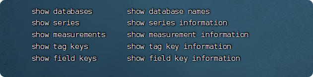
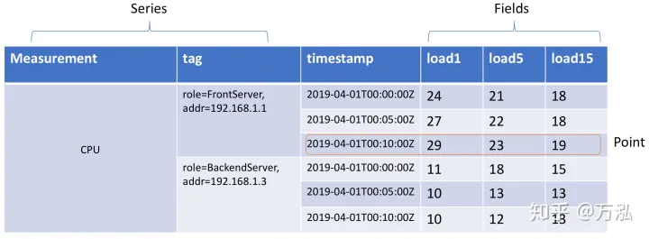
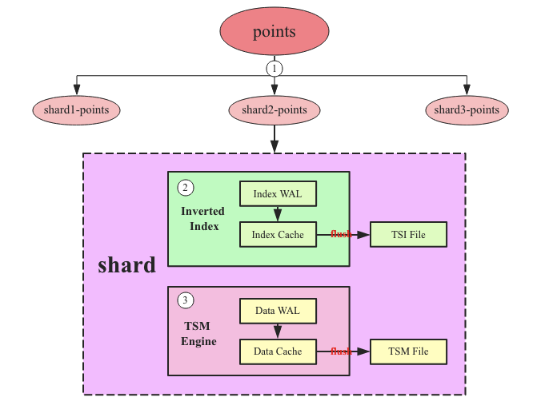

# influxdb理论与原理

近几年在时序数据库的场景下，InfluxDB快速崛起，InfluxDB针对于时序数据的特点，针对性的做了许多优化，比如为了保证高效的数据写入，设计和开发了TSM（类似于LSM）。同时使用Go作为开发语言，天然的跨平台。简单易用的SDK。种种原因使InfluxDB在广大开发者中流行起来。因此我们也从最简单的安装部署一步一步的带领大家认识InfluxDB。

与常见关系型数据库的对比  

概念名称	|InfluxDb	|关系型数据库
--|--|--
数据库	|database	|database
表	|measurement	|table
行	|points	|row
列	|tag,field,timestamp	|column

## 模型和基本概念

从influx help中，我们会看到5个基本的概念，依次为databases、series、measurements、tag keys和field keys：  

首先，我们先看一张InfluxDB定义的模型图，便于大家快速理解一下的这几个概念，我们以实际的**Linux服务CPU指标存储**为例：  

- **Series**: 时序模型的**时间线**概念，**Measurement + Tag**唯一确认一条时间线。比如图3，存储了两条时间线，分别是：

    - 时间线1 ：CPU，groups=FrontServer|addr=192.168.1.1
    - 时间线2：CPU，groups=BackendServer|addr=192.168.1.2
    
像内存、Disk Util等等，我们都可以作为几条新的时间线。

- **Measurement**（Metric）：中文直译为“度量”，但是直译的中文并不能很好的反应该字段的作用，简单理解为“Metric|**指标**”更清晰。按照上面模型的定义，CPU、内存、Disk Util、网络等，都可以作为一个指标。
- **Tag**：**标签**，详细描述一条时间线属性。比如上图，我们可以在Tag中添加跟多的属性，比如CPU型号、核数、频率等。
- **Timestamp**：**时间戳**，描述当前时间线时间发生的具体时间点。
- **Fields**：**时间线的值**，由一列或者多列组成。
- **Point**：**Timestamp + Felids**构成一个Point，描述在一个时间点发生的具体事件。
- *Shard:碎片， 在 InfluxDB 中是一个比较重要的概念，它和 retention policy 相关联。每一个存储策略下会存在许多 shard，每一个 shard 存储一个指定时间段内的数据，并且不重复，例如 7点-8点 的数据落入 shard0 中，8点-9点的数据则落入 shard1 中* 

每一个 shard 都对应一个底层的 tsm 存储引擎，有独立的 cache、wal、tsm file*

## TSM存储引擎概念

**主要由几个部分组成： cache、wal、tsm file、compactor**

1）**Cache**：cache 相当于是 LSM Tree 中的 memtabl。插入数据时，实际上是**同时往 cache 与 wal 中写入数据**，可以认为 cache 是 wal 文件中的数据在内存中的**缓存**。当 InfluxDB 启动时，会遍历所有的 wal 文件，重新构造 cache，这样即使系统出现故障，也不会导致数据的丢失。cache 中的数据并不是无限增长的，有一个 maxSize 参数用于控制当 cache 中的数据占用多少内存后就会将数据写入 tsm 文件。如果不配置的话，默认上限为 25MB，每当 cache 中的数据达到阀值后，会将当前的 cache 进行一次快照，之后清空当前 cache 中的内容，再创建一个新的 wal 文件用于写入，剩下的 wal 文件最后会被删除，快照中的数据会经过排序写入一个新的 tsm 文件中。

2）**WAL**：wal 文件的内容与内存中的 cache 相同，其作用就是为了**持久化数据**，*当系统崩溃后可以通过 wal 文件恢复还没有写入到 tsm 文件中的数据*。

3）**TSM File**：单个 tsm file 大小**最大为 2GB**，用于**存放数据**。

4）**Compactor**：compactor 组件在**后台持续运行**，每隔 1 秒会检查一次是否有需要压缩**合并的数据**。  

- **Compactor**主要进行两种操作，
    - 一种是 cache 中的数据大小**达到阀值**后，进行**快照**，之后转存到一个**新的 tsm文件**中。
    - 另外一种就是**合并当前的 tsm 文件**，将多个小的 tsm 文件合并成一个，使每一个文件尽量达到单个文件的最大大小，减少文件的数量，并且一些数据的删除操作也是在这个时候完成。

## 查询时时区转换
增加：tz('Asia/Shanghai')  
如：
    
    select * from cpu_load_short where time >='2020-07-01T10:00:00Z' tz('Asia/Shanghai')