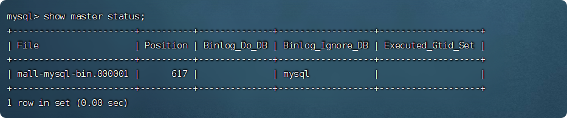
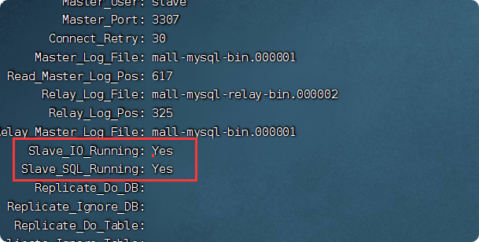

# mysql安装与使用

## 安装
### Ubuntu下docker安装

拉取镜像
    
    docker pull mysql:5.7

## 一主一从复制    

1.创建master主容器(挂载文件夹不需要创建,会自动创建)

     docker run -p 3307:3306 --name mysql-master \
      -v /usr/local/mysql-master/log:/var/log/mysql \
      -v /usr/local/mysql-master/data:/var/lib/mysql \
      -v  /usr/local/mysql-master/conf:/etc/mysql \
      -e MYSQL_ROOT_PASSWORD=root \
      -d mysql:5.7

1.1 新建mysql-master主服务器配置文件my.cnf  
    
    cd /usr/local/mysql-master/conf
    
    sudo vim my.cnf
    
下面是文件内容：  
    
         [mysqld]
         ## 设置server_id，同一局域网中需要唯一
         server_id=101
         ## 指定不需要同步的数据库名称
         binlog-ignore-db=mysql  
         ## 开启二进制日志功能
         log-bin=mall-mysql-bin  
         ## 设置二进制日志使用内存大小（事务）
         binlog_cache_size=1M  
         ## 设置使用的二进制日志格式（mixed,statement,row）
         binlog_format=mixed  
         ## 二进制日志过期清理时间。默认值为0，表示不自动清理。
         expire_logs_days=7  
         ## 跳过主从复制中遇到的所有错误或指定类型的错误，避免slave端复制中断。
         ## 如：1062错误是指一些主键重复，1032错误是因为主从数据库数据不一致
         slave_skip_errors=1062
         
         
1.2 重启master实例  
        
    docker restart mysql-master

1.3 进入mysql-master容器
    
    
    docker exec -it mysql-master /bin/bash
     
    mysql -uroot -proot
    
1.4 master容器实例内创建数据同步用户
    
    CREATE USER 'slave'@'%' IDENTIFIED BY '123456';
     
    GRANT REPLICATION SLAVE, REPLICATION CLIENT ON *.* TO 'slave'@'%';
    
1.5 在主数据库中查看主从同步状态  

    show master status;
    

记录File文件名和position 后面要用

2.创建slave从容器(挂载文件夹不需要创建,会自动创建)
    

     docker run -p 3308:3306 --name mysql-slave \
     -v /usr/local/mysql-slave/log:/var/log/mysql \
     -v /usr/local/mysql-slave/data:/var/lib/mysql \
     -v /usr/local/mysql-slave/conf:/etc/mysql \
     -e MYSQL_ROOT_PASSWORD=root \
     -d mysql:5.7
     
     
2.1 进入/usr/local/mysql-slave/conf目录下新建my.cnf
    
    cd /usr/local/mysql-slave/conf
        
    sudo vim my.cnf
     
文件内容如下：
    
    [mysqld]
    ## 设置server_id，同一局域网中需要唯一
    server_id=102
    ## 指定不需要同步的数据库名称
    binlog-ignore-db=mysql  
    ## 开启二进制日志功能，以备Slave作为其它数据库实例的Master时使用
    log-bin=mall-mysql-slave1-bin  
    ## 设置二进制日志使用内存大小（事务）
    binlog_cache_size=1M  
    ## 设置使用的二进制日志格式（mixed,statement,row）
    binlog_format=mixed  
    ## 二进制日志过期清理时间。默认值为0，表示不自动清理。
    expire_logs_days=7  
    ## 跳过主从复制中遇到的所有错误或指定类型的错误，避免slave端复制中断。
    ## 如：1062错误是指一些主键重复，1032错误是因为主从数据库数据不一致
    slave_skip_errors=1062  
    ## relay_log配置中继日志
    relay_log=mall-mysql-relay-bin  
    ## log_slave_updates表示slave将复制事件写进自己的二进制日志
    log_slave_updates=1  
    ## slave设置为只读（具有super权限的用户除外）
    read_only=1
      
2.2 修改完配置后重启slave实例 
    
    docker restart mysql-slave
    
    
2.3 进入mysql-slave容器 
    
     docker exec -it mysql-slave /bin/bash
      
     mysql -uroot -proot

2.4 在从数据库中配置主从复制

     change master to master_host='192.168.171.130', master_user='slave', master_password='123456', master_port=3307, master_log_file='mall-mysql-bin.000001', master_log_pos=617, master_connect_retry=30;
    
参数说明：
    
    master_host：主数据库的IP地址；
    master_port：主数据库的运行端口；
    master_user：在主数据库创建的用于同步数据的用户账号；
    master_password：在主数据库创建的用于同步数据的用户密码；
    master_log_file：指定从数据库要复制数据的日志文件，通过查看主数据的状态，获取File参数；
    master_log_pos：指定从数据库从哪个位置开始复制数据，通过查看主数据的状态，获取Position参数；
    master_connect_retry：连接失败重试的时间间隔，单位为秒。
    
    
    
2.5 在从数据库中开启主从同步 

    start slave;

2.6 在从数据库中查看主从同步状态
 
     show slave status\G;    
       
       
**看到2个线程为YES 说明同步成功**
       

## mycat分库分表

参考文章[数据库中间件 Mycat（一）读写分离、分库分表](https://blog.csdn.net/weixin_42032199/article/details/108224226?spm=1001.2101.3001.6661.1)

参考文章[Docker Mysql5.7 + Mycat1.6.7.1主从复制读写分离配置](https://blog.csdn.net/weixin_41715271/article/details/122418674?spm=1001.2014.3001.5501)

