# mysql理论及原理
## 体系结构

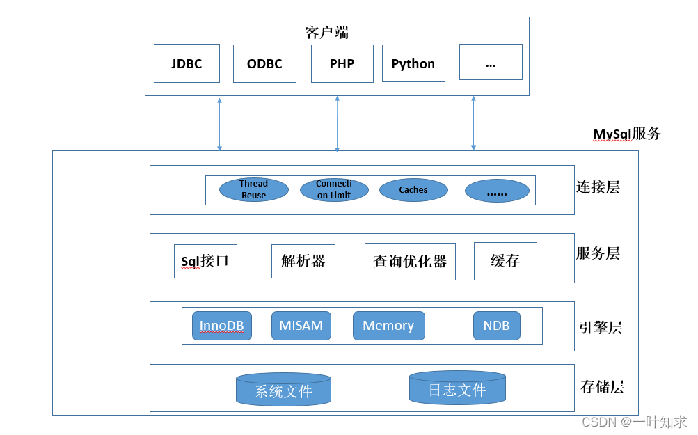

### 一、连接层（Client Connectors）  

*连接层又称为客户端连接器（Client Connectors）：**提供与MySQL服务器建立的支持**。  
目前几乎支持所有主流的服务端编程技术，主要完成一些类似于连接处理、授权认证、及相关的安全方案。  

在该层上引入了**线程池**的概念，为通过认证安全接入的客户端提供线程。同样在该层上可以实现基于SSL的安全连接，并且在这里服务器也会为接入的客户验证他所具备的权限。  
**注意**：连接用户权限修改后，不会立即生效，就是因为在这里将用户认证后的权限信息保存了下来，需要用户断开并重新连接，重新进行校验，修改后的权限才会生效。  

### 二、服务层（MySQL Server） 

服务层是MySQL Server的核心，主要包含**系统管理和控制工具、SQL接口、解析器、查询优化器**。

实际上，连接层中的连接认证，校验流程，也可以归属在服务层中。  
数据库连接成功后，在服务层完成大多数核心功能，如Sql接口，查询缓存，Sql分析和优化，以及一些内置函数的执行。
它的主要流程是这样的：  

- 第一步，查看当前查询是否存在缓存，有则直接返回，没有则进行服务器解析，并生成对应的内部解析树。  
- 第二步，完成相应的优化，确定表的查询顺序，是否使用索引    
- 第三步，生成对应的操作。  

### 三、存储引擎层（Pluggable Storage Engines）  

存储引擎负责MySQL中数据的存储与提取，与底层系统文件进行交互。MySQL存储引擎是插件式的，不同的存储引擎具备不同的功能，可以根据自己的需要进行选择，最常见的是**MyISAM和InnoDB**。  

注意：数据库的**索引**就是在引擎层实现的。    

### 四、系统文件层（File System）  
文件层负责将数据库的数据和日志存储在文件系统之上，并完成与存储引擎的交互，是文件的物理存储层。主要包含日志文件（redolog,undo.log），数据文件，索引文件，二进制日志，错误日志，配置文件，pid 文件，socket 文件等。  

## MySQL运行机制  

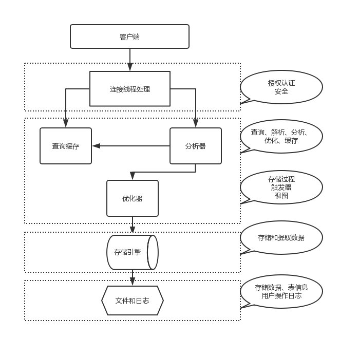

- 建立连接（Connectors&Connection Pool），通过客户端/服务器通信协议与MySQL建立连接。MySQL 客户端与服务端的通信方式是 “ 半双工通信 ”。

- 查询缓存（Cache&Buffer），如上图所示，存在则直接返回，不存在则进行查询，不过需要注意的是，它默认是关闭的，并且，在8.0以后版本，不再支持查询缓存，因为它需要SQL完全相同才能匹配缓存，命中率极低，如果表进行DDL或者DML操作，缓存就会被清空。

- 解析器（Parser），将客户端发送的SQL进行语法解析，生成"解析树"。预处理器根据一些MySQL规则进一步检查“解析树”是否合法，例如这里将检查数据表和数据列是否存在，还会解析名字和别名，看看它们是否有歧义，最后生成新的“解析树”。

- 优化器（Optimizer），根据“解析树”生成最优的执行计划。MySQL使用很多优化策略生成最优的执行计划，分为两类：静态优化（编译时优化）、动态优化（运行时优化）。  

查询执行引擎负责执行 SQL 语句，得到查询结果并返回给客户端。若开启用查询缓存，这时会将SQL 语句和结果完整地保存到查询缓存（Cache&Buffer）中，以后如果有相同的 SQL 语句执行则直接返回结果。  

## 存储引擎

**MySQL 5.6.13版以上，InnoDB就是作为默认的存储引擎**

### 索引查看及指定
> 查看索引
  
    SHOW ENGINES;
    
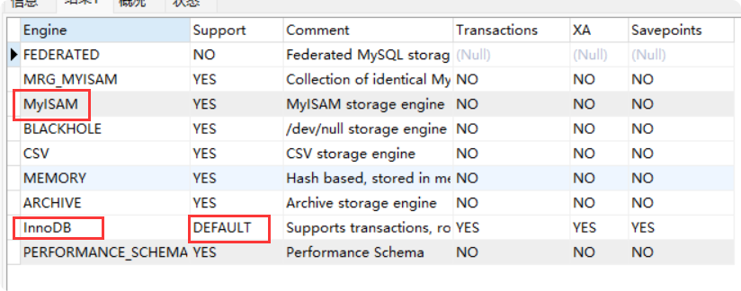

> 创建表指定 引擎
    
    CREATE TABLE `user_info` (
      `id` int(8) NOT NULL,
      `username` varchar(50) CHARACTER SET latin1 NOT NULL,
      `password` varchar(50) CHARACTER SET latin1 NOT NULL,
      PRIMARY KEY (`id`),
      KEY `user_info` (`username`) USING BTREE
    ) ENGINE=InnoDB DEFAULT CHARSET=utf8
    

### InnoDB 和MyISAM 区别
三大重点区别：**事务、外键、行级锁**  

内容|InnoDB|MyISAM
--|--|--
事务|支持事务，ACID四种隔离级别|不支持事务，但每次查询都是原子的
查询性能|较慢|较快（因为索引和数据分开存储，采用非聚集索引）
存储结构|索引的数据域存储数据文件本身（主键索引采用聚集索引，非主键索引是非聚集索引）【表有两个文件：表结构文件.frm、数据文件.idb（表里面的数据+索引文件），**没有单独索引文件**】|数据和索引分开储存（均采用非聚集索引） 【表有三个文件：索引文件.MYI、表结构文件.frm、数据文件.MYD】
移植性、备份、恢复|拷贝数据文件、mysqldump、binlog备份，在数据量达到几十G时就相对痛苦|数据以文件的形式存储，所以在跨平台的数据转移中会很方便，在备份和恢复时可以针对单独的表进行操作  
锁|有表级锁、行级（默认）锁,【**InnoDB的行锁是实现在索引上的**，而不是锁在物理行记录上。也就是说，如果访问没有命中索引，也无法使用行锁，将要退化为表锁。】|只支持表级锁（即每次操作是对整个表加锁，因此并发访问受限）
是否支持主外键|支持|不支持
是否支持全文索引|Mysql5.6版本之后支持|支持
是否存储表的总行数|不存储（执行select count(*) from table时，**需要全表扫描**）|存储（用一个变量保存了整个表的行数，执行上述语句时只需要读出该变量即可，速度很快，注意不能加有任何WHERE条件）  
使用场景|电商类（支持事务，安全性较高）**读写频繁**，请使用InnoDB。不知道如何选择时，就可以选择InnoDB，用以应对未来可能存在的复杂业务。|新闻类（比较适合一些查询业务）,表中绝大多数都只是读查询（一般R/W > 100:1且update相对较少），可以考虑 MyISAM  

### InnoDB引擎

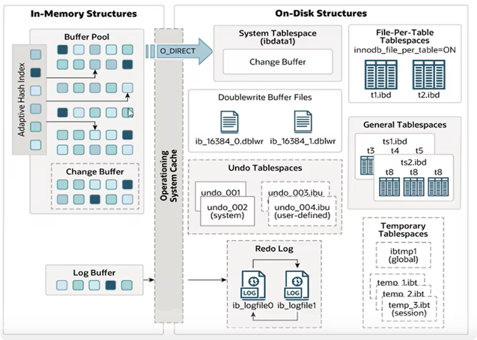

#### 逻辑存储结构
从InnoDB存储应引擎的存储结构来看，所有的数据都被逻辑的存放在一个空间中，成为**表空间**（tablespace）。表空间又由**段**（segment）、**区**（extent）、**页**（page）、**行 row**组成。页在一些文档中也成为块（block），InnoDB存储引擎的逻辑存储结构大致如图：

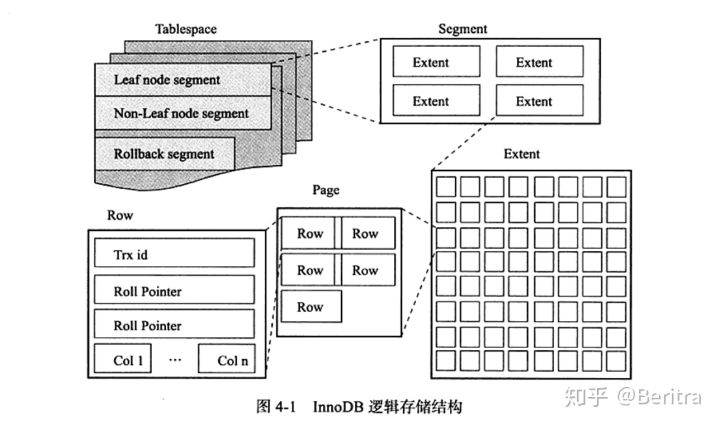  

- **表空间 tablespace**：表空间可以看做是InnoDB存储引擎逻辑结构的最高层，所有的数据都存放在表空间中。默认情况下InnoDB存储引擎有一个共享表空间ibdata1，所有的数据都存放在这个表空间中。如果用户开启了参数innodb_fiule_per_table，则每张表内的数据可以单独放在一个表空间中。  

- **段 segment**：面的图已经显示了表空间是由各个段组成的，常见的段有数据段、索引段、回滚段等。因为前面已经介绍过了InnoDB存储引擎表是索引组织（index organized）的，因此数据即索引，索引即数据。那么数据段即B+树的叶子节点（图中的Leaf node segment），索引段即B+树中的非索引节点（图中的Non-leaf node segment）。回滚段较为特殊。  

- **区 extent**：区是由连续的页组成的空间，在任何情况下，每个区的大小都为**1MB**。为了保证区中页的连续性，InnoDB存储引擎一次从磁盘中申请4~5个区。
- **页 page**：页同大多数数据库一样，InnoDB有页（Page）的概念（也可以称之为块），页是InnoDB磁盘管理的最小单位。 在默认情况下，InnoDB存储引擎**页的大小为16KB，即一个区中一共有64个连续的页**。在InnoDB存储引擎中，常见的页类型有：
    - 数据页（B-tree Node）
    - undo页（undo Log Page）
    - 系统页（System Page）
    - 事务数据页（Transaction system Page）
    - 插入缓冲位图页（Insert Buffer Bitmap）
    - 插入缓冲空闲列表页（Inser Buffer Free List）
    - 未压缩的二进制大对象页（Uncompressed BLOB Page）
    - 压缩的二进制大对象页（compressed BLOB Page）
    - **行 row**：InnoDB存储引擎是面向列的（row-oriented），也就是说数据是按行进行存放的。每个页存放的行记录也是有硬性规定的，最多允许存放16KB/2-200行记录，即7992行。  
#### 内存结构

*如果mysql是单独一台服务器，mysql百分之80的内存可能都要分配给缓冲区，来提高执行效率*  
 
- **buffer pool**：**缓冲池**是主内存中的一个区域，里面可以缓存磁盘上经常操作的真实数据，在执行增删改查时，先操作缓冲池中的数据（若缓冲池里面没有，则加载磁盘数据到缓冲池），**然后再以一定频率刷新到磁盘**，从而**减少磁盘IO**，加快处理速度。  
  缓冲池以页page为单位，底层采用**链表**数据结构管理page。根据状态可以分为三类：
  - free page：空闲page，未被使用过。
  - clean page：被使用过，数据没有被修改过。
  - dirty page：**脏页**，数据被修改过，页中数据和磁盘中的不一样。  
  

- **change buffer**：**更改缓冲区**（增对非唯一 二级索引），在执行DML语句时，如果这些数据page没有在缓冲池（buffer pool）中，不会直接操作磁盘，而将数据更改存在更改缓存区（change buffer）中，在未来数据被读取时，再将数据合并到缓冲池（buffer pool）中，再将合并后的数据写入磁盘。  
    - **change buffer 存在的意义**：与聚集索引不同，二级索引通常是非唯一的，并且以相对随机的顺序插入二级索引。同样删除和更新可能会影响索引树中不相邻的二级索引页，如果每次操作磁盘，会产生大量磁盘IO。有了更改缓存区（change buffer），可以在缓冲池（buffer pool）中进行**合并处理**，再写入磁盘，从而**减少磁盘IO**。

- **Adaptive Hash Index**：**自适应哈希索引**，用于**优化**缓冲池（buffer pool）数据的**查询**。InnoDB存储引擎会监控表上个索引页的查询，如果观察到hash索引可以提升查询速度，则建立hash索引页，所以称为自适应hash索引。
    - **hash索引只能进行等值查询，不能范围查询。所以要监控是否满足条件**
    - **自适应hash索引由系统根据情况自动生成，无需人工干预**，开启参数：adaptive_hash_index

- **Log Buffer**:**日志缓存区**，用来保存要写入到磁盘的log日志数据（redo log、undo log），默认大小为16M，日志缓存区定期将日志刷入到磁盘。如果需要更新、插入或者删除多行的事务，增加日志缓存区可以**减少磁盘IO**。
    - 参数 innodb_log_buffer_size:缓存区大小
    - 参数 innodb_flush_log_at_trx_commit:日志刷新到磁盘的时机（下面是值） 
        - 1：（默认值）日志在每次提交时写入并刷新到磁盘。
        - 0：每秒将日志写入并刷新到磁盘。
        - 2：日志在每次事务提交后写入，并每秒刷新到磁盘一次。  
        
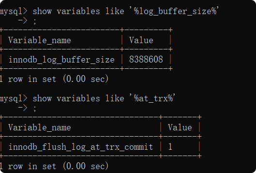  

#### 磁盘结构

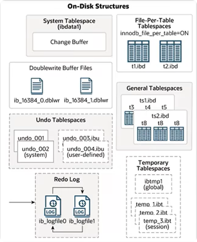

- **System Tablespace**：**系统表空间**是更改缓冲区（change buffer）的存储区域。如果innodb中每张表的**独立表空间**关闭的话，那么所有表的数据和所有也存在系统表空间内。（在mysql5.x版本中还包含innodb数据字典、undo log 等）  
    - 参数：innodb_data_file_path
    
    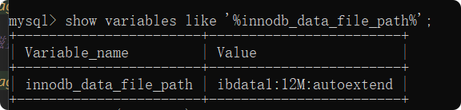
    
    描述：ibdata1 就是系统表空间文件  
    
    
    
    
- **File—Per-Table Tablespace**： **每张表独立表空间**（innodb中默认开启），包含innodb表的数据和索引，存储在文件系统上单个数据文件中（也就是xxx.idb文件）。 
    - 参数：innodb_file_per_table
    
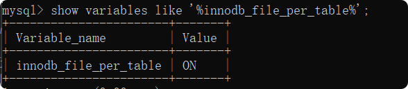  

- **General Tablespace**：**通用表空间**，需要通过create tablespace 语法创建通用表空间，在创建表的时候，可以直接该表空间。  
    -  创建通用表空间语法：create tablespace xxxx(表空间名字)   add datafile 'file_name(关联的表空间文件)' engine=engine_name（存储引擎）  
    -  创建表指定表空间语法：create table xxx... tablespace ts_name(表空间名字)
    
    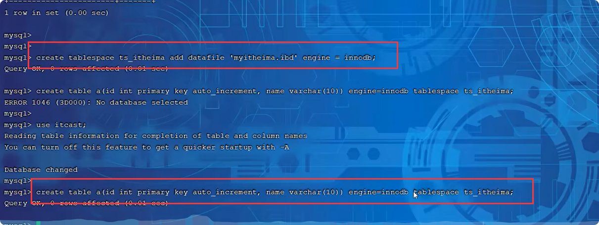  

- **Undo Tablespace**：**撤销表空间**，mysql实例在初始化时候会自动创建**两个**默认的undo 表空间（初始大小16M），用于存储undo log日志。

- **Temporary Tablespace**：**临时表空间**，innodb使用**会话临时表空间**和**全局临时表空间**，存储用户创建的临时表数据。

- **DoubleWrite Buffer Files **：**双写缓冲区**，innodb引擎将数据页从缓冲池（buffer pool） 刷新到磁盘前，先将数据页写入双写缓冲区文件中，以便于**系统异常恢复数据**。  

    
    
- **Redo Log**：**重做日志**，用来**实现事务的持久性**，该日志文件由两部分组成：重做日志缓冲区（redo log  buffer ）和重做日志文件（redo log）；前者在内存日志缓冲区（log buffer）中，后者在磁盘中。*事务提交之后会把所有信息记录到该日志中，用于磁盘在**刷新脏页（dirty page）**到磁盘发生错误时，进行数据恢复*

    - 以**循环方式写入**重做日志文件，涉及2个文件
    

#### 后台线程
    

> 分为4类：  

1).**Master Thread**：**核心后台线程**，负责**调度其他线程**，还负责将**缓冲池中的数据异步刷新到磁盘中**，保持数据的一致性，还包括**脏页（dirty page）的刷新、合并插入厍、undo页的回收**。  
    
2).**IO Thread**: **IO 线程**，innodb存储引擎使用了大量的AIO来处理IO请求，极大的提高数据库性能。而IO Thread主要负责这些IO请求的回调。

执行命令：show innodb engine status；可以查看IO Thread 里面线程个数   

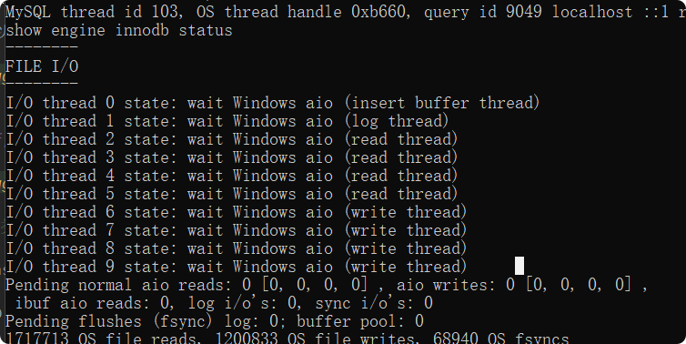  

3).**Purge Thread**:主要用来**回收事务已经提交的undo log**，在事务提交之后undo log 可能就不用了，就用它来回收掉。

4).**Page Cleaner Thread**:**协助Master Thread刷新脏页到磁盘的线程**，它可以减少Master Thread的工作压力，减少阻塞。

### B+tree和Btree

**中间元素向上分裂形成tree**
主要差别：B+tree *所有元素都会出现在叶子结点，非叶子结点存的是索引元素。叶子结点还有单项指针形成链表（InnoDB里面优化成双向指针）*

Btree图形：

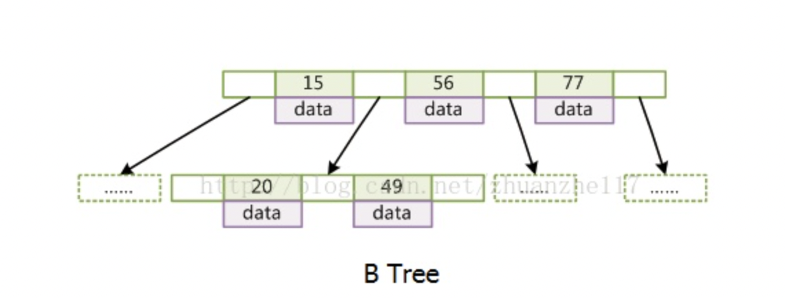

mysql中的B+tree 图形：

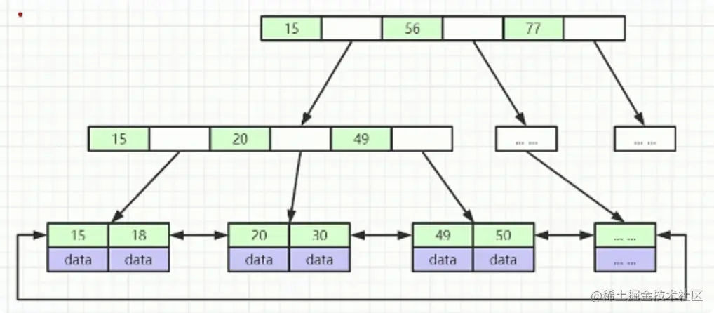

### B+tree高度和存放数量

B+tree的一个节点 == 一页 == 16kb

bigint在mysql中占8byte，mysql（C语言）一个地址占6byte，

所以 一页索引的数据量==16KB/(8+6)B ==1170个==一个节点放的个数

大多数数据库中一行数据1kb撑死了，所以最后放数据的节点个数==16kb/1kb==16个

如果深度为三，那么 1170*1170*16==**21902400**, 可以存放两千多万个数据

深度为三意味着如果走B+Tree索引的话，三次磁盘IO就能查到；而走全表查询:需要千万级查询...

### 为什么不用hash索引

hash索引**不支持范围查找和排序功能**

1. HASH索引本身只存储对应的HASH值和行指针，而**不是存储字段值**

2. HASH索引并不是按照索引顺序来存储的，因此**无法排序**

3. HASH索引**不支持部分索引列查找**，因为HASH索引是使用全部的内容来计算HASH值的

例如在(A,B)两列建立索引，只查询A无法使用索引

4.HASH索引只支持等值比较查询，包括 =、IN()不能进行任何的范围查询

HASH冲突  

5. 最严重的是既然HASH值是数字，肯定会出现相同的，也就是HASH冲突

6. 出现HASH冲突的时候，存储引擎必须遍历链表中所有的行指针，逐行进行比较，直到找到所有符合条件的行

7. 当HASH冲突特别多的时候，维护操作的成本就会变大，比如一次数据的删除

## 索引（重点）
### 分类

> 索引分类:4种

分类|含义|特点|关键字|
--|--|--|--
主键索引|针对于表中主键创建的索引|默认自动创建，只能有一个|PRIMAPY
唯一索引|避免同一个表中某数据列中的值的重复|可以有多个|UNIQUE
常规索引|快速定位特定数据|可以有多个|
全文索引|全文索引查找的是文本中的关键字，而不是比较索引中的值|可以有多个|FULLTEXT

> InnoDB存储引擎，根据存储形式，分2种

分类|含义|关键字|
--|--|--
聚集索引| **将数据存储与索引存放到一块**，索引结构的叶子节点保存了行数据，**行数据就是以B+tree形式存储的**|必须有，而且只有一个
二级索引|将数据与索引分开存储，索引结构的叶子节点关联的是对应的主键|可以存多个

聚集索引选取规则：
- 如果存在主键，主键索引就是聚集索引
- 如果没有主键，将使用**第一个唯一索引（UNIQUE）**索引聚集索引
- 如果没有主键也没有唯一索引，InnoDB 自动生成一个唯一的rowid索引隐藏的聚集索引

### 索引语法
#### 创建索引
CREATE [UNIQUE|FULLTEXT] INDEX index_name ON table_name (columnName(index_col_name,......);
    
    1、使用CREATE INDEX创建，语法如下：
    CREATE INDEX indexName ON tableName (columnName(length));
    
    CREATE INDEX indexName ON tableName (columnName(length));
    
    2、使用ALTER语句创建，语法如下：
    
    ALTER TABLE tableName ADD INDEX indexName(columnName);
    
    ALTER语句创建索引，下面提供一个设置索引长度的例子：
    
    ALTER TABLE t_user_action_log ADD INDEX ip_address_idx (ip_address(16));
     
    SHOW INDEX FROM t_user_action_log;
    3、建表的时候创建索引
    
    CREATE TABLE tableName(  
      id INT NOT NULL,   
      columnName  columnType,
      INDEX [indexName] (columnName(length))  
    );

#### 查看索引

SHOW INDEX FROM table_name;
 
#### 删除索引

DROP INDEX index_name ON table_name;

### explain执行计划

在所有select语句前加 explain 关键字

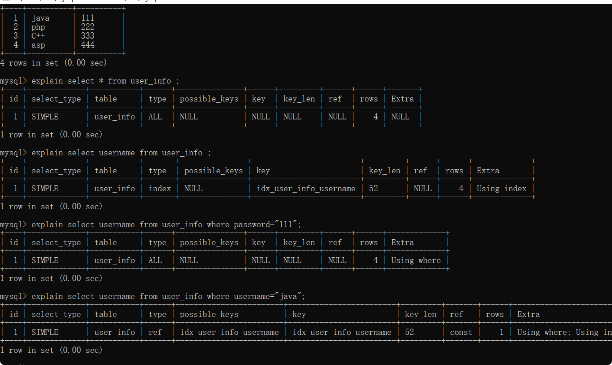

#### explain字段参数
参数|含义
--|--
id|查询的标识符
select_type|SELECT 查询的类型.
table|查询的是哪个表
partitions|匹配的分区
type|判断是什么扫描查询 性能：ALL < index < range ~ index_merge < ref < eq_ref < const < system
possible_keys|可能选用的索引
key|确切使用到的索引
key_len|索引长度（通过观察这个可以判断联合索引使用了几列，很有用）
ref|哪个字段或常数与 key 一起被使用
rows|显示此查询一共扫描了多少行. 这个是一个估计值.
filtered|表示此查询条件所过滤的数据的百分比
extra|额外的信息

select_type|说明
--|--
SIMPLE|简单查询
UNION|联合查询
SUBQUERY|子查询
UNION RESULT|联合查询的结果
PRIMARY|最外层查询

Extra|说明
--|--
NULL|查询的不全都是索引
using index|使用覆盖索引的时候就会出现
using index condition|查询条件是索引的一个范围
using where|查询条件包含普通的条件
Using filesort|排序 不能通过索引达到排序效果

### 索引失效类型
1.**前面加了%**不合理的使用模糊查询：like "%张"或like %张%
  
2.对索引列**使用函数**
  
3.对索引使用表达式计算
  
4.字符串**不加引号**对索引使用隐式转换，这三个都是引起了索引列值的变化导致索引失效
  
5.联合索引非最左匹配
  
6.where子句中or条件列没有使用索引 

7.范围查询 > ，要用>=

8.mysql评估，**走全表扫描比走索引快**，索引失效

## Sql优化

### 插入优化

- 大量数据采用**批量**插入形式
- **事务设置手动提交**，MySQL默认是自动提交，意味着每写一个SQL事务就自动提交，可能会频繁的涉及事务开始和提交，所以建议手动提交
- 主键顺序插入

### order by优化  
**设置根据索引** order by   
 
- Using filesort：通过表的索引或者全表扫描，读取到满足条件的数据行，然后在排序缓冲区 sort buffer 中完成排序，所以返回的数据不是通过索引直接返回的，这样的排序形式就叫filesort
- Using index：通过**有序索引顺序扫描**直接返回有序数据，这种情况不需要额外的排序，所以效率比较高
- 根据多字段排序时，遵循**最左前缀原则**

### group by优化

group by进行分组  

在分组操作时，可以**通过索引**来提高效率，索引使用也要满足**最左前缀原则**

### limit优化

检索数据为limit 9000000,10。此时需要MySQL排序前9000010记录仅仅返回9000000-9000010间的数据，其他数据丢弃，查询排序的代价比太大  

优化思路：一般分页查询时，**通过创建覆盖索引能够比较好的提高性能，可以通过创建覆盖索引加子查询的形式进行优化** 

    select *  from equip_info order by id limit 9000000,10;  
    
    改为
    
    select a.*  from equip_info a,(select id from equip_info order by id desc limit 9000000,10) s where s.id =a.id;
 

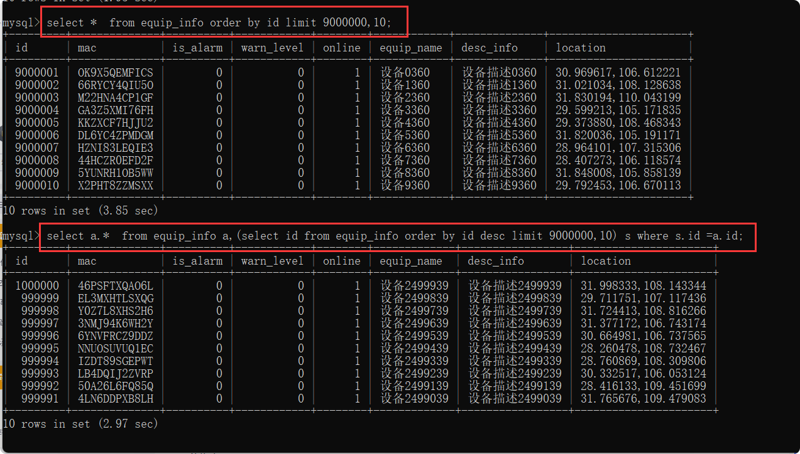  

### count优化

**myisam**存储引擎是把表的总行数存储在磁盘上，因此count（*）直接获取结果，效率比较高  

innodb存储引擎执行count（*），需要将数据一行一行读取出来，然后累计结果，效率较低  

> count（）的几种用法：  

效率 count（*）>count（1）>count（主键）>count（字段）  

- count（*）:innodb引擎并不会把全部字段取出来，而是**专门做了优化**，不取值，服务层直接按行进行累加
- count（1）：innodb引擎遍历整张表，**但不取值**，服务层对于返回的每一行，放一个数字“1”进去，直接按行进行累加
- count（主键）：innodb引擎遍历整张表，**把每一行的主键都取出来**，返回给服务层，服务层拿到主键直接按行进行累加（主键不可能为空）
- count（字段）：**没有not null约束**，innodb引擎遍历整张表，把每一行的字段都取出来，**判断是否为null**，若不为null，按行进行累加

### update 优化

*innodb的行锁是针对**索引加锁**，不是针对记录加锁，并且该索引不能失效，否则会从行锁升级被表锁*  

update时，要对更新的字段设置成索引，不然会把行锁升级为表锁  

### 其他博客文档

[SQL语句百万数据量优化方案](https://www.cnblogs.com/cq-jiang/p/7681196.html)

## 锁
### 全局锁

全局锁就是对整个数据库实例加锁。MySQL提供了一个加全局读锁的方法，命令是**Flush tables with read lock**，解锁**unlock tables**。当需要让整个库处于只读状态的时候，可以使用这个命令，之后其他线程的以下语句会被阻塞：数据更新语句（数据的增删改）、数据定义语句（包括建表、修改表结构等）和更新类事务的提交语句

全局锁的典型使用场景是，**做全库逻辑备份**。也就是把整库每个表都select出来存成文本

**全库备份**例子
    
    //加全局锁
    Flush tables with read lock;
    //bin目录运行cmd，执行mysqldump操作
    
    mysqldump -u root -p  kim_iot >D:/kim_iot.sql
    
    //解锁
    unlock tables;

加全局锁：Flush tables with read lock;  

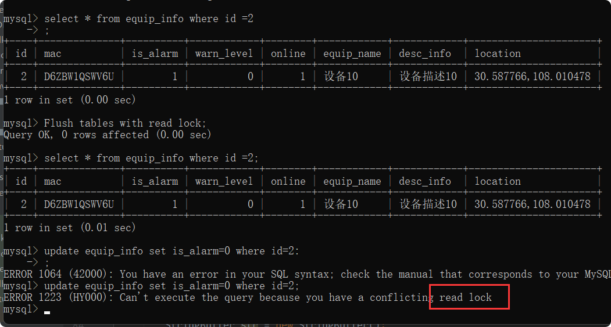

执行mysqldump操作：mysqldump -u root -p  kim_iot >D:/kim_iot.sql  

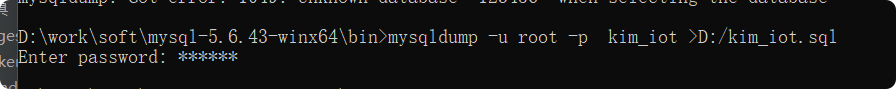

  

> 但是让整个库都只读，可能出现以下问题：

- 如果在主库上备份，那么在备份期间都不能执行更新，业务基本上就得**停摆**;
- 如果在从库上备份，那么在备份期间从库不能执行主库同步过来的binlog，会**导致主从延迟**

> 在**可重复读隔离**级别下开启一个事务能够拿到一致性视图(**快照读**)

  当mysqldump使用参数**-–single-transaction**的时候，导数据之前就会启动一个事务，来确保拿到一致性视图。而由于MVCC的支持，这个过程中数据是可以正常更新的。single-transaction只适用于所有的表使用事务引擎的库
    
        //bin目录运行cmd，执行mysqldump操作
        mysqldump  -–single-transaction -u root -p  kim_iot >D:/kim_iot.sql
        
        
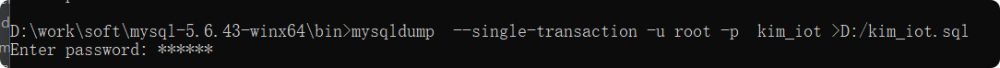

       
### 表级锁

#### 表锁

表锁的语法是lock tables … read/write。可以用unlock tables/客户端断开连接 主动释放锁    

例如：
    
    //读锁
    lock tables  equip_info read;

**读读共享，读写排他，写写排他**

#### 元数据锁（meta data lock，MDL）

系统**自动控制**，主要作用是维护表数据一致性，

在mysql5.5之后引入的元数据锁（MDL），
- 当对**一张表**增删改查时（select insert update delete），加MDL读锁（共享）
- 当对**表结构**进行变更时(alter table....)，加MDL写锁（排他） 

#### 意向锁
当一个事务试图对**整个表**进行加锁（共享锁或排它锁）**之前**，首先需要获得对应类型的意向锁（意向共享锁或意向共享锁）  
*解决innodb行锁和表锁冲突问题*  

1.意向共享锁（IS）：由语句select...lock in share mode 添加  
2.意向排它锁（IX）：由语句 insert、update、delete、select...for update 添加

**举个例子理解**  
**事务A**对user_info表执行一个SQL:update user_info set name =”张三” where id=6 加锁情况如下图;    

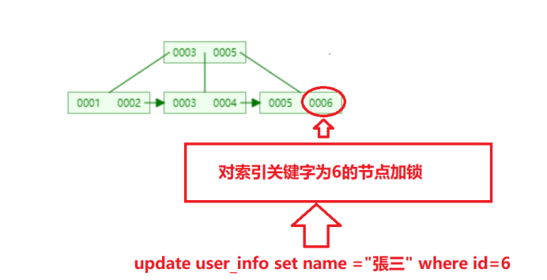  

与此同时数据库又接收到**事务B**修改数据的请求：SQL: update user_info set name =”李四”；

描述：  
1、因为事务B是对整个表进行修改操作，那么此SQL是需要对整个表进行加排它锁的（update加锁类型为排他锁）；

2、我们首先做的第一件事是先检查这个表有没有被别的事务锁住，只要有事务对表里的任何一行数据加了共享锁或排他锁我们就无法对整个表加锁（排他锁不能与任何属性的锁兼容）。

3、因为INNODB锁的机制是基于行锁，那么这个时候我们会对整个索引每个节点一个个检查，我们需要检查每个节点是否被别的事务加了共享锁或排它锁。

4、最后检查到索引ID为6的节点被事务A锁住了，最后导致事务B只能等待事务A锁的释放才能进行加锁操作。

思考：
在A事务的操作过程中，后面的每个需要对user_info加持表锁的事务都需要**遍历整个索引树**才能知道自己是否能够进行加锁，这种方式是不是太浪费时间和损耗数据库性能了？   

所以就有了意向锁的概念：如果当事务A加锁成功之后就设置一个状态告诉后面的人，已经有人对表里的行加了一个排他锁了，你们不能对整个表加共享锁或排它锁了，那么后面需要对整个表加锁的人只需要获取这个状态就知道自己是不是可以对表加锁，**避免了对整个索引树的每个节点扫描是否加锁**，而这个状态就是我们的意向锁  

### 行级锁

行锁是指上锁的时候锁住的是表的某一行或多行记录，其他事务访问同一张表时，只有被锁住的记录不能访问，其他的记录可正常访问；  

特点：粒度小，加锁比表锁麻烦，不容易冲突，相比表锁支持的并发要高；  

innodb的数据是基于**索引**组织的，行锁是通过对索引上的索引项加锁来实现的，而不是对记录加的锁。 

#### 行锁 Record Lock
> Record Lock（单行记录）：锁定**单个行记录**，防止其他事务对此行进行update和delete。在RC、RR隔离级别下都支持。    

**触发条件**：精准条件命中，并且命中的条件字段是唯一索引；

**例如**：update user_info set name=’张三’ where id=1 ,这里的id是唯一索引。

**记录锁的作用**：加了记录锁之后数据可以避免数据在查询的时候被修改的重复读问题，也避免了在修改的事务未提交前被其他事务读取的脏读问题。

#### 间隙锁 Gap Lock
> 间隙锁(Gap Lock):锁定索引记录间隙（不包含该几率），确保索引记录间隙不变，防止其他事务在这个间隙进行insert，产生幻读。在RR隔离级别下支持。

比如下面的表里面的数据ID 为 1,4,5,7,10 ,那么会形成以下几个间隙区间，-n-1区间，1-4区间，7-10区间，10-n区间 （-n代表负无穷大，n代表正无穷大）  

**触发条件**：范围查询并且查询未命中记录，查询条件必须命中索引、间隙锁只会出现在REPEATABLE_READ（RR重复读)的事务级别中。  

**例如**：对应上图的表执行select * from user_info where id>1 and id<4 for update(这里的id是唯一索引) ，这个SQL查询不到对应的记录，那么此时会使用间隙锁。  
  
**间隙锁作用**：防止幻读问题，事务并发的时候，如果没有间隙锁，就会发生如下图的问题，在同一个事务里，A事务的两次查询出的结果会不一样。

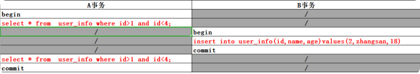

#### 临键锁 Next-Key Lock

> 临键锁（Next-Key Lock）:行锁+间隙锁的组合，同时锁住数据，并且**锁住数据前面的间隙GRP**，在RR隔离级别下支持。

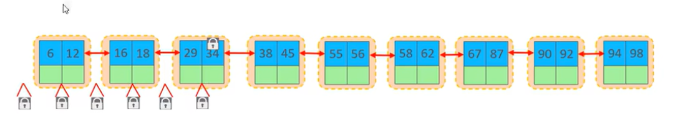

**触发条件**：范围查询并命中，查询命中了索引。

**例如**：下面表的数据执行 select * from user_info where id>1 and id<=13 for update ;会锁住ID为 1,5,10的记录；同时会锁住，1至5,5至10,10至15的区间。  
  

**临键锁的作用**：结合记录锁和间隙锁的特性，临键锁避免了在范围查询时出现脏读、重复读、幻读问题。加了临键锁之后，在范围区间内数据不允许被修改和插入。  

## 事务原理ACID

### 四大特性

- **原子性（Atomicity）**：事务是不可分割的最小操作单元，**要么全部成功，要么全部失败**；
- **一致性（Consistency）**：事务完成时，必须使所有**数据保持一致状态**；
- **隔离性（Isolation）**：数据库系统提供的隔离机制，保证事务**不受外部并发操作影响**的独立环境下运行；
- **持久性（Durability）**：事务一旦提交或者回归，它对数据库中**数据的改变就是永久的**。

### 如果保证四大特性

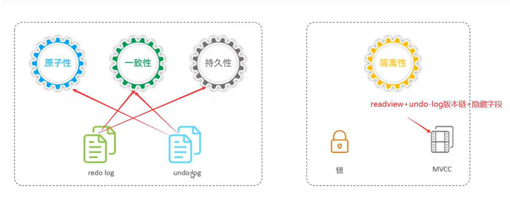

> **持久性**-**redo log** 

**重做日志**是物理日志，保存的是具体数据到磁盘redo log file  

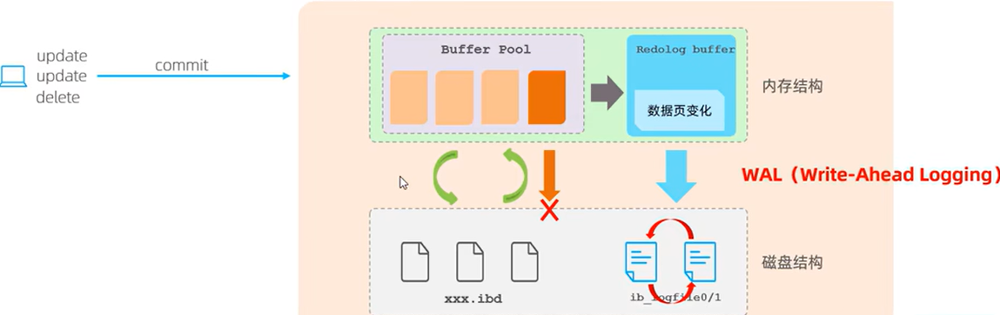

数据都是先写入缓冲池（buffer pool），每隔一段时间在刷入磁盘（还没写入磁盘的就叫脏页）。会出现还没写到磁盘**缓冲池数据丢失**，redo log主要解决这块问题。  
- 1、redo log buffer把数据库页变化记录下来，刷新到磁盘redo log file里面。如果出现数据丢失或者发生错误，进行数据恢复使用。
- 2、为什么不直接用buffer pool来做这个操作？buffer pool是随机操作磁盘文件（**随机磁盘IO**），redo log 是**追加记录，是顺序磁盘IO**（2个文件循环写，定期清理），效率高，减少磁盘IO。
- 3、redo log file 默认是2个文件，循环写，定期清理，而且写入磁盘操作是**先写日志WAL(write-ahead-logging)，过段时间在把缓冲池脏页的数据刷新到磁盘**。

> **原子性**-**undo log**

**回滚日志**，记录数据被修改前的信息，作用包括2个：**提供回滚**和**MVCC**（多版本并发控制）  
- undo-log是**逻辑日志**，*记录的是和数据操作相反的记录*，比如：insert时，记录一条对应的delete，当执行rollback时候，就可以从undo log中读取到相应的记录进行回归  

- undo-log销毁：事务提交时并不会立即销毁undo log，因为这些文件还有可能用于 MVCC

- undo-log存储：采用段的方式管理和记录，放入rollback segment回滚段中，内部包括1024个undo log segment。

> **一致性**-**undo log+redo log**
 
 指的是数据执行之前和之后是一致的，也就是说事务一旦**执行失败就要回滚（undo log）**，数据**一旦提交要保证**数据一定是**更新**（redo log）过来的
 
> **隔离性**-**undo log版本链+read view+隐藏字段**
  
 具体内容看下面MVCC说明
 
### 四大隔离级别
- read uncommitted(读未提交) ,事务A可以读取到事务B未提交的数据，事务B回滚，则事务A中的数据为**脏数据**
- read committed(读已提交) ,事务A只能读取到事务B已提交的数据，会产生**不可重复读**与**幻读**的问题
- repeatable read(可重复读),解决了不可重复读的问题，但**幻读**依然存在
- serializable(串行读)

## MVCC

> 当前读与快照读

- 当前读：读的是记录最新版本，读取时还要保证其他并发事务不能修改当前记录，会对读的内容进行**加锁、阻塞**
- 快照读：简单的select语句就是快照读。读取的是记录可见的版本，有可能是历史记录，**不加锁、非阻塞**
    - read committed(读已提交) 级别下，**每次select**，都会生成一个快照读
    - repeatable read(可重复读)级别下：开启事务**第一个select语句**才是快照读
    - serializable(串行读)：快照读退化为当前读（加锁、阻塞）

> MVCC**全称multi-version concurrency control 对版本并发控制**  

指的是，维护一个数据的多个版本，使数据读写没有冲突，MVCC提供了一个非阻塞读功能。  

MVCC具体实现：数据记录中**三个隐藏字段**、**undo log**和**readView**

- **隐藏字段**

  

 
隐藏字段|含义
--|--
DB_TRX_ID|**最近修改事务ID**，记录插入这条记录或者最后一次修改记录的事务ID
DB_ROLL_PTR|**回归指针**，指向这条记录上一个版本，用于配合undo log，指向**上一个版本**
DB_ROW_ID|**隐藏主键**，如果表没有主键，则会生成该隐藏字段。

- **undo log**

**回滚日志**,在insert、delete、update的时候产生的相反逻辑日志  

- 当insert的时候，undo log 日志只在回滚时需要，事务提交后，可被**立即删除**

- update和delete时，不仅回滚需要，**快照读时也需要，不会立即删除**

> undo log 版本链  

不同事务或者相同事务对**同一条记录**进行修改，会导致undo-log生成一条**记录版本链表**，链表头部是最新的旧记录，尾部是最早的旧记录。

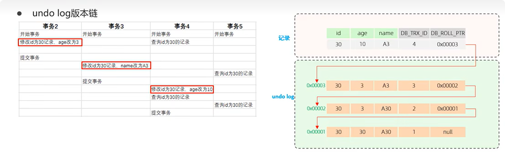

- **readView** 

**读视图**:是**快照读**SQL执行时MVCC提取数据的依据，记录并维护**当前活跃的事务（未提交）ID**；  

ReadView中包含了四个核心字段:  

字段|含义
--|--
m_ids|当前活跃的事务ID集合
min_trx_id|最小活跃事务ID
max_trx_id|预分配事务ID，当前事务ID+1（事务ID是自增的），也就是下个事务ID
creator_trx_id|ReadView 创建者ID

> 不同隔离级别生成readView的时机不同

- read committed(读已提交) 级别下，事务中**每次**执行快照读生成readView，
- repeatable read(可重复读)级别下：仅在事务中**第一次**执行快照读时生成readView，后面就复用该readView

**在RC级别下**

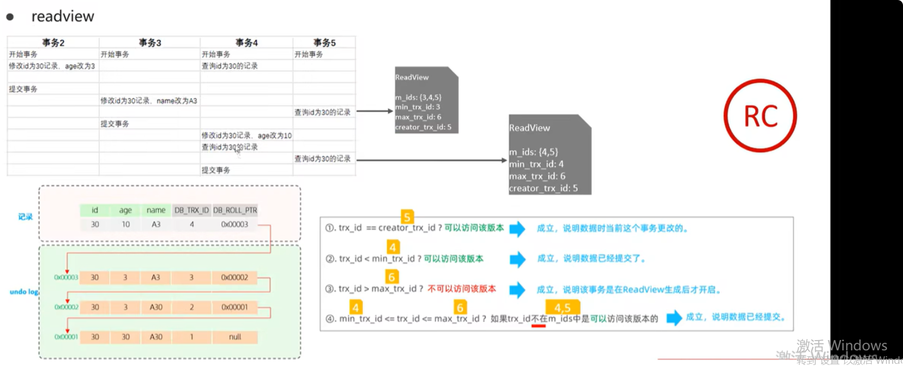

**在RR级别下**

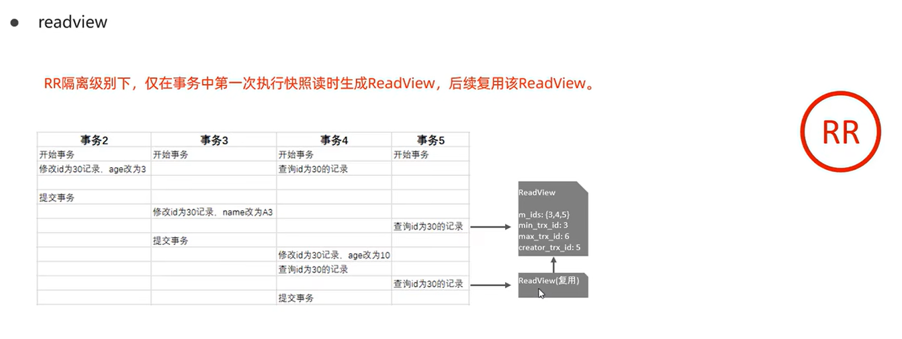

## 日志
### 错误日志 xxx.err

错误日志记录了mysqld启动和停止时，以及服务器在运行过程中发生任何严重错误时的相关信息。  

作用：当数据库出现故障导致无法运行时，建议首先查看此日志。  

该日志是默认开启的。linux下存放在/var/log/，默认日志文件名为mysqld.log，查看日志位置：
    
    show variables like'%log_error%';

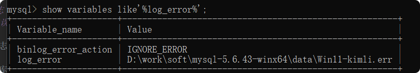 

### 二进制日志（binlog）

记录了所有的DDL（数据定义语言）和DML（数据操作语言），但不包括（select和show）语句

作用：1).灾难时数据恢复 2).Mysql主从复制。  

#### 日志格式

日志个数|含义
--|--
statement|基于sql语句的日志记录，记录的是sql语句，对数据库进行修改的sql都会记录到日志文件
row|基于行的记录，记录的是每一行的数据变更（默认）
mixed|混合了statement和row两种格式，默认是statement，特殊情况下用row

    
    show variables like '%binlog_format%';
    
    

#### 开启binlog日志
> mysql8版本中。默认二进制日志是开启的，参数如下：
    
    show variables like'%log_bin%';
    

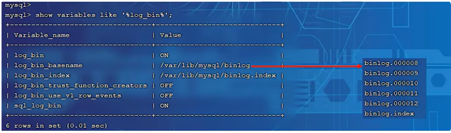

> Linux下

1.登录MySQL   

        mysql -h 127.0.0.1  -u root -p
        输入密码
2.查看状态  
    
    show variables like '%log_bin%';

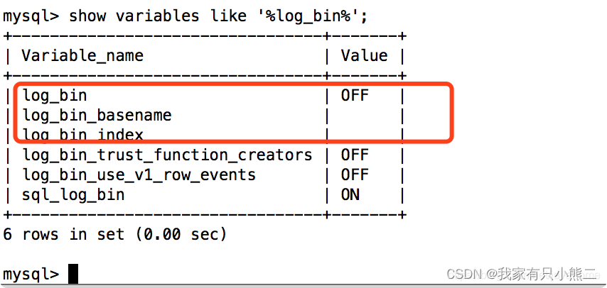

目前是：未开启状态  

3.创建目录和设置权限组  

    mkdir /usr/local/mysql/log-bin
    chown -R mysql:mysql /usr/local/mysql
    chmod -R 755 /usr/local/mysql

4.修改MySQL配置（my.cnf）  

    vi /etc/my.cnf

增加以下配置  
    
    # server-id表示单个结点的id，这里由于只有一个结点，所以可以把id随机指定为一个数，这里将id设置成1。若集群中有多个结点，则id不能相同
    server-id=1
    # log-bin日志文件的名字为mysql-bin，以及其存储路径
    log-bin=/usr/local/mysql/log-bin/mysql-bin

等同于这三个配置  
    
    # 第一个参数是打开binlog日志
    log_bin=ON
    # 第二个参数是binlog日志的基本文件名，后面会追加标识来表示每一个文件
    log_bin_basename=/usr/local/mysql/log-bin/mysql-bin
    # 第三个参数指定的是binlog文件的索引文件，这个文件管理了所有的binlog文件的目录
    log_bin_index=/usr/local/mysql/log-bin/mysql-bin.index

5.重启MySQL  

    service mysql restart

6. 查看binlog日志目录
    
  

7. 验证是否开启成功  
重新进入Mysql 查看状态(步骤参考1、2) ON 已开启  

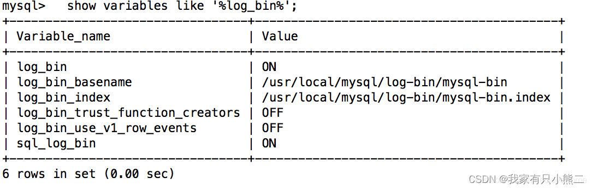  

> windows 下

1.查看是否开启了binlog：
    
    show binary logs;  

 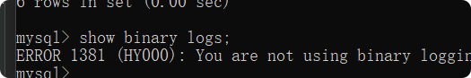
 
2.开启binlog：  
修改mysql的配置文件my.ini。添加如下配置：  

    # 可以是相对路径，也可以是绝对路径
    log-bin=mysql-bin
     # server-id表示单个结点的id，这里由于只有一个结点，所以可以把id随机指定为一个数，这里将id设置成2。若集群中有多个结点，则id不能相同
    server-id=2
    # 保存binlog的方式
    binlog-format=Row
    
3.重启MySQL服务  

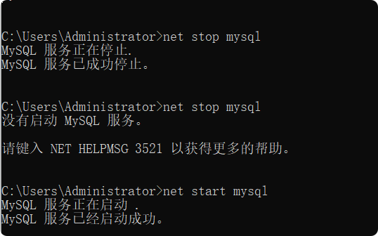

4.验证binlog是否开启：  
    
    show variables like '%log_bin%';
    show binary logs;
#### 查看binlog文件
方式一：通过mysqlbinlog直接查看  
    
    mysqlbinlog mysql-bin.000001

方式二：通过mysqlbinlog将binlog日志文件转换为txt查看  

    mysqlbinlog  -u username -p password mysql-bin.000001 >001.txt
    
#### 删除binlog文件
1.**自动删除**   

**永久生效**：修改mysql的配置文件my.cnf，添加binlog过期时间的配置项：expire_logs_days=30，然后重启mysql，这个有个致命的缺点就是需要重启mysql。

**临时生效**：进入mysql，用以下命令设置全局的参数：set global expire_logs_days=30;

（上面的数字30是保留30天的意思。）  

2.**手动删除**

可以直接删除binlog文件，但是可以通过mysql提供的工具来删除更安全，因为purge会更新mysql-bin.index中的条目，而直接删除的话，mysql-bin.index文件不会更新。mysql-bin.index的作用是加快查找binlog文件的速度。

（1）**直接删除**  

找到binlog所在目录，用rm binglog名 直接删除  

例：rm mysql-bin.010    

（2）**通过mysql提供的工具来删除**  

删除之前可以先看一下purge的用法：help purge;    
  
- 删除举例：  

    - **RESET MASTER**;//删除所有binlog日志，新日志编号从头开始  

    - **PURGE MASTER LOGS TO 'mysql-bin.010'**;//删除mysql-bin.010之前所有日志  

    - **PURGE MASTER LOGS BEFORE '2003-04-02 22:46:26'**;// 删除2003-04-02 22:46:26之前产生的所有日志  

### 查询日志

查询日志记录了客户端**所有操作语句**（binlog不包括查询数据的sql语句），默认关闭  

    show variables like'%general%';

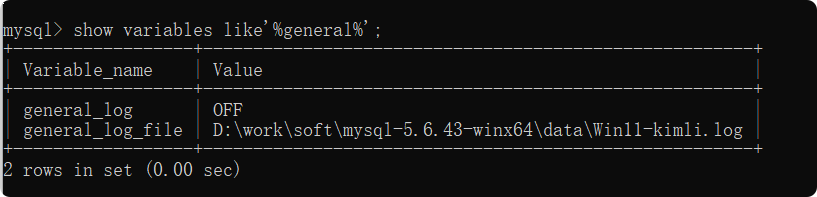

#### 开启查询日志
修改配置文件：  
    
    #开启查询日志： 0表示关闭，1表示开启， 
    general_log=1
    #设置文件名称，没指定就默认为host_name.log
    general_log_file=mysql_query.log
    

### 慢查询日志

记录查询日志比较低的日志，执行时间超过参数long_query_time、并且扫描记录树不小于min_examined_row_limit的所有sql语句。  
默认关闭。long_query_time默认为10秒，最小为0，经度可以为微妙  
1、永久生效（改配置文件）   
  
    #慢查询日志
    show_query_log=1
    #执行时间参数
    long_query_time=2

2、临时生效  

SQL语句|描述|说明  
--|--|--  
SHOW VARIABLES LIKE '%slow_query_log%';|查看慢查询日志是否开启|默认情况下 slow_query_log 的值为 OFF， 表示慢查询日志是禁用的
set global slow_query_log=1;|开启慢查询日志|只对当前数据库生效，如果 mysql 重启，则会失效。
SHOW VARIABLES LIKE 'long_query_time%';	|查看慢查询设定阈值|单位秒，默认是10秒
set global long_query_time=3;|设定慢查询阈值|单位秒，大于3秒，而不是大于等于

## 主从复制

### 原理
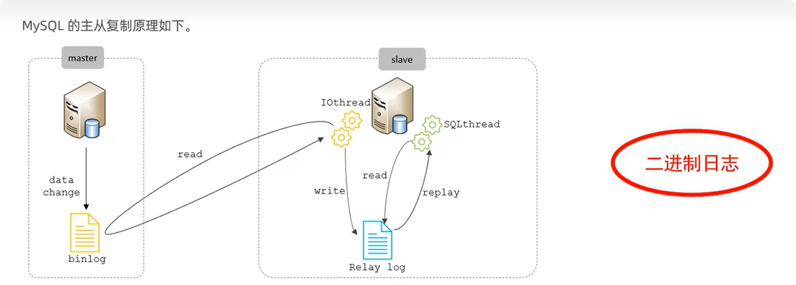  

- 主从复制三步
    - master主库在事务提交时，会把数据变更记录在binlog里面，
    - slave 从库读取主库的binlog，写到从库的relay log（中继日志）里面
    - slave 从库重做relay log中的事件，将改变反应到自身的数据

### 使用

主从复制和分库分表，另开一篇文章[mysql安装与使用](mysql安装与使用.md)。

