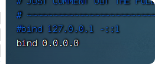
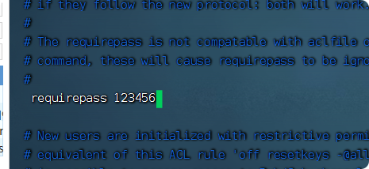
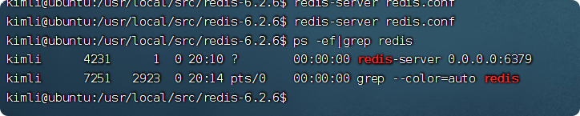
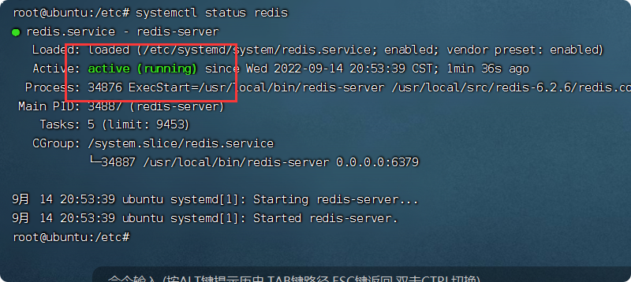
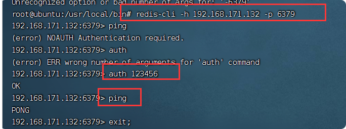
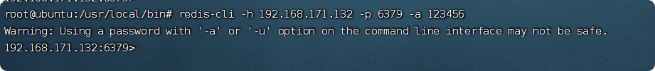
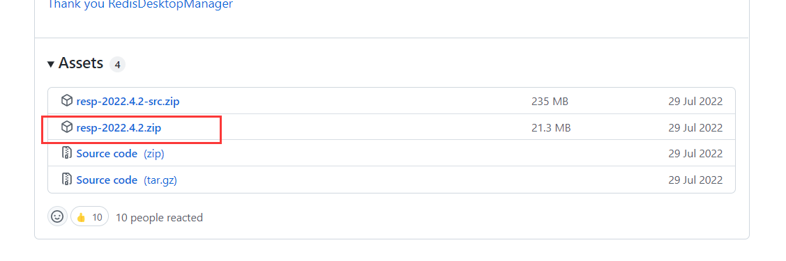
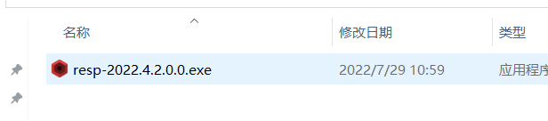
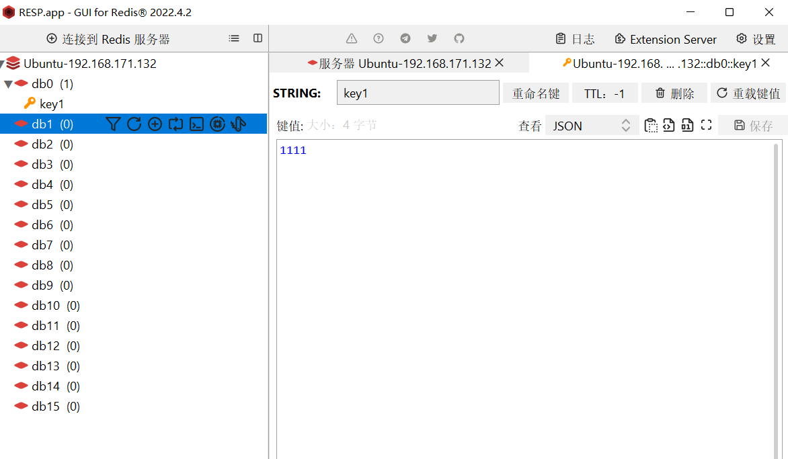

# redis安装与使用

## 单机安装redis

使用的是Ubuntu虚拟机
    
### 1.下载redis

[redis下载地址](https://download.redis.io/releases/)：选择redis-6.2.6.tar.gz 版本

### 2.安装redis依赖  
因为redis是基于C语言写的，所以要安装redis所需的gcc依赖
    
    sudo apt install -y gcc tcl

### 3.解压与安装
    
3.1.上传到 /usr/local/src，src文件先更改权限
        
        chmod 777 src
3.2.解压

        tar -zxvf redis-6.2.6.tar.gz
        
3.3.进入安装目录

         cd redis -6.2.6
    
3.4.运行编译命令 

        //先安装make 插件
        sudo apt install make  
        //运行编辑
        make && make install
        //如果前面安装出错，有残余文档。需要清理安装，执行下面命令
        make distclean && make
        
3.5.备份配置文件 redis.conf

          cp redis.conf redis.conf.bck
    
3.6.修改配置文件 redis.conf

ip地址：       

    
后台运行：  
    

开启密码：  

### 4.配置文件方式启动
     cd /usr/local/src/redis-6.2.6
     
     redis-server redis.conf
     

查看是否运行  
    
     ps -ef|grep redis
     

    
停止服务（杀死）：    

    sudo kill 9 4231
    
### 5.开启自启

    vim /etc/systemd/system/redis.service

文件内输入：
 
    [Unit]
    Description=redis-server
    After=network.target
    
    [Service]
    Type=forking
    # 这行配置内容要根据redis的安装目录自定义路径
    ExecStart=/usr/local/bin/redis-server /usr/local/src/redis-6.2.6/redis.conf
    PrivateTmp=true
    
    [Install]
    WantedBy=multi-user.target

启动服务：

    systemctl daemon-reload
    
    systemctl start redis
    
     systemctl status redis
     

## docker下安装redis

### 拉取与运行
    docker pull redis:6.2.6
    
    docker run -d --name redis -p 6379:6379 \
    -v /usr/local/redis/conf/redis.conf:/redis.conf \
    -v /usr/local/redis/data:/data \
    redis:6.2.6 \
    --requirepass 123456
    
    docker container update --restart=always redis

### 客户端连接

    apt install redis-tools
    
    redis-cli -h 192.168.171.132 -p 16379
    
    auth 123456

## 客户端
### Redis命令行客户端

Redis 自带了命令行客户端：redis-cli  
    
    redis-cli [options] [commonds]
    
- options: 

    - -h 127.0.0.1：指定要连接的redis节点的IP地址，默认是127.0.0.1  
    
    - -p 6379：指定要连接的redis节点的端口，默认是6379  
    
    - -a 123321：指定redis的访问密码  

- commonds就是Redis的操作命令，
    - 例如: ping：与redis服务端连接，服务端正常会返回pong
    
    
不指定commond时，直接进入redis-cli交互界面

1.不指定密码登录：  

    redis-cli -h 192.168.171.132 -p 6379
    
    auth 123456

2.指定密码登录
        
    redis-cli -h 192.168.171.132 -p 6379 -a 123456

----

### 图形化界面客户端

常用的几种客户端工具就就不介绍了，参考[强烈推荐三款不错的 Redis 客户端工具](https://www.hxstrive.com/article/1080.htm)  

我使用的是**RDM**：

  

#### RDM下载与安装

1.下载
下载地址：[GItHUb 地址](https://github.com/lework/RedisDesktopManager-Windows/releases)

2.安装

直接解压，双击exe安装  

3.使用

## redis启动之WARNING overcommit_memory is set to 0! Background save may fail under low memory condition. To fix this issue add 'vm.overcommit_memory = 1' to /etc/sysctl.conf and then reboot or run the comm

> 警告超委托内存设置为0！后台保存可能在低内存条件下失败。若要修复此问题，将“VM OpRebug内存＝1”添加到/ETC/SysTL.CONF中，然后重新启动或运行命令“SysTtl VM.OpjExtRebug内存＝1”，以使其生效。

方法1：只影响本次

    1.验证系统中overcommit_memory的值，执行如下命令
    sysctl -n vm.overcommit_memory
    
    2.设置overcommit_memory的值为1
    sysctl -w vm.overcommit_memory=1
    
    3.验证系统中overcommit_memory的值是否被改成了1
    sysctl -n vm.overcommit_memory
    
方法2:(需重启)

    1.将vm.overcommit_memory = 1添加到/etc/sysctl.conf中
    2.重启电脑

## redis优化

### 系统优化配置 

    # - 设置内存分配策略
    sudo sysctl -w vm.overcommit_memory=1
    
    # - 尽量使用物理内存(速度快)针对内核版本大于>=3.x （宁愿swap也不要OOM killer）
    sudo sysctl -w vm.swapniess=1
    
    # - 禁用 THP 特性减少内存消耗
    echo never > /sys/kernel/mm/transparent_hugepage/enabled
    
    # - OOM killer 特性优化
    for redis_pid in $(pgrep -f "redis-server")
    do
      echo -17 > /proc/${redis_pid}/oom_adj
    done
    
    # - 设置其打开文件数句柄数以及单个用户最大进程数
    tee etc/security/limits.conf <<'EOF'
    *  soft    nofile          10032
    *  hard    nofile          10032
    *  soft    nproc           65535
    *  hard    nproc           65535
    EOF
    
    # - SYN队列长度设置此参数可以容纳更多等待连接的网络。
    echo 511 > /proc/sys/net/core/somaxconn
    sudo sysctl -w net.ipv4.tcp_max_syn_backlog=2048
    
    # - 每个小时同步一次时间
    0 * * * * /usr/sbin/ntpdate ntp.xx.com > /dev/null 2>&1 
    
    
### 应用配置优化 

    # 最大客户端上限连接数（需根据实际情况调整与系统的open files有关，其数量值为open files(10032) - 32）
    maxclients 10000
    
    # 集群配置优化关键项
    # 集群超时时间，如果此时间设置太小时由于网络波动可能会导致进行重新选Master的操作
    cluster-node-timeout 5000
    # 主节点写入后必须同步到一台从上，防止数据丢失的有效方法(要求是其从节点必须>=1)
    min‐replicas‐to‐write 1 

### 应用使用中优化 

    # (1) 查询执行时间指的是不包括像客户端响应(talking)、发送回复等 IO 操作，而单单是执行一个查询命令所耗费的时间
    redis> SLOWLOG LEN   # 管理 redis 的慢日志查看当前日志的数量
    redis> SLOWLOG RESET # 清空 slowlog 此时上面 LEN 变成 0
    
    # (2) 断开耗时连接
    # 列出所有已连接客户端
    redis 127.0.0.1:6379> CLIENT LIST
    addr=127.0.0.1:43501 fd=5 age=10 idle=0 flags=N db=0 sub=0 psub=0 multi=-1 qbuf=0 qbuf-free=32768 obl=0 oll=0 omem=0 events=r cmd=client
    # 杀死当前客户端的连接
    redis 127.0.0.1:6379> CLIENT KILL 127.0.0.1:43501
    OK 作者：WeiyiGeek https://www.bilibili.com/read/cv13232686/ 出处：bilibili