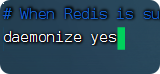

# redis安装与使用

## 单机安装redis

使用的是Ubuntu虚拟机
    
### 1.下载redis

[redis下载地址](https://download.redis.io/releases/)：选择redis-6.2.6.tar.gz 版本

### 2.安装redis依赖  
因为redis是基于C语言写的，所以要安装redis所需的gcc依赖
    
    sudo apt install -y gcc tcl

### 3.解压与安装
    
3.1.上传到 /usr/local/src，src文件先更改权限
        
        chmod 777 src
3.2.解压

        tar -zxvf redis-6.2.6.tar.gz
        
3.3.进入安装目录

         cd redis -6.2.6
    
3.4.运行编译命令 

        //先安装make 插件
        sudo apt install make  
        //运行编辑
        make && make install
        //如果前面安装出错，有残余文档。需要清理安装，执行下面命令
        make distclean && make
        
3.5.备份配置文件 redis.conf

          cp redis.conf redis.conf.bck
    
3.6.修改配置文件 redis.conf

ip地址：       

    
后台运行：  
    

开启密码：  

### 4.配置文件方式启动
     cd /usr/local/src/redis-6.2.6
     
     redis-server redis.conf
     

查看是否运行  
    
     ps -ef|grep redis
     

    
停止服务（杀死）：    

    sudo kill 9 4231
    
### 5.开启自启

    vim /etc/systemd/system/redis.service

文件内输入：
 
    [Unit]
    Description=redis-server
    After=network.target
    
    [Service]
    Type=forking
    # 这行配置内容要根据redis的安装目录自定义路径
    ExecStart=/usr/local/bin/redis-server /usr/local/src/redis-6.2.6/redis.conf
    PrivateTmp=true
    
    [Install]
    WantedBy=multi-user.target

启动服务：

    systemctl daemon-reload
    
    systemctl start redis
    
     systemctl status redis
     

## docker下安装redis

## 客户端
### Redis命令行客户端

Redis 自带了命令行客户端：redis-cli  
    
    redis-cli [options] [commonds]
    
- options: 

    - -h 127.0.0.1：指定要连接的redis节点的IP地址，默认是127.0.0.1  
    
    - -p 6379：指定要连接的redis节点的端口，默认是6379  
    
    - -a 123321：指定redis的访问密码  

- commonds就是Redis的操作命令，
    - 例如: ping：与redis服务端连接，服务端正常会返回pong
    
    
不指定commond时，直接进入redis-cli交互界面

1.不指定密码登录：  

    redis-cli -h 192.168.171.132 -p 6379
    
    auth 123456

2.指定密码登录
        
    redis-cli -h 192.168.171.132 -p 6379 -a 123456

----

### 图形化界面客户端

常用的几种客户端工具就就不介绍了，参考[强烈推荐三款不错的 Redis 客户端工具](https://www.hxstrive.com/article/1080.htm)  

我使用的是**RDM**：

  

#### RDM下载与安装

1.下载
下载地址：[GItHUb 地址](https://github.com/lework/RedisDesktopManager-Windows/releases)

2.安装

直接解压，双击exe安装  

3.使用

