# redis实战

## 依赖jar

                <dependency>
                    <groupId>org.springframework.boot</groupId>
                    <artifactId>spring-boot-starter-data-redis</artifactId>
                </dependency>
                <dependency>
                    <groupId>org.apache.commons</groupId>
                    <artifactId>commons-pool2</artifactId>
                </dependency>
                <dependency>
                    <groupId>org.springframework.boot</groupId>
                    <artifactId>spring-boot-starter-web</artifactId>
                </dependency>
        
                <dependency>
                    <groupId>mysql</groupId>
                    <artifactId>mysql-connector-java</artifactId>
                    <scope>runtime</scope>
                    <version>5.1.47</version>
                </dependency>
                <dependency>
                    <groupId>org.projectlombok</groupId>
                    <artifactId>lombok</artifactId>
                    <optional>true</optional>
                </dependency>
                <dependency>
                    <groupId>org.springframework.boot</groupId>
                    <artifactId>spring-boot-starter-test</artifactId>
                    <scope>test</scope>
                </dependency>
                <!--mybatis-plus-->
                <dependency>
                    <groupId>com.baomidou</groupId>
                    <artifactId>mybatis-plus-boot-starter</artifactId>
                    <version>3.4.3</version>
                </dependency>
                <!--hutool，牛逼的工具类-->
                <dependency>
                    <groupId>cn.hutool</groupId>
                    <artifactId>hutool-all</artifactId>
                    <version>5.7.17</version>
                </dependency>

## redis单点登录

### 需求与解决方案
>需求

分布式服务下，服务跑在不同服务上，传统session不能达到**一点登录，多点共同访问**，所以要多加一层redis，来存放登录信息

> 解决方案：手机验证登录为例子

- **发送验证码**：根据前段手机号码，生成验证码，调用短信系统发送到客户手机  
    - 1.验证手机是否合法
    - 2.RandomUtil.randomNumbers(6);生成验证码，发送
    - 3.电话号码作为key，验证码作为value，携带expire过期时间（如2分钟），存入redis
    
- **登录**：前端根据用户传来的电话号码和验证码，去redis进行验证
    - 1.信息合法验证
    - 2.电话号码作为key，去redis获得验证码，进行验证
    - 3.验证成功，进行登录：（短信登录需要验证，数据库是否有用户，没有用户就创建新用户）
    - 4.生成单独的token作为key，用户信息(不要携带敏感信息，如：密码等)作为value，增加过期expire时间（如30分钟），**此处可以选择string或者hash**
    - 5.返回前端token，存入authorization

- **访问拦截**：两层拦截，
    - 全局拦截 order(0)，**更新redis过期时间**（因为所有的访问都要更新时间，但是有的访问不需要登录，所有先来个全局拦截更新redis过期时间）
        - 1.根据访问请求头带的 authorization得到token ，查询redis。**没有数据直接返回true，放行**（有的页面不需要登录，返回true，留给第二层拦截器判断）
        - 2.如果有数据，存入ThreadLocal 里面，
        - 3.更新redis里面token过期时间，**同样返回true，放行**
    
    - 登录拦截：order(1)**拦截需要登录的访问，要配置不需要拦截的页面**
        - 获取ThreadLocal，判断是否存入用户，没有直接返回false，拦截
        - 有用户，返回true放行
        
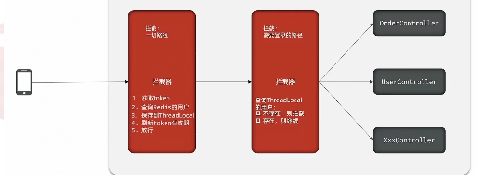

### 核心代码
    
> 发送验证码
    
      @Override
        public Result sendCode(String phone, HttpSession session) {
            //1.校验手机号
            if (RegexUtils.isPhoneInvalid(phone)) {
                //2.如果符合。返回错误信息
                return Result.fail("手机号格式错误");
            }
            //3.如果符合，生成验证码
            String code = RandomUtil.randomNumbers(6);
            //4.保存到redis
            stringRedisTemplate.opsForValue().set(LOGIN_CODE_KEY + phone, code, LOGIN_CODE_TTL, TimeUnit.MINUTES);
            //5.返回OK
            log.debug("发送短信验证码成功，验证码：{}", code);
            return Result.ok();
        }
        
 
> 登录
    
    @Override
        public Result login(LoginFormDTO loginForm, HttpSession session) {
            String phone = loginForm.getPhone();
            //1.校验手机号
            if (RegexUtils.isPhoneInvalid(phone)) {
                //2.如果符合。返回错误信息
                return Result.fail("手机号格式错误");
            }
            //2.校验验证码
            Object catheCode = stringRedisTemplate.opsForValue().get(LOGIN_CODE_KEY + phone);
            String code = loginForm.getCode();
            //3.不一致，报错
            if (catheCode == null || !catheCode.toString().equals(code)) {
                return Result.fail("验证码错误");
            }
            //4.一致，查询用户 select * from tb_user where phone = ？
            User user = query().eq("phone", phone).one();
            //5.判断用户是否存在
            if (user == null) {
                //6.不存在，创建新用户并保存
                user = createUserByPhone(phone);
            }
            //7.保存到redis
            String token = UUID.randomUUID().toString(true);
            UserDTO userDTO = BeanUtil.copyProperties(user, UserDTO.class);
            //bean转map
            Map<String, Object> userMap = BeanUtil.beanToMap(userDTO,new HashMap<>(),
                    CopyOptions.create().setIgnoreNullValue(true).setFieldValueEditor((fieldName,fieldValue)->fieldValue.toString()));
            
            String tokenKey = LOGIN_USER_KEY + token;
            stringRedisTemplate.opsForHash().putAll(tokenKey, userMap);
            stringRedisTemplate.expire(tokenKey, LOGIN_USER_TTL, TimeUnit.MINUTES);
    
            return Result.ok(token);
        }
        

> 访问拦截

添加拦截器：MvcConfig.java  
    
    @Configuration
    public class MvcConfig implements WebMvcConfigurer {
        @Autowired
        private StringRedisTemplate stringRedisTemplate;
        @Override
        public void addInterceptors(InterceptorRegistry registry) {
            /**
             * 登录拦截器,去掉不需要登录的页面
             */
            registry.addInterceptor(new LoginIntercepter())
                    .excludePathPatterns(
                        "/user/login",
                        "/user/code",
                        "/blog/hot",
                        "/shop/**",
                        "/voucher/**",
                        "/shop-type/**",
                        "/upload/**"
                ).order(1);
            /**
             * 刷新token时间，拦截所有请求
             */
            registry.addInterceptor(new RefreshTokenInterceptor(stringRedisTemplate)).addPathPatterns("/**").order(0);
        }
    }

    
全局拦截器（刷新过期时间）：RefreshTokenInterceptor.java
    
    public class RefreshTokenInterceptor implements HandlerInterceptor {
        private StringRedisTemplate stringRedisTemplate;
    
        public RefreshTokenInterceptor(StringRedisTemplate stringRedisTemplate) {
            this.stringRedisTemplate = stringRedisTemplate;
        }
    
        @Override
        public boolean preHandle(HttpServletRequest request, HttpServletResponse response, Object handler) throws Exception {
            //1.获取请求头的token
            String token = request.getHeader("authorization");
            if(StrUtil.isBlank(token)){
                return true;
            }
            String key=RedisConstants.LOGIN_USER_KEY + token;
            //2.根据token查询redis中的用户
            Map<Object, Object> userMap = stringRedisTemplate.opsForHash().entries(key);
            //判断用户是否存在
            if(userMap.isEmpty()){
               return true;
            }
            //如果存在，就存入threadLocal
            UserDTO userDTO = BeanUtil.fillBeanWithMap(userMap, new UserDTO(), false);
            //存入ThreadLocal
            UserHolder.saveUser(userDTO);
            //刷新token有效期
            stringRedisTemplate.expire(key,RedisConstants.LOGIN_USER_TTL, TimeUnit.MINUTES);
    
            return true;
        }
    
        @Override
        public void afterCompletion(HttpServletRequest request, HttpServletResponse response, Object handler, Exception ex) throws Exception {
            UserHolder.removeUser();
        }
    }
    
    
登录拦截器：LoginInterceptor.java
    
    public class LoginInterceptor implements HandlerInterceptor {
    
    
    
        @Override
        public boolean preHandle(HttpServletRequest request, HttpServletResponse response, Object handler) throws Exception {
            //判断是否需要拦截（ThreadLocal中是否有用户）
    
            if (UserHolder.getUser() == null) {
                //没有用户，需要拦截，返回状态码
                response.setStatus(401);
                //拦截
                return false;
            }
            //有用户就放心
            return true;
        }
    }
    

## 缓存介绍

> **缓存**(Cache), 就是数据交换的缓冲区 , 俗称的缓存就是缓冲区内的数据 , 一般从数据库中获取，存储于本地代码

### 常见缓存
    
    例1:Static final ConcurrentHashMap<K,V> map = new ConcurrentHashMap<>(); 本地用于高并发
    
    例2:static final Cache<K,V> USER_CACHE = CacheBuilder.newBuilder().build(); 用于redis等缓存
    
    例3:Static final Map<K,V> map =  new HashMap(); 本地缓存
    

由于其被 Static 修饰，所以随着类的加载而被加载到 内存之中 , 作为本地缓存，由于其又被 final 修饰，所以其引用 (例 3:map) 和对象 (例 3:new HashMap ()) 之间的关系是固定的，不能改变，因此不用担心赋值 (=) 导致缓存失效；

### 多级缓存
> 实际开发中，会构筑**多级缓存**来使系统运行速度进一步提升

- **浏览器缓存**：主要是存在于浏览器端的缓存

- **应用层缓存**：可以分为 tomcat 本地缓存，比如之前提到的 map，或者是**使用 redis 作为缓存**

- **数据库缓存**：在数据库中有一片空间是 buffer pool，增改查数据都会先加载到 mysql 的缓存中

- **CPU 缓存**：当代计算机最大的问题是 cpu 性能提升了，但内存读写速度没有跟上，所以为了适应当下的情况，增加了 cpu 的 L1，L2，L3 级的缓存

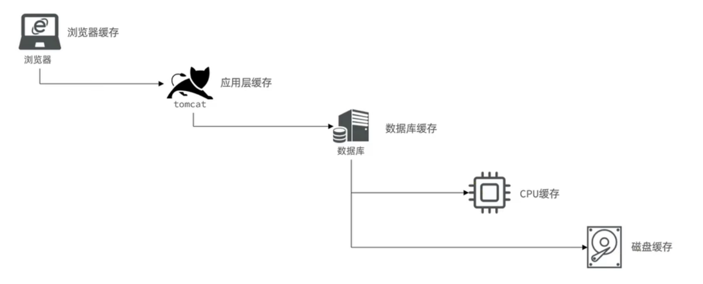  

## redis缓存

就是查询数据库之前先查询redis缓存，如果redis缓存数据存在，则直接从redis缓存中返回，如果redis缓存数据不存在，再查询数据库，然后将数据存入 redis。

### 问题一：缓存更新策略？

> 缓存更新是 redis 为了节约内存而设计出来的一个东西，主要是因为内存数据宝贵，当我们向 redis 插入太多数据，此时就可能会导致缓存中的数据过多，所以 redis 会对部分数据进行更新，或者把他叫为淘汰更合适。

#### 解决:LRU、超时、主动更新
- **内存淘汰**：redis 自动进行，当 redis 内存达到咱们设定的 **max-memery** 的时候，会***自动触发淘汰机制**，淘汰掉一些不重要的数据 (可以自己设置策略方式)

- **超时剔除**：当我们给 redis 设置了**过期时间** ttl 之后，redis 会将超时的数据进行删除，方便咱们继续使用缓存

- **主动更新**：我们可以**手动调用方法**把缓存删掉，通常用于解决缓存和数据库不一致问题

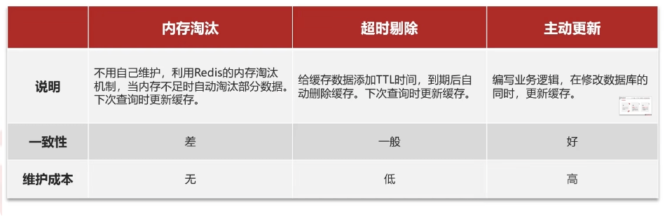

- 业务场景
    - **低一致性**：长久不变的数据，使用**内存淘汰（LRU等）**机制（也就是**不设置过期时间**）。如：店铺类型等长久不变的数据。
    
    - **高一致性**：经常变化的数据，**主动更新+超时剔除**（也就是**设置过期时间**，然后更新数据的时候**删除缓存**）。如：店铺详情等经常更新的数据。

### 问题二：双写不一致

> **数据库缓存不一致**:产生的原因就是更新数据库缓存不能及时更新

#### 解决:更新数据库+删除缓存

大概有三种解决方案：

- 1)Cache Aside Pattern **人工编码方式**：缓存调用者在更新完数据库后再去更新缓存，也称之为双写方案

- 2)Read/Write Through Pattern :**由系统本身完成**，数据库与缓存的问题交由系统本身去处理

- 3)Write Behind Caching Pattern ：**调用者只操作缓存**，其他线程去异步处理数据库，实现最终一致

> 一般使用方案1（人工编码方式）手动实现，这种方案就得思考一下几个问题。。

- **删除缓存还是更新缓存？**

    - **更新缓存**：每次更新数据库都更新缓存，**无效写操作较多，而且有可能长久不用，浪费内存**
    
    - **删除缓存**：更新数据库时删除缓存，查询时再新增缓存
    
- **如何保证缓存与数据库的操作的同时成功或失败？**

    - **单体系统**，将缓存与数据库操作放在一个**事务**
    
    - **分布式系统**，利用 **TCC（try-confirm-cancel）** 等分布式事务方案
    
    
- **先删缓存还是数据库？**
    
    - 先删除缓存，再操作数据库：**数据不一致风险大**，操作数据库比操作缓存**慢**，多线程并发下被其他线程修改的几率大，导致数据不一致的概率大
    
    - 先操作数据库，再删除缓存：**数据不一致风险小**，操作缓存比操作数据库**快**，多线程并发下被其他线程修改的几率小，导致数据不一致的概率小

*根据上面三个问题的答案，最后的选择是，先更新数据库，再删除缓存*

### 问题三：缓存**穿透**？

> **缓存穿透**:*数据库mysql和缓存redis里面**都没有数据**，导致每次请求都会直接打到数据库mysql*

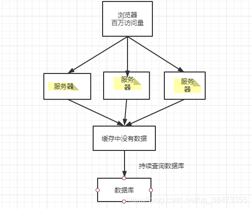

#### 解决:存null值、布隆过滤

- 做好热点参数的限流

- 做好数据的基础格式校验

- 加强用户权限校验

- 增强 id 的复杂度，避免被猜测 id 规律

- **缓存 null 值，设置过期时间**

- **布隆过滤**

方法|优点|缺点
--|--|--
缓存null对象|实现简单，维护方便|额外的内存消耗，可能造成短期的不一致
布隆过滤|内存占用较少，没有多余key|实现复杂，存在误判可能

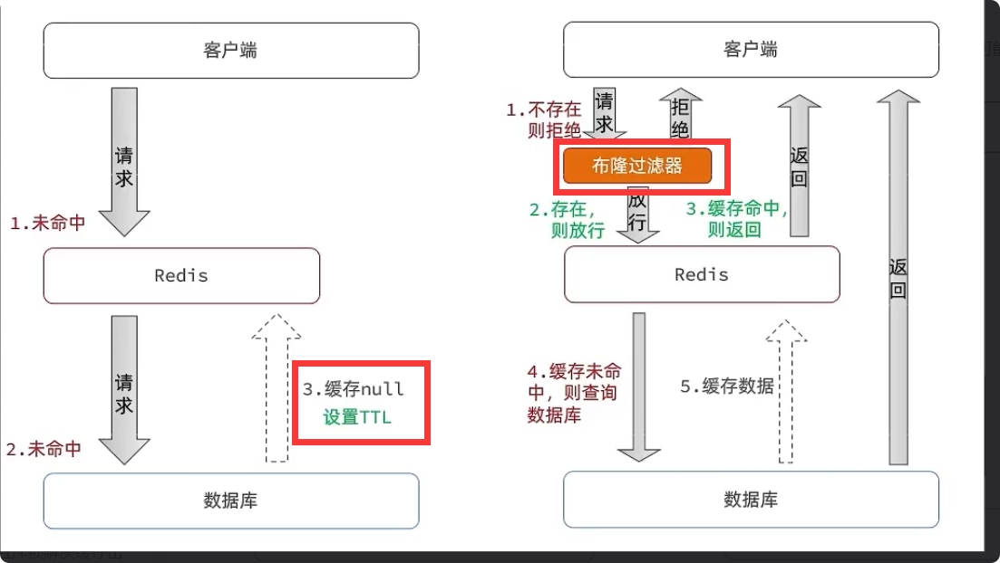

### 问题三：缓存**击穿**？

> 缓存击穿问题也叫**热点 Key 问题**，就是高并发下，key突然失效（**时间过期**），直接打到数据库mysql上，导致系统崩溃，最后可能会雪崩

**redis缓存没有数据，高并发下会有很多请求直接打到数据库上**  

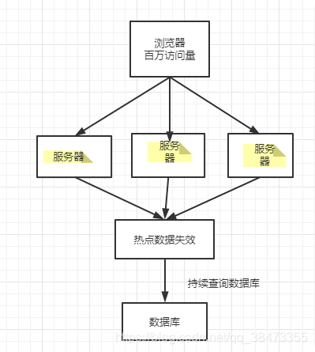

#### 解决:互斥锁、逻辑过期

**加锁**大量并发只让一个去查，其他人等待，查到以后释放锁，其他人获取到锁，先查缓存，就会有数据，不用去db

- **互斥锁**：访问者发现redis缓存没有，然后查询数据库重新建立缓存，这个过程如果是高并发下，所有访问会直接打到数据库上，导致服务器压力过大。可以把*查询没有缓存，去数据库重建缓存*这个过程写成**加锁串行**

- **逻辑过期**：因为击穿是因为缓存过期导致，那么直接**不设置过期时间**，使用代码来判断是否过期（*给数据字段增加expire_time字段*），当对比当前时间发现已经过期，另外**开启线程来修改过期时间和缓存的数据**，返回以前的数据。

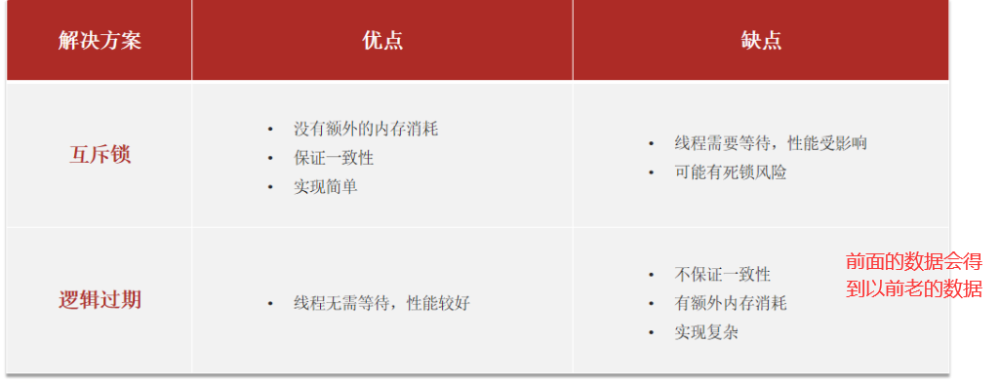

### 问题三：缓存**雪崩**？

> 缓存雪崩是指在同一时段大量的缓存 ***key 同时过期**或者 **Redis 服务宕机**，导致大量请求到达数据库，带来巨大压力。

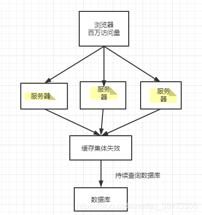

#### 解决:随机过期时间

- 给不同的 Key 的 **TTL 添加随机值**
- 利用 **Redis 集群**提高服务的可用性
- 给缓存业务添加**降级限流**策略
- 给业务添加**多级缓存**

## 分布式锁-redis

> 对**分布式**的环境本地锁只能锁住本地服务，需要在**全局加锁**即分布式锁。

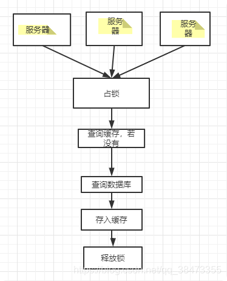

> 分布式锁要满足的条件

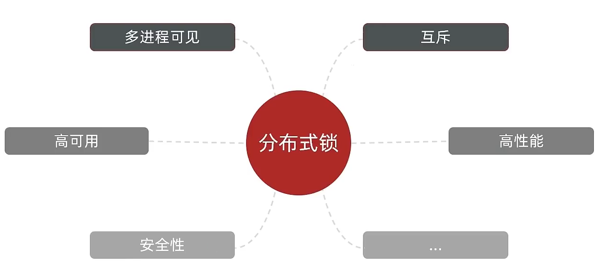

>常见的分布式锁实现方式：
- **Mysql**：mysql 本身就带有锁机制，但是由于 mysql 性能本身一般，所以采用分布式锁的情况下，其实使用 mysql 作为分布式锁比较少见
 
- **Redis**：redis 作为分布式锁是非常常见的一种使用方式，现在企业级开发中基本都使用 redis 或者 zookeeper 作为分布式锁，利用 setnx 这个方法，如果插入 key 成功，则表示获得到了锁，如果有人插入成功，其他人插入失败则表示无法获得到锁，利用这套逻辑来实现分布式锁
 
- **Zookeeper**：zookeeper 也是企业级开发中较好的一个实现分布式锁的方案
 

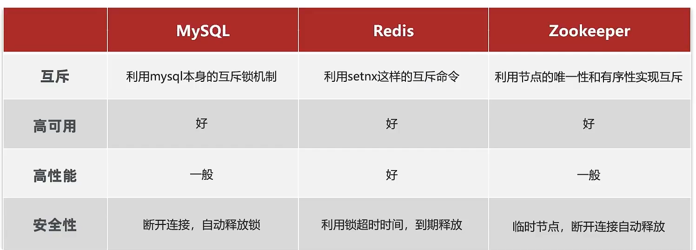  

### 手写代码实现

问题|描述|解决
--|--|--
**死锁**|在Redis中占到了锁，但执行过程中异常或服务器宕机**无法释放锁**，造成死锁|设置**过期时间**
**错删**|业务处理时间过长，当解锁时锁已经失效，其他线程已抢到锁，**删除的同时会解开其他线程的锁**。|设置锁时加上自己的**标志**，比如UUID  
**判断锁、解锁**|为了解决**错删**问题，要先判断是不是自己的锁，然后解锁。|获取锁和解锁**保证原子**操作，Redis+LUA脚本
**续期**|锁到期了，业务流程还没执行完，需要自动更新锁的时间|无法解决 
**可否重入**|在加锁的方法里面调用另一个加锁的方法|无法解决

#### 互斥锁

##### 实现思路
 
- 利用 set nx ex 获取锁，并设置过期时间，保存线程标示
- 释放锁时先判断线程标示是否与自己一致，一致则删除锁

特性：  
- 利用 set nx 满足互斥性
- 利用 set ex 保证故障时锁依然能释放，避免死锁，提高安全性
- 利用 Redis 集群保证高可用和高并发特性

##### 加锁
    
    private static final String ID_PREFIX = UUID.randomUUID().toString(true) + "-";
    @Override
    public boolean tryLock(long timeoutSec) {
       // 获取线程标示
       String threadId = ID_PREFIX + Thread.currentThread().getId();
       // 获取锁
       Boolean success = stringRedisTemplate.opsForValue()
                    .setIfAbsent(KEY_PREFIX + name, threadId, timeoutSec, TimeUnit.SECONDS);
       return Boolean.TRUE.equals(success);
    }
    

##### 解锁（没有原子性）

    public void unlock() {
        // 获取线程标示
        String threadId = ID_PREFIX + Thread.currentThread().getId();
        // 获取锁中的标示
        String id = stringRedisTemplate.opsForValue().get(KEY_PREFIX + name);
        // 判断标示是否一致
        if(threadId.equals(id)) {
            // 释放锁
            stringRedisTemplate.delete(KEY_PREFIX + name);
        }
    }
    
##### lua原子解锁
 普通解锁：先要判断是否是自己的锁，然后再解锁，这个判断+解锁 要执行两条redis语句，高并发下会出问题，所以用lua语句来保证原子性

> lua调用redis简单语法：
    
    redis.call('命令名称', 'key', '其它参数', ...)

例如：set name jack
    
    # 执行 set name jack
    redis.call('set', 'name', 'jack')
    
例如，我们要先执行 set name Rose，再执行 get name  
    
    # 先执行 set name jack
    redis.call('set', 'name', 'Rose')
    # 再执行 get name
    local name = redis.call('get', 'name')
    # 返回
    return name
    
> redis-cli调用lua：EVAL   

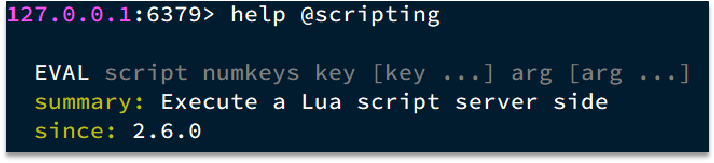

例如，我们要执行 redis.call (‘set’, ‘name’, ‘jack’) 这个脚本  

如果要传参：  

> 判断+删除 lua脚本
    
    -- 这里的 KEYS[1] 就是锁的key，这里的ARGV[1] 就是当前线程标示
    -- 获取锁中的标示，判断是否与当前线程标示一致
    if (redis.call('GET', KEYS[1]) == ARGV[1]) then
      -- 一致，则删除锁
      return redis.call('DEL', KEYS[1])
    end
    -- 不一致，则直接返回
    return 0

> RedisTemplate 中，可以利用 execute 方法去执行 lua 脚本，参数对应关系就如下图股
  
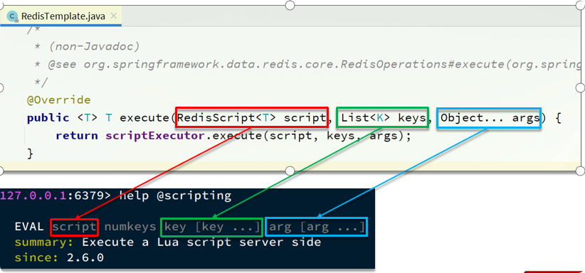

    private static final DefaultRedisScript<Long> UNLOCK_SCRIPT;  //excute需要的script
        static {
            UNLOCK_SCRIPT = new DefaultRedisScript<>();
            UNLOCK_SCRIPT.setLocation(new ClassPathResource("unlock.lua"));//存放路径resources
            UNLOCK_SCRIPT.setResultType(Long.class);
        }
    
    public void unlock() {
        // 调用lua脚本，script+KEYS参数+ARGV参数
        stringRedisTemplate.execute(
                UNLOCK_SCRIPT,
                Collections.singletonList(KEY_PREFIX + name),
                ID_PREFIX + Thread.currentThread().getId());
    }

    
    
#### 逻辑过期

##### 实现思路

- 当用户开始查询 redis 时，判断是否命中，*如果没有命中则直接返回空数据，不查询数据库*， 

- 而一旦命中后，将 value 取出，判断 value 中的过期时间是否满足，

- *如果没有过期，则直接返回 redis 中的数据*

- *如果过期，则在开启独立线程后直接返回之前的旧数据*

- 开启子线程去重构数据，重构完成后释放互斥锁。

##### 加锁、解锁、封装

参考博客：[redis实战](http://blog.czk.pub/post/5424c64f.html)

### redission实现

#### 依赖
    
    <dependency>
    	<groupId>org.redisson</groupId>
    	<artifactId>redisson</artifactId>
    	<version>3.13.6</version>
    </dependency>
    
    
    
#### 配置Redisson客户端

    @Configuration
    public class RedissonConfig {
    
        @Bean
        public RedissonClient redissonClient(){
            // 配置
            Config config = new Config();
            config.useSingleServer().setAddress("redis://192.168.171.132:6379")
                .setPassword("123456");
            // 创建RedissonClient对象
            return Redisson.create(config);
        }
    }
    
#### 使用
    
    @Resource
    private RedissionClient redissonClient;
    
    @Test
    void testRedisson() throws Exception{
        //获取锁(可重入)，指定锁的名称
        RLock lock = redissonClient.getLock("anyLock");
        //尝试获取锁，参数分别是：获取锁的最大等待时间(期间会重试)，锁自动释放时间，时间单位
        boolean isLock = lock.tryLock(1,10,TimeUnit.SECONDS);
        //判断获取锁成功
        if(isLock){
            try{
                System.out.println("执行业务");          
            }finally{
                //释放锁
                lock.unlock();
            }
            
        } 
    }
    

#### 看门狗WatchDog-自动续约

 - lock里面传了锁自动释放时间就用传的值
 - 如果没有传值，就默认30秒，然后watchdog自动续约，续约时间为30/3。也就是10秒之后
 - 当系统宕机了，就不会自动续约了，就会释放锁，不会造成死锁。  
 
源码：
    
    //未设置过期时间
    while (true) {
        ttl = tryAcquire(leaseTime, unit, threadId);
        if (ttl == null) {//过期时间并未空while循环执行
            break;
        }
    }
    private long lockWatchdogTimeout = 30 * 1000;//看门狗时间30s
    
    private void renewExpiration(){
        if (res) {
            // 重复调用
            renewExpiration();
        }
        internalLockLeaseTime / 3, TimeUnit.MILLISECONDS//10s调用一次
    }
    
    //设置过期时间
    if (leaseTime != -1) {
        return tryLockInnerAsync(leaseTime, unit, threadId, RedisCommands.EVAL_LONG);
    }
    
    internalLockLeaseTime = unit.toMillis(leaseTime);//设置锁时间
    
    return evalWriteAsync(getName(), LongCodec.INSTANCE, command,
                    "if (redis.call('exists', KEYS[1]) == 0) then " +
                            "redis.call('hincrby', KEYS[1], ARGV[2], 1); " +
                            "redis.call('pexpire', KEYS[1], ARGV[1]); " +
                            "return nil; " +
                            "end; " +
                            "if (redis.call('hexists', KEYS[1], ARGV[2]) == 1) then " +
                            "redis.call('hincrby', KEYS[1], ARGV[2], 1); " +
                            "redis.call('pexpire', KEYS[1], ARGV[1]); " +
                            "return nil; " +
                            "end; " +
                            "return redis.call('pttl', KEYS[1]);",
                    Collections.singletonList(getName()), internalLockLeaseTime, getLockName(threadId));//执行lua脚本   

#### redission锁的 mutiLock 原理

> 为了提高 redis 的可用性，我们会搭建集群或者主从.所有节点都保存一个锁信息。*mutiLock需要获得所有节点的锁信息才算加锁成功*。  

当我们去设置了多个节点锁时，redission 会将多个锁添加到一个集合中，然后用 while 循环去不停去尝试拿锁，但是会有一个总共的加锁时间，这个时间是用需要加锁的个数 * 1500ms ，假设有 3 个锁，那么时间就是 4500ms，假设在这 4500ms 内，所有的锁都加锁成功， 那么此时才算是加锁成功，如果在 4500ms 有线程加锁失败，则会再次去进行重试.

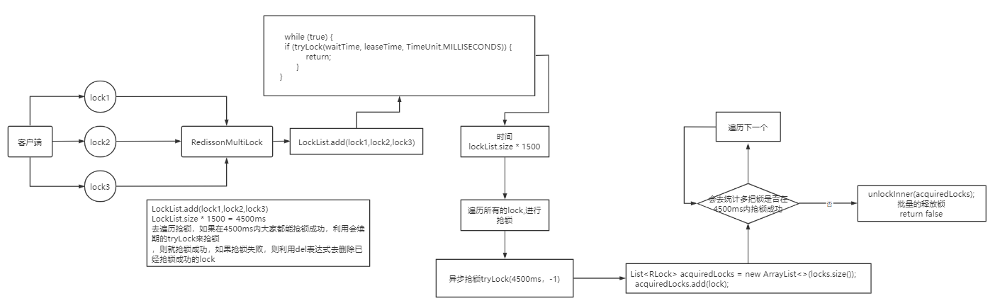

## redis实现秒杀

把库存（**String类型**）和购买的用户id（**set类型**）分表存入redis

### 需求分析

>秒杀步骤：
- 1、查询优惠卷
- 2、判断秒杀库存是否足够
- 3、查询订单
- 4、校验是否是一人一单
- 5、扣减库存
- 6、创建订单
  
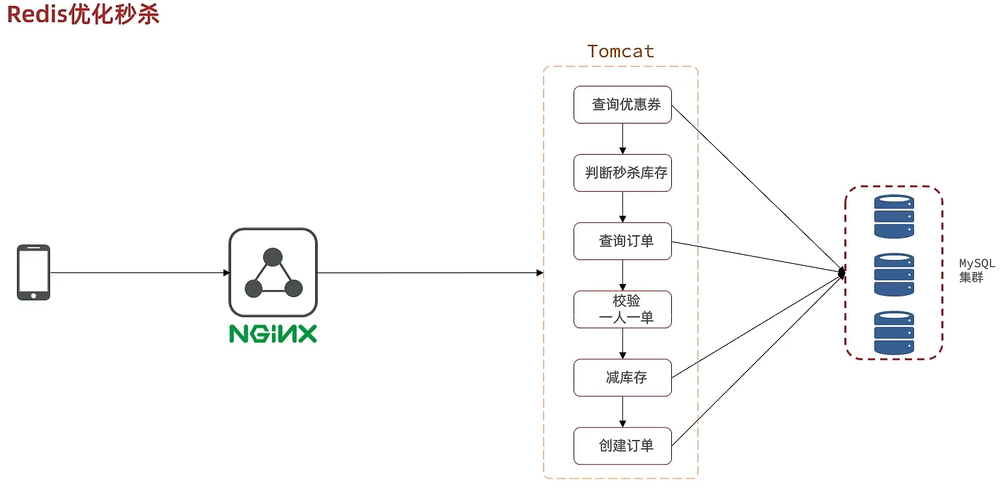  

> 优化秒杀

- 1)添加优惠卷的时候，把库存（String类型）和购买的用户id（set类型）分表存入redis，**超卖判断**，看库存是否大于0；**扣库存**；incrby -1；**一人一单**：ismember 判断是否存在set集合里

- 2)lua执行第一步，保证原子性，返回0说明可以下单，返回其他说明不能下单

- 3)生成订单id，返回给前端。

- 4)异步创建扣减库存，处理订单。

### 实现步骤

> 保存库存到redis
    
        stringRedisTemplate.opsForValue().set(SECKILL_STOCK_KEY + voucher.getId(), voucher.getStock().toString());
    
> lua脚本
    
    -- 1.参数列表
    -- 1.1.优惠券id
    local voucherId = ARGV[1]
    -- 1.2.用户id
    local userId = ARGV[2]
    -- 1.3.订单id
    local orderId = ARGV[3]
    
    -- 2.数据key
    -- 2.1.库存key
    local stockKey = 'seckill:stock:' .. voucherId
    -- 2.2.订单key
    local orderKey = 'seckill:order:' .. voucherId
    
    -- 3.脚本业务
    -- 3.1.判断库存是否充足 get stockKey
    if(tonumber(redis.call('get', stockKey)) <= 0) then
        -- 3.2.库存不足，返回1
        return 1
    end
    -- 3.2.判断用户是否下单 SISMEMBER orderKey userId
    if(redis.call('sismember', orderKey, userId) == 1) then
        -- 3.3.存在，说明是重复下单，返回2
        return 2
    end
    -- 3.4.扣库存 incrby stockKey -1
    redis.call('incrby', stockKey, -1)
    -- 3.5.下单（保存用户）sadd orderKey userId
    redis.call('sadd', orderKey, userId)
    //-- 3.6.发送消息到队列中， XADD stream.orders * k1 v1 k2 v2 ...
    //redis.call('xadd', 'stream.orders', '*', 'userId', userId, 'voucherId', voucherId, 'id', orderId)
    
    return 0
    
    

> 执行lua脚本
    
    @Override
    public Result seckillVoucher(Long voucherId) {
        //获取用户
        Long userId = UserHolder.getUser().getId();
        long orderId = redisIdWorker.nextId("order");
        // 1.执行lua脚本
        Long result = stringRedisTemplate.execute(
                SECKILL_SCRIPT,
                Collections.emptyList(),
                voucherId.toString(), userId.toString(), String.valueOf(orderId)
        );
        int r = result.intValue();
        // 2.判断结果是否为0
        if (r != 0) {
            // 2.1.不为0 ，代表没有购买资格
            return Result.fail(r == 1 ? "库存不足" : "不能重复下单");
        }
        //发送到mq
        省略。。。。
        
        // 3.返回订单id
        return Result.ok(orderId);
    }
    

## zset-点赞

**zset集合**集合实现

### 需求

- 1) **点赞**，高亮，第二次点赞为取消点赞

- 2) **点赞排行**，后点赞的排前面显示。显示5个

### 思路

- 给 Blog 类中添加一个 isLike 字段，标示是否被当前用户点赞
- 修改点赞功能，利用 Redis 的 **zset 集合**判断是否点赞过，未点赞过则点赞数 + 1，已点赞过则点赞数 - 1
- 修改根据 id 查询 Blog 的业务，判断当前登录用户是否点赞过，赋值给 isLike 字段
- 修改分页查询 Blog 业务，判断当前登录用户是否点赞过，赋值给 isLike 字段

### 例子
    
> 点赞逻辑代码
    
    @Override
     public Result likeBlog(Long id) {
         // 1.获取登录用户
         Long userId = UserHolder.getUser().getId();
         // 2.判断当前登录用户是否已经点赞
         String key = BLOG_LIKED_KEY + id;
         Double score = stringRedisTemplate.opsForZSet().score(key, userId.toString());
         if (score == null) {
             // 3.如果未点赞，可以点赞
             // 3.1.数据库点赞数 + 1
             boolean isSuccess = update().setSql("liked = liked + 1").eq("id", id).update();
             // 3.2.保存用户到Redis的set集合  zadd key value score
             if (isSuccess) {
                 stringRedisTemplate.opsForZSet().add(key, userId.toString(), System.currentTimeMillis());
             }
         } else {
             // 4.如果已点赞，取消点赞
             // 4.1.数据库点赞数 -1
             boolean isSuccess = update().setSql("liked = liked - 1").eq("id", id).update();
             // 4.2.把用户从Redis的set集合移除
             if (isSuccess) {
                 stringRedisTemplate.opsForZSet().remove(key, userId.toString());
             }
         }
         return Result.ok();
     }
    
    
     private void isBlogLiked(Blog blog) {
         // 1.获取登录用户
         UserDTO user = UserHolder.getUser();
         if (user == null) {
             // 用户未登录，无需查询是否点赞
             return;
         }
         Long userId = user.getId();
         // 2.判断当前登录用户是否已经点赞
         String key = "blog:liked:" + blog.getId();
         Double score = stringRedisTemplate.opsForZSet().score(key, userId.toString());
         blog.setIsLike(score != null);
     }
    
    
> 点赞列表查询列表

    @GetMapping("/likes/{id}")
    public Result queryBlogLikes(@PathVariable("id") Long id) {
    
        return blogService.queryBlogLikes(id);
    }
    
    

    
    @Override
    public Result queryBlogLikes(Long id) {
        String key = BLOG_LIKED_KEY + id;
        // 1.查询top5的点赞用户 zrange key 0 4
        Set<String> top5 = stringRedisTemplate.opsForZSet().range(key, 0, 4);
        if (top5 == null || top5.isEmpty()) {
            return Result.ok(Collections.emptyList());
        }
        // 2.解析出其中的用户id
        List<Long> ids = top5.stream().map(Long::valueOf).collect(Collectors.toList());
        String idStr = StrUtil.join(",", ids);
        // 3.根据用户id查询用户 WHERE id IN ( 5 , 1 ) ORDER BY FIELD(id, 5, 1)
        List<UserDTO> userDTOS = userService.query()
                .in("id", ids).last("ORDER BY FIELD(id," + idStr + ")").list()
                .stream()
                .map(user -> BeanUtil.copyProperties(user, UserDTO.class))
                .collect(Collectors.toList());
        // 4.返回
        return Result.ok(userDTOS);
    }
    

## set+zset-好友与朋友圈

- **好友关注**：**set实现**，查看共同好友（并集）、好友推荐（差集）

- **朋友圈推送**：**zset实现**，根据时间（score）查询，滚动分页。
      
### 需求

- 针对用户的操作：可以对用户进行关注和取消关注功能。    
- 好友发布博客之后，要能看到关注的好友所发送的博客

### 思路

- 需要在用户关注了某位用户后，需要将数据放入到 **set 集合**中，方便后续进行共同关注，同时当取消关注时，也需要从 set 集合中进行删除

- feed流实现朋友圈推送

### 例子
> 数据库表

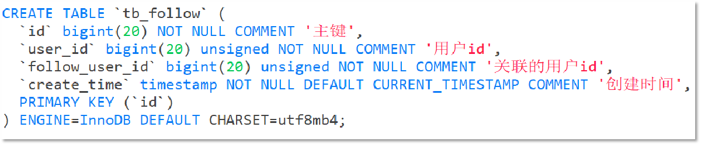  

注意：这里需要把主键修改为**自增长**，简化开发。

#### 关注与取消关注

**set实现**  

> FollowController
    
    //关注
    @PutMapping("/{id}/{isFollow}")
    public Result follow(@PathVariable("id") Long followUserId, @PathVariable("isFollow") Boolean isFollow) {
        return followService.follow(followUserId, isFollow);
    }
    //取消关注
    @GetMapping("/or/not/{id}")
    public Result isFollow(@PathVariable("id") Long followUserId) {
          return followService.isFollow(followUserId);
    }
    
    
> 关注与取消关注
    
    @Override
    public Result follow(Long followUserId, Boolean isFollow) {
        // 1.获取登录用户
        Long userId = UserHolder.getUser().getId();
        String key = "follows:" + userId;
        // 1.判断到底是关注还是取关
        if (isFollow) {
            // 2.关注，新增数据
            Follow follow = new Follow();
            follow.setUserId(userId);
            follow.setFollowUserId(followUserId);
            boolean isSuccess = save(follow);
            if (isSuccess) {
                // 把关注用户的id，放入redis的set集合 sadd userId followerUserId
                stringRedisTemplate.opsForSet().add(key, followUserId.toString());
            }
        } else {
            // 3.取关，删除 delete from tb_follow where user_id = ? and follow_user_id = ?
            boolean isSuccess = remove(new QueryWrapper<Follow>()
                    .eq("user_id", userId).eq("follow_user_id", followUserId));
            if (isSuccess) {
                // 把关注用户的id从Redis集合中移除
                stringRedisTemplate.opsForSet().remove(key, followUserId.toString());
            }
        }
        return Result.ok();
    }

> 查看共同好友
    
    @Override
    public Result followCommons(Long id) {
        // 1.获取当前用户
        Long userId = UserHolder.getUser().getId();
        String key = "follows:" + userId;
        // 2.求交集
        String key2 = "follows:" + id;
        Set<String> intersect = stringRedisTemplate.opsForSet().intersect(key, key2);
        if (intersect == null || intersect.isEmpty()) {
            // 无交集
            return Result.ok(Collections.emptyList());
        }
        // 3.解析id集合
        List<Long> ids = intersect.stream().map(Long::valueOf).collect(Collectors.toList());
        // 4.查询用户
        List<UserDTO> users = userService.listByIds(ids)
                .stream()
                .map(user -> BeanUtil.copyProperties(user, UserDTO.class))
                .collect(Collectors.toList());
        return Result.ok(users);
    }
    

#### Feed流消息推送

**zset集合**实现，推送时间为score

##### 原理

>当我们关注了用户后，这个用户发了动态，那么我们应该把这些数据推送给用户，这个需求，其实我们又把他叫做 Feed 流，关注推送也叫做 Feed 流，直译为投喂。为用户持续的提供 “沉浸式” 的体验，通过无限下拉刷新获取新的信息。

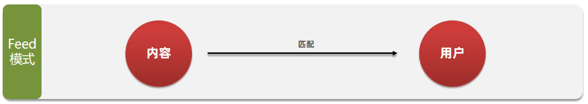

Feed 流的实现有两种模式：

- Feed 流产品有两种常见模式：
- **Timeline**：不做内容筛选，简单的按照内容**发布时间排序**，常用于好友或关注。例如朋友圈

    - 优点：信息全面，不会有缺失。并且实现也相对简单
    - 缺点：信息噪音较多，用户不一定感兴趣，内容获取效率低
    
- **智能排序**：利用智能算法屏蔽掉违规的、用户不感兴趣的内容。推送用户感兴趣信息来吸引用户

    - 优点：投喂用户感兴趣信息，用户粘度很高，容易沉迷
    - 缺点：如果算法不精准，可能起到反作用
    
我们本次针对好友的操作，采用的就是 **Timeline** 的方式，只需要拿到我们关注用户的信息，然后按照时间排序即可

该模式的实现方案有三种：  

- 拉模式
- 推模式
- 推拉结合

**拉模式**：也叫做读扩散  

该模式的核心含义就是：当张三和李四和王五发了消息后，都会保存在自己的邮箱中，假设赵六要读取信息，那么他会从读取他自己的收件箱，此时系统会从他关注的人群中，把他关注人的信息全部都进行拉取，然后在进行排序

- 优点：比较节约空间，因为赵六在读信息时，并没有重复读取，而且读取完之后可以把他的收件箱进行清楚。

- 缺点：比较延迟，当用户读取数据时才去关注的人里边去读取数据，**假设用户关注了大量的用户**，那么此时就会拉取海量的内容，对服务器压力巨大。

**推模式**：也叫做写扩散。  

推模式是没有写邮箱的，当张三写了一个内容，此时会主动的把张三写的内容发送到他的粉丝收件箱中去，假设此时李四再来读取，就不用再去临时拉取了

- 优点：时效快，不用临时拉取

- 缺点：内存压力大，假设一个大 V 写信息，很多人关注他， 就会写很多分数据到粉丝那边去

**推拉结合模式**：也叫做读写混合，兼具推和拉两种模式的优点。

推拉模式是一个折中的方案，站在发件人这一段，  
- 如果是个**普通的人**，那么我们采用**推模式**的方式，直接把数据写入到他的粉丝中去，因为普通的人他的粉丝关注量比较小，所以这样做没有压力，
- 如果是**大 V**，活跃粉丝**推模式**，僵尸粉**拉模式**，直接将数据先写入到一份到发件箱里边去，然后再直接写一份到活跃粉丝收件箱里边去，现在站在收件人这端来看，如果是活跃粉丝，那么大 V 和普通的人发的都会直接写入到自己收件箱里边来，而如果是普通的粉丝，由于他们上线不是很频繁，所以等他们上线时，再从发件箱里边去拉信息。

##### 需求

- 修改新增探店笔记的业务，在保存 blog 到数据库的同时，推送到粉丝的收件箱
- 收件箱满足可以根据时间戳排序，必须用 Redis 的数据结构实现
- 查询收件箱数据时，可以实现分页查询  

**因为数据一直在变化，传统分页模式不太适合，采用滚动分页模式**

> 传统分页模式:根据page+size去拿数据，新增了数据，**会拿到重复的数据**

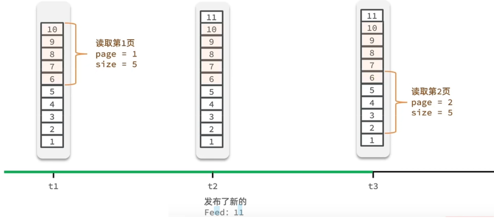

> Feed 流的滚动分页：**记录每次操作的最后一条**，然后从这个位置开始去读取数据

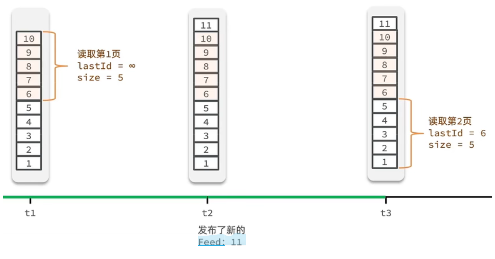

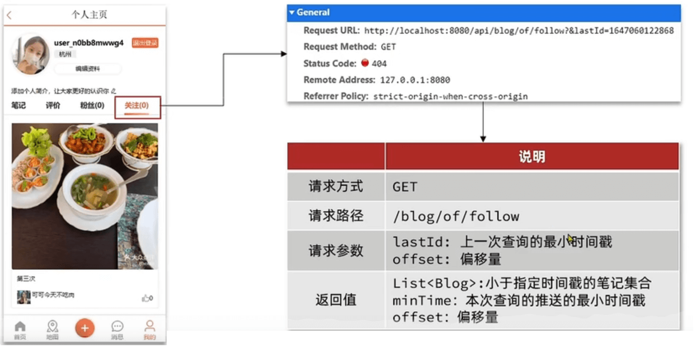

##### 推送实现

> 就是我们在保存完探店笔记后，获得到当前笔记的粉丝，然后把数据推送到粉丝的 redis 中去。

    @Override
    public Result saveBlog(Blog blog) {
        // 1.获取登录用户
        UserDTO user = UserHolder.getUser();
        blog.setUserId(user.getId());
        // 2.保存探店笔记
        boolean isSuccess = save(blog);
        if(!isSuccess){
            return Result.fail("新增笔记失败!");
        }
        // 3.查询笔记作者的所有粉丝 select * from tb_follow where follow_user_id = ?
        List<Follow> follows = followService.query().eq("follow_user_id", user.getId()).list();
        // 4.推送笔记id给所有粉丝
        for (Follow follow : follows) {
            // 4.1.获取粉丝id
            Long userId = follow.getUserId();
            // 4.2.推送
            String key = FEED_KEY + userId;
            stringRedisTemplate.opsForZSet().add(key, blog.getId().toString(), System.currentTimeMillis());
        }
        // 5.返回id
        return Result.ok(blog.getId());
    }
    
    

##### 查询实现

> 一、定义出来具体的返回值实体类

    @Data
    public class ScrollResult {
        private List<?> list;
        private Long minTime;
        private Integer offset;
    }

> BlogController

注意：RequestParam 表示接受 url 地址栏传参的注解，当方法上参数的名称和 url 地址栏不相同时，可以通过 RequestParam 来进行指定

> BlogServiceImpl

    @Override
    public Result queryBlogOfFollow(Long max, Integer offset) {
        // 1.获取当前用户
        Long userId = UserHolder.getUser().getId();
        // 2.查询收件箱 ZREVRANGEBYSCORE key Max Min LIMIT offset count
        String key = FEED_KEY + userId;
        Set<ZSetOperations.TypedTuple<String>> typedTuples = stringRedisTemplate.opsForZSet()
            .reverseRangeByScoreWithScores(key, 0, max, offset, 2);
        // 3.非空判断
        if (typedTuples == null || typedTuples.isEmpty()) {
            return Result.ok();
        }
        // 4.解析数据：blogId、minTime（时间戳）、offset
        List<Long> ids = new ArrayList<>(typedTuples.size());
        long minTime = 0; // 2
        int os = 1; // 2
        for (ZSetOperations.TypedTuple<String> tuple : typedTuples) { // 5 4 4 2 2
            // 4.1.获取id
            ids.add(Long.valueOf(tuple.getValue()));
            // 4.2.获取分数(时间戳）
            long time = tuple.getScore().longValue();
            if(time == minTime){
                os++;
            }else{
                minTime = time;
                os = 1;
            }
        }
    	os = minTime == max ? os : os + offset;
        // 5.根据id查询blog
        String idStr = StrUtil.join(",", ids);
        List<Blog> blogs = query().in("id", ids).last("ORDER BY FIELD(id," + idStr + ")").list();
    
        for (Blog blog : blogs) {
            // 5.1.查询blog有关的用户
            queryBlogUser(blog);
            // 5.2.查询blog是否被点赞
            isBlogLiked(blog);
        }
    
        // 6.封装并返回
        ScrollResult r = new ScrollResult();
        r.setList(blogs);
        r.setOffset(os);
        r.setMinTime(minTime);
    
        return Result.ok(r);
    }

## BitMap-用户签到

### 原理

**BitMap实现**：二进制表  
 
 Redis 中是利用 **string 类型**数据结构实现 BitMap，因此最大上限是 512M，转换为 bit 则是 2^32 个 bit 位。
              
> 签到

**SETBIT**：向指定位置（offset）存入一个 0 或 1  

             

> 签到统计   

- 查看**签到天数**，统计多少个1即可：BITFIELD key GET u[dayOfMonth] 0

- 查看最近**连续签到**：与1作与运算(num & 1),然后右移一位,抛弃最后一位（num >>>= 1;），继续与1作与运算

### 实现
    
> 签到    

    @Override
    public Result sign() {
        // 1.获取当前登录用户
        Long userId = UserHolder.getUser().getId();
        // 2.获取日期
        LocalDateTime now = LocalDateTime.now();
        // 3.拼接key
        String keySuffix = now.format(DateTimeFormatter.ofPattern(":yyyyMM"));
        String key = USER_SIGN_KEY + userId + keySuffix;
        // 4.获取今天是本月的第几天
        int dayOfMonth = now.getDayOfMonth();
        // 5.写入Redis SETBIT key offset 1
        stringRedisTemplate.opsForValue().setBit(key, dayOfMonth - 1, true);
        return Result.ok();
    }
    

> 统计连续签到

    @Override
    public Result signCount() {
        // 1.获取当前登录用户
        Long userId = UserHolder.getUser().getId();
        // 2.获取日期
        LocalDateTime now = LocalDateTime.now();
        // 3.拼接key
        String keySuffix = now.format(DateTimeFormatter.ofPattern(":yyyyMM"));
        String key = USER_SIGN_KEY + userId + keySuffix;
        // 4.获取今天是本月的第几天
        int dayOfMonth = now.getDayOfMonth();
        // 5.获取本月截止今天为止的所有的签到记录，返回的是一个十进制的数字 BITFIELD sign:5:202203 GET u14 0
        List<Long> result = stringRedisTemplate.opsForValue().bitField(
                key,
                BitFieldSubCommands.create()
                        .get(BitFieldSubCommands.BitFieldType.unsigned(dayOfMonth)).valueAt(0)
        );
        if (result == null || result.isEmpty()) {
            // 没有任何签到结果
            return Result.ok(0);
        }
        Long num = result.get(0);
        if (num == null || num == 0) {
            return Result.ok(0);
        }
        // 6.循环遍历
        int count = 0;
        while (true) {
            // 6.1.让这个数字与1做与运算，得到数字的最后一个bit位  // 判断这个bit位是否为0
            if ((num & 1) == 0) {
                // 如果为0，说明未签到，结束
                break;
            }else {
                // 如果不为0，说明已签到，计数器+1
                count++;
            }
            // 把数字右移一位，抛弃最后一个bit位，继续下一个bit位
            num >>>= 1;
        }
        return Result.ok(count);
    }
    
    

## Hyperloglog-UV统计

首先我们搞懂两个概念：  

- UV：全称 Unique Visitor，也叫独立访客量，是指通过互联网访问、浏览这个网页的自然人。1 天内同一个用户多次访问该网站，只记录 1 次。
- PV：全称 Page View，也叫页面访问量或点击量，用户每访问网站的一个页面，记录 1 次 PV，用户多次打开页面，则记录多次 PV。往往用来衡量网站的流量。
通常来说 UV 会比 PV 大很多，所以衡量同一个网站的访问量，我们需要综合考虑很多因素，所以我们只是单纯的把这两个值作为一个参考值  

UV 统计在服务端做会比较麻烦，因为要判断该用户是否已经统计过了，需要将统计过的用户信息保存。但是如果每个访问的用户都保存到 Redis 中，数据量会非常恐怖，那怎么处理呢？  

### 原理

> **Hyperloglog (HLL)** 是从 Loglog 算法派生的概率算法，用于确定非常大的集合的基数，而不需要存储其所有值。相关算法原理大家可以参考：https://juejin.cn/post/6844903785744056333#heading-0  

Redis 中的 HLL 是基于 **string 结构实现**的，单个 HLL 的内存永远小于 **16kb**， 内存占用低的令人发指！作为代价，其测量结果是概率性的，有小于 0.81％的误差。不过对于 UV 统计来说，这完全可以忽略。

  

### 实现
    
测试思路：我们直接利用单元测试，向 HyperLogLog 中添加 100 万条数据，看看内存占用和统计效果如何
    
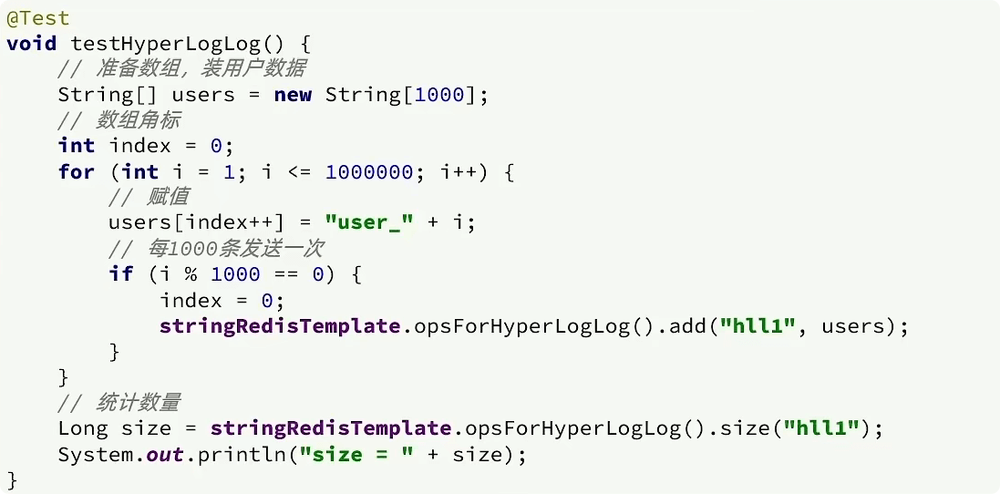
 
 
 ### redis分布式id
 > 随着我们系统规模越来越大，mysql 的单表的容量不宜超过 500W，数据量过大之后，我们要进行**拆库拆表**，但*拆分表了之后，他们从逻辑上讲他们是同一张表，所以他们的 id 是不能一样的， 于是乎我们需要保证 id 的唯一性*。
   

 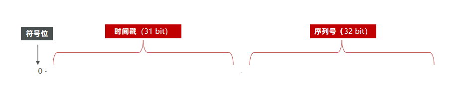
 
 描述： 
 - ID 的组成部分：符号位：1bit，永远为 0
 
 - 时间戳：31bit，以秒为单位，可以使用 69 年
 
 - 序列号：32bit，秒内的计数器，支持每秒产生 2^32 个不同 ID
 
 
#### 封装

    @Component
    public class RedisIdWorker {
        /**
         * 开始时间戳
         */
        private static final long BEGIN_TIMESTAMP = 1640995200L;
        /**
         * 序列号的位数
         */
        private static final int COUNT_BITS = 32;
    
        private StringRedisTemplate stringRedisTemplate;
    
        public RedisIdWorker(StringRedisTemplate stringRedisTemplate) {
            this.stringRedisTemplate = stringRedisTemplate;
        }
    
        public long nextId(String keyPrefix) {
            // 1.生成时间戳
            LocalDateTime now = LocalDateTime.now();
            long nowSecond = now.toEpochSecond(ZoneOffset.UTC);
            long timestamp = nowSecond - BEGIN_TIMESTAMP;
    
            // 2.生成序列号
            // 2.1.获取当前日期，精确到天
            String date = now.format(DateTimeFormatter.ofPattern("yyyy:MM:dd"));
            // 2.2.自增长
            long count = stringRedisTemplate.opsForValue().increment("icr:" + keyPrefix + ":" + date);
    
            // 3.拼接并返回
            return timestamp << COUNT_BITS | count;
        }
    }
    
    
#### 测试
    
    @Test
    void testIdWorker() throws InterruptedException {
        CountDownLatch latch = new CountDownLatch(300);
    
        Runnable task = () -> {
            for (int i = 0; i < 100; i++) {
                long id = redisIdWorker.nextId("order");
                System.out.println("id = " + id);
            }
            latch.countDown();
        };
        long begin = System.currentTimeMillis();
        for (int i = 0; i < 300; i++) {
            es.submit(task);
        }
        latch.await();
        long end = System.currentTimeMillis();
        System.out.println("time = " + (end - begin));
    }
    