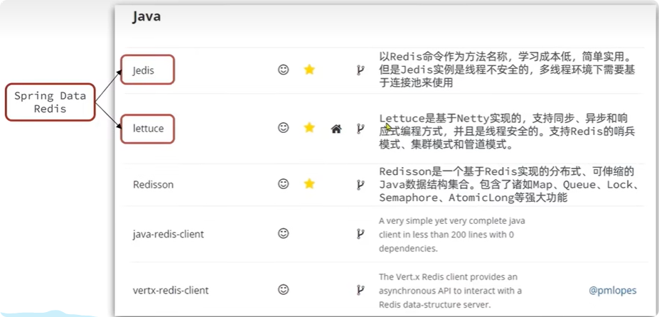

# redis客户端

## 客户端对比

在 Redis 官网中提供了各种语言的客户端，地址:https://redis.io/docs/clients/

标记为 * 的就是推荐使用的 java 客户端，包括：

- Jedis 和 Lettuce：这两个主要是提供了 Redis 命令对应的 API，方便我们操作 Redis，而 SpringDataRedis 又对这两种做了抽象和封装，因此我们后期会直接以 SpringDataRedis 来学习。
- Redisson：是在 Redis 基础上实现了分布式的可伸缩的 java 数据结构，例如 Map、Queue 等，而且支持跨进程的同步机制：Lock、Semaphore 等待，比较适合用来实现特殊的功能需求。

## Jedis 客户端

Jedis 的官网地址： https://github.com/redis/jedis

### Jedis快速使用

1).导入依赖
    
             <dependency>
                <groupId>redis.clients</groupId>
                <artifactId>jedis</artifactId>
                <version>3.7.0</version>
            </dependency>

2).单元测试
    
    @RunWith(SpringRunner.class)
    @SpringBootTest
    public class JedisTest {
        private Jedis jedis;
        @Before
        public void setUp(){
          jedis=new Jedis("192.168.171.132",6379);
          jedis.auth("123456");
          jedis.select(0);
        }
        @Test
        public void String(){
            String set_jedis = jedis.set("jedis:test", "hello jedis");
            System.out.println(set_jedis);
            String get_jedis  = jedis.get("jedis:test");
            System.out.println(get_jedis);
        }
        
        @After
        public void afterAll(){
            if (jedis!=null){
                jedis.close();
            }
        }
    }
    

### Jedis连接池

> Jedis 本身是线程不安全的，并且频繁的创建和销毁连接会有性能损耗，因此我们推荐大家使用 Jedis 连接池代替 Jedis 的直连方式。
  

    
    public class JedisPoolTest {
    
        private JedisPool jedisPool;
    
        private Jedis jedis;
    
        @Before
        public void setUp() {
            JedisPoolConfig config = new JedisPoolConfig();
            config.setMaxWaitMillis(1000);
            config.setMinIdle(0);
            config.setMaxIdle(8);
            config.setMaxTotal(8);
            jedisPool = new JedisPool(config, "192.168.171.132", 6379, 1000, "123456");
            jedis = jedisPool.getResource();
        }
    
        @Test
        public void String() {
            Long hello_jedis = jedis.setnx("jedis:test1", "hello jedis");
            String setex = jedis.setex("jedis", 60L, "测试过期时间");
            System.out.println(hello_jedis);
            String get_jedis = jedis.get("jedis:test1");
            System.out.println(get_jedis);
        }
        @Test
        public void HashTest(){
            Long hsetnx = jedis.hsetnx("jedis:hash", "name", "kimli");
            Map<String,String> map=new HashMap<>();
            map.put("age","18");
            map.put("sex","男");
            map.put("address","重庆");
            String hmset = jedis.hmset("jedis:hash", map);
            System.out.println("hsetnx:"+hsetnx);
            System.out.println("hmset:"+hmset);
    
            jedis.hgetAll("jedis:hash").forEach((k,v)-> System.out.println("key："+k+"value:"+v));
    
        }
    
    }
    

## SpringDataRedis客户端

详情请看另一篇[springboot与redis](/常用框架/springboot/springboot与redis.md)
    