# redis数据结构与类型

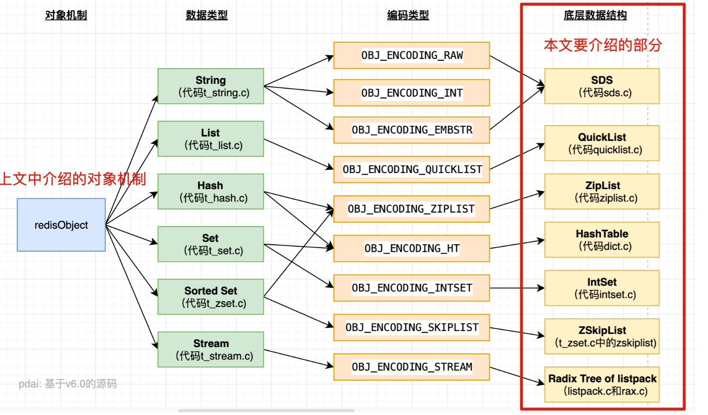

## redis数据结构

> Redis 本身是一个典型的 key-value 内存存储数据库，因此所有的 key、value 都保存在之前学习过的 Dict 结构中。不过在其 database 结构体中，有两个 Dict：一个用来记录 key-value；另一个用来记录 key-TTL。

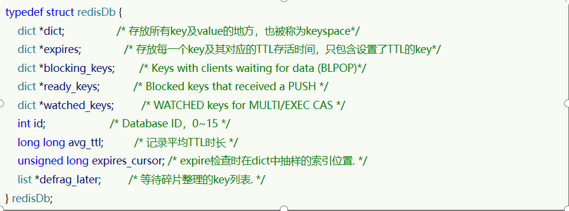

内部结构

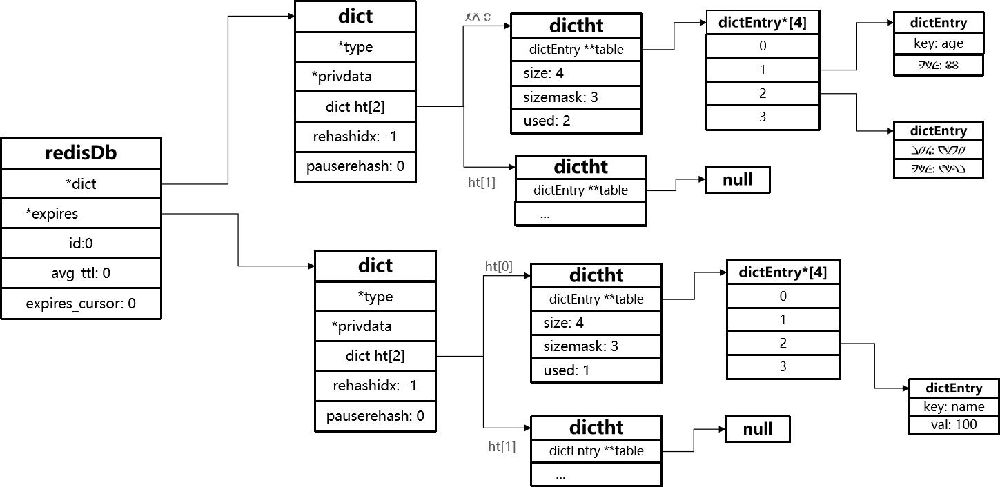

### SDS-简单动态字符串
> Redis 是用 C 语言写的，*但是对于 Redis 的字符串，却不是 C 语言中的字符串（即以空字符’\0’结尾的字符数组），它是自己构建了一种名为 简单动态字符串（simple dynamic string,SDS）的抽象类型*，并将 SDS 作为 Redis 的默认字符串表示

例如，我们执行命令：  

那么 Redis 将在底层创建**两个SDS**，其中一个是包含 “name” 的 SDS，另一个是包含 “虎哥” 的 SDS。

#### SDS源码结构

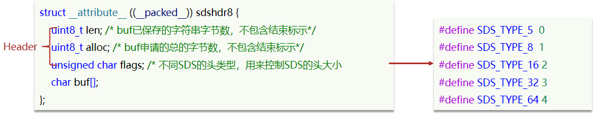

例如，一个包含字符串 “name” 的 sds 结构如下：第一次分配时并不会分配多余空间  

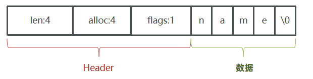

SDS 之所以叫做**动态字符串**，是因为它具备**动态扩容**的能力，例如一个内容为 “hi” 的 SDS：

  

假如我们要给 SDS 追加一段字符串 “,Amy”，这里首先会申请新内存空间： 

- 如果新字符串小于 1M，则新空间为扩展后字符串长度的两倍 + 1；

- 如果新字符串大于 1M，则新空间为扩展后字符串长度 + 1M+1。称为内存预分配。

#### SDS 的优点

- 1.获取字符串长度的时间复杂度为 O (1)
- 2.支持动态扩容
- 3.支持内存预分配，减少用户线程与内核线程交互次数
- 4.二进制安全
一般来说，SDS 除了保存数据库中的字符串值以外，SDS 还可以作为缓冲区（buffer）：包括 AOF 模块中的 AOF 缓冲区以及客户端状态中的输入缓冲区

### IntSet-整数集合

> intset 是 set 集合的一种实现方式，基于整数数组来实现，并且具备长度可变、有序等特征。

#### IntSet源码结构

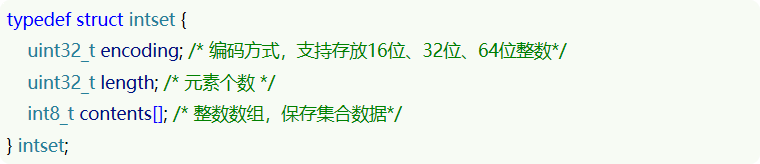

**其中的 encoding 包含三种模式，表示存储的整数大小不同：**

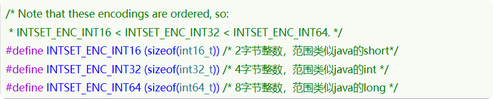

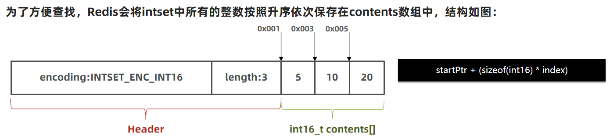

现在，数组中每个数字都在 int16_t 的范围内，因此采用的编码方式是 INTSET_ENC_INT16，每部分占用的字节大小为：

- encoding：4 字节 （可以理解为标识每个元素的类型）
- length：4 字节
- contents：2 字节 * 3 = 6 字节

#### IntSet 自动升级

我们向该其中添加一个数字：50000，这个数字超出了 int16_t 的范围，intset 会自动升级编码方式到合适的大小。
以当前案例来说流程如下：

- 升级编码为 INTSET_ENC_INT32 , 每个整数占 4 字节，并按照新的编码方式及元素个数扩容数组
- 倒序依次将数组中的元素拷贝到扩容后的正确位置
- 将待添加的元素放入数组末尾
- 最后，将 inset 的 encoding 属性改为 INTSET_ENC_INT32，将 length 属性改为 4

> 那么如果我们删除掉刚加入的 int32 类型时，会不会做一个降级操作呢？

> 不会。主要还是减少开销的权衡

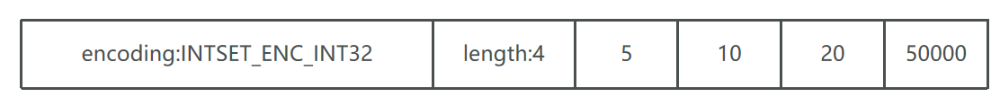

源码如下：  

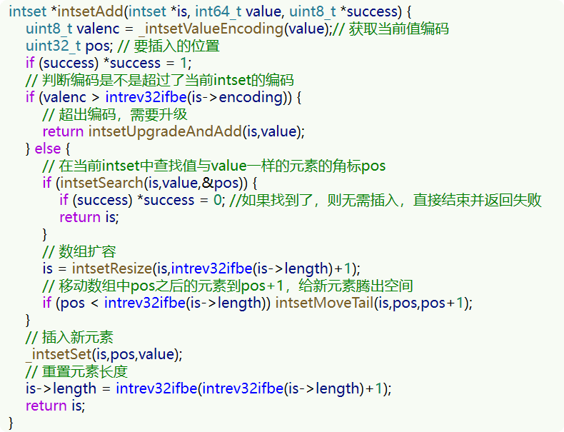

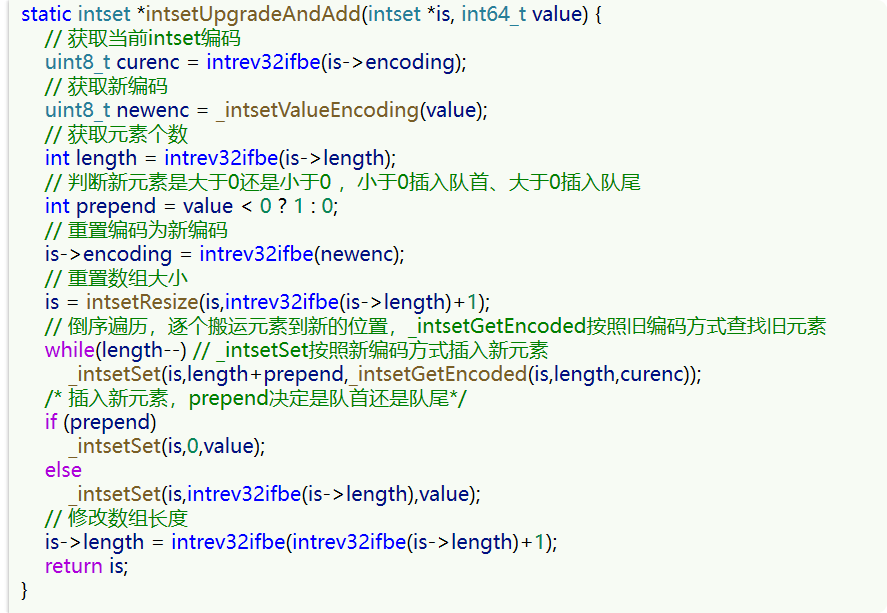

#### 总结：
Intset 可以看做是特殊的整数数组，具备一些特点：
     
- Redis 会确保 Intset 中的**元素唯一、有序**
- 具备类型**升级机制**，可以**节省内存空间**
- 底层采用**二分查找**方式来查询

### Dict-哈希列表
> 我们知道 Redis 是一个键值型（Key-Value Pair）的数据库，我们可以根据键实现快速的增删改查。而键与值的映射关系正是通过 Dict 来实现的。是 set 和 hash 的实现方式之一

  
#### Dict源码结构

Dict 由三部分组成，分别是：哈希表（DictHashTable）、哈希节点（DictEntry）、字典（Dict）  
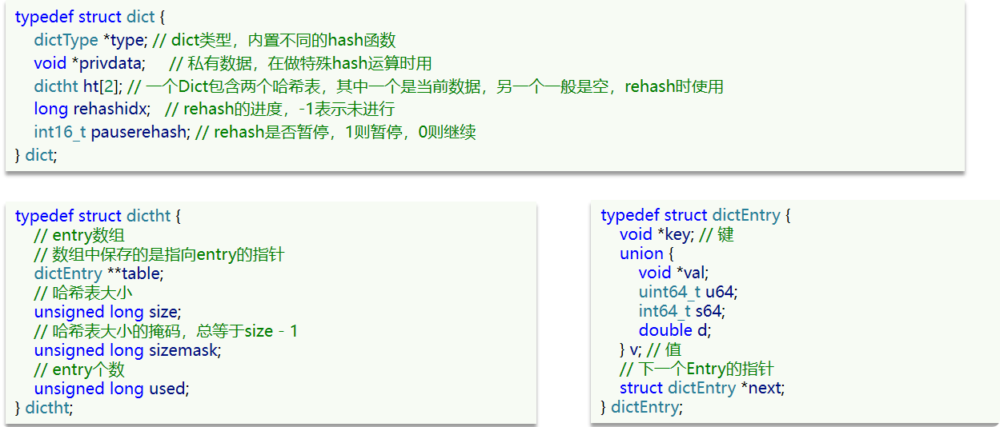

#### 哈希算法

Redis 计算哈希值和索引值方法如下：

    #1、使用字典设置的哈希函数，计算键 key 的哈希值
    hash = dict->type->hashFunction(key);
    
    #2、使用哈希表的sizemask属性和第一步得到的哈希值，计算索引值
    index = hash & dict->ht[x].sizemask;
    
#### hash冲突

用的链表，维护next指针

#### 扩容与收缩
当哈希表保存的键值对太多或者太少时，就要通过 rerehash (重新散列）来对哈希表进行相应的扩展或者收缩。具体步骤：
- 1.计算新 hash 表的 realeSize，值取决于当前要做的是扩容还是收缩：
- 2.如果是扩容，则新 size 为第一个大于等于 dict.ht [0].used + 1 的 2^n
- 3.如果是收缩，则新 size 为第一个小于等于 dict.ht [0].used 的 2^n （不得小于 4）
- 4.按照新的 realeSize 申请内存空间，创建 dictht ，并赋值给 dict.ht [1]
- 5.设置 dict.rehashidx = 0，标示开始 rehash
- 6.将 dict.ht [0] 中的每一个 dictEntry 都 rehash 到 dict.ht [1]
- 7.将 dict.ht [1] 赋值给 dict.ht [0]，给 dict.ht [1] 初始化为空哈希表，释放原来的 dict.ht [0] 的内存
- 8.将 rehashidx 赋值为 - 1，代表 rehash 结束
- 9.在 rehash 过程中，新增操作，则直接写入 ht [1]，查询、修改和删除则会在 dict.ht [0] 和 dict.ht [1] 依次查找并执行。这样可以确保 ht [0] 的数据只减不增，随着 rehash 最终为空

> 触发扩容的条件：

- 服务器目前没有执行 BGSAVE 命令或者 BGREWRITEAOF 命令，并且负载因子大于等于 1。
- 服务器目前正在执行 BGSAVE 命令或者 BGREWRITEAOF 命令，并且负载因子大于等于 5。  

**负载因子** = 哈希表已保存节点数量 / 哈希表大小。

#### 总结

- 维护2个ht，ht[0]平常使用，ht[1]用来rehash扩容

- 解决hash冲突用的是链表，维护一个next指针

- hash扩容是渐进式扩容，因为元素过多，一次扩容会影响性能；访问哪个就判断是否要扩容。如果要扩容就放到ht[1]里面取

### ZipList-双端链表

> ZipList 是一种特殊的 “双端链表” ，由一系列特殊编码的**连续内存空间**组成。可以在任意一端进行压入 / 弹出操作，并且该操作的时间复杂度为 O (1)。
  
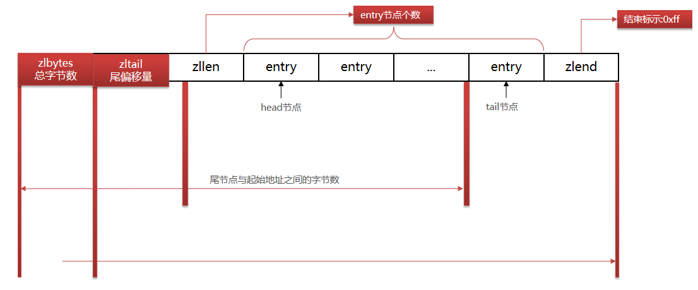

> 4字节-4字节-2字节-中间放entry-1字节：所谓的4421
- **zlbytes** : **字节总数**，字段的类型是 uint32_t , 这个字段中存储的是整个 ziplist 所占用的内存的字节数

- **zltail** : **尾偏移量**，字段的类型是 uint32_t , 它指的是 ziplist 中最后一个 entry 的偏移量。用于快速定位最后一个 entry, 以快速完成 pop 等操作

- **zllen **: **尾节点与起始地址的字节数**，字段的类型是 uint16_t , 它指的是整个 ziplit 中 entry 的数量。这个值只占 2bytes（16 位）: 如果 ziplist 中 entry 的数目小于 65535 (2 的 16 次方), 那么该字段中存储的就是实际 entry 的值。若等于或超过 65535, 那么该字段的值固定为 65535, 但实际数量需要一个个 entry 的去遍历所有 entry 才能得到。

- **zlend** ：是一个终止字节，其值为全 F, 即 0xff. ziplist 保证任何情况下，一个 entry 的首字节都不会是 255

#### ZipListEntry
> 一般链表的entry都是维护了前指针和后指针，一个指针8字节，浪费空间。
> ZipList因为是**连续内存空间**里面的entry维护的是：前一个节点长度+数据类型+数据内容

- **previous_entry_length**：前一节点的长度，占 **1 个或 5 个字节**。
    - 如果前一节点的长度小于 254 字节，则采用 1 个字节来保存这个长度值
    - 如果前一节点的长度大于 254 字节，则采用 5 个字节来保存这个长度值，第一个字节为 0xfe，后四个字节才是真实长度数据
- encoding：编码属性，记录 content 的数据类型（字符串还是整数）以及长度，占用 1 个、2 个或 5 个字节
- contents：负责保存节点的数据，可以是字符串或整数

#### ZipList 的连锁更新问题
> 一种非常特殊的情况
- 因为previous_entry_length大小设置成为要嘛1字节，要嘛5字节。而且当前节点长度超过254的时候变成5字节
- 如果一连串都是 250~253 字节长度的entry，那么一个变化。后面的挨个都会变

#### 总结

- 压缩列表的可以看做一种连续内存空间的” 双向链表”

- 列表的节点之间不是通过指针连接，而是记录上一节点和本节点长度来寻址，内存占用较低

- **如果列表数据过多，导致链表过长，可能影响查询性能**

- 增或删较大数据时有可能发生**连续更新问题**

### QuickList-双端链表

> ZipList 虽然节省内存，但申请内存必须是连续空间，但是我们要存储大量数据，内存中碎片比较多，很难找到一块大的连续空间。于是 ，大数据量下，内存申请效率低成了 ziplist 的最大问题，而 quickList 就是为了帮助 zipList 摆脱困境的。
  
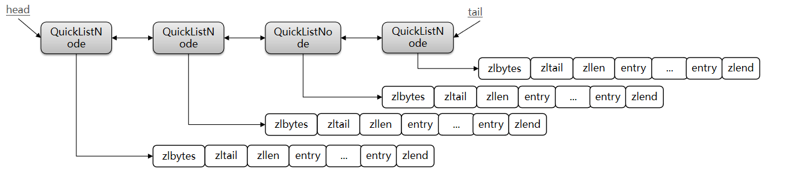

为了避免 QuickList 中的每个 ZipList 中 entry 过多，Redis 提供了一个配置项：list-max-ziplist-size 来限制。

- **如果值为正**，则代表 ZipList 的允许的 entry 个数的最大值
- **如果值为负**，则代表 ZipList 的最大内存大小，分 5 种情况：
    - -1：每个 ZipList 的内存占用不能超过 4kb
    - -2：每个 ZipList 的内存占用不能超过 8kb
    - -3：每个 ZipList 的内存占用不能超过 16kb
    - -4：每个 ZipList 的内存占用不能超过 32kb
    - -5：每个 ZipList 的内存占用不能超过 64kb
#### 源码结构

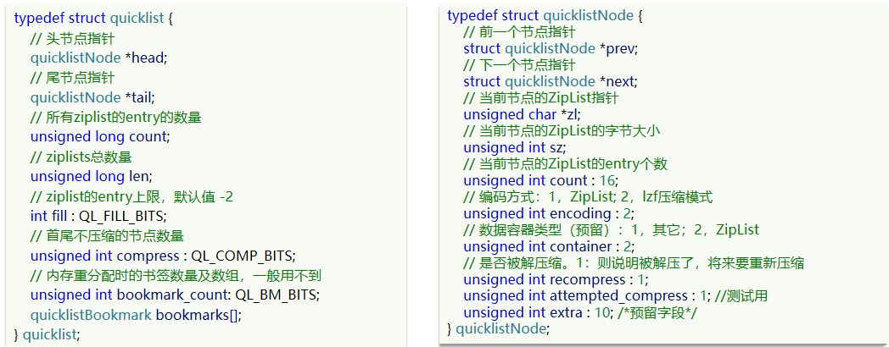

####总结
QuickList 的特点：

- 是一个节点为 ZipList 的双端链表
- 节点采用 ZipList ，解决了传统链表的内存占用问题
- 控制了 ZipList 大小，解决连续内存空间申请效率问题
- 中间节点可以压缩，进一步节省了内存

### SkipList-跳跃链表

> 跳跃表结构在 Redis 中的运用**场景只有一个**，那就是作为有序列表 (**Zset**) 的使用。跳跃表的性能可以保证在查找，删除，添加等操作的时候在对数期望时间内完成，这个性能是可以和平衡树来相比较的，而且在实现方面比平衡树要优雅，这就是跳跃表的长处。跳跃表的缺点就是需要的存储空间比较大，属于利用**空间来换取时间**的数据结构
  
**维护多层级，方便查找**  
  
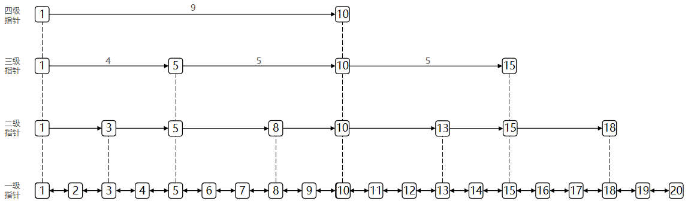

#### SkipListNode 结构
- ele 字段，持有数据，是 sds 类型
- score 字段，其标示着结点的得分，结点之间凭借得分来判断先后顺序，跳跃表中的结点按结点的得分升序排列.
- backward 指针，这是原版跳跃表中所没有的。该指针指向结点的前一个紧邻结点.
- level 字段，用以记录所有结点 (除过头节点外)；每个结点中最多持有 32 个 zskiplistLevel 结构。实际数量在结点创建时，按幂次定律随机生成 (不超过 32). 每个 zskiplistLevel 中有两个字段
- forward 字段指向比自己得分高的某个结点 (不一定是紧邻的), 并且，若当前 zskiplistLevel 实例在 level [] 中的索引为 X, 则其 forward 字段指向的结点，其 level [] 字段的容量至少是 X+1. 这也是上图中，为什么 forward 指针总是画的水平的原因.
- span 字段代表 forward 字段指向的结点，距离当前结点的距离。紧邻的两个结点之间的距离定义为 1

#### 总结

SkipList 的特点：
     
- 跳跃表是一个双向链表，每个节点都包含 score 和 ele 值
- 节点**按照 score 值排序**，score 值一样则按照 ele 字典排序
- **每个节点都可以包含多层指针，层数是 1 到 32 之间的随机数**
- 不同层指针到下一个节点的跨度不同，层级越高，跨度越大
- 增删改查**效率与红黑树基本一致，实现却更简单**
     

### RedisObject-Redis对象 

> Redis 中的任意数据类型的**键和值**都会被封装为一个 RedisObject，也叫做 Redis 对象，

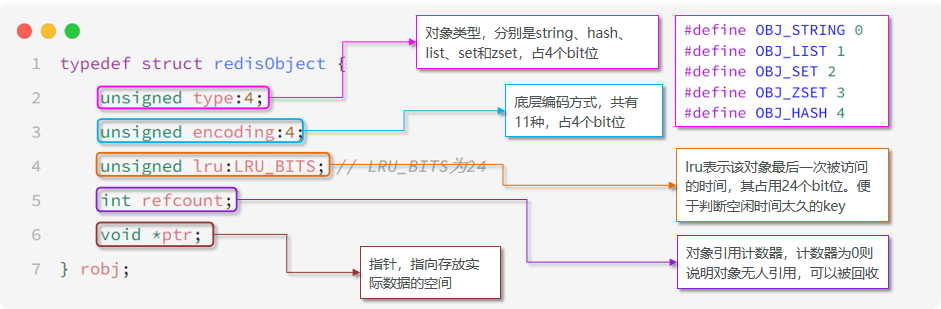

type : 占 4bit , 五个取值类型，表示对象类型 String , Hash , List , set , zset。
encoding : 占 4bit ，十一种编码方式
lru : 占用 3 字节，记录最后一次被访问的时间，主要用于 lru 算法，最近最少使用
refcount ：占用 4 字节，引用计数器，无人用就回收
*ptr：占用 8 字节 ，只想存放实际数据的空间

> redis 的头部占用 16 字节

#### encoding 取值11种

编号|	编码方式|	说明
--|--|--
0	|OBJ_ENCODING_RAW	    |raw 编码动态字符串
1	|OBJ_ENCODING_INT	    |long 类型的整数的字符串
2	|OBJ_ENCODING_HT	    |hash 表（字典 dict）
3	|OBJ_ENCODING_ZIPMAP	|已废弃
4	|OBJ_ENCODING_LINKEDLIST|双端链表
5	|OBJ_ENCODING_ZIPLIST	|压缩列表
6	|OBJ_ENCODING_INTSET	|整数集合
7	|OBJ_ENCODING_SKIPLIST	|跳表
8	|OBJ_ENCODING_EMBSTR	|embstr 的动态字符串
9	|OBJ_ENCODING_QUICKLIST	|快速列表
10	|OBJ_ENCODING_STREAM	|Stream 流

#### type数据结构5种

数据类型	|编码方式
--|--
OBJ_STRING	|int、embstr、raw
OBJ_LIST	|LinkedList 和 ZipList (3.2 以前)、QuickList（3.2 以后）
OBJ_SET	    |intset、HT
OBJ_ZSET	|ZipList、HT、SkipList
OBJ_HASH	|ZipList、HT

    
## redis数据类型
### String（int/embstr/raw）
> 字符串是 Redis 最基本的数据类型，不仅**所有 key 都是字符串类型**，其它几种数据类型构成的元素也是字符串。注意字符串的长度不能超过 512M。
#### 编码方式（encoding）

字符串对象的编码可以是 int ，raw 或者 embstr 。

- int 编码：保存的是可以用 long 类型表示的整数值。
- embstr 编码：保存长度小于 44 字节的字符串（redis3.2 版本之前是 39 字节，之后是 44 字节）。
- raw 编码：保存长度大于 44 字节的字符串（redis3.2 版本之前是 39 字节，之后是 44 字节）。

#### raw编码

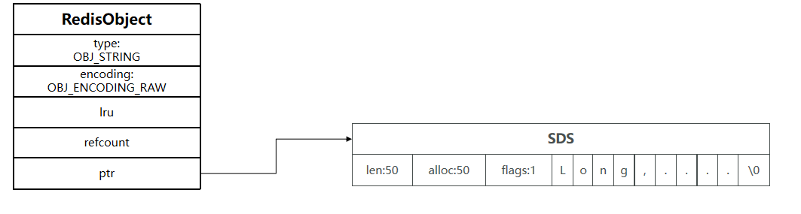

*ptr **指针**指向实际 SDS 存储位置。**内存不连续**

#### embstr编码

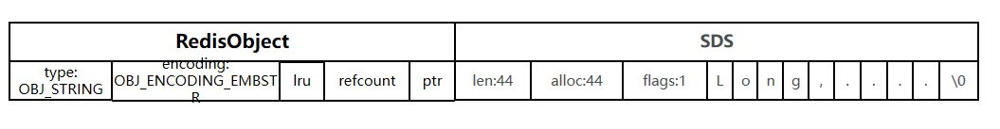

**内存连续**，意味着 redis 在申请内存空间时只需要调用一次申请内存函数，减少用户态内核态交换，效率高。

#### int编码

如果存储的字符串是整数值，并且大小在 LONG_MAX 范围内，则会采用 INT 编码：**直接将数据保存在 RedisObject 的 ptr 指针位置**（刚好 8 字节），不再需要 SDS 了。

#### 内存布局

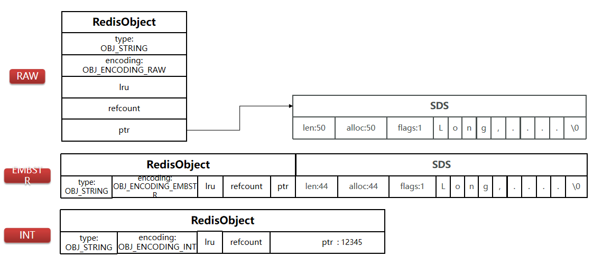

#### 编码转换

- 整数时为int
- 小于等于44字节为 embstr
- 大于44字节为指针，指向SDS

### List（QuickList）

> list 列表，它是简单的字符串列表，按照插入顺序排序，你可以添加一个元素到列表的头部（左边）或者尾部（右边），它的底层实际上是个链表结构。
  
  
#### 编码方式（encoding）

列表对象的编码是 **quicklist**。 (之前版本中有 linkedList 和 ziplist 这两种编码。进一步的，目前 Redis 定义的 10 个对象编码方式宏名中，有两个被完全闲置了，分别是: OBJ_ENCODING_ZIPMAP 与 OBJ_ENCODING_LINKEDLIST。 从 Redis 的演进历史上来看，前者是后续可能会得到支持的编码值（代码还在）, 后者则应该是被彻底淘汰了)

#### 内存布局

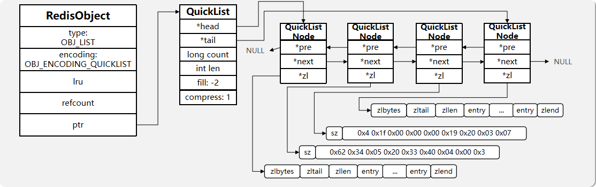

### Set（Dict/IntSet）
> 集合对象 set 是 string 类型（整数也会转换成 string 类型进行存储）的无序集合。注意集合和列表的区别：集合中的元素是无序的，因此不能通过索引来操作元素；集合中的元素不能有重复。
  
#### 编码方式（encoding）
 
> intset 和 dict

#### 内存布局

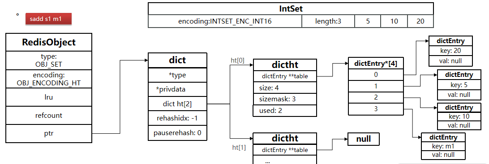

#### 编码转换

当集合同时满足以下两个条件时，使用 intset 编码：

- 集合对象中所有元素都是**整数**
- 集合对象所有元素个数**不超过 512**

不能满足这两个条件的就使用 hashtable 编码。    

第二个条件可以通过配置文件的 set-max-intset-entries 进行配置。

### ZSet（ZipList/SkipList&Dict）

和上面的集合对象相比，有序集合对象是有序的。与列表使用索引下标作为排序依据不同，有序集合为每个元素设置一个分数（score）作为排序依据。
#### 编码方式（encoding）
- SkipList & HT（Dict）：SkipList 可以排序，并且可以同时存储 score 和 ele 值（member）;HT 可以键值存储，并且可以根据 key 找 value
- ZipList ：当 节点 entry **数量 小于 128 并且** 每个节点大小**小于 64kb **时采用

#### 内存布局

> SkipList & Dict：Dict存键+值score，SkipList用来排序

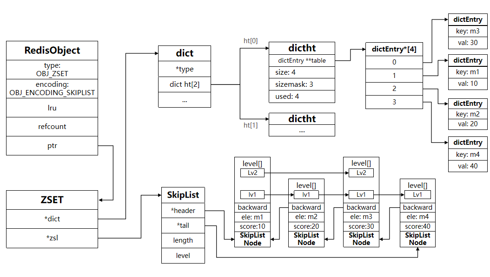

> ZipList

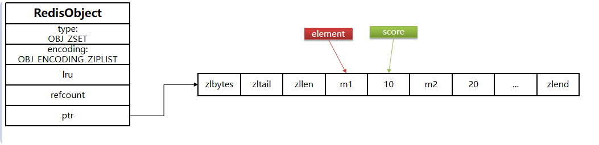

- ziplist 本身没有排序功能，而且没有键值对的概念，因此需要有 zset 通过编码实现：

- ZipList 是连续内存，因此 score 和 element 是**连续紧挨两个 entry**， element 在前，score 在后
- score 越小越接近队首，score 越大越接近队尾，按照 score 值升序排列

#### 编码转换

- 元素数量小于 zset_max_ziplist_entries个，默认值 128
- 每个元素都小于 zset_max_ziplist_value 字节，默认值 64

### Hash（ZipList/Dict）

> 哈希对象的键是一个字符串类型，值是一个键值对集合。

#### 编码方式（encoding）

 ziplist或者dict。

#### 内存布局

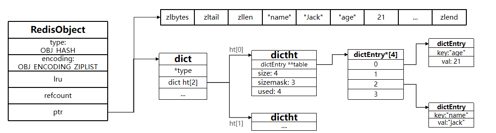

> 当为ZipList的时候，两个连续entry，一个存键，一个存值

#### 编码转换

- 元素数量小于hash-max-ziplist-entries个：默认 512

- 每个元素都小于hash-max-ziplist-value字节：默认64

