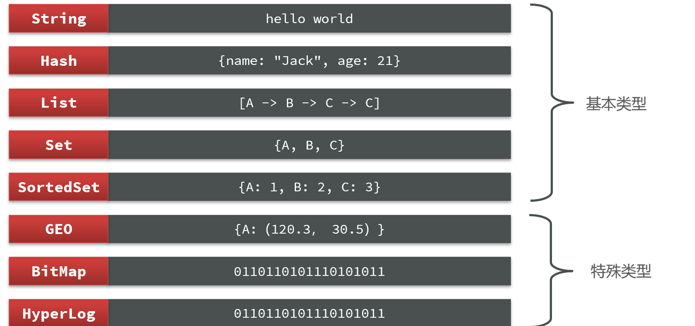
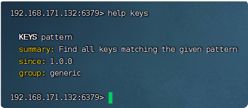
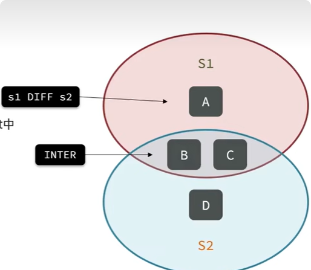
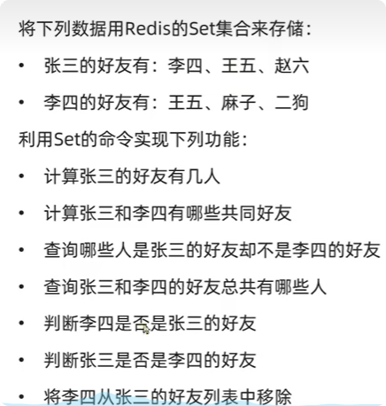
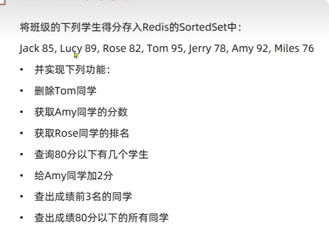

# redis理论与原理

## Redis数据结构介绍

### 介绍

Redis是一个key-value的数据库，key一般是String类型，不过value的类型多种多样。  

redis的数据结构是针对value的  

  

### 命令使用方法帮助
 
 Redis为了方便我们学习，将操作不同数据类型的命令也做了分组，在官网[点击进入](https://redis.io/commands)可以查看到不同的命令,也可以通过终端查找命令的使用。  
 
 例如想知道例如想知道keys命令怎么用可以在终端打出help keys  
 
 
 
    
    help @string
 
### Redis通用命令

**通用指令**是部分数据类型的，都可以使用的指令，常见的有：  

命令|作用
--|--
keys|查看符合模板的所有key
del|删除一个指定的key
exists|判断key是否存在
expire|	给一个key设置有效期，有效期到期时该key会被自动删除
ttl	|查看一个KEY的剩余有效期

----

## 不同数据结构的操作命令  

### String字符串命令

#### 描述
> String类型，也就是字符串类型，是Redis中最简单的存储类型。其value是字符串，不过根据字符串的格式不同，又可以分为3类：

- string：普通字符串

- int：整数类型，可以做自增、自减操作

- float：浮点类型，可以做自增、自减操作

#### 原理
> redis 中的 String 是动态字符串，内部结构类似 ArrayList。采用预分配冗余空间的方式减少内存的频繁分配。

不管是哪种格式，底层都是字节数组形式存储，只不过是编码方式不同。字符串类型的**最大空间不能超过512m**.

#### 常用命令

命令|描述|例子
--|--|--
set	|添加或者修改已经存在的一个String类型的键值对	|set name jack 加过期时间和判断是否存在set k6 50 ex 50 nx
get	|根据key获取String类型的value	|get name
mset	|批量添加多个String类型的键值对	|mset name jack age 19
mget	|根据多个key获取多个String类型的value	|mget name age
incr	|让一个整型的key自增1	|incr age
incrby	|让一个整型的key自增并指定步长，例如：incrby num 2 让num值自增2	|incr age 3
incrbyfloat	|让一个浮点类型的数字自增并指定步长	|incrbyfloat num 2.1
setnx	| 添加一个String类型的键值对，前提是这个key不存在，否则不执行	|setnx name jack
setex	|添加一个String类型的键值对，并且指定有效期	|	setex name 20 jack

描述： 

setnx name jack命令其实和set name jack nx这个命令效果类似，nx是set命令选项（如图）  

setex name 10 jack 命令其实和set name jack ex 10命令效果类似，ex是set命令选项

#### 使用场景

- **缓存**： 经典使用场景，把常用信息，字符串，图片或者视频等信息放到 redis 中，redis 作为缓存层，mysql 做持久化层，降低 mysql 的读写压力。
- **计数器**：redis 是单线程模型，一个命令执行完才会执行下一个，同时数据可以一步落地到其他的数据源。
- **session**：常见方案 spring session + redis 实现 session 共享，

### Hash散列命令
> redis 中的无序字典是一个 String 类型的 field 和 value 的映射表，内部结构类似 HashMap，每个 hash 可以存储 2^32-1 个键值对（40 多亿）
  
#### 原理

> 底层的实现结构，与 HashMap 一样，是 “数组 + 链表” 的二维结构，第一维 hash 的数据位置碰撞时，将碰撞元素用链表串接起来，不同的是，redis 字典的值只能是字符串，而且两者的 rehash 方式不同。java 的 hashmap 是一次全部 rehash，耗时较高，redis 为了提高性能，采用渐进式 rehash 策略。具体方式为，同时保留新旧两个 hash 结构，然后逐步搬迁，最后取代

 Hash类型，也叫散列，其value是一个无序字典，类似于Java中的**HashMap结构**。
可以理解为*mysql一行的数据*   
通常key等于：数据库名：表名：行id，   
value为 字段名称+字段值：比如  
    
     hmset iot:user:1 name kim age 12 sex nv
     
 
#### 常见命令  

命令|	描述|	例子
--|--|--
HSET key field value|	添加或者修改hash类型key的field的值	|hset iot:user:1 name kim
HGET key field	|获取一个hash类型key的field的值	|hget iot:user:1 name
HMSET	|批量添加多个hash类型key的field的值	| hmset iot:user:1 name kim age 12 sex 女
HMGET	|批量获取多个hash类型key的field的值	|hmget iot:user:1 name  age sex
HGETALL|	获取一个hash类型的key中的所有的field和value|	hgetall iot:user:1
HKEYS	|获取一个hash类型的key中的所有的field	|hkeys iot:user:1
HVALS	|获取一个hash类型的key中的所有的value	|hvals iot:user:1
HINCRBY	|让一个hash类型key的字段值自增并指定步长|	hincrby iot:user:1 age 1
HSETNX	|添加一个hash类型的key的field值，前提是这个field不存在，否则不执行	|hsetnx iot:user:1 name kim

#### 使用场景

- 缓存： 能直观，相比 string 更节省空间，的维护缓存信息，如用户信息，视频信息等。  

### List链表命令  

> redis 的链表是一个字符链表，内部结构类似 LinkedList。left，right 都可以添加。如果键不在，则创建新链表，如果已存在则新填内容。如果当前链表没有值，则该链表也会自动删除。redis 的列表最多可存储 2^32-1 个元素（4294967295，每个列表可以存储 40 多亿个元素）  

#### 原理

> 底层是一个快速链表（quickList）的结构，在列表元素较少时，使用内存存储压缩列表 ziplist。当元素数量较多时，改成 quickList，也就是将多个 zipList 串起来使用，以减少内存的碎片化。
  

#### 命令使用  

命令|描述|使用
--|--|--
RPUSH	|将给定值推入到列表右端	|RPUSH key value
LPUSH	|将给定值推入到列表左端	|LPUSH key value
RPOP	|从列表的右端弹出一个值，并返回被弹出的值|	RPOP key
LPOP	|从列表的左端弹出一个值，并返回被弹出的值	LPOP key
LRANGE	|获取列表在给定范围上的所有值	|LRANGE key 0 -1
LINDEX	|通过索引获取列表中的元素。你也可以使用负数下标，以 -1 表示列表的最后一个元素， -2 表示列表的倒数第二个元素，以此类推。	|LINDEX key index
LINSERT	|在某一个旧元素值的前边或后边插入一个新的值	|linsert key before/after old_value new_value
LLEN	|过去链表长度	|llen key
LTRIM	|截取 list 从 stater 到 end 位置的值并保留	|ltrim key start end
LREM	|删除 count 个元素值为 value 的元素	|lrem key count value
LSET	|修改索引号为 index 的元素的值为 value	|LSET key index value

  
#### 使用方案

- Stack (栈) : lpush+lpop
- Queue（队列）: lpush+rpop
- Capped Collection（有限集合）: lpush+ltrim
- Message Queue（消息队列）: lpush+brpop

#### 使用场景

- 微博 TimeLine: 有人发布微博，用 lpush 加入时间轴，展示新的列表信息。
- 消息队列

### Set无序集合命令

> redis 的集合是 String 类型的无序不重复的元素集，同时提供交集、并集、差集等操作，集合中最大的成员数为 2^32-1（40 多亿）。Redis 中集合是通过哈希表实现的，所以添加，删除，查找的复杂度都是 O (1)。

#### 原理

类似 HashSet, 也是通过哈希表实现的，相当于所有的 value 都为空。通过计算 hash 的方式来快速排重，也是 set 能提供判断一个成员是否在集合内的原因。

- **无序**
- 元素不可重复
- 查找快
- 支持交集、并集、差集等功能

#### 命令使用

命令|简述|使用
--|--|--
SADD	|向集合添加一个或多个成员	|SADD key value
SREM	|删除 set 集合中的 member	|SREMkey member [member…]
SCARD	|获取集合的成员数	|SCARD key
SISMEMBER|	判断 member 元素是否是集合 key 的成员	|SISMEMBER key member
SMEMBERS	|返回集合中的所有成员	|SMEMBERS key member
SPOP	|随机弹出 count 个 member	|SPOP key [count]
SRANDMEMBER|	随机返回 count 个成员	|SRANDMEMBER key count
SMOVE	|移动 source 中的成员 member 到 destination 中	|SMOVE sourse destination member
SDIFF	|返回 key1 与 key2 的差集	|SDIFF key1 key2 [key3…]
SINTER	|返回 key1 与 key2 的交集	|SINTER key1 key2 [key3…]
SUNION	|返回 key1 与 key2 的交集	|SUNION key1 key2 [key3…]

#### 举个例子

 
    192.168.171.132:6379> sadd zhangsan lisi wangwu zhaoliu
    (integer) 3
    192.168.171.132:6379> sadd lisi wangwu wangmazi ergou
    (integer) 3
    192.168.171.132:6379> smembers zhangsan
    1) "lisi"
    2) "zhaoliu"
    3) "wangwu"
    192.168.171.132:6379> sinter zhangsan  lisi
    1) "wangwu"
    192.168.171.132:6379> sdiff zhangsan lisi
    1) "lisi"
    2) "zhaoliu"
    192.168.171.132:6379> sdiff lisi zhangsan
    1) "wangmazi"
    2) "ergou"
    192.168.171.132:6379> sunion zhangsan lisi
    1) "wangwu"
    2) "zhaoliu"
    3) "lisi"
    4) "wangmazi"
    5) "ergou"
    192.168.171.132:6379> sismember zhangsan lisi
    (integer) 1
    192.168.171.132:6379> sismember lisi zhangsan
    (integer) 0
    192.168.171.132:6379> srem zhangsan lisi
    (integer) 1
    192.168.171.132:6379> scard zhangsan
    (integer) 2
    192.168.171.132:6379> scard lisi
    (integer) 3
    192.168.171.132:6379> 

#### 使用场景

- 标签（tag）, 给用户添加标签，或者用户给消息添加标签，这样有同一标签或者类似标签的可以给推荐关注的事或者关注的人。
- 点赞，或点踩，收藏等，可以放到 set 中实现  
    

### Sorted/ZSet有序集合命令  

> Redis 有序集合和集合一样也是 string 类型元素的集合，且不允许重复的成员。不同的是每个元素都会关联一个 double 类型的分数。redis 正是通过分数来为集合中的成员进行从小到大的排序。zset 的成员是唯一的，但分数是可以重复的。
  
#### 原理 

- 压缩列表 (ziplist): ziplist 是为了提高存储效率而设计的一种特殊编码的双向链表。它可以存储字符串或者整数，存储整数时是采用整数的二进制而不是字符串形式存储。它能在 O (1) 的时间复杂度下完成 list 两端的 push 和 pop 操作。但是因为每次操作都需要重新分配 ziplist 的内存，所以实际复杂度和 ziplist 的内存使用量相关

 
- 跳跃表（zSkiplist): 跳跃表的性能可以保证在查找，删除，添加等操作的时候在对数期望时间内完成，这个性能是可以和平衡树来相比较的，而且在实现方面比平衡树要优雅，这是采用跳跃表的主要原因。跳跃表的复杂度是 O (log (n))。

- ZSet特性：

    - **可排序**
    - 元素不可重复
    - 查询速度快 

#### 使用命令 

命令|简述|使用
--|--|--
zadd key score member  |添加一个或者多个元素，如果已经存在则更新score值| zadd key score member 
zrem key score | 删除集合中one元素|zrem key score
zscore key member|得到指定元素score值|zscore key member
zrank(zrevrank) key member| 获取集合中指定**元素排名**，倒叙就是zrevrank key member|zrank key member
zcard key  | 返回集合中所有**元素个数**|zcard key 
zcount key min max| 返回集合中指定**score范围**内所有元素个数 |zcount key min max
zincrby key increment member|让指定**元素自增**，没有元素就创建元素|zincrby key increment member
zrange(zrevrange) key min max | 按照score排序后，获取集合中指定**排名范围**内的元素,倒叙就是zrevrange key min max|zrange myset 0 5 
zrangebyscore(zrevrangebyscore)	 key min max |	获取指定**分数范围**内的成员 （升序） withscores 表示带上分数，limit 表示分页素|zrangebyscore key min max [withscores] [limit offset count]
zcard key|  返回集合中所有元素个数|
zremrangebyrank  key min max  |删除指定**索引范围**内（2-5）的元素|zremrangebyrank  myset 2 5
zremrangebyscore  key min max  |删除指定**score范围**内（2-5）的元素|zremrangebyscore  myset 2 5
zdiff	|差集|
zinter	|交集|
zunion	|交集|

#### 举个例子

    
    192.168.171.132:6379> zrem students tom
    (integer) 1
    192.168.171.132:6379> zscore student amy
    (nil)
    192.168.171.132:6379> zscore students amy
    "92"
    192.168.171.132:6379> zrank students rose
    (integer) 2
    192.168.171.132:6379> zrevrank students rose
    (integer) 3
    192.168.171.132:6379> zcount students 0 8
    (integer) 0
    192.168.171.132:6379> zcount students 0 80
    (integer) 2
    192.168.171.132:6379> zincrby students 2 amy
    "94"
    192.168.171.132:6379> zrange students 0 2
    1) "miles"
    2) "jerry"
    3) "rose"
    192.168.171.132:6379> zrevrange students 0 2
    1) "amy"
    2) "lucy"
    3) "jack"
    192.168.171.132:6379> zrangebyscore students 0 80 
    1) "miles"
    2) "jerry"
    192.168.171.132:6379> zrangebyscore students 0 80 withscores
    1) "miles"
    2) "76"
    3) "jerry"
    4) "78"
    192.168.171.132:6379> 

#### 使用场景

- 排行榜：有序集合经典使用场景。例如小说视频等网站需要对用户上传的小说视频做排行榜，榜单可以按照用户关注数，更新时间，字数等打分，做排行。

### HyperLogLogs（基数统计）

#### 什么是基数？

举个例子，A = {1, 2, 3, 4, 5}， B = {3, 5, 6, 7, 9}；那么基数（**不重复的元素**）= 1, 2, 4, 6, 7, 9； （允许容错，即可以接受一定误差）

#### 解决什么问题？

这个结构可以非常省内存的去统计各种计数，比如注册 IP 数、每日访问 IP 数、页面实时 UV、在线用户数，共同好友数等。

#### 优势体现在哪？
一个大型的网站，每天 IP 比如有 100 万，粗算一个 IP 消耗 15 字节，那么 100 万个 IP 就是 15M。而 HyperLogLog 在 Redis 中每个键占用的内容都是 12K，理论存储近似接近 2^64 个值，不管存储的内容是什么，它一个基于基数估算的算法，只能比较准确的估算出基数，可以使用少量固定的内存去存储并识别集合中的唯一元素。而且这个估算的基数并不一定准确，是一个带有 0.81% 标准错误的近似值（对于可以接受一定容错的业务场景，比如 IP 数统计，UV 等，是可以忽略不计的）

#### 命令使用
    
    192.168.171.132:6379> pfadd key1 a b c d e f g h i # 创建第一组元素
    (integer) 1
    192.168.171.132:6379> pfcount key1      # 统计元素的基数数量
    (integer) 9
    192.168.171.132:6379> pfadd key2 c j k l m e g a  # 创建第二组元素
    (integer) 1
    192.168.171.132:6379> pfcount key2
    (integer) 8
    192.168.171.132:6379> pfmerge key3 key1 key2
    OK
    192.168.171.132:6379> pfcount key3  # 合并两组：key1 key2 -> key3 并集
    (integer) 13
    192.168.171.132:6379> 

    

### Bitmap （位存储）

#### 描述

Bitmap 即位图数据结构，都是操作二进制位来进行记录，只有 0 和 1 两个状态。

#### 解决什么问题？  

比如：统计用户信息，活跃，不活跃！ 登录，未登录！ 打卡，不打卡！ 两个状态的，都可以使用 Bitmaps！  

如果存储一年的打卡状态需要多少内存呢？ 365 天 = 365 bit 1 字节 = 8bit 46 个字节左右！

#### 命令使用

使用 bitmap 来记录 周一到周日的打卡！ 周一：1 周二：0 周三：0 周四：1 ……

    192.168.171.132:6379> setbit sign 0 1
    (integer) 0
    192.168.171.132:6379> setbit sign 1 1
    (integer) 0
    192.168.171.132:6379> setbit sign 2 0
    (integer) 0
    192.168.171.132:6379> setbit sign 3 1
    (integer) 0
    192.168.171.132:6379> setbit sign 4 0
    (integer) 0
    192.168.171.132:6379> setbit sign 5 0
    (integer) 0
    192.168.171.132:6379> setbit sign 6 1
    (integer) 0

查看某一天是否有打卡！  
    
    192.168.171.132:6379> getbit sign 3
    (integer) 1
    192.168.171.132:6379> getbit sign 5
    (integer) 0

统计操作，统计 打卡的天数！  

    192.168.171.132:6379> bitcount sign   # 统计这周的打卡记录，就可以看到是否有全勤！
    (integer) 4

    
### geospatial (地理位置)

#### 添加地理位置

    127.0.0.1:6379> geoadd china:city 118.76 32.04 manjing 112.55 37.86 taiyuan 123.43 41.80 shenyang
    (integer) 3
    127.0.0.1:6379> geoadd china:city 144.05 22.52 shengzhen 120.16 30.24 hangzhou 108.96 34.26 xian
    (integer) 3
  
#### 规则

- 两级无法直接添加，我们一般会下载城市数据 (这个网址可以查询 GEO： http://www.jsons.cn/lngcode)！
    - 有效的经度从 - 180 度到 180 度。
    - 有效的纬度从 - 85.05112878 度到 85.05112878 度。

        #当坐标位置超出上述指定范围时，该命令将会返回一个错误。
        127.0.0.1:6379> geoadd china:city 39.90 116.40 be ijin
        (error) ERR invalid longitude,latitude pair 39.900000,116.400000 
            
    
   

#### geopos

> 获取指定的成员的经度和纬度
    
    127.0.0.1:6379> geopos china:city taiyuan manjing
    1) 1) "112.54999905824661255"
       1) "37.86000073876942196"
    2) 1) "118.75999957323074341"
       1) "32.03999960287850968"
    

获得当前定位，一定是一个坐标值！

#### geodist

>如果不存在，返回空 

- 单位如下

    - m
    - km
    - mi 英里
    - ft 英尺
    
    
    127.0.0.1:6379> geodist china:city taiyuan shenyang m
    "1026439.1070"
    127.0.0.1:6379> geodist china:city taiyuan shenyang km
    "1026.4391" 
    
    
#### georadius

> 附近的人 ==> 获得所有附近的人的地址，定位，通过半径来查询

获得指定数量的人  
    
    127.0.0.1:6379> georadius china:city 110 30 1000 km			以 100,30 这个坐标为中心, 寻找半径为1000km的城市
    1) "xian"
    2) "hangzhou"
    3) "manjing"
    4) "taiyuan"
    127.0.0.1:6379> georadius china:city 110 30 500 km
    1) "xian"
    127.0.0.1:6379> georadius china:city 110 30 500 km withdist
    1) 1) "xian"
       2) "483.8340"
    127.0.0.1:6379> georadius china:city 110 30 1000 km withcoord withdist count 2
    1) 1) "xian"
       2) "483.8340"
       3) 1) "108.96000176668167114"
          2) "34.25999964418929977"
    2) 1) "manjing"
       2) "864.9816"
       3) 1) "118.75999957323074341"
          2) "32.03999960287850968"

参数 key 经度 纬度 半径 单位 [显示结果的经度和纬度] [显示结果的距离] [显示的结果的数量]

#### georadiusbymember  

> 显示与指定成员一定半径范围内的其他成员

    127.0.0.1:6379> georadiusbymember china:city taiyuan 1000 km
    1) "manjing"
    2) "taiyuan"
    3) "xian"
    127.0.0.1:6379> georadiusbymember china:city taiyuan 1000 km withcoord withdist count 2
    1) 1) "taiyuan"
       2) "0.0000"
       3) 1) "112.54999905824661255"
          2) "37.86000073876942196"
    2) 1) "xian"
       2) "514.2264"
       3) 1) "108.96000176668167114"
          2) "34.25999964418929977"
    

#### geohash (较少使用) 

> 该命令返回 11 个字符的 hash 字符串

    127.0.0.1:6379> geohash china:city taiyuan shenyang
    1) "ww8p3hhqmp0"
    2) "wxrvb9qyxk0"
    
    
#### 底层

> geo 底层的实现原理实际上就是 Zset, 我们可以通过 Zset 命令来操作 geo 

    127.0.0.1:6379> type china:city
    zset  
    
查看全部元素 删除指定的元素  

    127.0.0.1:6379> zrange china:city 0 -1 withscores
     1) "xian"
     2) "4040115445396757"
     3) "hangzhou"
     4) "4054133997236782"
     5) "manjing"
     6) "4066006694128997"
     7) "taiyuan"
     8) "4068216047500484"
     9) "shenyang"
    1)  "4072519231994779"
    2)  "shengzhen"
    3)  "4154606886655324"
    127.0.0.1:6379> zrem china:city manjing
    (integer) 1
    127.0.0.1:6379> zrange china:city 0 -1
    1) "xian"
    2) "hangzhou"
    3) "taiyuan"
    4) "shenyang"
    5) "shengzhen"
    
