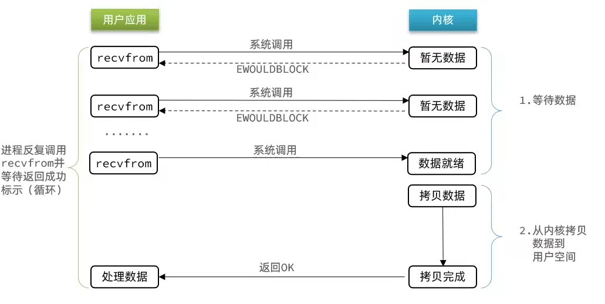
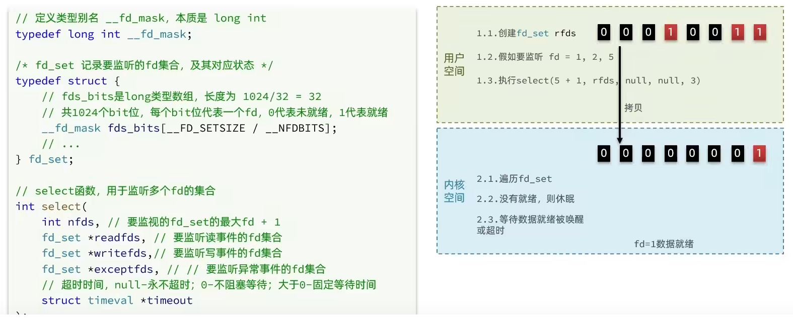

# redis网络模型
## 用户空间和内核空间

>用户的应用，比如 redis ，mysql 等其实是没有办法去执行访问我们操作系统的硬件的，所以我们可以通过发行版的这个壳子去访问内核，再通过内核去访问计算机硬件

### 为什么要划分内核态和用户态

> ​ 计算机硬件包括，如 cpu，内存，网卡等等，**内核（通过寻址空间）可以操作硬件的**，但是内核需要不同设备的驱动，有了这些驱动之后，内核就可以去对计算机硬件去进行 内存管理，文件系统的管理，进程的管理等等
  
  

### 进程寻址空间

> 什么是寻址空间呢？我们的应用程序也好，还是内核空间也好，都是没有办法直接去物理内存的，而是通过分配一些虚拟内存映射到物理内存中，我们的内核和应用程序去访问虚拟内存的时候，就需要一个虚拟地址，这个地址是一个无符号的整数。

​比如一个 32 位的操作系统，他的带宽就是 32，他的虚拟地址就是 2 的 32 次方，也就是说他寻址的范围就是 0~2 的 32 次方， 这片寻址空间对应的就是 2 的 32 个字节，就是 4GB，这个 4GB，会有 3 个 GB 分给用户空间，会有 1GB 给内核系统

Linux 系统为了提高 IO 效率，会在用户空间和内核空间都加入缓冲区：

- 写数据时，要把用户缓冲数据拷贝到内核缓冲区，然后写入设备
- 读数据时，要从设备读取数据到内核缓冲区，然后拷贝到用户缓冲区

## 网络模型

### 阻塞IO

> 用户去读取数据时，会去先发起 recvform 一个命令，去尝试从内核上加载数据，如果内核没有数据，那么用户就会等待，此时内核会去从硬件上读取数据，内核读取数据之后，会把数据拷贝到用户态，并且返回 ok，整个过程，都是阻塞等待的，这就是阻塞 IO
  
顾名思义，阻塞 IO 就是两个阶段都必须阻塞等待：

- 阶段一：

    - 用户进程尝试读取数据（比如网卡数据）
    - 此时数据尚未到达，内核需要等待数据
    - 此时用户进程也处于阻塞状态
- 阶段二：

    - 数据到达并拷贝到内核缓冲区，代表已就绪
    - 将内核数据拷贝到用户缓冲区
    - 拷贝过程中，用户进程依然阻塞等待
    - 拷贝完成，用户进程解除阻塞，处理数据

### 非阻塞 IO

顾名思义，非阻塞 IO 的 recvfrom 操作会立即返回结果而不是阻塞用户进程。

- 阶段一：

    - 用户进程尝试读取数据（比如网卡数据）
    - 此时数据尚未到达，内核需要等待数据
    - 返回异常给用户进程
    - 用户进程拿到 error 后，再次尝试读取
    - 循环往复，直到数据就绪
- 阶段二：

    - 将内核数据拷贝到用户缓冲区
    - 拷贝过程中，用户进程依然阻塞等待
    - 拷贝完成，用户进程解除阻塞，处理数据
    - 可以看到，非阻塞 IO 模型中，用户进程在第一个阶段是非阻塞，第二个阶段是阻塞状态。虽然是非阻塞，但性能并没有得到提高。而且忙等机制会导致 CPU 空转，CPU 使用率暴增。

### 信号驱动

信号驱动 IO 是与内核建立 SIGIO 的信号关联并设置回调，当内核有 FD 就绪时，会发出 SIGIO 信号通知用户，期间用户应用可以执行其它业务，无需阻塞等待。

- 阶段一：

    - 用户进程调用 sigaction ，注册信号处理函数
    - 内核返回成功，开始监听 FD
    - 用户进程不阻塞等待，可以执行其它业务
    - 当内核数据就绪后，回调用户进程的 SIGIO 处理函数
- 阶段二：

    - 收到 SIGIO 回调信号
    - 调用 recvfrom ，读取
    - 内核将数据拷贝到用户空间
    - 用户进程处理数据

当有大量 IO 操作时，信号较多，SIGIO 处理函数不能及时处理可能导致信号队列溢出，而且内核空间与用户空间的频繁信号交互性能也较低。

### 异步 IO

> 这种方式，不仅仅是用户态在试图读取数据后，不阻塞，而且当内核的数据准备完成后，也不会阻塞

他会由内核将所有数据处理完成后，由内核将数据写入到用户态中，然后才算完成，所以性能极高，不会有任何阻塞，全部都由内核完成，可以看到，异步 IO 模型中，用户进程在两个阶段都是非阻塞状态。

### IO 多路复用

> 监听多个地方的数据读取进度，谁的数据准备好了，就通知用户去从缓存区读取

### 多路复用 IO 的实现

目前流程的多路复用 IO 实现主要包括四种: select、poll、epoll、kqueue。下表是他们的一些重要特性的比较:

IO 模型	|相对性能	|关键思路	|操作系统	|JAVA 支持情况
--|--|--|--|--
select	|较高	|Reactor	|windows/Linux	|支持Reactor 模式 (反应器设计模式)。Linux 操作系统的 kernels 2.4 内核版本之前，默认使用 select；而目前 windows 下对同步 IO 的支持，都是 select 模型
poll	|较高	|Reactor	|Linux	|Linux 下的 JAVA NIO 框架，Linux kernels 2.6 内核版本之前使用 poll 进行支持。也是使用的 Reactor 模式
epoll	|高	|Reactor/Proactor	|Linux	|Linux kernels 2.6 内核版本及以后使用 epoll 进行支持；Linux kernels 2.6 内核版本之前使用 poll 进行支持；另外一定注意，由于 Linux 下没有 Windows 下的 IOCP 技术提供真正的 异步 IO 支持，所以 Linux 下使用 epoll 模拟异步 IO
kqueue	|高	|Proactor	|Linux	|目前 JAVA 的版本不支持

#### select

> 采用1024大小fd_set集合存放事件,**最大连接1024**，每次数据来了，需要**全部拷贝**到用户buffer，然后**全部遍历**才能找到

select 是 Linux 最早是由的 I/O 多路复用技术：  

linux 中，**一切皆文件*，socket 也不例外，我们把需要处理的**数据封装成 FD**，然后在用户态时创建一个 fd_set 的集合（这个集合的大小是要监听的那个 FD 的最大值 + 1，但是大小整体是有限制的 ），这个集合的长度大小是有限制的，同时在这个集合中，标明出来我们要控制哪些数据。

##### 流程  

- 用户态下：

    - 创建 fd_set 集合，包括要监听的 读事件、写事件、异常事件 的集合
    - 确定要监听的 fd_set 集合
    - 将要监听的集合作为参数传入 select () 函数中，select 中会将 集合复制到内核 buffer 中
- 内核态：

    - 内核线程在得到 集合后，遍历该集合
    - 没数据就绪，就休眠
    - 当数据来时，线程被唤醒，然后再次遍历集合，标记就绪的 fd 然后将整个集合，复制回用户 buffer 中
    - 用户线程**遍历集合**，找到就绪的 fd ，再发起读请求。

##### 源码

##### 不足

- 集合大小固定为 1024 ，也就是说最多维持 **1024 个 socket**，在海量数据下，不够用
- 集合需要在 用户 buffer 和内核 buffer 中**反复复制**，涉及到 用户态和内核态的切换，非常影响性能

#### poll

> poll 模式对 select 模式做了简单改进，把**集合改成链表，没有存储上限（但是当数量多了，一样效率低）**，同样要**全部拷贝**到用户buffer，**全部遍历**找到数据

#### 流程
     
- 创建 pollfd 数组，向其中添加关注的 fd 信息，数组大小自定义
- 调用 poll 函数，将 pollfd 数组拷贝到内核空间，转链表存储，无上限
- 内核遍历 fd ，判断是否就绪
- 数据就绪或超时后，拷贝 pollfd 数组到用户空间，返回就绪 fd 数量 n
- 用户进程判断 n 是否大于 0, 大于 0 则遍历 pollfd 数组，找到就绪的 fd
     
##### 源码

     
##### 与 select 对比

- select 模式中的 fd_set 大小固定为 1024，而 pollfd 在内核中采用链表，

- 理论上无上限，但实际上不能这么做，因为的监听 FD 越多，每次遍历消耗时间也越久，性能反而会下降

#### epoll

> epoll 模式是对 select 和 poll 的改进，它提供了三个函数：eventpoll 、epoll_ctl 、epoll_wait

- **eventpoll**(epoll示例) 函数内部包含了两个东西 :

    - 红黑树 ：用来记录所有的 fd
    
    - 链表 ： 记录已就绪的 fd

- **epoll_ctl 函数** ，**将要监听的 fd 添加到 红黑树 上去**，并且给每个 fd **绑定一个监听函数**，当 fd 就绪时就会被触发，这个监听函数的操作就是 **将这个 fd 添加到 链表中去**。

- **epoll_wait 函数**，**就绪等待**。一开始，用户态 buffer 中创建一个空的 events 数组，当就绪之后，我们的回调函数会把 fd 添加到链表中去，当函数被调用的时候，会去检查链表（当然这个过程需要参考配置的等待时间，可以等一定时间，也可以一直等），如果链表中没有有 fd 则 fd 会从红黑树被添加到链表中，此时再将链表中的的 fd 复制到 用户态的空 events 中，并且返回对应的操作数量，用户态此时收到响应后，会从 events 中拿到已经准备好的数据，在调用 读方法 去拿数据。

#### 总结
- select 模式存在的三个问题：
     
    - 能监听的 FD **最大不超过 1024**
    - 每次 select 都需要把所有要监听的 FD **都拷贝到内核空间**
    - 每次都要**遍历所有 FD** 来判断就绪状态
    
- poll 模式的问题：
     
    - poll 利用**链表解决了 select 中监听 FD 上限的问题**，但依然要遍历所有 FD，如果监听较多，性能会下降
    
- epoll 模式中如何解决这些问题的？
     
    - 基于 epoll 实例中的**红黑树**保存要监听的 FD，理论上无上限，而且增删改查效率都非常高
    - 每个 FD 只需要执行一次 epoll_ctl 添加到红黑树，以后每次 epol_wait 无需传递任何参数，无需重复拷贝 FD 到内核空间
    - 利用 **ep_poll_callback** 机制来监听 FD 状态，无需遍历所有 FD，因此性能不会随监听的 FD 数量增多而下降
     
### epoll 的服务器端流程

梳理：

- **epoll_create**:**创建eventpoll示例**
    - **红黑树rb_root**（空）：rb_root 用来去记录需要被监听的 FD
    - **链表list_head**（空）：list_head，用来存放已经就绪的 FD
    
- **epoll_ctl**：**accept()监听连接socket**，把要监听的fd，放到红黑树rb_root里面，并且设置回调函数

-**epoll_wait**：**监听事件**，检查是有有准备就绪的数据，一旦准备就绪，就触发回调函数，把fb添加到链表list_head里面

## redis通信协议

> RESP 协议Redis Serialization Protocol

- Redis 1.2 版本引入了 RESP 协议
- Redis 2.0 版本中成为与 Redis 服务端通信的标准，称为 RESP2
- Redis 6.0 版本中，从 RESP2 升级到了 RESP3 协议，增加了更多数据类型并且支持 6.0 的新特性–客户端缓存

### 协议格式

- 单行字符串：首字节是 ‘+’ ，后面跟上单行字符串，以 CRLF（ “\r\n” ）结尾。例如返回”OK”： “+OK\r\n”

- 错误（Errors）：首字节是 ‘-’ ，与单行字符串格式一样，只是字符串是异常信息，例如：”-Error message\r\n”

- 数值：首字节是 ‘:’ ，后面跟上数字格式的字符串，以 CRLF 结尾。例如：”:10\r\n”

- 多行字符串：首字节是 ‘$’ ，表示二进制安全的字符串，最大支持 512MB：

    - 如果大小为 0，则代表空字符串：”$0\r\n\r\n”
    - 如果大小为 - 1，则代表不存在：”$-1\r\n”
- 数组：首字节是 ‘*’，后面跟上数组元素个数，再跟上元素，元素数据类型不限 :

## redis内存回收

> Redis 之所以性能强，最主要的原因就是基于内存存储。然而单节点的 Redis 其内存大小不宜过大，会影响持久化或主从同步性能。

我们可以通过修改配置文件来设置 Redis 的最大内存：

    maxmemory 1gb

### 过期 key 处理

当内存使用达到上限时，就无法存储更多数据了。为了解决这个问题，Redis 提供了一些策略实现内存回收：

> Redis 本身是一个典型的 key-value 内存存储数据库，因此所有的 key、value 都保存在之前学习过的 Dict 结构中。不过在其 **database 结构体中，有两个 Dict：一个用来记录 key-value；另一个用来记录 key-TTL**。
  
  

内部结构

### 惰性删除

惰性删除：顾明思议并不是在 TTL 到期后就立刻删除，而是在**访问**一个 key 的时候，检查该 key 的存活时间，如果已经过期才执行**删除**。

### 周期删除

周期删除：顾明思议是通过一个**定时任务**，周期性的**抽样**部分过期的 key，然后执行删除。执行周期有两种：

- Redis 服务初始化函数 initServer () 中设置定时任务，**按照 server.hz 的频率来执行过期 key 清理**，模式为 **SLOW**
- Redis 的**每个事件循环前会调用 beforeSleep () 函数，执行过期 key 清理**，模式为 **FAST**

SLOW 模式规则：

- 执行频率受 server.hz 影响，默认为 10，即**每秒执行 10 次，每个执行周期 100ms**。
- 执行清理耗时不超过一次执行周期的 25%. 默认 slow 模式耗时不超过 25ms
- 逐个遍历 db，逐个遍历 db 中的 bucket，抽取 20 个 key 判断是否过期
- 如果没达到时间上限（25ms）并且过期 key 比例大于 10%，再进行一次抽样，否则结束

FAST 模式规则（过期 key 比例**小于 10% 不执行** ）：

- 执行频率受 beforeSleep () 调用频率影响，但两次 FAST 模式**间隔不低于 2ms**
- **执行清理耗时不超过 1ms**
- 逐个遍历 db，逐个遍历 db 中的 bucket，抽取 20 个 key 判断是否过期
- 如果**没达到时间上限（1ms）并且过期 key 比例大于 10%**，再进行一次抽样，否则结束

## 内存淘汰策略

> 内存淘汰：就是当 **Redis 内存**使用达到设置的**上限**时，主动挑选部分 key 删除以释放更多内存的流程。

Redis 支持 8 种不同策略来选择要删除的 key：

- **noeviction**： 不淘汰任何 key，但是内存满时不允许写入新数据，默认就是这种策略。
- **volatile-ttl**： 对设置了 TTL 的 key，比较 key 的剩余 TTL 值，TTL 越小越先被淘汰
- **allkeys-random**：对全体 key ，随机进行淘汰。也就是直接从 db->dict 中随机挑选
- **volatile-random**：对设置了 TTL 的 key ，随机进行淘汰。也就是从 db->expires 中随机挑选。
- **allkeys-lru**： 对全体 key，基于 LRU 算法进行淘汰
- **volatile-lru**： 对设置了 TTL 的 key，基于 LRU 算法进行淘汰
- **allkeys-lfu**： 对全体 key，基于 LFU 算法进行淘汰
- **volatile-lfu**： 对设置了 TTL 的 key，基于 LFI 算法进行淘汰

### 算法

**LRU**（Least Recently Used），**最少最近使用**。用当前时间减去最后一次访问时间，这个值越大则淘汰优先级越高。  
**LFU**（Least Frequently Used），**最少频率使用**。会统计每个 key 的访问频率，值越小淘汰优先级越高。

- LFU 的访问次数之所以叫做逻辑访问次数，是因为并不是每次 key 被访问都计数，而是通过运算：

    - 生成 0~1 之间的随机数 R
    - 计算 (旧次数 * lfu_log_factor + 1)，记录为 P
    - 如果 R < P ，则计数器 + 1，且最大不超过 255
    - 访问次数会随时间衰减，距离上一次访问时间每隔 lfu_decay_time 分钟，计数器 -1

