# redis运维

## 持久化

### RDB
> RDB (Redis DataBase) 快照 / 内存快照 ，RDB 持久化是把当前进程数据生成快照保存到磁盘上的过程，由于是某一时刻的快照，那么快照中的值要早于或者等于内存中的值。
  
#### 手动触发
> 手动触发分别对应 save 和 bgsave 命令

- **save 命令**：**主进程执行**，**阻塞当前 Redis 服务器**，直到 RDB 过程完成为止，对于内存 比较大的实例会造成长时间阻塞，线上环境不建议使用

- **bgsave 命令**：Redis 进程**执行 fork 操作创建子进程**，RDB 持久化过程由子进程负责，完成后自动结束。**阻塞只发生在 fork 阶段**，一般时间很短

#### bgsave 的基本流程
- redis 客户端执行 bgsave 命令或者自动触发 bgsave 命令；
- 主进程判断当前是否已经存在正在执行的子进程，如果存在，那么主进程直接返回；
- 如果不存在正在执行的子进程，那么就 fork 一个新的子进程进行持久化数据，fork 过程是阻塞的，fork 操作完成后主进程即可执行其他操作，子进程与主进程共享内存空间；
- 子进程先将数据写入到**临时的 rdb 文件**中，待快照数据写入完成后再原子**替换旧的 rdb** 文件；
- 同时发送信号给主进程，通知主进程 rdb 持久化完成，主进程更新相关的统计信息（info Persitence 下的 rdb_* 相关选项）

#### 自动触发(配置)
> 默认开启RDB持久化，可以配置执行时机

4种执行时机：  
- redis.conf 中配置 **save m n**，即在 m 秒内有 n 次修改时，自动触发 bgsave 生成 rdb 文件；
- **主从复制时**，从节点要从主节点进行 全量复制时 也会触发 bgsave 操作，生成当时的快照发送到从节点；
- 执行 **debug reload** 命令重新加载 redis 时也会触发 bgsave 操作；
- 默认情况下执行 **shutdown 命令**时，如果没有开启 aof 持久化，那么也会触发 bgsave 操作；

  
**Redis中默认的周期性设置**
    
    # Save the DB to disk.
    #
    # save <seconds> <changes>
    #
    # Redis will save the DB if both the given number of seconds and the given
    # number of write operations against the DB occurred.
    #
    # Snapshotting can be completely disabled with a single empty string argument
    # as in following example:
    #
    # 关闭 RDB
    # save ""
    #
    # Unless specified otherwise, by default Redis will save the DB:
    #   * After 3600 seconds (an hour) if at least 1 key changed
    #   * After 300 seconds (5 minutes) if at least 100 keys changed
    #   * After 60 seconds if at least 10000 keys changed
    #
    # You can set these explicitly by uncommenting the three following lines.
    # 如果 900秒 内有 1 条Key信息发生变化，则进行快照；
    save 3600 1
    # 如果 300 秒内有 10 条Key信息发生变化，则进行快照；
    save 300 100
    # 如果 60 秒内有 10000 条 Key 信息发生变化，则进行快照。
    save 60 10000
    
**其它相关配置**
    
    # 文件名称
    dbfilename dump.rdb
    
    # 文件保存路径
    dir /home/work/app/redis/data/
    
    # 如果持久化出错，主进程是否停止写入
    stop-writes-on-bgsave-error yes
    
    # 是否压缩
    rdbcompression yes
    
    # 导入时是否检查
    rdbchecksum yes
    
       
#### 核心思路

RDB 中的核心思路是 Copy-on-Write，来保证在进行快照操作的这段时间，需要压缩写入磁盘上的数据在内存中不会发生变化。在正常的快照操作中，一方面 Redis 主进程会 fork 一个新的快照进程专门来做这个事情，这样保证了 Redis 服务不会停止对客户端包括写请求在内的任何响应。**另一方面这段时间发生的数据变化会以副本的方式存放在另一个新的内存区域，待快照操作结束后才会同步到原来的内存区域 **。

处。

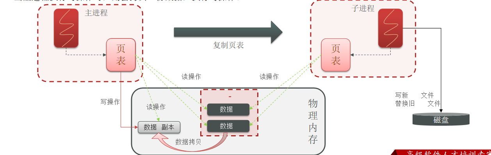

#### 优缺点

- 优点
    - RDB 文件是某个时间节点的快照，默认使用 **LZF 算法进行压缩**，压缩后的文件体积远远小于内存大小，适用于备份、全量复制等场景；(**体积小**)
    - Redis 加载 RDB 文件恢复数据要远远快于 AOF 方式；（**速度快**）
- 缺点
    - RDB 方式实时性不够，无法做到秒级的持久化；（**实时性不够**）
    - 每次调用 bgsave 都需要 fork 子进程，fork 子进程属于重量级操作，频繁执行成本较高；（**fork 成本高**）
    - RDB 文件是二进制的，没有可读性，AOF 文件在了解其结构的情况下可以手动修改或者补全；（**可读性不高**）
    - 版本兼容 RDB 文件问题；（**不兼容**）

### AOF

> AOF 全称为 **Append Only File**（追加文件）。Redis 处理的每一个写命令都会记录在 AOF 文件，可以看做是命令日志文件。

AOF 日志采用写后日志，即**先写内存，后写日志**。  

- **避免额外的检查开销**：Redis 在向 AOF 里面记录日志的时候，**并不会先去对这些命令进行语法检查**。所以，如果先记日志再执行命令的话，日志中就有可能记录了错误的命令，Redis 在使用日志恢复数据时，就可能会出错。
- **不会阻塞当前的写操作**

但这种方式存在潜在风险：    

- 如果命令执行完成，写日志之前宕机了，会**丢失数据**。
- 主线程写磁盘压力大，导致写盘慢，阻塞后续操作

AOF 日志记录 Redis 的每个写命令，步骤分为：命令追加（append）、文件写入（write）和文件同步（sync）。  

**命令追加** 当 AOF 持久化功能打开了，服务器在执行完一个写命令之后，会以协议格式将被执行的写命令追加到服务器的** aof_buf 缓冲区**。

关于*何时将 aof_buf 缓冲区的内容写入 AOF 文件*中，Redis 提供了三种写回策略：  
- **Always同步写回**：每个写命令执行完，立马同步地将日志写回磁盘；

- **Everysec每秒写回**：每个写命令执行完，只是先把日志写到 AOF 文件的内存缓冲区，每隔一秒把缓冲区中的内容写入磁盘；

- **No，操作系统控制的写回**：每个写命令执行完，只是先把日志写到 AOF 文件的内存缓冲区，由操作系统决定何时将缓冲区内容写回磁盘。

    # appendfsync always
    appendfsync everysec
    # appendfsync no
    
#### redis.conf中配置 AOF 
    
    # appendonly参数开启AOF持久化
    appendonly no
    
    # AOF持久化的文件名，默认是appendonly.aof
    appendfilename "appendonly.aof"
    
    # AOF文件的保存位置和RDB文件的位置相同，都是通过dir参数设置的
    dir ./
    
    # 同步策略
    # appendfsync always
    appendfsync everysec
    # appendfsync no
    
    # aof重写期间是否同步
    no-appendfsync-on-rewrite no
    
    # 重写触发配置
    auto-aof-rewrite-percentage 100 //涨的百分比 0就是不rewrite
    auto-aof-rewrite-min-size 64mb //最小开始rewrite的大小
    
    # 加载 aof出错如何处理
    aof-load-truncated yes
    
    # 文件重写策略
    aof-rewrite-incremental-fsync yes
#### AOF重写机制
> Redis 会fork出一条新进程，读取内存中的数据，并重新写到一个**临时文件**中。并没有读取旧文件（你都那么大了，我还去读你？？？ o(ﾟДﾟ)っ傻啊！）。最后**替换旧的aof文件**。

  
  
 
**AOF重写步骤**
- 1.主进程fork一个子进程，子进程创建完成后持有主进程的内存数据；  
- 2.子进程将历史内存数据用插入命令写入临时AOF文件；  
- 3.父进程将累计的差异数据追加到重写缓冲区(server.aof_rewrite_buf_blocks)中；  
- 4.重写过程中，父进程会将一部分差异数据通过管道发给子进程；  
- 5.当子进程完成步骤2后，会读取父进程发来的的差异数据并将其写入临时文件，然后退出；  
- 6.父进程捕捉到子进程的退出，如果是OK，**将累计的差异数据写入临时文件，并且对临时文件rename，用它代替旧的AOF文件，至此就完成AOF的重写**。  

> 在重写日志整个过程时，主线程有哪些地方会被阻塞？

- 1.**fork子进程时**，需要拷贝虚拟页表，会对主线程阻塞 。  
- 2.主进程**有bigkey 写入时**，操作系统会创建页面的副本，并拷贝原有的数据，会对主线程阻塞。  
- 3.子进程重写日志完成后，主进程**追加 aof 重写缓冲区时**可能会对主线程阻塞。  
 

### RDB+AOF
> 内存快照以一定的频率执行，在两次快照之间，使用 AOF 日志记录这期间的所有命令操作。

这样一来，快照不用很频繁地执行，这就**避免了频繁 fork 对主线程**的影响。而且，AOF 日志也只用记录两次快照间的操作，也就是说，不需要记录所有操作了，因此，就不会出现文件过大的情况了，也可以避免重写开销。  

这个方法既能享受到 RDB 文件快速恢复的好处，又能享受到 AOF 只记录操作命令的简单优势，**实际环境中用的很多**。 

>在线上我们到底该怎么做？这里提供了一些的实践经验。

- 如果 Redis 中的数据并**不是特别敏感或者可以通过其它方式重写生成数据，可以关闭持久化**，如果丢失数据可以通过其它途径补回；
- 自己制定策略定期检查 Redis 的情况，然后可以**手动触发备份、重写数据**；
- **单机如果部署多个实例**，要防止多个机器同时运行持久化、重写操作，防止出现内存、CPU、IO 资源竞争，**让持久化变为串行**；
- 可以加入**主从机器**，利用一台从机器进行备份处理，其它机器正常响应客户端的命令；
- **RDB持久化与 AOF 持久化可以同时存在，配合使用**。

## 主从集群(主写从读)

> 简单的说Redis主从复制，假设我们有三台Redis服务器，一台主服务器Master，两台从服务器slave，**slave中只能做读操作。Master可做读写操作**，每次对Master进行写操作之后，首先Master会将数据存储在硬盘中，然后通过sync同步命令将每一个slave的数据进行更新，然后每一个slave都将更新的数据写在自己的硬盘中，这样就保证了数据的一致性。

### 原理
> 2个核心步骤
- **全量（同步）复制**：(**RDB拷贝**)第一次建立连接时，会执行全量同步 ，将 master 节点的所有数据都拷贝给 slave 节点

- **增量（同步）复制**：RDB拷贝成本高，第一次RDB全量同步之后，通过offset偏移量去查看**repl_backlog_buffer （环形缓存区）**里面的内容，得到有差异的数据，然后同步给slave。*环形缓冲区可能被写满，写满之后只能进行一次RDB全量同步*，**所以repl_backlog_buffer（环形缓冲区）可以设置大一点，减少全量同步的概率**
> 3个核心内容

- **replid**:Replication Id数据集的标记,**主从复制就是靠replid判断是否是自己的从节点**的。*id 一致则说明是同一数据集。每一个 redis 实例 都有唯一的 replid，slave 则会继承 master 节点的 replid*
                                                          
- **offset**：偏移量，**记录slave与master中repl_backlog_buffer数据的差量**，随着记录在 repl_baklog 中的数据增多而逐渐增大。slave 完成同步时也会记录当前同步的 offset。如果 slave 的 offset 小于 master 的 offset ，说明 slave 数据落后于 master，需要更新。

- **repl_backlog_buffer**：环形缓冲区，记录着全量同步之后，新增的数据，根据offset位置判断需要增量同步的数据内容。*环形，一圈写完，覆盖以前的内存继续画圈，所以repl_backlog_buffer值可以设置得大一点*

### 无磁盘复制模式
- Redis 默认是磁盘复制，但是如果使用比较低速的磁盘，这种操作会给主服务器带来较大的压力 。Redis 从 2.8.18 版本开始尝试支持无磁盘的复制。使用这种设置时，**子进程直接将 RDB 通过网络发送给从服务器，不使用磁盘作为中间存储**。
- master 创建一个新进程直接 dump RDB 到 slave 的 socket ，不经过主进程，不经过硬盘。**适用于磁盘较慢，并且网络较快的时候**。
  
- 使用 repl-diskless-sync 配置参数来启动无磁盘复制（默认关闭）。

- 使用 repl-diskless-sync-delay 参数来配置传输开始的延迟时间；master 等待一个 repl-diskless-sync-delay 的秒数，如果没 slave 来的话，就直接传，后来的得排队等了；否则就可以一起传
    
    
        # With slow disks and fast (large bandwidth) networks, diskless replication
        # works better.
        repl-diskless-sync no
        
        # When diskless replication is enabled, it is possible to configure the delay
        # the server waits in order to spawn the child that transfers the RDB via socket
        # to the replicas.
        #
        # This is important since once the transfer starts, it is not possible to serve
        # new replicas arriving, that will be queued for the next RDB transfer, so the
        # server waits a delay in order to let more replicas arrive.
        #
        # The delay is specified in seconds, and by default is 5 seconds. To disable
        # it entirely just set it to 0 seconds and the transfer will start ASAP.
        repl-diskless-sync-delay 5
        
    

### 配置

#### 安装三个redis
先安装三个redis：

1）**创建文档**

    cd /usr/local/src
    sudo su
    mkdir 7001 7002 7003

2) **拷贝配置文件**
            
        
        //单独拷贝
        cp redis-6.2.6/redis.conf 7001
        cp redis-6.2.6/redis.conf 7001
        cp redis-6.2.6/redis.conf 7001
        //批量拷贝，管道组合命令
        echo 7001 7002 7003 | xargs -t -n 1 cp redis-6.2.6/redis.conf
    
    
3) **修改每个实例的端口、工作目录** 

修改每个文件夹内的配置文件，将**端口分别修改为7001、7002、7003**，将rdb文件**保存位置**(默认是:dir./)都修改为自己所在目录（在/usr/local/src目录执行下列命令）：  

    sed -i -e 's/6379/7001/g' -e 's/dir .\//dir \/usr\/local\/src\/7001\//g' 7001/redis.conf
    sed -i -e 's/6379/7002/g' -e 's/dir .\//dir \/usr\/local\/src\/7001\//g' 7002/redis.conf
    sed -i -e 's/6379/7003/g' -e 's/dir .\//dir \/usr\/local\/src\/7001\//g' 7003/redis.conf
    
4) **修改每个实例的声明IP**

虚拟机本身有多个IP，为了避免将来混乱，我们需要在redis.conf文件中指定每一个实例的绑定ip信息，格式如下：    
    
    # redis实例的声明 IP
    replica-announce-ip 192.168.171.132
    

每个目录都要改，我们一键完成修改（在/tmp目录执行下列命令）：  

    
    # 逐一执行
    sed -i '1a replica-announce-ip 192.168.171.132' 7001/redis.conf
    sed -i '1a replica-announce-ip 192.168.171.132' 7002/redis.conf
    sed -i '1a replica-announce-ip 192.168.171.132' 7003/redis.conf
     
    # 或者一键修改
    printf '%s\n' 7001 7002 7003 | xargs -I{} -t sed -i '1a replica-announce-ip 192.168.171.132' {}/redis.conf
    
5) **启动**  
  分别启动3个redis实例，启动命令：  

    //要查看运行日志，先把后台运行变成no ，修改配置文件
    
    daemonize no

    # 第1个
    redis-server 7001/redis.conf
    # 第2个
    redis-server 7002/redis.conf
    # 第3个
    redis-server 7003/redis.conf   
    
    //批量启动
    
    printf '%s\n' 7001 7002 7003 |xargs -I{} -t redis-server {}/redis.conf
    
    单机停止
    shutdown
    如果要一键停止，可以运行下面命令：
    printf '%s\n' 7001 7002 7003 | xargs -I{} -t redis-cli -p {} shutdown

#### 开启主从关系

##### 命令模式
有**临时**和**永久**两种模式：**注意**：*在5.0以后新增命令replicaof，与salveof效果一致。*
  
- 修改**配置文件**（永久生效）
  
  在redis.conf中添加一行配置：slaveof (masterip) (masterport)
  
- **命令模式** 使用redis-cli客户端连接到redis服务，执行slaveof命令（重启后失效）：
  
  slaveof  (masterip) (masterport)

> 使用命令模式 **7001为主，7002 7003 为从**
    
    # 连接 7002
    redis-cli -p 7002  -a 123456
    # 执行slaveof
    slaveof 192.168.171.132 7001
    
    # 连接 7003
    redis-cli -p 7003  -a 123456
    # 执行slaveof
    slaveof 192.168.171.132 7001
    
 
> 集群状态

    redis-cli -p 7001  -a 123456

    # 查看状态
    info replication    

发现主节点master：连接的slave为0  

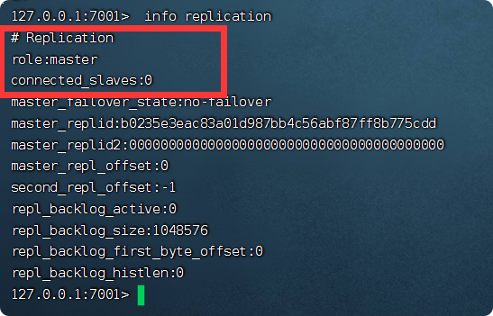

从节点，连接状态为down： master_link_status:down

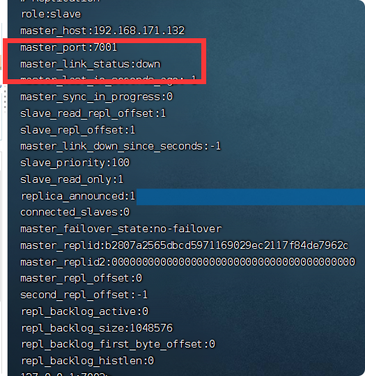

**原因分析**：因为设置了密码

##### 配置模式
    
     replicaof 198.168.171.132 7001
    
    # If the master is password protected (using the "requirepass" configuration
    # directive below) it is possible to tell the replica to authenticate before
    # starting the replication synchronization process, otherwise the master will
    # refuse the replica request.
    #
     masterauth 123456
    

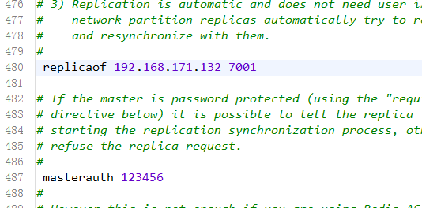

主从配置成功:

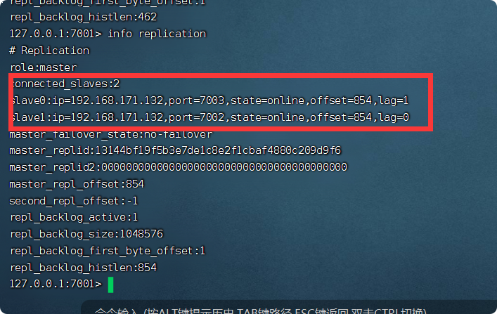

## 哨兵机制(Sentinel)
> 解决问题：如果我们在使用主从复制的情况下，**Master服务器进行了down机**的情况，我们的系统就不能再进行写的操作，所以此时redis在2.6版本引入了哨兵模式，但是并不稳定，2.8版本之后哨兵模式才稳定了起来。一个健壮的部署至少需要三个哨兵实例。

### 原理
哨兵的作用如下：

* **监控**：Sentinel 会不断检查您的 master 和 slave 是否按预期工作(**1秒发一次ping,三打二胜（num/2+1）的方式判断master故障 **)
* **自动故障恢复**：如果 master 故障，Sentinel 会将一个 slave 提升为 master。当故障实例恢复后也以新的 master 为主
* **通知**：Sentinel 充当 Redis 客户端的服务发现来源，当集群发生故障转移时，会将最新信息推送给 Redis 的客户端
* **配置提供者**（Configuration provider）：客户端在初始化时，通过连接哨兵来获得当前 Redis 服务的主节点地址。

**切换 master流程如下：**
- sentinel 给被选中的 slave 节点发送 **slaveof no one** 命令，让该节点成为 master
- sentinel 给所有其它 slave 发送 **slaveof masterIP masterPort** 命令，让这些 slave 成为新 master 的从节点，开始从新的 master 上同步数据。
- 最后（原来master变slave），sentinel 将故障节点标记为 slave，当故障节点恢复后会自动成为新的 master 的 slave 节点

### 配置

1)**新建三个目录，来存放sentinel配置**
    
    sudo su
    # 进入/tmp目录
    cd /usr/local/src
    # 创建目录
    mkdir s1 s2 s3
2)**s1目录创建一个sentinel.conf文件**
    
    port 27001 
    sentinel announce-ip 192.168.171.132
    sentinel monitor mymaster 192.168.171.132 7001 2 
    sentinel down-after-milliseconds mymaster 5000
    sentinel failover-timeout mymaster 60000
    sentinel auth-pass mymaster 123456
    dir "/usr/local/src/s1"
    
    
解读：
- port 27001：是当前sentinel实例的端口
- sentinel monitor mymaster 192.168.171.132 7001 2 ：指定主节点信息
    - mymaster：主节点名称，自定义，任意写
    - 192.168.171.132 7001：主节点的ip和端口
    - 2：选举master时的quorum值

- sentinel auth-pass mymaster 123456 :哨兵不能分辨 master和slave的密码，所以主节点和从节点密码要一样
    
3)**然后将s1/sentinel.conf文件拷贝到s2、s3两个目录中**（在/usr/local/src目录执行下列命令）：

        # 方式一：逐个拷贝
        cp s1/sentinel.conf s2
        cp s1/sentinel.conf s3
        # 方式二：管道组合命令，一键拷贝
        echo s2 s3 | xargs -t -n 1 cp s1/sentinel.conf
4)**修改s2、s3两个文件夹内的配置文件，将端口分别修改为27002、27003**：

    
    sed -i -e 's/27001/27002/g' -e 's/s1/s2/g' s2/sentinel.conf
    sed -i -e 's/27001/27003/g' -e 's/s1/s3/g' s3/sentinel.conf
    
5)**启动** 
    
    
    cd /usr/local/src
    
    # 第1个
    redis-sentinel s1/sentinel.conf
    # 第2个
    redis-sentinel s2/sentinel.conf
    # 第3个
    redis-sentinel s3/sentinel.conf
    
    
**哨兵监听成功**

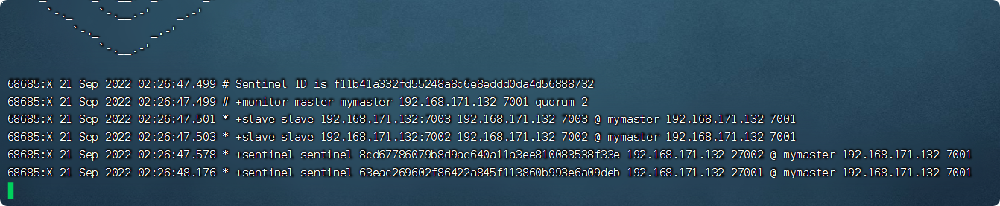    

6)**测试**

尝试让master节点7001宕机，查看sentinel日志：  

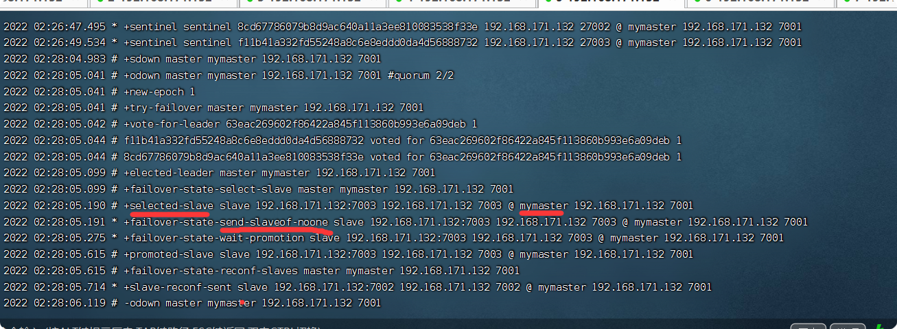

重新选举7003为主节点master了，7001成了slave

7003信息：

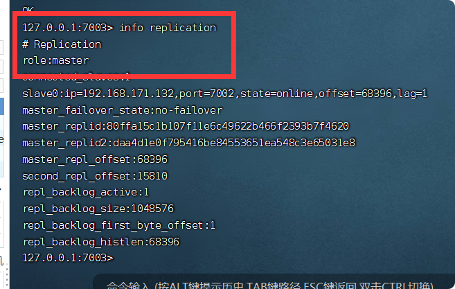
    
7001信息：

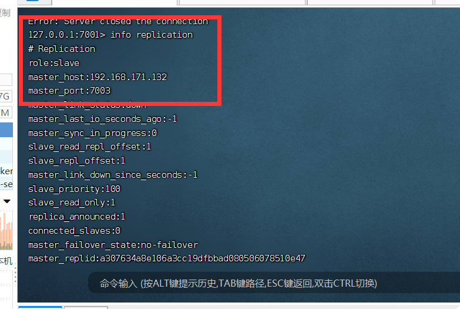

### RedisTemplate配置

> 在 Sentinel 集群**监管**下的 Redis 主从集群，其节点会因为自动故障转移而发生变化，**Redis 的客户端**必须感知这种变化，及时更新连接信息。Spring 的 RedisTemplate 底层利用 **lettuce** 实现了节点的感知和自动切换。
  
#### 依赖

    <dependency>
        <groupId>org.springframework.boot</groupId>
        <artifactId>spring-boot-starter-data-redis</artifactId>
    </dependency>
    
    
#### yml
> 只用配置哨兵，哨兵会自动使用redis主从集群，而且读写分离，master宕机自动选举

    spring:
      redis:
        sentinel:
          nodes: 192.168.171.132:27001,192.168.171.132:27002,192.168.171.132:27003
          master: mymaster
        password: 123456  #有密码一定要带上密码

#### 配置读写分离
    
   
       @Configuration
       public class SentinelConfig {
           @Bean
           public LettuceClientConfigurationBuilderCustomizer clientConfigurationBuilderCustomizer(){
               return clientConfigurationBuilder -> clientConfigurationBuilder.readFrom(ReadFrom.REPLICA_PREFERRED);
           }
       
       }
    
- 这个 bean 中配置的就是读写策略，包括四种：

    - MASTER：从主节点读取
    - MASTER_PREFERRED：优先从 master 节点读取，master 不可用才读取 replica
    - REPLICA：从 slave（replica）节点读取
    - REPLICA _PREFERRED：优先从 slave（replica）节点读取，所有的 slave 都不可用才读取 master

    
 

## 分片集群

> 主从和哨兵可以解决高可用、高并发读的问题。但是依然有两个问题没有解决：**海量数据存储问题、高并发写的问题**。为了解决这俩问题，Redis 提供了分片集群的方案。
  
### 数据分片（hash插槽）

> Redis 集群中有 **16384**(2的14次方) 个哈希槽，要计算给定键的哈希槽，我们只需将键的 CRC16 **取模 16384**。

- 例如，一个具有 ABC 3 个节点的集群，其中：

    - 节点 A 包含从 0 到 5500 的哈希槽。
    - 节点 B 包含从 5501 到 11000 的哈希槽。
    - 节点 C 包含从 11001 到 16383 的哈希槽。

> 插入时插槽分布

- **key 中有”{}”**：{}里面的就属于计算哈希槽的部分

- **key 中没有 “{}”**:整个key都是计算哈希槽的部分

### 配置集群

IP|PORT|角色
--|--|--
192.168.171.132	|7001	|master
192.168.171.132	|7002	|master
192.168.171.132	|7003	|master
192.168.171.132	|8001	|slave
192.168.171.132	|8002	|slave
192.168.171.132	|8003	|slave

1)删除之前的 7001、7002、7003 这几个目录，重新 **创建 7001、7002、7003、8001、8002、8003 目录**：

    
    
        #进入目录
        cd /usr/local/src
        # 删除旧的，避免配置干扰
        rm -rf 7001 7002 7003
        # 创建目录
        mkdir 7001 7002 7003 8001 8002 8003
        
  

2)**准备redis.conf配置文件**， 在 /usr/local/src 下准备一个新的 redis.conf 文件，内容如下：
    
    
        port 6379
        # 开启集群功能
        cluster-enabled yes
        # 集群的配置文件名称，不需要我们创建，由redis自己维护
        cluster-config-file /usr/local/src/6379/nodes.conf
        # 节点心跳失败的超时时间
        cluster-node-timeout 5000
        # 持久化文件存放目录
        dir /usr/local/src/6379
        # 绑定地址
        bind 0.0.0.0
        # 让redis后台运行
        daemonize yes
        # 注册的实例ip
        replica-announce-ip 192.168.171.132
        # 保护模式
        protected-mode no
        # 数据库数量
        databases 1
        # 日志
        logfile /usr/local/src/6379/run.log
        # 密码
        requirepass 123456
        //如果有密码必须带上master的密码，不然会导致日志文件爆炸
        masterauth 123456
 
     
3)**将这个文件拷贝到每个目录下：**

    
        #进入目录
        cd /usr/local/src
        # 执行拷贝
        echo 7001 7002 7003 8001 8002 8003 | xargs -t -n 1 cp redis.conf

4)**修改每个目录下的redis.conf，将其中的6379修改为与所在目录一致**：
    
    
        # 进入目录
        cd /usr/local/src
        # 修改配置文件
        printf '%s\n' 7001 7002 7003 8001 8002 8003 | xargs -I{} -t sed -i 's/6379/{}/g' {}/redis.conf
        
5)**启动**：

> 因为已经配置了后台启动模式，所以可以直接启动服务：
    
    
    
        # 进入目录
        cd /usr/local/src
        # 一键启动所有服务
        printf '%s\n' 7001 7002 7003 8001 8002 8003 | xargs -I{} -t redis-server {}/redis.conf
    
**通过 ps 查看状态**
    
        ps -ef | grep redis

**批量关闭**
    
        printf '%s\n' 7001 7002 7003 8001 8002 8003 | xargs -I{} -t redis-cli -p {} shutdown
        
        printf '%s\n' 7001 7002 7003 8001 8002 8003 | xargs -I{} -t redis-cli -a 123456  -p  {} shutdown

    
6)**创建集群**

> **Redis5.0之前**
    
        # 安装依赖
        yum -y install zlib ruby rubygems
        gem install redis
        
        # 进入redis的src目录
        cd /usr/local/src/redis-6.2.4/src
        # 创建集群
        ./redis-trib.rb create --replicas 1 -a 123456  192.168.171.132:7001 192.168.171.132:7002 192.168.171.132:7003 192.168.171.132:8001 192.168.171.132:8002 192.168.171.132:8003

> **Redis5.0 以后**:我安装的是Redis6.2.6版本，带密码的

    
        redis-cli --cluster create --cluster-replicas 1 -a 123456 192.168.171.132:7001  192.168.171.132:7002 192.168.171.132:7003 192.168.171.132:8001 192.168.171.132:8002 192.168.171.132:8003
    

 
- 命令说明：

- **redis-cli --cluster**：代表集群操作命令
- **create**：代表是创建集群
- **--cluster-replicas** ：1 表示节点主从直接比例是1:1,也就是3个master，3个slave
- **-a**：后面跟密码，所有与节点密码必须一样

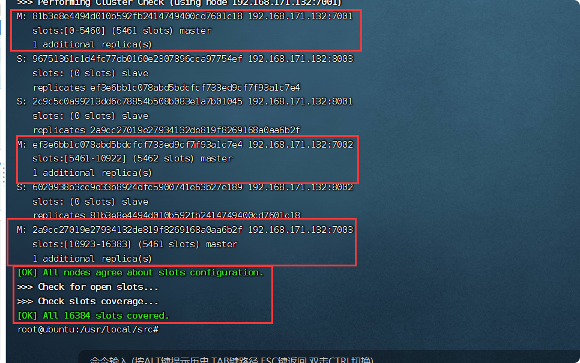

    
### 集群使用

6)**连接到集群**
    
    #使用集群连接 。其实就是加了-c（6380，6381都行） 
    redis-cli -c -p 7001 -a 123456
    #查看集群信息 
    cluster nodes

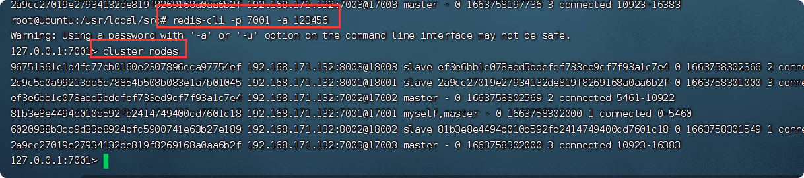
    
    
7)**测试**  
    
    # 存储数据
    set num 123
    # 读取数据
    get num
    # 再次存储
    set a 1
    
    
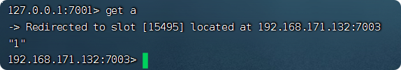

### 故障恢复（Failover）
> master 节点挂了之后，如何进行故障恢复呢？

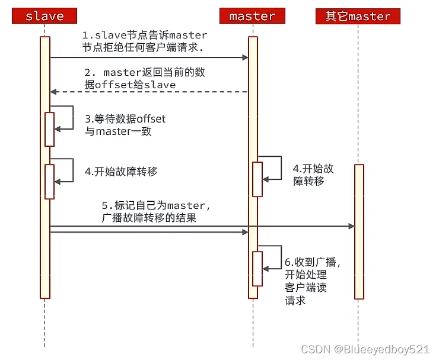

手动的Failover支持三种不同不是：

- 缺省：默认的流程，如图1-6步
- force：省略了对offset的一致性校验
- takeover：直接执行第5步，忽略数据一致性、忽略master状态和其他master的意见。

### 集群伸缩
#### 增加节点
> 查看帮助命令 
    
    redis-cli --cluster help

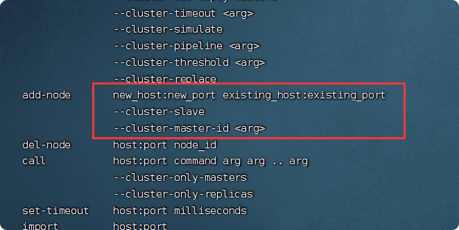

##### 需求分析
- 需求：向集群中添加一个新的 master 节点，并向其中存储 num = 10
     
    - 启动一个新的 redis 实例，端口为 7004
    - 添加 7004 到之前的集群，并作为一个 master 节点
    - 给 7004 节点分配插槽，使得 num 这个 key 可以存储到 7004 实例
- 这里需要两个新的功能：
     
    - 添加一个节点到集群中
    - 将部分插槽分配到新插槽

##### 配置

1)**创建实例**

    创建一个文件夹：
    mkdir 7004
    拷贝配置文件：
    cp redis.conf 7004
    修改配置文件：
    sed -i s/6379/7004/g 7004/redis.conf
    启动
    redis-server 7004/redis.conf
    
2)**添加新节点到 redis**    

    执行命令：
    redis-cli --cluster add-node   192.168.171.132:7004 192.168.171.132:7001 -a 123456
    通过命令查看集群状态： 
        redis-cli -c -p 7001 -a 123456 cluster nodes
    
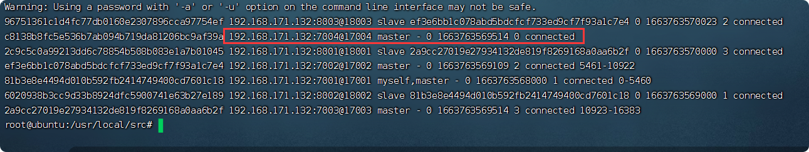

3)**转移插槽**
我们要将 **num **存储到 7004 节点，因此需要先看看 num 的插槽是多少：  

    redis-cli -c -p 7003 -a 123456
    
    get num

    

如上图所示，num 的插槽为 2765.  

我们可以将 0~3000 的插槽从 7001 转移到 7004，命令格式如下：  
     
     redis-cli --cluster reshard 192.168.171.132:7001 -a 123456

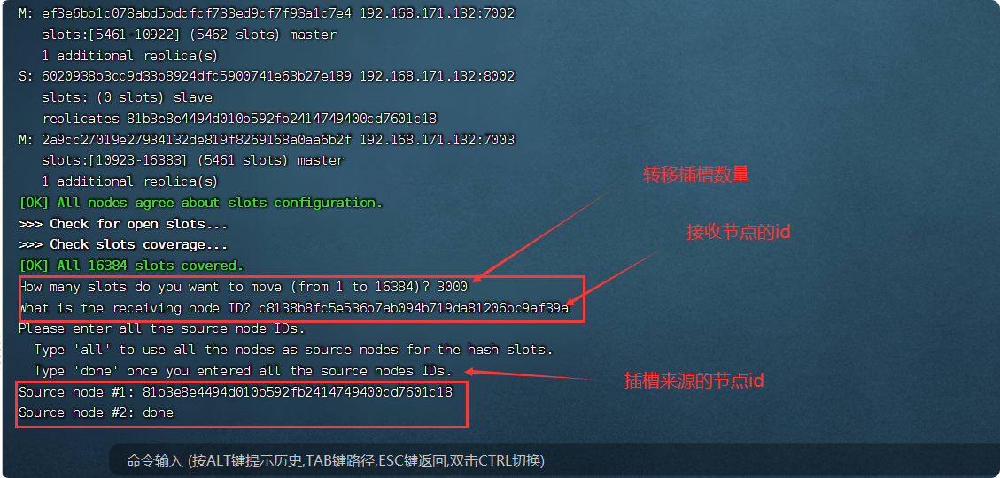
    

**查看集群信息**
    
    redis-cli -c -p 7001 -a 123456 cluster nodes

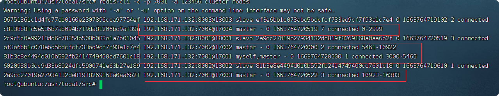
    

        
#### 移除节点

> 要删除副本节点，只需使用 del-node redis-cli 的命令：

    redis-cli --cluster del-node 127.0.0.1:7000 `<node-id>`
    
    
    redis-cli -a 123456 --cluster  del-node 192.168.171.132:7004  c8138b8fc5e536b7ab094b719da81206bc9af39a
    
- 第一个参数只是**集群中的一个随机节点**
- 第二个参数是要删除的**节点的ID**

*删除主节点，但是要删除主节点，它必须为空。如果主节点不为空，需要将数据从它重新分片到之前的所有其他主节点。*

> **关闭服务：先查看ps -ef|grep redis-server，然后执行kill命令。**

### RedisTemplate访问分片集群

#### 依赖
    
    spring:
      redis:
        sentinel:
          nodes: 192.168.171.132:27001,192.168.171.132:27002,192.168.171.132:27003
          master: mymaster
        password: 123456  #有密码一定要带上密码

#### yml配置

    spring:
      redis:
        password: 123456  #有密码一定要带上密码
        cluster:
          nodes:
            - 192.168.171.132:7001
            - 192.168.171.132:7002
            - 192.168.171.132:7003
            - 192.168.171.132:8001
            - 192.168.171.132:8002
            - 192.168.171.132:8003

#### 配置类
    /**
     * 配置读写分离
    **/
    @Configuration
    public class ClusterConfig {
        @Bean
        public LettuceClientConfigurationBuilderCustomizer clientConfigurationBuilderCustomizer(){
            return clientConfigurationBuilder -> clientConfigurationBuilder.readFrom(ReadFrom.REPLICA_PREFERRED);
        }
    
    }
    
    
- 这个 bean 中配置的就是读写策略，包括四种：

    - MASTER：从主节点读取
    - MASTER_PREFERRED：优先从 master 节点读取，master 不可用才读取 replica
    - REPLICA：从 slave（replica）节点读取
    - REPLICA _PREFERRED：优先从 slave（replica）节点读取，所有的 slave 都不可用才读取 master
   